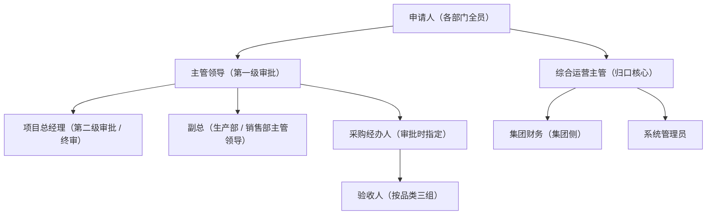

> ★ **架构转向 ③：审批核心迁至我方** —— 本文「审批流转归属」相关口径已被增量 PRD 取代，请先读 **[`01a-PRD-Increment-V2.md`](./01a-PRD-Increment-V2.md)**（三方审批接入 / 四个操作 / 编号 / 推送 / 回调 / 对账 / 通讯录新定位）。未被转向影响的部分仍以本文为准。★ **本文已按转向 ③ 修订（V1.15）**：下表 N1/N7/**G1（§2.2 可用性目标）**/G2、M0/M2/M3 多条 FR 与 Q1/Q17 等位点已逐条标注「**作废 / 改写 / 修改**」（以 ★ 标记；V1.7 位点改写见 §10 V1.7，V1.8 补 `FR-M2-04`/`FR-M2-05` 见 §10 V1.8，V1.9 改 `FR-M0-09` 见 §10 V1.9，V1.10 消歧裸 `G1` 见 §10 V1.10，V1.11 消歧 `M` / `A2`·`A4` / `G2`·`G3` 见 §10 V1.11，V1.12 消歧 `C4` 见 §10 V1.12，**V1.13 扩消歧 `G`（三方）/ `P` / `C`（整段）见 §10 V1.13**，**V1.14 `C` 族补第三义（脚本门禁）见 §10 V1.14**，**V1.15 补模块 `M9`（§3.1）见 §10 V1.15**）。

# 采购与费用审批平台（自建侧）· 产品需求文档（PRD）

> 结论先行：**审批一点不重造。** 审批流转全程留在飞书原生审批引擎内；自建系统只做「接收事件 → 落库 → 台账 / 看板 / 行·列权限 → 报送凭证包 → 审计留痕」。自建系统存在的唯一理由是补齐飞书免费版三项限制——**不支持行·列权限（唯一绕不过）、单表 2,000 行、仪表盘只能挂 1 张数据源表**。

---

## 1. 文档信息

| 项 | 内容 |
|---|---|
| 文档名称 | 采购与费用审批平台（自建侧）· 产品需求文档 |
| 版本 | V1.15（★ 已按**架构转向 ③** 修订相关位点；转向位点以 `01a-PRD-Increment-V2.md` 为准） |
| 日期 | 2026-09-27 |
| 实施主体 | 湖南江熙新材料科技（岳阳城陵矶新港区） |
| 方案路线 | 方案 B（审批走飞书原生引擎）· 模式 A（自建系统只收不转） |
| 编程语言 / 技术栈 | Go 1.21+ / Echo v4 / SQLite（WAL）/ Vue3（`//go:embed` 内嵌）/ ECharts / 云侧 S3 兼容对象存储（主）+ RustFS（异地备份）/ 境外云主机单实例 / 飞书免登 |
| 文档定位 | 需求正本，作为 UseCase（02）、TestCase（03）、架构设计（04）、接口设计（05）的共同输入 |

### 1.1 依据文件清单

| # | 文件 | 在本文档中的作用 | 读取状态 |
|---|---|---|---|
| 1 | `C:\Users\haoduan\WorkBuddy\江熙新材\deliverables\procurement-system\技术方案书V1.0.html` | 架构、选型、模块 M0–M8、关键设计、接口清单、风险 | 已读取 |
| 2 | `C:\Users\haoduan\WorkBuddy\江熙新材\_build\xlsx_dump_v3.txt` | **业务口径第一权威来源**：单据清单 11 张、表单字段清单、用途分类表、审批阈值矩阵、角色权限矩阵、采购方式与留痕、台账与看板设计 12+4、待确认事项 27 项 | 已读取 |
| 3 | `C:\Users\haoduan\WorkBuddy\江熙新材\deliverables\procurement-approval\费用管理办法V3.0.html` | 制度正文 12 章 67 条 + 附录 A/B/C（条款引用出处） | 已读取 |
| 4 | `C:\Users\haoduan\WorkBuddy\江熙新材\deliverables\procurement-approval\审批流程图集V3.0.html` | 图 0 分界总览 + 图 1–9（含驳回分支） | 已读取 |

> 四份输入均已实际读取，无缺失。

### 1.2 引用约定

- 制度条款引用格式：「制度第 X 条」。
- 工具表引用格式：「工具表·<表名>」，如「工具表·审批阈值矩阵」。
- 流程图文引用格式：「流程图文 X」。
- 「★」标记表示该结论带有已知代价或易漏风险，须重点核对。

---

## 2. 背景与目标

### 2.1 为什么建这套系统（只为一个理由）

业务上，湖南侧已完成《费用管理办法 V3.0》与《审批流程图集 V3.0》的定案：审批链、金额分档、例外流程全部落地在**飞书原生审批**里，审批人正常在飞书 App 内完成操作。飞书免费版能满足审批流转，但有三项限制无法承载本项目的**台账、看板与分权**需求：

| # | 飞书免费版限制（工具表·台账与看板设计 ⑦⑧⑨） | 本项目受影响的功能 | 自建系统如何补齐 |
|---|---|---|---|
| 1 | **不支持行 / 列权限设置（高级权限）** | 「金额列仅总经理可见」「某部门记录对他部门不可见」这类数据级权限 | 自建系统在服务端做行级过滤 + 列级可见性。**这是唯一绕不过的一项，也是本系统存在的首要理由** |
| 2 | **单数据表最大 2,000 行** | 第 1、9 号等流水型台账按 50–100 笔/月计，20–40 个月后写不进新记录 | SQLite 无行数上限；辅以年度归档策略 |
| 3 | **一个仪表盘最多挂 1 个数据源表** | 第 14、15 号看板需跨表汇总（如「经办人指定集中度」需联采购经办登记台账与订单台账） | 自建系统直接 SQL 联查，看板不限数据源表数量 |

### 2.2 目标（可量化）

| # | 目标 | 量化验收口径 | 对应模块 |
|---|---|---|---|
| G1 | ★ **改写（转向 ③）**：~~自建系统任何故障都不影响飞书侧审批~~ → **审批与数据不中断（我方为主路）** | ★ **原「停机演练下飞书侧审批照常、成功率 100%」口径作废**（③ 下我方是**审批链路的必需节点**，不成立）。★ **新口径**：① 我方**正常运行**时全流程可用；② **服务整体不可用** → 飞书侧点击"未生效"、**归"高可用"**（用户第三轮 D2）；③ 回调 / 推送按"**落盘即 200、业务异步**"保证不丢（`01a §7.2`） | M8 |
| G2 | ★ **改写（转向 ③）**：**数据不丢、可自愈**（原"删本地数据→对账补拉全量恢复"**不再成立**） | ★ ③ 下 `external_tasks` **只给粗粒度 `status`**、`check` **只给 `diff_instances`** → **无"全量补拉"能力**。★★ **新口径**：① **幂等**（回调 / 事件不产生重复记录）；② **对账兜底＝"发现差异 + 重推"，非"补拉全量"**；③ **真相源在我方**（飞书不再是数据源）（`01a §6.2` / `§6.3`） | M2 / M3 |
| G3 | **分权可验证**：越权访问 100% 被拦截 | 行级、列级越权用例全部被拦截并留痕 | M5 |
| G4 | **报送可追溯**：「钱到底付了没有」可查证 | 每笔提交集团的事项均可查到提交日期与移交凭证；「无凭证视为未提交」（制度第四十八条） | M6 |

> 目标之间的正交性：G1 保证「业务不受影响」，G2 保证「数据可信」，G3 保证「权限可控」，G4 保证「跨边界可追溯」。四者互不替代。
> ★ **编号消歧（README 定案 #56；登记见 `15-Code-Collision-Register.md` §2 行 2）**：本节 `G1`（**可用性目标**）**与 `01a §9` 的 `G1`（**驳回重提策略**，已关闭）不是同一个**，勿混 —— 引用时请写明「`01-PRD §2.2 G1`（可用性）」或「`01a §9 G1`（驳回重提）」。★ **`G` 族为「三方共载」**：同一 `G` token 亦见 **`10 §2` 产品缺口清单（`G1`–`G8`）** —— `01a §9` 的 `Gx` 即 `10 §2 Gx` 的**处置行**（**同指**）。`G2` / `G3` 亦**同名不同物**（本节 `G2`：**数据自愈目标** ↔ `01a §9`/`10 §2` **加签时机**；本节 `G3`：**分权目标** ↔ **代理人语义 / 委派**）——**同族，已按 #56 三方互指**（见 `01a §9` 各行 ＋ `15` 登记）。

---

## 3. 范围

### 3.1 做什么

1. **M0 平台接入**：飞书长连接事件接收、按 `approval_code` 逐个订阅、tenant_access_token 管理、对账补拉、飞书免登（open_id → 角色）。
2. **M1 登记与查询**：承接「审批里不产生、但业务必须记录」的登记项，以及备付金余额 / 防拆分 / 次数上限的**只读提示**（不阻断）。
3. **M2 实例拉取与状态机**：按 `instance_code` 取实例详情与表单字段、状态机映射、业务单号归档。
4. **M3 事件落库**：幂等落库、状态收敛、驳回重提原单不覆盖。
5. **M4 台账**：12 张数据台账、公式列红标、拆分嫌疑清单。
6. **M5 看板与分权**：4 张看板 + 行级过滤 + 列级可见性 + 角色映射。**本系统的核心价值**。
7. **M6 报送与凭证包**：提交集团登记、移交凭证、月度「已提交未付款」对账、合同 / 发票原件移交清单。
8. **M7 审计与留痕**：操作日志、状态变更史、导出留痕。
9. **M8 部署运维**：单实例约束、健康检查、自动重启、备份与恢复演练、降级开关。
10. **M9 审批核心（我方流转）** ★ **（架构转向 ③ 新增模块）**：单据编号生成、**分档与审批人计算**（替代飞书条件分支）、我方表单与校验、**转交 / 加签（顺序会签）/ 回退 / 撤回**、实例快照与 `update_mode` 策略、状态机（含 `TRANSFERRED` 与"已撤回"）、**台账由我方终态直写**、提交页防错与**提交时实时回源**、内部审批事件（通知 + 日志）。**需求细目见 `01a §8.2`（`FR-M9-01`~`FR-M9-18`）**。

> ★ **编号消歧（README 定案 #56；登记见 `15-Code-Collision-Register.md` §2 行 3）**：本节 `M0`–`M9` ＝ **功能模块代号**（★ `M9` 为**转向 ③ 增量模块**，与 `01a §8.2` **同义**；★ `04 §1.2` 现阶段仍为 `M0`–`M8`，**未含 `M9`**）；★ **与另两种 `M` 不同义**：① `FR-Mx-yy` ＝ **功能需求编号**（`FR-` ＋ 模块号 ＋ 序号，见 §1 / §5，全篇 **99 处**）；② `01a §2.3` 的 `M1`–`M7` ＝ **对本文的「修改条目」编号**（`01a` 局部）。引用时请写明「模块 `Mx`」或「`FR-Mx-yy`」或「`01a` 修改条目 `Mx`」。

### 3.2 不做什么（边界，逐条明确）

| # | 不做的事 | 依据 |
|---|---|---|
| ~~N1~~ | ~~**不重造审批引擎**，不承接任何审批流转。三方审批（模式 B）已否决。~~ ★ **架构转向 ③ 后作废**：「流转」**已迁至我方**（承接流转，复用飞书展示 / 待办 / 通知），**三方审批已采纳** | ★ **作废**：见 `01a`（转向 ③） |
| N2 | **不调用「创建审批实例」接口**。发起入口为飞书原生发起，用户在飞书审批里填单发起。 | 技术方案书 §0 / §3.1；模式 A |
| N3 | **不替代集团财务**。集团侧全人工、**不回传数据**、不作数据对齐。湖南侧流程**止于「提交集团」**。 | 制度第四十五条、第四十八条；工具表·待确认事项第 24 项（B8） |
| N4 | **不承接报销流程**。「报销单（BX）」已取消（2026-09-25 批复 A4；★ 本 `A4` ＝**制度批复文号**，非 `01a §2.2` 的「新增项 `A4`」）；报销直接人工走集团流程。 | 制度第二十四条、第二十八条；工具表·单据清单 R20 |
| N5 | **不做审批流的实时预警**。事前硬校验（备付金是否充足、防拆分、次数上限）无法在发起时拦截，只做成台账公式列红标 + 审批人自行参考。 | 技术方案书 §5.5；见本文 §8 |
| N6 | **不纳入人事考核逻辑**。违规操作由人事管理制度考核、已执行的操作不撤回。 | 制度第五十八条（D5） |
| ~~N7~~ | ~~**不做合同模板的条件分支配置**；11 张审批模板人工在飞书审批后台建（API 不支持条件分支）。~~ ★ **架构转向 ③ 后作废**：三方审批定义**可纯 API 建 / 更新**；且**条件分支 / 分档在我方**（不再依赖飞书侧） | ★ **作废**：`01a §2.1 F4/F5`、`§2.5` |
| N8 | **不做发票验真**。制度第二十八条第 2 项「建议接入发票验真」为建议项，本期不做。 | 制度第二十八条（建议） |
| N9 | **不做预算拦截**。预算执行台账本期不启用扣减动作，仅保留结构。 | 工具表·台账与看板设计 第 12 号 |
| N10 | **本期不做节点级审批轨迹（FR-M2-07 降级为二期）** —— ★ **结论保留、理由改写（转向 ③）**。**结论**：**仍不订阅 `approval_task`（节点级）、不落库**。**★ 新理由**：① ③ 下**审批事件链整体作废**（`F1`：不再依赖飞书事件；审批事件订阅已退役）；② 节点轨迹的**真相源已在我方**（`t_flow_op_log` + 状态机）—— 原"**权威来源本来就在飞书审批详情页**"的说法在 ③ 下**方向相反**。**代价**：`t_status_history.task_node` 恒为 NULL（不变）。 | FR-M2-07（应该）；★ `01a §2.1 F1` / `§4.6` |

---

## 4. 角色与权限

### 4.1 角色清单

| 角色 | 对应岗位（工具表·角色权限矩阵） | 备注 |
|---|---|---|
| 申请人 | 各部门全员 | 可提需求、可参与验收（仅查看） |
| 主管领导 | 综合运营部 / 质检技术部 → **项目总经理**；生产部 / 销售部 → **副总**（销售部由项目总经理协管） | 采购与费用的**第一级审批人**；**在该环节指定采购经办人** |
| 项目总经理 | 项目总经理 | **第二级审批人**；采三档审批、全部需签合同采购的第二级审批、独家采购终审；**采购审批权限不设金额上限** |
| 副总 | 副总 / 项目合伙人 | 生产部、销售部的第一级审批人 |
| 综合运营主管 | 综合运营部主管 | **归口核心**；唯一对接集团的人；持有采一档「备付金是否充足」一项审批权 |
| 采购经办人 | 由主管领导在审批「要不要买」时指定的各部门人员 | 询比价、组织合同、下单跟单 |
| 验收人 | 按采购品类分**三组**（见 §4.3） | 「验收入库」一步合并 |
| 集团财务 | 集团 | 湖南侧无付款能力，全部公户转账与报销付款由集团财务执行 |
| 集团（审批） | 集团分管 / 董事长 | **本办法不设集团审批节点**；不介入日常审批 |
| 系统管理员 | 指定 1–2 人 | 表单与流程配置、分类库维护、权限维护；**不参与任何业务审批** |

> 关于「质检技术部」「库管」：二者在工具表·角色权限矩阵中**不是独立角色行**，而是以「验收人」构成组与「来料检验报告（QC）」发起岗位的身份出现。本 PRD 按此口径处理（见 §4.3）。
> 关于已取消角色：采购岗、财务岗、出纳均已在 V2.0 取消，**不得出现在本系统的角色表中**。

### 4.2 每角色的可见范围与可操作项

依据工具表·角色权限矩阵（●可操作 / ○仅查看 / —无权限）：

| 角色 | 发起申请 | 主管领导审批 | 总经理审批 | 备案接收 | 备付金审批（采一档） | 询价比价 | 合同起草 | 到货验收 |
|---|---|---|---|---|---|---|---|---|
| 申请人 | ● | — | — | — | — | — | — | ○ |
| 主管领导 | ● | ● | — | — | — | — | — | — |
| 项目总经理 | ● | ● | ● | — | — | — | — | — |
| 副总 | ● | ● | — | — | — | — | — | — |
| 综合运营主管 ★核心 | ● | — | — | ● | ● | — | — | — |
| 采购经办人 | ● | — | — | — | — | ● | ● | ○ |
| 验收人 | ● | — | — | — | — | — | — | ● |
| 集团财务 | — | — | — | — | — | — | — | — |
| 集团（审批） | — | — | — | — | — | — | — | — |
| 系统管理员 | — | — | — | — | — | — | — | — |

**本系统的可见范围口径（自建侧定义，非飞书侧）：**

| 角色 | 台账行级可见范围（建议） | 列级可见范围（建议） |
|---|---|---|
| 申请人 | 仅本人发起 / 本人经办的记录 | 不含金额列以外的敏感列；不含他人金额 |
| 主管领导 | 本部门（含分管部门）全部记录 | 含金额列 |
| 副总 | 所分管部门（生产部 / 销售部）全部记录 | 含金额列 |
| 项目总经理 | 全量 | 全量（含金额、供应商、预付比例、质保金） |
| 综合运营主管 | 全量（归口需要） | 全量 |
| 采购经办人 | 本人被指定经办的记录 | 不含集团侧人工登记列 |
| 验收人 | 本人参与验收的记录 | 不含金额列 |
| 系统管理员 | 全量（运维视角，**只读**） | 全量但**不含金额列**（定案） |

> ★ **已定案（2026-09-26）**：上表行 / 列口径**采纳为本系统默认口径**，落为 `t_permission_rule` 数据行（**改数据行即生效，不改代码、不重启**）。同时定两条：① **行级权限只用 6 个 `row_scope` 令牌 + `DENY`，不引入按字段值的条件表达式**；② **新增「系统管理」后台页**（角色 × 资源矩阵 + 人员角色管理），供管理员自助配置（见 FR-M5-09~11）。**行·列权限是本系统唯一不可替代的价值。**

**可操作项数提示（工具表·角色权限矩阵 R14）**：单个角色「可操作项数」≥6 时需复核是否存在不相容职务兼任。综合运营主管为 7 项（已超警戒线），配五项缓解措施；本系统不以拆角色解决，而是以**审计留痕 + 监督指标**（见 FR-M5-07）承接。

### 4.3 验收人三组构成（定义条款，制度第十一条）

| 组 | 采购品类 | 验收人构成 | 强制产出 |
|---|---|---|---|
| 设备耗材类 | P02 备品备件与五金 / P03 劳保与安环用品 / P04 设备与仪器 | **经办人 ＋ 质检技术部（双方）** | 到货验收单 GR；设备类另附技术评审意见（单台/套 ≥20,000 元，制度第二十二条） |
| 原辅料类 | P01 原辅料 | **经办人 ＋ 质检技术部 ＋ 库管（三方）** | 到货验收单 GR + 来料检验报告 QC |
| 其他类 | P05 设备与周转设施租赁 / P06 工程与安装 / P07 生产性服务 / P08 能源动力 | **经办人 ＋ 综合运营部人员（双方）** | 到货验收单 GR（工程类另附技术意见） |

> ★ **旧口径「验收人 ≠ 采购经办人」已作废**（2026-09-25 批复 A2；★ 本 `A2` ＝**制度批复文号**，非 `01a §2.2` 的「新增项 `A2`」）。防弊点不在「经办人不得验收」，而在「验收结论须由多方分别签署」。本系统不得按旧口径做校验。

> ★ **编号消歧（README 定案 #56；登记见 `15-Code-Collision-Register.md` §2 行 7）**：本表 `P01`–`P08`（**采购品类代号**）★ **与以下「同名 `P`」均不同物**，勿混：① `P0`/`P1`/`P2`（**优先级**，§5 各处）；② `06` 的 `P0-1`/`P1-1`（**实现缺陷**）与 `12` 的 `P0-A`/`P1-A`（**评估缺陷**）；③ `10 §6` 的 `P1`–`P3`（**待拍板项**）与 `04a §6.4` 的 `P1`–`P3`（**锁号前提**）；④ `P95`/`P99`（**时延百分位**）。引用请写明来源（如「品类 `P01`」/「`10 §6 P1`」）。

### 4.4 两条回避规则（本系统须留痕）

| # | 规则 | 系统落地方式 | 依据 |
|---|---|---|---|
| 1 | **需求提出人不得同时作该笔指定经办人**（采二档及以上；**采一档明确豁免**，由申请人自购） | 台账公式列「经办人是否＝提出人」自动标红（事后发现，**不自动拦截**） + 综合运营主管在三单匹配初审环节人工核对 | 制度第十三条、第十四条、第六十条 |
| 2 | **综合运营主管不得作该笔验收人**；且其本人需求不得自审、不得自购（采一档审批上抬至主管领导） | 台账单独标记 + 公式列红标 | 制度第十四条、第十五条、第十八条 |

> ★ 两条回避均为**事后核对**，不构成系统拦截（制度第十四条「事后核对」效力边界，2026-09-25 批复）。

---

## 5. 功能需求

> 优先级：**必须**（P0，缺则闭环不成立）/ **应该**（P1）/ **可选**（P2）。
> 每条需求给出编号 + 描述 + 优先级 + 验收标准。

### 5.1 M0 平台接入（全案唯一的飞书通道层）

| 编号 | 需求描述 | 优先级 | 验收标准 |
|---|---|---|---|
| FR-M0-01 | 管理 `tenant_access_token`：单实例获取、提前刷新（建议提前 5–10 分钟）、并发不互相顶掉 | 必须 | Token 过期前自动刷新成功；并发调用不出现 401 |
| FR-M0-02 | ★ **改写（转向 ③）**：建立并保活长连接 WebSocket；长连接**不再订阅审批实例事件**（`F1`），职责收敛为**通讯录事件**（`08`）与连接保活；`approval_task`（节点级）**亦不订阅**（N10） | 必须 | **无审批事件订阅**；通讯录事件可达；断线自动重连；健康检查可见连接状态（`01a §2.1 M1`） |
| ~~FR-M0-03~~ | ★ **作废（转向 ③）**：**不再「订阅审批事件」**（`F1`，审批事件链退役）→ 改为**通讯录事件订阅**（`08`） | 必须 | 订阅对象改为通讯录事件；**审批事件订阅应无残留**（`01a §2.1 M1`） |
| FR-M0-04 | 订阅结果纳入启动自检与健康检查；订阅失败 / 状态非成功时**告警**（日志 + 通知） | 必须 | 人为使一个 `approval_code` 订阅失败 → 启动自检报告失败项并触发告警 |
| FR-M0-05 | 启动自检项：① 订阅状态；② 长连接状态；③ 数据库可写；④ **单实例**（见 FR-M8-01） | 必须 | 任一自检项失败均有明确日志与告警；自检报告可在健康检查端点查看 |
| FR-M0-06 | ★ **改写（转向 ③）**：事件分发改为按**通讯录事件类型**分发（`contact.user.*` / `contact.department.*` 等）；未启用 / 未知事件类型必须**安全忽略并计数** | 必须 | 通讯录事件路由到 `08` 处理器；未知类型**安全忽略**（不落库、不报错、计数留痕）（`01a §2.1 M1`） |
| FR-M0-07 | ★ **改写（转向 ③）**：~~每日「批量取实例 ID」→「取实例详情」补录~~ → 改为 **`external_instances/check` 对账**（**基线 5 分钟、自适应**）；不一致处置＝"**发现差异 + 重推**"（★ **非"全量补拉"**，`01a §6.3`） | 必须 | 对账按 5 分钟基线运行；★ **原"删数据→一次对账全量恢复"口径作废**（TC-05 失效） |
| FR-M0-08 | 飞书接口调用统一收口到适配层，便于监控与迁移；记录月度实际调用量 | 应该 | 全部飞书调用经适配层；可查询当月调用量 |
| FR-M0-09 | ★ **改写（转向 ③）**：**③ 下附件由申请人在「我方页面」上传**（表单在我方）→ **飞书侧不调用上传接口**；**下载仍走飞书 `GET`（按引用）**；主存＝**云主机同地域 S3 兼容对象存储**，上传路径**先落「本地暂存 + 待主存确认」**（不阻塞主体） | 必须 | 附件可由申请人在**我方页面**上传、按引用下载；★ **飞书侧无上传调用**；主存未命中 → 回退 RustFS 备份；不把 RustFS 当主存（`01a §2.3 M6`，QV2-16 待集团确认） |
| FR-M0-10 | **飞书免登**：`GET /auth/feishu/callback` 换取用户身份，`open_id → 角色` 映射；人员变动跟着飞书通讯录走，不另维护账号 | 必须 | 未登录访问受保护页面 → 跳转登录；登录后拿到角色；角色变更后权限即时生效（见 TC-09/10/11） |
| FR-M0-11 | ★ **改写（转向 ③）**：**不存在创建「原生」审批实例的路径；但存在创建「三方」审批实例的推送路径**（`external_instances`） | 必须 | 代码中无**原生**实例创建调用；**三方推送路径存在**且被用例覆盖（`01a §2.3 M2`） |
| FR-M0-12 | ★ **改写（转向 ③）**：~~用事件订阅，绝不轮询~~ → **已存在对账轮询**（`external_instances/check`，基线 5 分钟、自适应），"**无轮询**"约束**单点解除**；其余仍事件驱动 | 必须 | 对账轮询按 5 分钟基线 + 自适应运行；配额监控（70% / 90%）（`01a §6.3` / `§5.5`） |

### 5.2 M1 登记与查询（非审批类登记 + 只读提示）

| 编号 | 需求描述 | 优先级 | 验收标准 |
|---|---|---|---|
| FR-M1-01 | **备付金签领登记**：签领人 / 签领金额 / 签领日期登记（采一档「先领款、后购买」时序的凭据） | 必须 | 采一档审批通过并完成校验后可登记签领记录；签领记录与付款凭据可逐笔一一对应 |
| FR-M1-02 | **集团报销跟踪表登记**（人工登记，不进入审批系统）：关联事前申请单号、申请人、部门、实际金额、票据张数、初审状态、移交集团日期、集团付款日期与金额、超支说明 | 必须 | 综合运营主管可人工登记；登记项可被台账与看板引用 |
| FR-M1-03 | **采购报备单的审批外字段补录**：付款凭据号、抽查状态 | 应该 | 报备单审批完成后可补录；补录字段进采购备案台账 |
| FR-M1-04 | **备付金余额只读页**（做法 A，技术方案书 §5.5）：供综合运营主管审批前查看 | 应该 | 只读展示备付金实有金额；**不提供修改入口** |
| FR-M1-05 | **防拆分 / 次数上限只读提示**：同供应商 + 同二级明细当月累计、单部门月备案次数、800–1,000 元区间标记，以台账公式列红标呈现 | 必须 | 触发条件时红标显示；★ **不阻断提交、不阻断审批**（见 §8） |
| FR-M1-06 | 状态查询「我这单到哪了」：按业务单号查在途状态与当前节点 | 应该 | 申请人与经办人可查本人相关单据的当前状态 |
| FR-M1-07 | **月核销后余额登记**：按月登记签领、支出与核销后余额（「有多少用多少」唯一可被外部核对的锚点） | 应该 | 每月生成核销后余额，并可被月度报送引用 |

> ★ **口径澄清（诚实记录）**：技术方案书 §4 将「采购报备」列入 M1「非审批类登记」。按业务第一权威来源（工具表·单据清单 第 1 号、制度第十八条），**采购报备单本身是审批单据**（综合运营主管审批备付金），走飞书原生审批。本 PRD 以业务口径为准：报备单走飞书审批；**M1 只承接其「审批外字段」的补录（FR-M1-03）与备付金签领登记（FR-M1-01）**。此口径差异已列入 §9 待确认项（Q5）。

### 5.3 M2 实例拉取与状态机

| 编号 | 需求描述 | 优先级 | 验收标准 |
|---|---|---|---|
| FR-M2-01 | ★ **作废 / 改写（转向 ③）**：~~按 `instance_code` 取飞书实例详情作主数据源~~ → **我方本地快照为准**（`F2`）；审批详情走 `GET /api/approval/{biz_no}` | 必须 | 详情数据来源＝我方库；不再以飞书实例详情为主数据源（`01a §2.1 F2` / `§6.2`） |
| FR-M2-02 | ★ **改写（转向 ③）**：~~表单字段以键值对存 `t_instance_field`~~ → **`t_instance_field` 作废**（`F3` 原生控件链作废）；字段值以**我方表单**为唯一来源，落 `t_instance` 规范列 | 必须 | 无 `t_instance_field` 依赖；字段值由我方表单产生（`01a §2.1 F3`） |
| FR-M2-03 | ★★ **改写（转向 ③）**：原 **8 态映射显式作废**（`PENDING / APPROVED / REJECTED / CANCELED / DELETED / REVERTED / OVERTIME_CLOSE / OVERTIME_RECOVER`）→ 改**我方 4 态**：实例 `PENDING / APPROVED / REJECTED / CANCELED`（+ 本地"已撤回"）；任务 `PENDING / APPROVED / REJECTED / TRANSFERRED / DONE` | 必须 | 4 态正确落库；**无 8 态残留**（`01a §2.1 F3` / `§8.2 FR-M9-10`） |
| FR-M2-04 | ★ **改写（转向 ③）**：~~按「前缀-YYMM-####」解析并归档业务单号~~（原 `ParseBizNo` 从飞书 `instance_code` **反解**单号）→ **反解链路作废**；单号改由**我方生成并自我归档**：`{前缀}-{YYMM}-{####}`（`t_doc_seq` 事务内自增）＋ `biz_no` **UNIQUE** ＋ **终态锁号**（进终态即不复用）；前缀沿用 BA / PR / SA / RFQ / BJ / SS / CT / PC / GR / QC / SUB | 必须 | 11 种前缀按**我方生成**落库；**无"从 `instance_code` 反解单号"路径**；终态复用号被 `UNIQUE` 拒（`01a §3` / `§8 FR-M9-01` / `FR-M9-15`） |
| FR-M2-05 | ★ **改写（转向 ③）**：`approval_code ↔ 单据类型` 映射**配置化**（定义建好后导入映射表）；★ **必须为双向映射**：正向 `doc_type → approval_code`（建定义 / 推实例用）＋ ★★ **反向 `approval_code → doc_type`**（**回调入站携带 `approval_code`，须据此定位单据类型**） | 必须 | 映射表**双向**可配置，不写死在代码；★ ⚠ **缺反向映射 → 回调带回的 `approval_code` 无法定位单据类型（静默）**（`01a §2.1 F5` / 本文件 Q1） |
| FR-M2-06 | 业务主键贯穿：业务主键自申请单（PR / SA）起贯穿至集团付款，台账与看板全部以该主键关联，不做二次录入 | 必须 | 由 PR / SA / SUB 主键可回溯全链 |
| FR-M2-07 | ★ **改写（转向 ③）**：~~`approval_task` 节点级事件处理（TRANSFERRED / ROLLBACK / DONE）~~ | 应该（**本期不做** → §3.2 N10） | **本期明确不做**：不订阅 `approval_task`；★ ③ 下**逐审批人轨迹由我方 `t_flow_op_log` 承载**（**不再"以飞书审批详情页为准"**）（`01a §4.6`） |
| FR-M2-08 | ★ **作废 / 改写（转向 ③）**：~~`field_id → biz_field` 抽取链~~ → **抽取链整体作废**（`F3`）；金额 / 供应商 / 用途分类 / 部门由**我方表单**直接落 `t_instance` 规范列 | 必须 | 规范列非空**由我方表单保证**；不再依赖 `field_id` 映射（`01a §2.1 F3` / `§2.3 M6`） |

### 5.4 M3 事件落库（3 秒窗口的必答题）

| 编号 | 需求描述 | 优先级 | 验收标准 |
|---|---|---|---|
| FR-M3-01 | **事件处理路径极短**：收到事件 → 写一条「待处理」记录 → **立即返回**；详情拉取与业务处理走**异步** | 必须 | 事件接入端点只做一次写入，不同步拉取详情；实测处理耗时远小于 3 秒 |
| FR-M3-02 | **幂等键 = 事件级唯一 ID**：**2.0 版事件用 `header.event_id`、1.0 版事件用 `uuid`**（飞书《事件概述》官方口径）。入库前先查该 ID 是否已存在，已存在则直接返回成功。★ **不得用 `instance_code + status` 作唯一键**——驳回重提会使同一实例**再次进入 PENDING**，该组合会把第二次 PENDING 幂等吞掉，**状态再也回不去** | 必须 | 同一事件重复推送 3 次只产生 1 条记录（见 TC-01）；驳回重提后状态能正确回到 PENDING 并最终收敛为 APPROVED（见 TC-16） |
| FR-M3-03 | 异步处理队列：详情拉取、字段解析、台账写入均在异步侧完成；失败可重试且**重试仍然幂等** | 必须 | 异步重试不产生重复记录 |
| FR-M3-04 | **状态收敛**：同一实例多次状态事件按状态机收敛为当前状态，保留历史 | 必须 | 终态不被中间态覆盖；历史可查 |
| FR-M3-05 | ★ **改写（转向 ③）**：**驳回重提：原单留痕、不被覆盖**；★ ③ 下 **`REJECTED` ＝终态**、重提**用新单号**（进终态即锁号） | 必须 | 驳回后重提产生**新单号**记录，原单历史保留可查（`01a §3`；★ **驳回重提策略** —— ★ **已定案（用户第四轮口径 ①）：`REJECTED` / `CANCELED` 后一律「流程全部重走」＝新单号 + 全套重审，否掉「继续执行」；`REJECTED` 仍进终态、单号仍锁**（`01a §9 G1` 已关闭；★ **本 `G1` 指「驳回重提策略」，非 `01-PRD §2.2` 的 `G1`「可用性目标」**）） |
| FR-M3-06 | 事件处理耗时监控：记录并暴露事件处理耗时，超阈值告警 | 应该 | 可查询事件处理耗时分布；超阈值有告警 |
| FR-M3-07 | 事件落库失败进入死信 / 待重试队列，可人工触发重放 | 应该 | 失败事件不静默丢失；可重放 |
| FR-M3-08 | **幂等保留窗口 ≥ 7.1 小时**：官方重试间隔为 **15 秒 / 5 分钟 / 1 小时 / 6 小时**、最多 **4 次**，最长重发窗口约 **7.1 小时**（飞书《事件概述》）。幂等记录 / 唯一约束的保留期须覆盖该窗口 | 必须 | 在 7.1 小时窗口内延迟重复投递同一事件 → 不产生重复记录 |
| FR-M3-09 | **有序事件不得被阻塞**：飞书对部分事件采用**有序推送**（前一事件成功后才推下一事件；消费失败则重复推送直至失效才推下一个）→ 同步路径**绝不阻塞**，确保前一事件及时返回成功 | 必须 | 人为让某一事件的异步处理变慢 → 同步路径仍在 3 秒内返回成功，后续事件不被卡住 |

### 5.5 M4 台账（12 张）

| 编号 | 需求描述 | 优先级 | 验收标准 |
|---|---|---|---|
| FR-M4-01 | 建立 **12 张数据台账**（见 §6.2 清单），名称与工具表·台账与看板设计一致 | 必须 | 12 张台账齐备、名称与口径一致 |
| FR-M4-02 | **审批自动写入**，不做二次录入 | 必须 | 台账记录由审批事件驱动自动生成 |
| FR-M4-03 | **「同步存档（只读）+ 运营表（可写）」拆分**：凡「审批里不产生、但业务必须记录或回填」的字段，一律放运营表 | 必须 | ★ **Q14 已定案（2026-09-26）**：第 3、6 号必拆；第 4、5、7 号拆；第 8 号**本身可写、不另拆**；`L11` **派生视图不落行**；`L10` 只读汇总、`L12` 本期不启用 → 三者**无写入口**（写接口 40901） |
| FR-M4-04 | **公式列红标**：① 经办人是否＝提出人；② 同供应商当月累计 ≥1,000 元；③ 是否落入 800–1,000 元重点抽查区间 | 必须 | 触发条件时红标显示；红标计算不消耗外部资源 |
| FR-M4-05 | **同供应商当月累计视图**（按供应商，而非仅按品类，须含跨部门、跨品类） | 必须 | 跨部门、跨品类同供应商小额采购可被一并累计（制度第二十一条第 7 项） |
| FR-M4-06 | **拆分嫌疑清单**按月输出（同供应商高频次、同品类多笔小额、金额集中于临界值以下） | 应该 | 每月可导出清单 |
| FR-M4-07 | **变更链回溯**：按合同号查看历次变更的次数、累计金额与所取档位 | 必须 | 变更单关联合同号；可按合同号回溯（制度第五十二条） |
| FR-M4-08 | **年度归档**：每年导出上年记录归档（应对流水型台账增长） | 应该 | 归档脚本可运行；归档后历史仍可查 |
| FR-M4-09 | 台账维护责任人为综合运营主管（制度第五十九条） | 必须 | 台账管理入口与责任角色绑定 |

**12 张台账清单（工具表·台账与看板设计）**：

| 序 | 名称 | 类型 | 是否必拆为「同步存档 + 运营表」（★ Q14 已定案） |
|---|---|---|---|
| 1 | 采购备案台账 | 台账 | 单表；但付款凭据号 + 抽查状态属审批后字段 |
| 2 | 采购需求与审批台账 | 台账 | 单表（字段全部在审批内产生） |
| 3 | 采购经办登记台账 | 台账 | **必须拆**（指定经办人 / 指定人 / 指定时间为凭证；经办状态 / 完成日期 / 是否按期属审批后字段） |
| 4 | 合同台账 | 台账 | 建议拆（履约状态、质保金余额属审批后字段） |
| 5 | 费用事前申请台账 | 台账 | 建议拆（结算状态、移交集团日期） |
| 6 | 集团提交与付款衔接台账（含「集团报销跟踪表」职能） | 台账 | **必须拆**（集团侧四字段全部人工登记） |
| 7 | 到货验收台账 | 台账 | 拆（检验结论、差异说明由质检后续补充）。★ QC 以其 `related_biz_no` 指向 GR，**各写一行 + 查询侧关联**——GR 行上呈现 `inspection` 块 |
| 8 | 供应商档案与绩效表 | 台账 | 手工维护表，**本身可写、不另拆**（★ Q14 定案：此前工具表 R2 与 FR-M4-03 写作「建议拆」，以本行为准） |
| 9 | 例外事项台账 | 台账 | 单表（独家 / 紧急 / 变更；含「是否已核销闭合」） |
| 10 | 用途分类汇总台账 | 台账 | 只读，不做拆分；★ Q14 定案：**不做派生视图**（汇总口径由看板承担），查询返回空集为设计意图 |
| 11 | 订单执行台账 | 台账 | ★ **派生视图、不落行**（Q14 定案）：以 L04 合同台账为骨架、关联 L07 到货验收派生；**无写入口**，不支持按 id 读取 |
| 12 | 预算执行台账 | 台账 | 本期不启用，保留结构（**无写入口**） |

### 5.6 M5 看板与分权（本方案的核心价值）

| 编号 | 需求描述 | 优先级 | 验收标准 |
|---|---|---|---|
| FR-M5-01 | 建立 **4 张看板**（见 §6.3），指标定义与工具表一致 | 必须 | 4 张看板齐备，指标可计算 |
| FR-M5-02 | **行级过滤**：按角色过滤可见行范围（见 §4.2） | 必须 | 越权访问行被拦截（见 TC-06） |
| FR-M5-03 | **列级可见性**：按角色控制列可见（如金额列仅项目总经理 / 综合运营主管可见） | 必须 | 越权访问列被拦截（见 TC-07） |
| FR-M5-04 | **角色映射 `t_user_role`**：`open_id → 角色 → 可见行范围 / 可见列集合` | 必须 | 角色变更后权限即时生效（见 TC-11） |
| FR-M5-05 | 看板数据的**数据源指向运营表**，不指向只读的同步存档表（否则「经办人指定集中度」「付款完成日期」等永远为空） | 必须 | 看板取数可算出运营表字段 |
| FR-M5-06 | 看板只读，不提供数据修改入口 | 必须 | 看板无写入口 |
| FR-M5-07 | **监督指标**（按月输出）：①「需求提出人任经办人的笔数」**应恒为 0**；②「经办人指定集中度」（某人被指定笔数 ÷ 总笔数）；异常信号判读口径＝**零违规 + 长期固定指定同一人** | 必须 | 两项指标可在看板 / 台账按月输出（见 TC-24） |
| FR-M5-08 | 看板 `GET /api/dashboard/{id}` 接口按角色返回过滤后的数据 | 必须 | 不同角色拉取同一看板得到不同数据集 |
| FR-M5-09 | **权限管理后台页**（系统管理，**仅「系统管理员」角色可进**）：以「**角色 × 资源**」矩阵配置 `row_scope`，并逐格配置列白 / 黑名单与「运营表可写字段」；保存即写入 `t_permission_rule` 并**即时清缓存生效** | 必须 | 管理员在页面上改规则 → 不重启、不改代码即生效（见 TC-33） |
| FR-M5-10 | **人员角色管理**页：维护 `t_user_role`（`open_id` ↔ 角色 / 部门 / 分管部门），支持启用 / 停用；**未映射人员默认拒绝** | 必须 | 停用某人后其访问立即被拒（见 TC-34） |
| FR-M5-11 | 权限变更**全量留痕**：规则表增删改与人员角色变更均写 `t_audit_log`（谁、何时、改前 / 改后 diff） | 必须 | 每次权限变更均可在审计页查到 diff（见 TC-35） |

### 5.7 M6 报送与凭证包（人工桥四条纪律）

| 编号 | 需求描述 | 优先级 | 验收标准 |
|---|---|---|---|
| FR-M6-01 | **提交集团登记**：提交时间、提交人、关联单据清单、付款方式、湖南侧完成日期 | 必须 | 可登记并可查询 |
| FR-M6-02 | **移交凭证（签收记录）登记**；**「无凭证视为未提交」**判定 | 必须 | 无凭证的记录状态判为「未提交」（见 TC-15） |
| FR-M6-03 | **3 个工作日提交时限**：湖南侧流程完成后 3 个工作日内提交集团；超期计入异常预警 | 必须 | 超期记录进入异常预警面板 |
| FR-M6-04 | **月度「已提交未付款」对账**：可导出清单 | 必须 | 每月可导出「已提交未付款」清单（制度第四十九条） |
| FR-M6-05 | **合同 / 发票原件移交清单 + 签收** | 必须 | 原件移交清单可生成并可登记签收 |
| FR-M6-06 | **报送凭证包导出**：`GET /api/submission/package` | 必须 | 可一键导出凭证包（含关联单据清单、移交凭证） |
| FR-M6-07 | 集团侧字段（集团受理编号、集团流程状态、付款完成日期）**仅作人工登记，不回填、不作数据对齐** | 必须 | 无任何自动回填路径；字段来源标注为「人工登记」 |
| FR-M6-08 | 集团驳回处置登记：取消 / 驳回重走两条路择一，并在台账标注原因 | 应该 | 可登记驳回原因与处置方式（制度第四十八条） |

### 5.8 M7 审计与留痕

| 编号 | 需求描述 | 优先级 | 验收标准 |
|---|---|---|---|
| FR-M7-01 | **操作日志**：记录谁在何时做了何种操作 | 必须 | 关键操作均可追溯 |
| FR-M7-02 | **状态变更史**：实例状态变更全量留痕（`t_audit_log`） | 必须 | 可按实例查完整状态变迁 |
| FR-M7-03 | **导出留痕**：台账 / 看板 / 凭证包导出行为留痕 | 应该 | 导出行为可查 |
| FR-M7-04 | `GET /api/audit/logs` 审计日志查询接口 | 必须 | 可按时间、角色、对象查询 |
| FR-M7-05 | **不纳入人事考核逻辑**：本系统不实现违规的拦截 / 退回 / 作废动作；违规认定走人事管理制度 | 必须 | 系统中无「违规自动退回」逻辑 |

### 5.9 M8 部署运维

| 编号 | 需求描述 | 优先级 | 验收标准 |
|---|---|---|---|
| FR-M8-01 | **单实例约束**：系统**必须禁止多副本运行**，并在启动时自检（进程级单实例锁 + 启动检查） | 必须 | 启动第二个实例 → 被拒绝或告警（见 TC-04） |
| FR-M8-02 | 健康检查端点 + systemd 自动重启 | 必须 | 进程异常退出后可自动拉起；健康检查反映订阅、长连接、DB 状态 |
| FR-M8-03 | **备份**：每日 `VACUUM INTO` 快照 → **云盘 + RustFS 双份** | 必须 | 快照每日生成并双份落地 |
| FR-M8-04 | **恢复演练**：每季度一次从当日 S3 快照恢复 | 应该 | 演练记录可查（见 TC-21） |
| FR-M8-05 | ★ **改写（转向 ③）**：~~降级开关：自建系统不可用时审批照常在飞书进行；恢复后对账补拉~~ → ③ 下**不成立**（我方是必需节点）：服务整体不可用**归"高可用"**；系统只保证"**落盘即 200、业务异步**" | 必须 | ★ 原"停机演练下飞书侧审批不受影响"口径**作废**（TC-08 失效）；回调"**落盘即 200**"（`01a §7.2`，用户第三轮 D2） |
| FR-M8-06 | 密钥与 App Secret 走**环境变量，不入库**、不进版本库 | 必须 | 仓库中无凭据明文 |
| FR-M8-07 | 全站 HTTPS | 必须 | 强制 HTTPS |
| FR-M8-08 | 一键备份 / 一键恢复脚本；日志滚动 | 应该 | 脚本可执行；日志按大小 / 时间滚动 |
| FR-M8-09 | SQLite 文件权限收紧；WAL + 短事务 | 应该 | 文件权限受限；无长事务锁等待 |

---

## 6. 数据需求

### 6.1 11 张单据 → 实例与表单字段的映射思路

**统一思路**：11 张单据**均为飞书原生审批模板**（人工在审批后台建，导出 `approval_code`）；自建系统**不建实例**，只按 `instance_code` 拉取详情。

| 序 | 单据名称 | 编号规则 | 发起 / 填写岗位 | 适用流程线 | 映射主键 | 后续关联单据 |
|---|---|---|---|---|---|---|
| 1 | 采购报备单 | `BA-YYMM-####` | 申请人（各部门） | 生产采购 · 采一档 | `BA` 单号 | 到货验收单 / 付款凭据 |
| 2 | 物资采购申请单 | `PR-YYMM-####` | 申请人（各部门） | 生产采购 · 采二 / 采三档 | `PR` 单号（**全流程主键**） | 询价单 / 合同 / 到货验收单 |
| 3 | 费用事前申请单 | `SA-YYMM-####` | 申请人（各部门） | 运营销售费用线 / 管理费用线 | `SA` 单号 | 票据 / 集团提交流转单 |
| 4 | 询价单 | `RFQ-YYMM-####` | 采购经办人 | 生产采购 · 采三档 | `RFQ` 单号 | 比价表 / 合同 |
| 5 | 比价表 | `BJ-YYMM-####` | 采购经办人 | 生产采购 · 采三档（**不少于 3 家**） | `BJ` 单号 | 合同 |
| 6 | 单一来源理由书 | `SS-YYMM-####` | 采购经办人 | 生产采购 · 例外（独家） | `SS` 单号 | 合同 |
| 7 | 合同 / 简式订单 | `CT-YYMM-####` | 采购经办人组织 · 主管领导与项目总经理审批后签署 | 生产采购 · **1,000 元以上原则上均须签订** | `CT` 单号 | 到货验收单 / 集团提交流转单 |
| 8 | 采购变更单 | `PC-YYMM-####` | 采购经办人 | 生产采购 · 追加或调价 | `PC` 单号（关联合同号） | 集团提交流转单 |
| 9 | 到货验收单 / 入库单 | `GR-YYMM-####` | 采购经办人 ＋ 质检技术部 / 库管 / 综合运营部（按品类三组） | 生产采购 · 全档位 | `GR` 单号 | 来料检验报告 / 集团提交流转单 |
| 10 | 来料检验报告 | `QC-YYMM-####` | 质检技术部 | 生产采购 · 全档位 | `QC` 单号 | 入库单 / 不合格处理单 |
| 11 | 集团提交流转单 | `SUB-YYMM-####` | 综合运营主管 | 全部需集团付款或移交的事项 | `SUB` 单号 | 集团侧合同 / 付款凭据 / 记账凭证 |

**映射机制**：

| 机制 | 说明 |
|---|---|
| 实例主表 `t_instance` | `instance_code`、`approval_code`、自定义 uuid、`status`、申请人 `open_id`、金额、业务分类、时间戳 |
| 字段明细 `t_instance_field` | 实例表单字段以键值对存储，应对模板字段变动（模板字段 `id` 映射表作为**配置项而非硬编码**） |
| 单据类型映射 | `approval_code → 单据类型（BA/PR/SA/…）` 配置化 |
| 业务主键 | 自 PR / SA 起贯穿至集团付款（工具表·单据清单 R25） |
| 编号生成 | 「前缀-YYMM-####」，`YYMM` 为年月、`####` 为四位流水号，由**系统自动生成**，提交后不可修改 |

> ★ 编号规则中的「`####` 四位流水号」是否**按月重置**，工具表未明示 → 列入 §9 待确认项（Q7）。
> ★ 「采购订单 PO」在工具表·表单字段清单中有字段定义、台账第 11 号为「订单执行台账」，但**不在 11 张单据清单内** → 列入 §9 待确认项（Q6）。

### 6.2 12 张台账的字段与数据来源

| 序 | 台账名称 | 关键字段（摘要） | 数据来源 | **必须人工登记的字段** |
|---|---|---|---|---|
| 1 | 采购备案台账 | 备案单号、需求人、部门、分类、二级明细、金额、供应商、日期、审批人（备付金）、审批结论、**备付金签领人/金额/日期**、付款凭据号、抽查状态、是否落入 800–1,000 元重点抽查区间、核销后余额 | 采购报备单自动写入 | 付款凭据号、抽查状态（综合运营主管补录） |
| 2 | 采购需求与审批台账 | 需求单号（PR）、需求人、部门、分类、金额、档位、主管领导、**指定经办人**、审批状态、合同审批状态、提交日期、当前节点 | 物资采购申请单自动写入 | 无（字段全部在审批内产生） |
| 3 | 采购经办登记台账 | PR 号、需求部门、需求提出人、**指定经办人**、**指定人（即审批人）**、指定时间、**经办人是否＝提出人（公式红标）**、指定时档位与金额、是否签合同、经办状态、完成日期、是否按期、是否落入当月同供应商累计 ≥1,000 元转档预警 | 采购申请单审批节点指定经办人后自动写入 | 经办状态、完成日期、是否按期（运营表） |
| 4 | 合同台账 | 合同编号、关联需求单、供应商、合同金额、付款条件、审批层级、**预付比例**、签署日期、履约状态、质保金余额 | 合同 / 简式订单自动写入 | 预付比例、质保金余额（采购经办人维护） |
| 5 | 费用事前申请台账 | SA 号、申请人、部门、费用科目、用途分类与二级明细、事由、对象、预计金额、实际金额、票据张数与号码、支付方式（垫付/对公）、**经办人（可空）**、结算状态、移交集团日期 | 费用事前申请单自动写入 | 结算补录部分（综合运营主管人工填写） |
| 6 | 集团提交与付款衔接台账（含「集团报销跟踪表」职能） | SUB 号、关联单据、事项类型、金额、付款方式、湖南侧完成日期、提交集团日期、移交凭证（签收）、集团受理编号、集团流程状态、付款/报销完成日期、驳回原因与处置 | 「集团提交流转单」自动写入 | 提交集团日期、集团受理编号、集团流程状态、付款完成日期（**全部人工登记，B8**） |
| 7 | 到货验收台账 | GR 号、关联 PO 或备案单、实收数量、验收结论、**验收人（按品类三组）**、检验结论、差异说明 | 到货验收单 + 来料检验报告自动写入 | 检验结论、差异说明（质检后续补充） |
| 8 | 供应商档案与绩效表 | 供应商名称、统一社会信用代码、账户信息、准入日期、准交率、检验合格率、价格偏离度、评级、关联关系申报 | 采购经办人维护 + 订单验收数据自动汇总 | 手工维护（本身可写） |
| 9 | 例外事项台账 | 独家采购、紧急采购、采购变更事项及金额、理由、审批记录、**紧急单是否已核销闭合（B6）** | 单一来源理由书 / 紧急采购补录 / 采购变更单自动写入 | 无（含独家「唯一性理由/季度占比」、紧急「是否闭合」列） |
| 10 | 用途分类汇总台账 | 按一级分类逐月汇总金额与笔数；按部门汇总；按供应商金额排序 | 各单据自动汇总（公式列 / 看板） | 无（只读） |
| 11 | 订单执行台账 | PO 号、关联 PR、供应商、金额、交期、实际到货、延期天数、订单状态 | 采购订单自动写入 | 实际到货、延期天数（运营表） |
| 12 | 预算执行台账 | 预算科目、年度预算额、已预占、已实耗、可用余额、执行率、预警状态 | 预算编制 + 审批单自动扣减 | **本期不启用**，保留结构 |

### 6.3 4 张看板的指标定义

| 序 | 看板名称 | 指标定义 | 数据来源 | 备注 |
|---|---|---|---|---|
| 13 | 预算执行看板 | 分科目预算进度条、超支预警数、月度执行率、同比 | 引用预算执行台账 | 本期预算不启用，看板可先留空 |
| 14 | 采购执行看板 | 在途订单数、平均采购周期、延期订单 TOP5、月度采购金额趋势、**同供应商当月累计 TOP**、**经办人指定集中度** | 引用订单执行台账 + 采购经办登记台账的**运营表** | ★ 数据源须指向运营表，否则指标永远为空 |
| 15 | 费用结构看板 | 按部门 / 类别 / 供应商的费用分布与趋势、异常科目提示 | 引用费用事前申请台账的**运营表** | 结算状态等字段取自运营表 |
| 16 | 异常预警面板 | 超时未审、超预算、紧急采购、单一来源、账户变更、**拆分嫌疑（同供应商 + 同品类月累计 ≥1,000 元）**、**经办超期未完成**、**需求提出人任经办人的笔数（应恒为 0）**、**经办人指定集中度**、**紧急采购超 24 小时未补录或未核销闭合**、**集团驳回后未处置** | 各单据状态字段聚合 | 预警以公式列红标 + 看板红标呈现（不消耗外部自动化额度） |

---

## 7. 非功能需求

| 维度 | 要求 | 可验收口径 |
|---|---|---|
| 性能 | 日单据量 < 100、并发 < 20；页面 P95 < 500ms；**事件处理路径 3 秒内返回** | 压测 / 实测报告；事件接入端点耗时可查 |
| 可用性（含单实例约束） | **单实例 + systemd 自动重启 + 健康检查**；★ **自建系统不可用不得影响审批** | 停机演练通过；多副本启动被拒绝（TC-04） |
| 安全 | 全站 HTTPS；**飞书免登 + 角色最小权限**；SQLite 文件权限收紧；密钥与 App Secret 走环境变量不入库、不进版本库 | 无凭据明文；越权拦截用例通过 |
| 备份与恢复 | 每日 `VACUUM INTO` 快照 → 云盘 + RustFS 双份；每季度恢复演练 | 快照双份落地；演练记录可查 |
| 合规 | 业务数据与员工信息（open_id、姓名、金额）**存放境外**，需按《促进和规范数据跨境流动规定》及集团法务意见确认是否需申报；**结论须留书面记录** | 书面合规结论归档（★ 高阻塞项，见 §9 Q4） |
| 可运维 | 一键备份 / 一键恢复脚本；日志滚动；**启动自检**（订阅状态、长连接状态、数据库可写、单实例） | 脚本可执行；自检端点可见四项状态 |

---

## 8. 范围与限制（诚实写明已知代价）

### 8.1 ★ 事前硬校验无法在发起时拦截（最重要的一条）

**事实**：本系统发起入口为**飞书原生发起**，自建系统不参与审批流转，因此**备付金是否充足、防拆分、次数上限这三项事前硬校验，无法在发起时拦截**。

**本系统的实际做法（唯一可行做法）**：

| 原本设想 | 本系统实际能做的 | 差距 |
|---|---|---|
| 发起时系统自动校验备付金余额并拦截 | 提供**备付金余额只读页**，由综合运营主管在飞书审批时**自行查看判断**（技术方案书 §5.5 做法 A） | 判断权在人，不在系统 |
| 发起时自动校验防拆分并拦截 | 台账**公式列红标**（同供应商当月累计 ≥1,000 元）+ **同供应商当月累计视图** + 拆分嫌疑清单 | 事后红标，非事前拦截 |
| 发起时自动校验次数上限并拦截 | 台账红标 + 月度报送列示（单部门月备案 ≤15 次） | 事后发现，非事前拦截 |

> ★ **不得含糊、不得写成「系统会自动拦截」。** 这一点与「全飞书方案」的把关强度一致——无论哪套方案，把关强度都落在**审批人 + 事后核对 + 月度报送 + 后置审计**上，而非系统拦截（技术方案书 §0 第 5 条、§9 风险 1；制度第十四条「事后核对」效力边界）。

### 8.2 其他已知限制

| # | 限制 | 说明 |
|---|---|---|
| L1 | **单实例是硬约束，不是懒** | 长连接在集群模式下不广播（多实例只有一个随机实例收到事件）→ 禁止多副本运行；启动自检必须拒绝第二个实例 |
| L2 | **必须先订阅**，否则一条事件都不来 | 现象是「静默无数据」，极难排查 → 必须有启动自检与告警（FR-M0-03 / FR-M0-04） |
| L3 | **事件可能重复到达，且最长 7.1 小时内都可能重来** | 3 秒内未响应即重推，间隔 **15 秒 / 5 分钟 / 1 小时 / 6 小时**、最多 4 次；平台「至少投递一次」，**成功接收也可能再收到重复** → 必须用**事件级 ID** 幂等（FR-M3-02），保留窗口 ≥ 7.1 小时（FR-M3-08）。★ 另：飞书对部分事件采用**有序推送**，前一事件成功后推下一事件 → 同步路径**绝不阻塞**（FR-M3-09） |
| L4 | **审批模板不能用 API 建** | 官方不支持条件分支 → 11 张模板人工建、导出 `approval_code` 清单（S0 前置） |
| L5 | **集团侧全人工、不回传** | 「钱到底付了没有」只能靠人工登记 + 移交凭证；第 6 号台账只有半截数据（公司侧半截完整、集团侧半截人工） |
| L6 | **违规不撤回** | 已执行的操作不撤回；系统的威慑力来自「被发现后按人事制度考核」与月度报送，不来自系统拦截（制度第五十八条） |
| L7 | **备付金签领为人工动作** | 「先领款、后购买」的签领记录由人工登记；台账的准确性依赖登记质量 |
| L8 | **业务数据存放境外存在合规敞口** | 须取得书面合规结论后方可上线（§9 Q4） |
| L9 | **「需求提出人任经办人」不可在系统层校验** | 飞书原生审批不支持跨字段校验 → 只能事后核对（制度第十四条） |

---

## 9. 待确认事项（本期开发相关，注明阻塞级别）

> 阻塞级别：**高** = 不定则无法开工 / 无法上线；**中** = 影响功能完整度；**低** = 不影响主流程。

| 编号 | 事项 | 来源 | 阻塞级别 | 不确认的后果 |
|---|---|---|---|---|
| Q1 | ★ **作废 / 改写（转向 ③）**：~~11 张模板 `approval_code` 清单 + 字段 `id` 映射表~~ → 改为**三方审批定义（API 建）** + **`approval_code → 单据类型` 反向映射** | ★ `01a §2.5` / `§2.1 F5` | **高** | 无定义 / 反向映射则回调带回的 `approval_code` 无法定位单据类型 |
| Q2 | **飞书档位（免费版 / 商业专业版）与自建应用 API 月度调用量上限的现值** | 工具表·待确认事项 第 22、23 项；技术方案书 §9.1 | **高** | 影响调用量与成本预算；超限后调用直接失败（429 / 99991403） |
| ~~Q3~~ | **行·列权限的具体矩阵** —— ★ **已定案（2026-09-26）**：采纳本文 §4.2 口径为默认；行级只用 6 令牌 + `DENY`、**不引入条件表达式**；**新增「系统管理」后台页**（FR-M5-09~11）供管理员自助配置 | 工具表·待确认事项 第 25 项；技术方案书 §1.1 | **已闭合** | — |
| Q4 | **业务数据存放境外的合规结论**（《促进和规范数据跨境流动规定》+ 集团法务） | 技术方案书 §7、§9 风险 2 | **高** | 无书面结论则存在合规风险，不宜上线 |
| Q5 | **「采购报备」的归属口径**：M1 非审批类登记 vs 飞书审批单据 | 技术方案书 §4 vs 工具表·单据清单 第 1 号 / 制度第十八条；本文 §5.2 | **中** | 影响 M1 与 M2 的功能边界划分 |
| Q6 | **「采购订单 PO」是否为独立单据、是否在自建侧落库** | 工具表·表单字段清单（有 PO 字段）vs 工具表·单据清单（11 张不含 PO） | **中** | 影响订单执行台账（第 11 号）的数据来源 |
| Q7 | **单号四位流水号 `####` 是否按月重置** | 工具表·单据清单 R24（仅说明「由系统自动生成」） | **中** | 影响编号生成器与唯一性约束 |
| Q8 | **各角色的代理人名单**（每角色 1 名；两级审批不得由同一人代理；**备付金审批不得代理**） | 工具表·待确认事项 第 19 项；制度第十六条（2026-09-26 决定） | **中** | 影响角色映射与代理权限模型 |
| Q9 | **管理费用对公直付的具体范围** | 工具表·待确认事项 第 15 项；制度第三十一条 | **中** | 影响费用线分线（垫付 / 对公直付）的判定规则 |
| Q10 | **报销时限与超期处理**（对外结算时限**以集团确认为准**，15/30/90 天为建议值） | 工具表·待确认事项 第 16 项；制度第三十条 | **中** | 影响超期预警阈值（本系统只用内部作业时限 3 个工作日，不受影响） |
| Q11 | **集团流程的启动条件**（哪些金额或品类须另行发起集团流程） | 工具表·待确认事项 第 11 项 | **中** | 影响「是否需报集团流程」字段的判定 |
| Q12 | **合同标准范本的建设与维护**（覆盖原辅料、设备、租赁、工程服务四类） | 工具表·待确认事项 第 10 项；制度第三十六条 | **低** | 不阻塞系统开发，影响合同台账的标记字段 |
| Q13 | **销售部「项目总经理协管」的具体含义** | 工具表·待确认事项 第 20 项；制度第十二条 | **低** | 影响审批链判定（建议：协管不改变主管领导为第一级审批人） |
| ~~Q14~~ | **台账「运营表」字段清单与人工登记责任人** —— ★ **已闭合（2026-09-26）**：①「哪些台账可写 / 可写哪些字段 / 谁登记」＝**纯配置**，落 `t_permission_rule.writable_fields`（空＝只读，非空＝可写；改后清缓存即时生效）；② 编码侧六项（`L07` GR+QC 各写一行+查询侧关联、`L11` 派生视图不落行、变更链键名收敛为 `contract_no`/`related_biz_no`、`t_ledger_field_def` 补写入端口并作为写接口白名单、报送行级权限按真实列重建、看板标量键同投影）**已实施**。详见 docs/06 §K 与 `07-Template-Build-Guide.md` | 工具表·台账与看板设计 R27–R29；《Q14 待确认清单》 | **已闭合** | — |
| Q15 | **「必经环节数」口径**：制度第六十六条写「当前合计 38」，工具表·审批阈值矩阵写「40 个必经环节」（各档环节数 6+5+7+5+5+4+1+6+1 = 40） | 两份权威输入不一致 | **低** | 不影响开发；按制度第六十六条「需要核对时以工具表为准」→ 以 **40** 为准，并建议制度侧同步修正 |
| Q16 | **年度归档保留策略**（归档年限、归档存储位置） | 技术方案书 §7（保留策略待定） | **低** | 影响 FR-M4-08 的实现细节 |
| Q17 | ★ **作废 / 改写（转向 ③）**：~~审批事件报文版本 / 幂等键~~ → 审批事件链**已作废**（`F1`，本文不再消费 `approval_instance`）；★ 仅**通讯录事件**仍涉信封版本 | ★ `01a §2.1 F1`；`08 §5.3 C4`（★ 本 `C4` ＝**通讯录事件信封**，属 `08 §5.3` 的 `C2`/`C3`/`C4`/`C7` **「待实测」族**；★★ **与 `01a §10.10` / `04a §15` 的 `C1`–`C11`（**架构复核采纳项**）**整段**不是同一个**，**亦 ≠ `scripts/audit_silent.py` 的**门禁 `C4`**（第三义）—— 登记见 `15-Code-Collision-Register.md` §2 行 1） | **高** | 审批侧幂等改由**回调幂等键 `(biz_no, task_id, op_type)`** 承担（`01a §4.6`） |
| ~~Q18~~ | **「工作日」口径** —— ★ **已定（2026-09-27）**：本系统口径为「**不含法定节假日**，只跳周六日」；并已在 `submission.HolidayChecker` 预留**可注入日历挂点**（业务日后确认含节假日/调休时，只需注入函数，**调用点零改动**）。★ 影响面仅「超期预警」阈值，不改变流程正确性 | 工具表·待确认事项 第 24 项（人工桥纪律①）；制度第四十八/四十九条 | **中** | 只影响**预警阈值**计算（人工桥本就是人工执行），不影响主流程；但不明确则超期预警会误报或漏报 |
| Q19 | **三单匹配容差数值** —— 保持**待定**：当前**人工判定**（不设自动容差）。★ **刻意不加配置键**：容差当前无消费端，加进去就是"假配置"（决策 #24），待集团财务给数后再一并实现 | PRD FR-M6-01；工具表·表单字段清单「三单匹配结论」 | **中** | 容差未定则该枚举只能靠人工判断，集团财务复核时无客观判据 |
| ~~Q20~~ | **供应商名称规范化** —— ★ **已闭合（2026-09-27）**：新增**归一分组键** `supplier_norm`（`internal/normalize`：去空白 + 全角半角归一 + 大小写归一），**分组/比较用它、展示用原名**；落地于 `t_ledger_archive.supplier_norm`（migration `0004`，写入收口在 `store.upsertArchive` 一处）与三处聚合（防拆分累计 / 备付金签名红标 / 看板 TOP）。★ **「简称 ↔ 全称」不在此列**：语义等价必须由业务给对照表，**不得做包含式模糊合并**（会误并不同公司） | PRD FR-M4-05；制度第二十一条第 7 项（同供应商当月累计防拆分） | **中** | 不归一 → 换个写法即可绕过「同供应商当月累计 ≥1,000 转档」预警，**防拆分指标被规避**；归一规则过宽 → 无关供应商被并成一家而误报。★ 直接影响 TC-51 / TC-52 |
| ~~Q21~~ | **单笔金额是否允许为 0** —— ★ **已闭合（2026-09-27）**：**不允许**（必须 > 0）。台账侧：入库抽取后金额 ≤ 0 **不作为有效金额落库**（保持 NULL）并记 warn；API 侧：报送入口由"拒负数"收紧为"拒 ≤ 0" | PRD FR-M2-04；产品侧（本轮复检提出） | **中** | 当前实现**接受 0**（金额解析器有意视 0 为合法，写入路径只拦负数）。若不落一条明确口径，「0 元采购单」既可被提交、也不会被任何规则拦下。★ 直接影响 TC-50 第 7 步 |

---

## 10. 变更记录

| 版本 | 日期 | 变更 | 作者 |
|---|---|---|---|
| V1.15 | 2026-09-27 | **补模块 `M9` 定义（纯文档；team-lead 派单 `#66`）**：★ **`§3.1` 模块清单补第 10 项「`M9 审批核心（我方流转）`」** —— 本会话已在 `01a §8.2` 新增 `M9` 模块与 `FR-M9-01`~`FR-M9-18`（18 条 FR），但 `01-PRD §3.1` 模块表**仍只到 `M8`** → **`FR-M9-yy` 引用了未定义的模块号**（模块号**双向核对不通过**：`FR-M9-` 出现于本文与 `01a`，而 `§3.1` 未定义 `M9`）。本次补 `M9` 行并同步 `§3.1` 的 `M` 消歧注（`M0`–`M9`；注明 `04 §1.2` 暂未含 `M9`）。★ **双向核对结论**：全 `docs` 的 `FR-Mx-yy` 模块号 ∈ {`M0`…`M9`} **＝** `§3.1` 定义模块 {`M0`…`M9`}，且**每个模块均有 ≥1 条 FR** → **通过**。★ **不改任何编号**。 | 许清楚（产品经理） |
| V1.14 | 2026-09-27 | **★ `C` 族补第三义（自捕，纯文档；team-lead 派单 `#61` 收尾）**：V1.13 的 `C` 整段消歧**只列了 2 义**（架构复核 ↔ 通讯录），**自捕漏了第 3 义 —— `scripts/audit_silent.py` 的「门禁项」`C1`–`C8`（＋`C8a`/`C8b`）**（引于 `05-API`/`11`/`12`）→ §9 Q17 注补第三义（**`C4` 实为三义撞号**）；`15` 同步补登记（V1.2→V1.3）。★ **不改任何编号**。 | 许清楚（产品经理） |
| V1.13 | 2026-09-27 | **编号消歧扩面（纯文档；README 定案 #56 + #54，team-lead 派单 `#61`）**：★ `15` 扩至全 `docs/` 覆盖面后，本文同步加注**最小加注集**中的 `G`/`P`/`C` 三族：① ★ **`G` 三方互指** —— §2.2 表后注补 **`10 §2` 产品缺口 `G1`–`G8`**（此前只注「本节 `Gx` ↔ `01a §9`」，**漏了 `10`**）；② ★ **`P` 族消歧** —— §4.3 表后加注（本表 `P01`–`P08`**采购品类** ↔ `P0`/`P1`/`P2`**优先级** / `06`·`12` **缺陷编号** / `10`·`04a` **待拍板·锁号前提** / `P95`·`P99`**时延**）；③ ★ **`C` 整段** —— §9 Q17 注由「仅 `C4`」扩为「`08 §5.3` `C2`/`C3`/`C4`/`C7` 族 ↔ `01a §10.10`/`04a §15` `C1`–`C11` 整段」。★ **不改任何编号**。 | 许清楚（产品经理） |
| V1.12 | 2026-09-27 | **`C4` 双向消歧（纯文档；README 定案 #56，team-lead 派单 `#59`）**：★ 本文 `§9 Q17` 引用的 `08 §5.3 C4`（**通讯录事件信封**）与 `01a §10.10` / `04a §15` 的 `C4`（**架构复核采纳项**）**同名不同物**。① 本文 Q17 行加注（本 `C4` 指通讯录事件信封、非架构复核项）；② `01a §10.10` 的 `C4` 行加互指注；③ 登记入 `15-Code-Collision-Register.md`（状态转 ✅）。★ `08` / `04a` 侧由架构师处理（已转交）。★ **不改编号**。 | 许清楚（产品经理） |
| V1.11 | 2026-09-27 | **编号消歧扩面 + 新建登记总表（纯文档；README 定案 #56，team-lead 派单 `#53`）**：① 新建 **`docs/15-Code-Collision-Register.md`**（全仓「同号不同物」登记总表：`G`/`M`/`A`/`R`/`C4` + 纪律 + 消歧写法 + 同义指针清单）；② ★ **`M` 三义双向注** —— `01-PRD §3.1`（模块 `M0`–`M8`）与 `01a §2.3`（修改条目 `M1`–`M7`）各加注，并写清与 `FR-Mx-yy`（功能需求编号，全篇 **99 处**）的三义区分；③ ★ **`A2`/`A4` 双向注** —— 本文「2026-09-25 批复 `A2`/`A4`」（**制度批复文号**，`§4.3` / `§3.2 N4` 一带）与 `01a §2.2`（**新增项**）互指。★ **不改任何编号**。 | 许清楚（产品经理） |
| V1.10 | 2026-09-27 | **同名 `G1` 双向消歧（纯文档；README 定案 #56，team-lead 派单 `#52`）**：★ 背景 —— 本文 §2.2 的 `G1`（**可用性目标**）与 `01a §9` 的 `G1`（**驳回重提策略**）**同名不同物**，且 `01a` 内多处「G1 反转 / G1 降级 / §2.2 G1」实际指前者，易误读。① §2.2 表后加**消歧注**；② `FR-M3-05` 原写「驳回重提策略 `G1` **待用户拍板**」**已陈旧** → 改为**已定案**（用户第四轮口径 ①：驳回 / 撤销后**流程全部重走**＝新单号 + 全套重审；`REJECTED` 仍进终态、单号仍锁），并注明该 `G1` 指驳回重提策略、非可用性目标；③ 顶部指针裸 `G1` 写清为「`G1`（§2.2 可用性目标）」。★ **不改编号**（改名断引用）。★ 同族 `G2` / `G3` 亦重号（`01-PRD` 数据自愈目标 / 分权目标 ↔ `01a` 加签时机 / 代理人语义），**本轮仅报、待裁定**。 | 许清楚（产品经理） |
| V1.9 | 2026-09-27 | **`FR-M0-09` 措辞收敛（纯文档；team-lead P2 派单）**：原句以「附件**下载**（飞书 `GET`）+ **上传**」并列开头，**易被读成"飞书侧仍承担上传"** → 改为明确口径：**③ 下附件由申请人在「我方页面」上传，飞书侧不调用上传接口**；**下载仍走飞书 `GET`（按引用）**；主存＝云主机同地域 S3 兼容对象存储，上传路径先落「本地暂存 + 待主存确认」（不阻塞主体）。 | 许清楚（产品经理） |
| V1.8 | 2026-09-27 | **按架构转向 ③ 补改两个边界位点（纯文档；审计第四十九阶段驱动）**：① **FR-M2-04 改写** —— 原"按「前缀-YYMM-####」**解析**并归档业务单号"（`ParseBizNo` 从飞书 `instance_code` **反解**）**作废** → 单号改由**我方生成并自我归档/锁号**（`t_doc_seq` 自增 + `biz_no` UNIQUE + 终态不复用）；② **FR-M2-05 改写** —— `approval_code ↔ 单据类型` 映射须为**双向**，★ **必须补"反向映射"`approval_code → doc_type`**（回调入站携带 `approval_code`，缺它则**无法定位单据类型（静默）**）。★ 另：核对审计位点清单时发现**审计亦有漏项** —— `FR-M0-06`/`FR-M0-07` 仍为旧口径（"事件分发路由 / 对账补拉全量"链），已由产品经理在 V1.7 一并补改（见 §10 V1.7 行）。 | 许清楚（产品经理） |
| V1.7 | 2026-09-27 | **按架构转向 ③ 修订相关位点（纯文档；审计第四十九阶段驱动）**：**作废** **N1**（不承接流转 → 已承接）、**N7**（11 模板人工建 → 三方定义 API 建 / 分档在我方）；**整段改写** **G1**（★「停机演练下飞书侧审批照常、成功率 100%」**量化验收口径作废** → 我方为主路 + 服务不可用归"高可用"）、**G2**（"删数据 → 全量补拉"**不成立** → 幂等 + 真相源在我方）；**作废 / 改写** **FR-M0-03**（订阅审批事件）、**FR-M2-01**（飞书取实例详情）、**FR-M2-08**（`field_id` 抽取链）、**Q1**（模板 / 字段映射 → 定义 + 反向映射）、**Q17**（审批事件幂等键 → 回调幂等键）；**修改** **FR-M0-02**（改订通讯录事件）、**FR-M0-06**（事件分发改通讯录）、**FR-M0-07**（对账改 `check`，**非"补拉全量"**）、**FR-M0-09**（附件改我方上传）、**FR-M0-11**（无原生创建 / 有三方推送）、**FR-M0-12**（无轮询 → 5 分钟对账）、**FR-M2-02**（`t_instance_field` 作废）、**FR-M2-03**（★ **8 态映射显式作废 → 我方 4 态**）、**FR-M2-07**（轨迹改由 `t_flow_op_log`）、**FR-M3-05**（驳回＝终态 + 新号）、**FR-M8-05**（降级开关作废）；**N10 保留结论、改写理由**（真相源已在我方）；顶部指针注明本文已按转向 ③ 修订。★ **不改 `02/03/05/07/08`**（另行派单）。 | 许清楚（产品经理） |
| V1.6 | 2026-09-27 | **B38/B39 降级标注落地（纯文档，零代码）**，起因：实现说明 §M/§N 已决策「B38 缓到二期（洞由 B46 补齐）」「B39 附件只收不传」，但**承诺的 PRD/API/架构标注未实际落** —— 属「决策已下、文档未同步」的漂移。① 新增 **§3.2 N10「本期不做节点级审批轨迹」**；② FR-M2-07 改标「应该（**本期降级**）」；③ ★ **修正两处「必须」级矛盾** —— **FR-M0-02**（原写「订阅 `approval_instance` 与 `approval_task` 两类」，改为**只订阅 `approval_instance`**）、**FR-M0-06**（原写「两者分别路由到正确处理器」，改为**只有实例有处理器，未启用/未知类型安全忽略并计数**）；④ **FR-M0-09** 原写「附件**上传**/下载」并验收「可上传至 S3」→ 改为**只下载、不调飞书上传接口**（写入自有 S3 仅发生在回源缓存回填），上传链路属模式 B 遗留、零调用点。三项均属「文案声称的能力与代码实际能力不一致」。 | 交付总监 |
| V1.5 | 2026-09-27 | **Q18 / Q20 / Q21 闭合，Q19 保持待定**：Q18 工作日＝不含节假日（留 `HolidayChecker` 挂点）；Q20 供应商归一＝`supplier_norm` 分组键（去空白 + 全角半角 + 大小写，**不做简称合并**）；Q21 单笔金额必须 > 0（台账忽略非正金额、报送入口拒 ≤ 0）；Q19 三单匹配容差**刻意不加配置键**（无消费端）。 | 交付总监 |
| V1.4 | 2026-09-26 | **新增待确认 Q18–Q21**（由产品经理复检 UC/TC 时提出、交付总监正式立案）：Q18「工作日」是否含节假日、Q19 三单匹配容差数值、Q20 供应商名称规范化口径（★ 不归一即可规避防拆分预警）、Q21 单笔金额是否允许 0（当前**接受 0**）。**待确认项由 17 增至 21**。 | 交付总监 |
| V1.3 | 2026-09-26 | **Q14 闭合并实施**：§9 Q14 标记已闭合；§5.5 台账清单按定案改写（第 8 号不拆、第 11 号改派生视图、第 10 号不做派生）；FR-M4-03 按定案改写。配置侧＝`t_permission_rule.writable_fields`（纯配置）；编码侧六项见 docs/06 §K。 | 交付总监 |
| V1.2 | 2026-09-26 | 新增 **FR-M2-08 规范字段抽取**（把 `field_id → biz_field` 映射的结果落到 `t_instance` 规范列，非规范列字段汇总进台账 `ext_json`）。起因：原实现只把映射用于 `t_instance_field`，`amount_cents` / `supplier` / `purpose_class_*` **恒为空**且不报错，导致看板金额、防拆分「同供应商当月累计」、800–1,000 元抽查清单**静默失效**（见 `06` §J）。 | 交付总监 |
| V1.1 | 2026-09-26 | **Q3 定案**：§4.2 口径采纳为默认；行级权限锁定 **6 令牌 + `DENY`，不引入条件表达式**；新增 **FR-M5-09~11**（权限管理后台页 / 人员角色管理 / 权限变更留痕），§9 Q3 闭合。 | 交付总监 |
| V1.0 | 2026-09-26 | 首版。依据四份输入（技术方案书 V1.0、配置工具表 v3.0 全文导出、费用管理办法 V3.0、审批流程图集 V3.0）产出。锁定：方案 B / 模式 A、11 张单据、12 张台账 + 4 张看板、M0–M8 模块、4 个飞书接口、单实例 / 幂等 / 先订阅 / 极短事件路径 / 对账补拉 / 降级六项硬约束；明确「事前硬校验无法在发起时拦截」这条已知代价。 | Alice（产品经理） |
