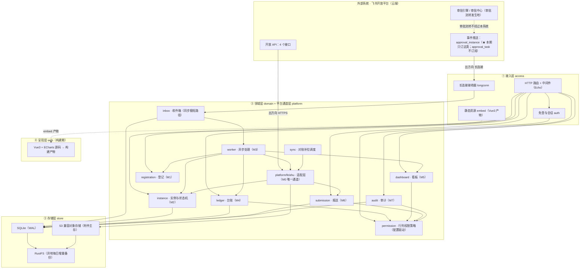
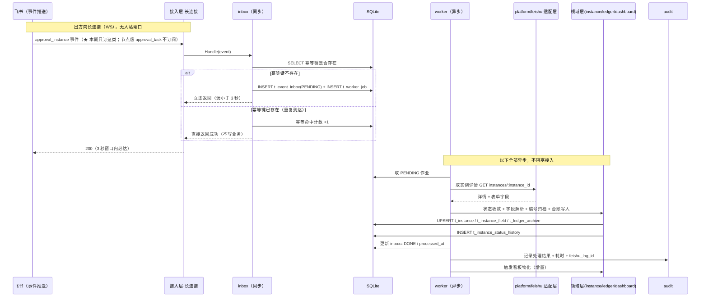
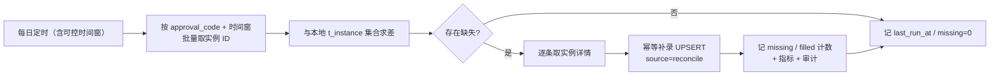
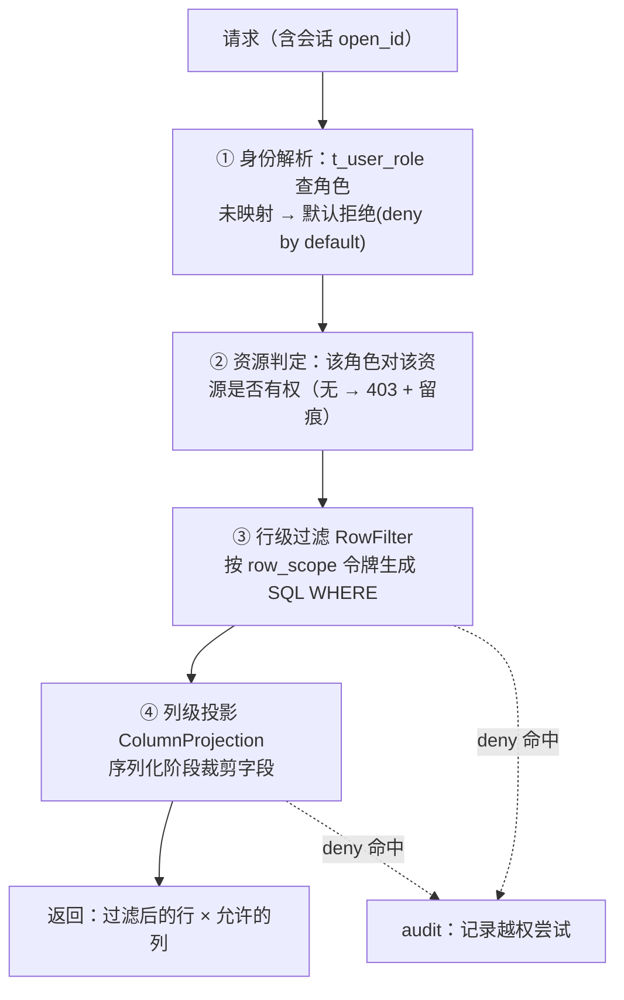
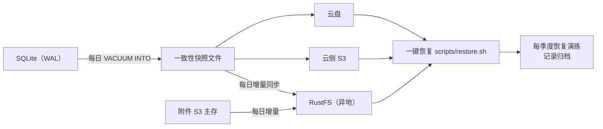

# 采购与费用审批平台（自建侧）· 架构设计

> 结论先行：本系统是**审批引擎的旁路**，不是审批引擎。架构的全部难点不在业务功能，而在四条工程纪律——**单实例、幂等 inbox、先订阅、极短事件路径**，外加一条兜底（**对账补拉**）与一条底线（**自建系统故障不得影响飞书侧审批**）。
> 全案**只用 4 个飞书接口 + 1 条长连接**，**不存在「创建审批实例」调用路径**。
> 技术栈已锁定，不得更改：Go 1.21+ / Echo v4 / SQLite（WAL）/ Vue3（`//go:embed` 内嵌）/ ECharts / 云侧 S3 兼容对象存储（主）+ RustFS（异地每日增量备份）/ 境外云主机单实例 systemd / 飞书免登。
> ⚠️ **架构转向 ③ 已发生**：审批流转归属由「飞书原生引擎旁路」改为「**审批核心迁至我方 · 飞书官方三方审批**」；转向相关的增量设计（数据模型 / 状态机 / 推送与版本控制 / 回调端点 / 四操作 / 编号 / 对账 / 长连接收敛 / 静默防护 / 任务分解 / 测试）见 **[`04a-Architecture-Increment-V2.md`](./04a-Architecture-Increment-V2.md)**。本文为 V1.0 基线；凡与其冲突的**转向相关位点以 04a 为准**。★ **`04 §0` 三条否定式硬约束的定案**：**「无入站端口」**→**单点解除**（仅开一条回调入站路径）· **「无轮询」**→**解除**（仅加 5 分钟对账轮询）· **「故障完全隔离」**→**改写**（本方成为审批必需节点，降级口径见 `01a` §7.2）；详见 `04a-Architecture-Increment-V2.md` **§0 定案表**。

| 项 | 内容 |
|---|---|
| 文档名称 | 采购与费用审批平台（自建侧）· 架构设计 |
| 版本 | V1.5（+ `#74` 批量 A：`t_subscribe_state` 读取点改符号 `handleReadyz`；§1.2 起为 M0–M9） |
| 日期 | 2026-09-26 |
| 上游文档 | `01-PRD.md`（需求正本）、`02-UseCase.md`、`03-TestCase.md`、`README.md`（五条硬约束）、`docs/reference/README.md` |
| 依据 | 技术方案书 V1.0-r1（`deliverables/procurement-system/技术方案书V1.0.html`） |
| 语言纪律 | 简体中文 |

---

## 0. 架构一页纸

| 维度 | 结论 |
|---|---|
| 系统定位 | 旁路只读+登记系统（模式 A / 方案 B）：「收事件 → 落库 → 台账 / 看板 / 行·列权限 / 报送 / 审计」 |
| 通道 | 出方向两条：**长连接 WS**（收事件）+ **HTTPS**（取详情 / 订阅 / 附件）。无入站端口、无公网 IP、无轮询 |
| 飞书接口面 | **仅 4 个**：订阅审批事件、取实例详情、批量取实例 ID、附件上传/下载。**无「创建审批实例」** |
| 同步路径 | 只做一件事：**写 inbox + 立即返回**（3 秒窗口的必答题） |
| 异步路径 | 详情拉取 → 字段解析 → 状态下沉 → 台账写入 → 看板物化 |
| 幂等键 | **事件级唯一 ID**（2.0 版 `header.event_id` / 1.0 版 `uuid`）；`instance_code + status` **仅用于状态收敛**，见 §4.3 |
| 部署 | **单实例**（进程级文件锁 + 端口独占），systemd 托管，健康检查自动重启 |
| 权限 | **配置驱动**（规则表 + 策略接口），默认取 PRD §4.2 建议值；**口径待 Q3 定案，不得硬编码** |
| 存储 | SQLite WAL 单文件；备份 `VACUUM INTO` → 云盘 + RustFS 双份 |
| 故障域 | 自建系统与飞书审批**完全隔离**：自建全停 → 审批照常；恢复后对账补拉补齐 |

---

## 1. 分层架构

### 1.1 分层与依赖方向

依赖方向**自上而下单向**：接入层 → 领域层 → 存储层；呈现层（静态资源）由接入层托管，不反向依赖。**飞书通道层（M0）在领域层之上被领域层单向调用**，飞书 SDK 不得泄漏到领域层以上。



**边界纪律（写进代码，不是写进文档）：**

| # | 纪律 | 落地方式 |
|---|---|---|
| 1 | 事件接收函数**只写 inbox 并返回** | 长连接回调体内不得出现任何同步的飞书 API 调用或业务表写入（静态检查 / Code Review 卡点，对应 TC-03） |
| 2 | 飞书调用**统一收口适配层** | 除 `internal/platform/feishu` 外禁止 import 飞书 SDK（golangci-lint depguard 规则） |
| 3 | 领域层**不感知飞书 SDK 类型** | 适配层将飞书 DTO 转为内部领域模型后再上抛 |
| 4 | **无「创建审批实例」** | 适配层不暴露 create 方法；依赖白名单只允许 4 个接口（对应 FR-M0-11 / TC-25） |
| 5 | 权限**服务端强制** | 前端隐藏 ≠ 拦截；行过滤在 SQL 层、列投影在序列化层（对应 TC-07） |

### 1.2 M0–M9 模块与分层映射

| 模块 | 归属层 | 核心组件 | 关键约束 |
|---|---|---|---|
| M0 平台接入 | 领域层·平台通道 | `platform/feishu`、`access/longconn`、`sync` | 只出方向；4 接口；先订阅；无轮询 |
| M1 登记与查询 | 领域层·登记 | `domain/registration` | 只读提示不阻断（§8 已知代价） |
| M2 实例与状态机 | 领域层·实例 | `domain/instance` | 键值对存储；状态映射；编号归档（只读） |
| M3 事件落库 | 领域层·inbox/worker | `inbox`、`worker` | 同步极短；幂等；死信重放 |
| M4 台账 | 领域层·台账 | `domain/ledger` | 存档/运营拆分；公式列红标 |
| M5 看板与分权 | 领域层·看板 + 权限 | `domain/dashboard`、`permission` | 数据源指向**运营表** |
| M6 报送与凭证包 | 领域层·报送 | `domain/submission` | 无凭证视为未提交 |
| M7 审计与留痕 | 领域层·审计 | `domain/audit` | 全量留痕；不参与审批 |
| M8 部署运维 | 接入层 + 部署物 | `cmd/*`、`scripts/*` | 单实例；自检四项；降级 |
| M9 审批核心（我方流转） | 领域层·审批 | `flow`（`service`/`ops`/`callback`/`notify`/`event`）、`approval`（定义装载） | ★ **架构转向 ③ 新增模块**；编号生成 · 分档与审批人计算 · 表单校验 · 转交/加签（顺序会签）/回退/撤回 · 实例快照与 `update_mode` · 状态机 · **台账终态直写** · 提交时实时回源 · 内部事件（通知+日志）。需求细目见 `01a §8.2`（`FR-M9-01`~`FR-M9-18`） |

---

## 2. 目录结构（Go 标准布局）

```
jx-procurement-platform/
├── cmd/
│   └── jxapproval/
│       ├── main.go                 入口：装配依赖、获取单实例锁、启动自检、注册信号处理、托管 systemd
│       └── bootstrap.go            启动编排：订阅 → 长连接 → worker → 定时对账 → HTTP 监听
├── internal/
│   ├── config/                     配置加载（env 优先 + config.yaml 兜底）；映射表装载与校验
│   │   ├── env.go                  环境变量清单（App ID / Secret 等，不入库、不进版本库）
│   │   ├── approval_map.go         approval_code → 单据类型 映射（PRD Q1，配置化）
│   │   └── field_map.go            字段 id → 业务字段名 映射（PRD Q1，配置化）
│   ├── platform/                   ★ 外部依赖适配层（唯一允许接触第三方 SDK 的地方）
│   │   ├── feishu/
│   │   │   ├── client.go           4 接口收口 + tenant_access_token 管理（M0）
│   │   │   ├── longconn.go         长连接 WS 保活 / 重连 / 事件路由（M0）
│   │   │   ├── subscribe.go        「订阅审批事件」逐个 approval_code 调用（M0）
│   │   │   ├── instance.go         取实例详情 / 批量取实例 ID（M0）
│   │   │   ├── attachment.go       附件上传 / 下载（M0）
│   │   │   └── dto.go              飞书 DTO → 内部领域模型转换
│   │   ├── objectstore/            S3 兼容客户端（附件主存）
│   │   └── backup/                 RustFS 每日增量同步
│   ├── inbox/                      ★ 事件收件箱（同步极短路径，M3）
│   │   ├── inbox.go                写 inbox + 立即返回；幂等去重
│   │   └── idempotent.go           幂等键计算与命中计数
│   ├── worker/                     异步处理池（M3）
│   │   ├── pool.go                 并发受控、优雅退出
│   │   ├── handler_instance.go     实例级事件处理
│   │   ├── handler_task.go         节点级事件处理
│   │   ├── retry.go                指数退避重试
│   │   └── deadletter.go           死信落库与人工重放
│   ├── domain/                     领域层（纯业务，不含飞书类型）
│   │   ├── instance/               M2：实例模型、状态机、编号归档、时间线
│   │   ├── ledger/                 M4：台账模型、存档/运营拆分、公式列红标
│   │   ├── dashboard/              M5：4 张看板指标 SQL 与物化
│   │   ├── registration/           M1：备付金签领、集团报销跟踪、审批外字段补录
│   │   ├── submission/             M6：提交集团、移交凭证、凭证包、月度对账
│   │   └── audit/                  M7：操作日志、状态变更史、导出留痕
│   ├── access/                     接入层
│   │   ├── router.go               Echo 路由注册（业务 / 内部运维两组）
│   │   ├── middleware/             会话、CSRF、限流（429）、恢复、请求日志
│   │   ├── handler/                各 REST 处理器（薄，只做参数绑定与调用领域）
│   │   ├── auth/                   飞书免登回调、会话、open_id→角色解析（含"拒绝未映射"）
│   │   └── static/                 //go:embed web/dist → 静态资源
│   ├── permission/                 ★ 行·列权限策略引擎（配置驱动，M5）
│   │   ├── policy.go               策略接口：RowFilter / ColumnProjection
│   │   ├── rule_loader.go          规则表装载（口径变更不改代码）
│   │   └── dataset.go              行级范围令牌（本人/本部门/分管部门/全量/被指定）
│   ├── sync/                       对账补拉（M0 / 兜底）
│   │   ├── scheduler.go            每日定时（含可控时间窗，供测试）
│   │   ├── reconcile.go            批量取实例 ID → 求差 → 补录
│   │   └── cursor.go               同步游标读写
│   ├── store/                      SQLite 存储层（Repository）
│   │   ├── db.go                   连接、WAL、PRAGMA、迁移执行
│   │   └── repo_*.go               各表仓储实现（含行过滤 SQL 拼装）
│   └── observ/                     可观测性
│       ├── log.go                  结构化日志（含 feishu_log_id 透传）
│       ├── metrics.go              关键指标埋点
│       └── health.go               /healthz /readyz 聚合器（自检四项 + 运行期）
├── migrations/                     SQL DDL（按序编号，启动自动迁移）
│   └── 0001_init.sql
├── web/                            前端源码（Vue3 + ECharts；构建产物由 access/static embed）
│   ├── src/{views,components,api,permission}/      ★ permission 前端仅做展示降级，真拦截在服务端
│   └── vite.config.ts
├── scripts/                        构建、备份、部署脚本
│   ├── build.sh                    npm build → go build（embed）→ 单二进制
│   ├── backup.sh                   一键备份（VACUUM INTO → 云盘 + RustFS）
│   ├── restore.sh                  一键恢复
│   └── jxapproval.service          systemd unit 草案
└── docs/                           需求与设计文档
```

**目录 → 模块对照**：`platform/feishu` = M0；`inbox`+`worker` = M3；`domain/instance` = M2；`domain/ledger` = M4；`domain/dashboard`+`permission` = M5；`domain/registration` = M1；`domain/submission` = M6；`domain/audit` = M7；`cmd`+`scripts`+`observ/health` = M8。

---

## 3. 数据模型（SQLite DDL 草案）

> 说明：以下为**DDL 草案**，用于固化表结构、键与约束；字段类型按 SQLite 亲和类型书写。**凡涉及未定口径（`approval_code`、字段 `id`、权限矩阵）一律以配置表承接，不进入硬编码列**。

### 3.1 表清单

| # | 表名 | 职责 | 对应模块 |
|---|---|---|---|
| 1 | `t_instance` | 实例主表 | M2 |
| 2 | `t_instance_field` | 实例表单字段（键值对）｜★ **已弃用（转向 ③ · F3）**（原生控件链作废 → 端点恒空） | M2 |
| 3 | `t_instance_status_history` | 状态变更史｜★ **③ 写入者＝`flow.finalize`**（原 `worker/ingest`） | M2 / M7 |
| 4 | `t_event_inbox` | 事件收件箱（幂等） | M3 |
| 5 | `t_worker_job` | 异步作业 / 重试队列 | M3 |
| 6 | `t_deadletter` | 死信 | M3 |
| 7 | `t_sync_cursor` | 同步游标 / 对账状态 | M0 |
| 8 | `t_subscribe_state` | 订阅状态｜★ **已弃用（转向 ③ · F1）**；读取点 `handlers_ops.go` 的 **`handleReadyz` 自检（`subscribe_states`）** 须一并清理 | M0 |
| 9 | `t_config_mapping` | approval_code 映射 + 字段 id 映射（配置化） | M0 / M2 |
| 10 | `t_user_role` | 用户角色映射 | M5 |
| 11 | `t_permission_rule` | 行·列权限规则（配置驱动） | M5 |
| 12 | `t_ledger_archive` | 台账·同步存档（只读）｜★ **③ 写入者＝`flow.finalize`**（原 `worker/ingest`） | M4 |
| 13 | `t_ledger_ops` | 台账·运营表（可写） | M4 |
| 14 | `t_ledger_field_def` | 台账字段定义（可见/可写/公式） | M4 |
| 15 | `t_petty_cash_receipt` | 备付金签领登记 | M1 |
| 16 | `t_petty_cash_close` | 备付金月核销 | M1 |
| 17 | `t_expense_track` | 集团报销跟踪表（人工登记） | M1 |
| 18 | `t_submission` | 报送登记 | M6 |
| 19 | `t_submission_item` | 报送关联单据 | M6 |
| 20 | `t_audit_log` | 审计日志 | M7 |

> ★ **转向 ③ 后本表的新写入者 / 弃用**（详见 `04a-Architecture-Increment-V2.md` 与 `11`）：**弃用**＝`t_instance_field`（**F3**，原生控件链作废 → `GET /api/instances/{code}/fields` 恒空）、`t_subscribe_state`（**F1**，审批事件订阅作废）；**写入者迁移为 `flow.finalize`**（取代旧事件链 `worker/ingest`）＝`t_ledger_archive` / `t_instance_status_history` / **`t_attachment`**（迁移 `0005` 引入，见 `05-API §3.12`；元数据入库零网络 IO）。

### 3.2 DDL 草案

```sql
-- ============ M2 实例主表 ============
CREATE TABLE t_instance (
  id               INTEGER PRIMARY KEY AUTOINCREMENT,
  instance_code    TEXT    NOT NULL UNIQUE,           -- 飞书实例 ID
  approval_code    TEXT    NOT NULL,                  -- 映射到单据类型（经 t_config_mapping）
  doc_type         TEXT,                              -- BA/PR/SA/RFQ/BJ/SS/CT/PC/GR/QC/SUB（映射得出）
  biz_no           TEXT,                              -- 业务单号：前缀-YYMM-####（由飞书流水号控件生成，自建侧只读）
  biz_no_prefix    TEXT,                              -- 归档前缀
  biz_no_yymm      TEXT,                              -- YYMM（可空，Q7 待确认是否按月重置）
  biz_no_seq       TEXT,                              -- ####（只读归档，自建侧不生成）
  status           TEXT    NOT NULL,                  -- 状态机收敛后的当前状态
  status_raw       TEXT,                              -- 飞书原始状态（保真）
  applicant_open_id TEXT,                             -- 申请人
  applicant_name   TEXT,
  department       TEXT,                              -- 部门（行级过滤依据）
  amount_cents     INTEGER,                           -- 金额（分；列级权限保护对象）
  purpose_class_l1 TEXT,                              -- 用途一级分类
  purpose_class_l2 TEXT,                              -- 用途二级明细
  supplier         TEXT,                              -- 供应商（防拆分累计依据）
  source           TEXT NOT NULL DEFAULT 'event',     -- event / reconcile（区分事件入库 or 对账补录）
  created_at       TEXT NOT NULL,                     -- ISO8601 UTC
  updated_at       TEXT NOT NULL
);
CREATE INDEX idx_instance_approval_code ON t_instance(approval_code, created_at);
CREATE INDEX idx_instance_dept          ON t_instance(department);
CREATE INDEX idx_instance_applicant     ON t_instance(applicant_open_id);
CREATE INDEX idx_instance_supplier      ON t_instance(supplier, biz_no_yymm);
CREATE INDEX idx_instance_biz_no        ON t_instance(biz_no);

-- ============ M2 实例表单字段（键值对，不硬编码字段顺序） ============
-- ★ 转向 ③：本表【已弃用 · F3】——原生控件链作废，`GET /api/instances/{code}/fields` 恒空（见 04a / 11 §3 B-1）
CREATE TABLE t_instance_field (
  id             INTEGER PRIMARY KEY AUTOINCREMENT,
  instance_code  TEXT    NOT NULL,
  field_id       TEXT    NOT NULL,                    -- 飞书表单控件 id（原样存，映射到业务名走 t_config_mapping）
  field_name     TEXT,                                -- 展示名（模板可能变名，仅作展示）
  biz_field      TEXT,                                -- 经映射表得到的业务字段名（可空表示未映射，Q1）
  value_text     TEXT,                                -- 统一以文本存储，按需解析
  value_type     TEXT,                                -- text/number/date/attachment/option...
  raw_json       TEXT,                                -- 原始片段（保真，应对控件演进）
  created_at     TEXT NOT NULL,
  UNIQUE(instance_code, field_id)
);
CREATE INDEX idx_field_biz ON t_instance_field(instance_code, biz_field);

-- ============ M2/M7 状态变更史（驳回重提的链式留痕） ============
-- ★ 转向 ③：写入者＝`flow.finalize`（取代旧 worker/ingest；见 04a / 11 §3 B-5）
CREATE TABLE t_instance_status_history (
  id             INTEGER PRIMARY KEY AUTOINCREMENT,
  instance_code  TEXT    NOT NULL,
  status         TEXT    NOT NULL,
  task_node      TEXT,                                -- 节点名（approval_task 事件）。★ 预留未用：本期不订阅 approval_task，恒为 NULL（PRD N10 / B38）
  operator_open_id TEXT,
  opinion        TEXT,                                -- 审批意见（驳回原因等）
  occurred_at    TEXT    NOT NULL,                    -- 事件发生时间
  event_seq      INTEGER NOT NULL,                    -- 同实例内递增序号（见 §4.3 幂等增强）
  created_at     TEXT    NOT NULL
);
CREATE INDEX idx_hist_instance ON t_instance_status_history(instance_code, event_seq);

-- ============ M3 事件收件箱（幂等） ============
CREATE TABLE t_event_inbox (
  id             INTEGER PRIMARY KEY AUTOINCREMENT,
  idem_key       TEXT    NOT NULL,                    -- 幂等键 = 事件级唯一 ID（见 §4.3；2.0 版 header.event_id / 1.0 版 uuid）
  event_type     TEXT    NOT NULL,                    -- 本期只写 approval_instance；approval_task 不订阅（PRD N10）
  instance_code  TEXT    NOT NULL,
  status         TEXT,
  event_id       TEXT,                                -- 飞书事件/消息 ID（若可用，仅作辅助）
  payload        TEXT    NOT NULL,                    -- 原始事件报文（保真）
  process_state  TEXT    NOT NULL DEFAULT 'PENDING',  -- PENDING/PROCESSING/DONE/FAILED/DEAD
  retry_count    INTEGER NOT NULL DEFAULT 0,
  last_error     TEXT,
  received_at    TEXT    NOT NULL,                    -- 入库时刻（用于 3 秒路径耗时观测）
  processed_at   TEXT,
  UNIQUE(idem_key)                                    -- ★ 幂等唯一约束：重复事件在此处被拦
);
CREATE INDEX idx_inbox_state ON t_event_inbox(process_state, received_at);

-- ============ M3 异步作业 / 重试 ============
CREATE TABLE t_worker_job (
  id             INTEGER PRIMARY KEY AUTOINCREMENT,
  inbox_id       INTEGER NOT NULL,
  job_type       TEXT    NOT NULL,                    -- fetch_detail / parse_field / write_ledger
  state          TEXT    NOT NULL DEFAULT 'QUEUED',
  attempts       INTEGER NOT NULL DEFAULT 0,
  next_run_at    TEXT,
  last_error     TEXT,
  created_at     TEXT NOT NULL,
  updated_at     TEXT NOT NULL,
  UNIQUE(inbox_id, job_type)                          -- 同一 inbox 同一作业不重复
);
CREATE INDEX idx_job_sched ON t_worker_job(state, next_run_at);

-- ============ M3 死信 ============
CREATE TABLE t_deadletter (
  id             INTEGER PRIMARY KEY AUTOINCREMENT,
  inbox_id       INTEGER NOT NULL,
  reason         TEXT    NOT NULL,
  payload        TEXT,
  replay_count   INTEGER NOT NULL DEFAULT 0,
  created_at     TEXT NOT NULL,
  last_replayed_at TEXT
);

-- ============ M0 同步游标 ============
CREATE TABLE t_sync_cursor (
  id             INTEGER PRIMARY KEY AUTOINCREMENT,
  approval_code  TEXT    NOT NULL,
  cursor_kind    TEXT    NOT NULL,                    -- reconcile（批量取实例 ID 的时间窗游标）
  last_synced_at TEXT,                                -- 上次同步起点（时间窗）
  last_run_at    TEXT,
  last_missing   INTEGER DEFAULT 0,                   -- 上次对账求差缺失条数
  last_filled    INTEGER DEFAULT 0,                   -- 上次补录条数
  UNIQUE(approval_code, cursor_kind)
);

-- ============ M0 订阅状态（先订阅 + 健康检查） ============
-- ★ 转向 ③：本表【已弃用 · F1】——审批事件订阅作废；读取点 `handlers_ops.go` 的 **`handleReadyz` 自检（`subscribe_states`）** 须清理（见 04a / 11 §3 B-2）
CREATE TABLE t_subscribe_state (
  id             INTEGER PRIMARY KEY AUTOINCREMENT,
  approval_code  TEXT    NOT NULL UNIQUE,
  doc_type       TEXT,
  subscribed     INTEGER NOT NULL DEFAULT 0,          -- 0/1
  last_result    TEXT,                                -- 成功/失败码
  last_error     TEXT,
  last_attempt_at TEXT,
  updated_at     TEXT NOT NULL
);

-- ============ M0/M2 配置映射（★ 配置化，不硬编码） ============
CREATE TABLE t_config_mapping (
  id             INTEGER PRIMARY KEY AUTOINCREMENT,
  map_kind       TEXT    NOT NULL,                    -- 'approval_code' | 'field_id' | 'threshold' | 'enum'
  map_key        TEXT    NOT NULL,                    -- approval_code / 控件 id / 枚举键
  map_value      TEXT    NOT NULL,                    -- 单据类型 / 业务字段名 / 阈值等
  doc_type       TEXT,                                -- 作用于哪类单据（field_id 映射用）
  remark         TEXT,
  updated_at     TEXT NOT NULL,
  UNIQUE(map_kind, map_key, COALESCE(doc_type,''))
);

-- ============ M5 用户角色映射 ============
CREATE TABLE t_user_role (
  id             INTEGER PRIMARY KEY AUTOINCREMENT,
  open_id        TEXT    NOT NULL UNIQUE,             -- 飞书 open_id
  name           TEXT,
  role           TEXT    NOT NULL,                    -- 申请人/主管领导/项目总经理/副总/综合运营主管/采购经办人/验收人/系统管理员
  department     TEXT,                                -- 主部门
  extra_depts    TEXT,                                -- 分管部门（JSON 数组，供行级范围令牌）
  active         INTEGER NOT NULL DEFAULT 1,
  updated_at     TEXT NOT NULL
  -- ★ 未在此表映射的 open_id → 默认拒绝（deny by default），对应 UC-01/A2、TC-32
);

-- ============ M5 权限规则（配置驱动，口径待 Q3 定案） ============
CREATE TABLE t_permission_rule (
  id             INTEGER PRIMARY KEY AUTOINCREMENT,
  resource       TEXT    NOT NULL,                    -- ledger:采购备案台账 / dashboard:14 / api:instances 等
  role           TEXT    NOT NULL,
  row_scope      TEXT    NOT NULL,                    -- SELF/DEPT/CHARGE_DEPT/ALL/ASSIGNED/PARTICIPATED
  column_allow   TEXT,                                -- 允许列（JSON 数组；NULL = 全部允许）
  column_deny    TEXT,                                -- 拒绝列（JSON 数组；优先级高于 column_allow）
  writable_fields TEXT,                               -- 可写字段（JSON 数组；仅运营表有效，其余只读）
  effective_from TEXT,                                -- 生效时间（口径变更留痕）
  remark         TEXT,
  updated_at     TEXT NOT NULL,
  UNIQUE(resource, role)
  -- ★ 此表内容默认取 PRD §4.2「建议值」；Q3 定案后仅改数据行，不改代码
);

-- ============ M4 台账·同步存档（只读，审批自动写入） ============
-- 建模策略：单表 + 类型字段（取舍见 §3.3）。核心列为稳定字段，变动字段入 ext_json。
-- ★ 转向 ③：写入者＝`flow.finalize`（取代旧 worker/ingest；见 04a / 11 §3 B-5）
CREATE TABLE t_ledger_archive (
  id             INTEGER PRIMARY KEY AUTOINCREMENT,
  ledger_type    TEXT    NOT NULL,                    -- 台账类型（1..12 语义键，见 §3.4）
  biz_no         TEXT,                                -- 业务单号（贯穿全链）
  instance_code  TEXT,                                -- 来源实例
  source_doc_type TEXT,
  department     TEXT,
  applicant_open_id TEXT,
  submitter_open_id TEXT,                              -- ★ 预留未用（B42）：列已建，但 Ingest 不写、亦无读取者；
                                                       --   保留以避免 SQLite 重建表；新用途前请先明确语义
  amount_cents   INTEGER,
  supplier       TEXT,
  purpose_class_l1 TEXT,
  purpose_class_l2 TEXT,
  biz_date       TEXT,                                -- 业务日期（YYMM 解析等）
  ext_json       TEXT    NOT NULL DEFAULT '{}',       -- 类型专属字段（键值对，不硬编码列）
  created_at     TEXT NOT NULL,
  updated_at     TEXT NOT NULL,
  UNIQUE(ledger_type, biz_no)                         -- 同类型同业务单号唯一（幂等写入）
);
CREATE INDEX idx_arch_type_dept ON t_ledger_archive(ledger_type, department);
CREATE INDEX idx_arch_supplier_month ON t_ledger_archive(ledger_type, supplier, biz_date);

-- ============ M4 台账·运营表（可写，仅运营字段） ============
CREATE TABLE t_ledger_ops (
  id             INTEGER PRIMARY KEY AUTOINCREMENT,
  ledger_type    TEXT    NOT NULL,
  biz_no         TEXT    NOT NULL,                    -- 以业务单号关联存档表（不做二次录入）
  ops_json       TEXT    NOT NULL DEFAULT '{}',       -- 审批后字段（付款凭据号/抽查状态/经办状态/完成日期/...(Q14)）
  updated_by     TEXT,
  updated_at     TEXT NOT NULL,
  UNIQUE(ledger_type, biz_no)
);

-- ============ M4 台账字段定义（可见/可写/公式） ============
CREATE TABLE t_ledger_field_def (
  id             INTEGER PRIMARY KEY AUTOINCREMENT,
  ledger_type    TEXT    NOT NULL,
  field_key      TEXT    NOT NULL,                    -- 对应 archive.ext_json / ops_json 的键
  field_label    TEXT,
  is_formula     INTEGER NOT NULL DEFAULT 0,          -- 公式列红标（FR-M4-04）
  formula_kind   TEXT,                                -- same_person / supplier_month_sum / spot_check_range ...
  is_sensitive   INTEGER NOT NULL DEFAULT 0,          -- 是否敏感列（金额类，供列级权限兜底）
  UNIQUE(ledger_type, field_key)
);

-- ============ M1 备付金签领登记 ============
CREATE TABLE t_petty_cash_receipt (
  id             INTEGER PRIMARY KEY AUTOINCREMENT,
  biz_no         TEXT,                                -- 关联采购报备单（BA）
  instance_code  TEXT,
  receiver_open_id TEXT,
  receiver_name  TEXT,
  amount_cents   INTEGER NOT NULL,
  received_date  TEXT    NOT NULL,
  created_by     TEXT,
  created_at     TEXT NOT NULL
);
CREATE INDEX idx_pc_receipt_biz ON t_petty_cash_receipt(biz_no);

-- ============ M1 备付金月核销 ============
CREATE TABLE t_petty_cash_close (
  id             INTEGER PRIMARY KEY AUTOINCREMENT,
  period         TEXT    NOT NULL,                    -- 账期 YYYY-MM
  issued_cents   INTEGER,                             -- 当期签领
  spent_cents    INTEGER,                             -- 当期支出
  balance_cents  INTEGER,                             -- 核销后余额（唯一可外部核对的锚点）
  remark         TEXT,
  created_by     TEXT,
  created_at     TEXT NOT NULL,
  UNIQUE(period)
);

-- ============ M1 集团报销跟踪表（人工登记） ============
CREATE TABLE t_expense_track (
  id             INTEGER PRIMARY KEY AUTOINCREMENT,
  src_biz_no     TEXT,                                -- 关联事前申请单号（SA）
  applicant_open_id TEXT,
  department     TEXT,
  actual_cents   INTEGER,
  invoice_count  INTEGER,
  review_state   TEXT,                                -- 初审状态
  handover_date  TEXT,                                -- 移交集团日期
  paid_date      TEXT,                                -- 集团付款日期（人工）
  paid_cents     INTEGER,
  overrun_note   TEXT,                                -- 超支说明
  created_by     TEXT,
  created_at     TEXT NOT NULL,
  updated_at     TEXT NOT NULL
);

-- ============ M6 报送登记 ============
CREATE TABLE t_submission (
  id             INTEGER PRIMARY KEY AUTOINCREMENT,
  biz_no         TEXT UNIQUE,                         -- SUB-YYMM-####
  subject_type   TEXT,                                -- 事项类型
  amount_cents   INTEGER,
  pay_method     TEXT,
  hn_finish_date TEXT,                                -- 湖南侧完成日期
  submit_date    TEXT,                                -- 提交集团日期
  receipt_ref    TEXT,                                -- 移交凭证（签收记录）★ 为空则视为未提交
  submit_state   TEXT    NOT NULL,                    -- 未提交/已提交/办理中/已付款/已驳回（按凭证与人工登记推导）
  grp_accept_no  TEXT,                                -- 集团受理编号（人工）
  grp_state      TEXT,                                -- 集团流程状态（人工）
  paid_date      TEXT,                                -- 付款完成日期（人工）
  reject_reason  TEXT,                                -- 驳回原因与处置
  created_by     TEXT,
  created_at     TEXT NOT NULL,
  updated_at     TEXT NOT NULL,
  CHECK (receipt_ref IS NULL OR receipt_ref <> '' OR submit_state <> '已提交')
);
CREATE INDEX idx_sub_state ON t_submission(submit_state, hn_finish_date);

-- ============ M6 报送关联单据 ============
CREATE TABLE t_submission_item (
  id             INTEGER PRIMARY KEY AUTOINCREMENT,
  submission_id  INTEGER NOT NULL,
  item_biz_no    TEXT    NOT NULL,                    -- PR / CT / GR / 发票 / 比价表等
  item_type      TEXT,
  FOREIGN KEY (submission_id) REFERENCES t_submission(id) ON DELETE CASCADE
);

-- ============ M7 审计日志 ============
CREATE TABLE t_audit_log (
  id             INTEGER PRIMARY KEY AUTOINCREMENT,
  actor_open_id  TEXT,
  actor_role     TEXT,
  action         TEXT    NOT NULL,                    -- view/query/update/export/login/denied/replay/subscribe...
  resource       TEXT,                                -- 台账/看板/实例/凭证包
  target_id      TEXT,
  result         TEXT,                                -- allow / deny
  detail_json    TEXT,
  feishu_log_id  TEXT,                                -- ★ 飞书调用 log_id（排障用）
  ip             TEXT,
  created_at     TEXT NOT NULL                        -- ISO8601 UTC
);
CREATE INDEX idx_audit_time ON t_audit_log(created_at);
CREATE INDEX idx_audit_actor ON t_audit_log(actor_open_id, action);
```

### 3.3 台账建模策略取舍：**单表 + 类型字段**（选定）

| 方案 | 说明 | 优点 | 缺点 | 结论 |
|---|---|---|---|---|
| **A. 单表 + 类型字段**（选定） | `t_ledger_archive` / `t_ledger_ops` 各一张，以 `ledger_type` 区分，稳定字段列 + `ext_json` 变动字段 | ① 12 张台账字段差异大且**模板字段会变**（Q1 / 风险 5），固定列需频繁 DDL 迁移；②「同供应商当月累计」「跨表联查」等跨台账聚合 SQL 简单；③ 新增台账/字段零迁移；④ 与 `t_instance_field` 键值对思路一致 | `ext_json` 牺牲部分列级类型约束；需靠 `t_ledger_field_def` + 应用层校验兜底 | **采用**。本系统是旁路台账、报表型负载（日 <100 单 / 并发 <20），不需要强列约束换取写性能 |
| B. 一表一台账（12 张） | 每张台账独立 `CREATE TABLE` | 强类型、字段语义清晰 | ① 字段变动即 DDL 迁移，与「模板变动不改代码」直接冲突；② 跨台账联查（防拆分、看板 14/15）要写多表 UNION；③ 12 套 CRUD 重复 | 否决 |
| C. EAV 全键值 | 全字段都进 KV 表 | 最灵活 | 查询/聚合性能差，权限列投影与看板 SQL 变得复杂 | 否决 |

> 补充：台账内部仍保留**存档表（只读）/ 运营表（可写）拆分**（FR-M4-03），落地为 `t_ledger_archive` + `t_ledger_ops` 两表，以 `biz_no` 关联，**不是** 12 张表各拆一半。第 8 号「供应商档案与绩效表」本身可写、无拆分问题，直接落在运营表语义中（`ledger_type` 标记），不单独建表。

### 3.4 台账类型语义键（`ledger_type`）

> ★ **Q14 已定案（2026-09-26）**：下表「可写字段」即**最终清单**，由 `t_permission_rule.writable_fields`（纯配置，空＝只读）＋ 写接口的**字段定义白名单**共同承载；登记责任人与触发时点见《Q14 待确认清单》。**「派生态」**一列标明哪些台账**不接收实例级落账**。

| 键 | 台账 | 存档/运营 | 可写字段（运营） | 派生态 | 登记责任人 |
|---|---|---|---|---|---|
| `L01` | 采购备案台账 | 单表 | 付款凭据号、抽查状态（FR-M1-03） | 落行（含审批后字段 → 需运营表） | 综合运营主管 |
| `L02` | 采购需求与审批台账 | 单表 | 无（全在审批内产生） | 落行（无需运营表） | —（无需人工登记） |
| `L03` | 采购经办登记台账 | **必拆** | 经办状态、完成日期、是否按期 | 落行 | 采购经办人 |
| `L04` | 合同台账 | **拆** | 预付比例、质保金余额 | 落行 | 采购经办人 / 综合运营主管 |
| `L05` | 费用事前申请台账 | **拆** | 结算状态、移交集团日期 | 落行 | 综合运营主管 |
| `L06` | 集团提交与付款衔接台账 | **必拆** | 提交日期、集团受理编号、集团流程状态、付款完成日期（全人工） | 落行 | 综合运营主管（依集团人工反馈） |
| `L07` | 到货验收台账 | **拆** | 检验结论、差异说明 | 落行（GR / QC **各写一行**，查询侧以 `related_biz_no` 关联） | 质检技术部 / 采购经办人 |
| `L08` | 供应商档案与绩效表 | 本身可写 | 手工维护字段 | 落行（主数据，**不另拆**） | 综合运营主管 |
| `L09` | 例外事项台账 | 单表 | 是否已核销闭合（紧急单闭合） | 落行（含独家 / 紧急 / **变更**） | 采购经办人 |
| `L10` | 用途分类汇总台账 | 只读 | 无 | **只读汇总、不落行**；Q14 定案**不做派生视图**（汇总口径由看板承担） | —（无写入口） |
| `L11` | 订单执行台账 | **派生视图** | 无（**不落行**） | ★ 以 L04 为骨架 + 关联 L07 派生（`GET /api/ledger/L11` 返回 `derived:true`） | —（无写入口） |
| `L12` | 预算执行台账 | 保留结构 | 本期不启用 | 不落行、**无写入口** | —（本期不启用） |

### 3.5 索引与唯一约束（幂等键）小结

| 对象 | 约束 | 目的 |
|---|---|---|
| `t_event_inbox.idem_key` | **UNIQUE** | 事件重复到达时，第二条在写入即被拒绝（幂等的唯一权威点，对应 TC-01） |
| `t_instance.instance_code` | **UNIQUE** | 同一实例只有一条主记录 |
| `t_ledger_archive(ledger_type, biz_no)` | **UNIQUE** | 台账写入幂等（重放不产生重复行） |
| `t_worker_job(inbox_id, job_type)` | **UNIQUE** | 重试不产生重复作业 |
| `t_subscribe_state.approval_code` | **UNIQUE** | 订阅状态单点可查 |
| `t_user_role.open_id` | **UNIQUE** | 一人一角色（Q8 代理人另见 §10 问题） |
| 各类 `created_at/occurred_at` | 索引 | 时间窗对账、审计查询 |

### 3.6 转向 ③ 的数据迁移与兼容策略（`instance_code` 新旧共存 · C-3 · `A30`）

> **问题（`A30` / C11）**：旧库 `t_instance.instance_code` ＝ **飞书原生实例 code**（`0001`）；转向 ③ 后我方自建实例，`instance_code` 应等于**我方 `instance_id`**（`04a §3.3` 建议 `{app_id}:{biz_no}`）。**两套语义并存**须给共存与回填口径。★ **位点更正**：`04 §12` 是**变更记录**、**无「迁移策略」节** → 本节即**迁移策略正本**（原指派"§12 迁移策略"位点不存在，落此并报回）。

| 项 | 结论 |
|---|---|
| 共存判定 | 未上线、**存量极少**（`docs/12`：28 表无生产数据、迁移量 ≈0）→ **不做批量数据迁移**，仅**统一文档与实现口径** |
| 判定新旧 | 旧 code ＝ 飞书下发（不含 `:`）、新 code ＝ `{app_id}:{biz_no}`（**含 `:`**）→ 可用"是否含 `:`"**粗判**；★ 实现侧以**写入来源**（`flow` vs `ingest`）为准，**不靠格式猜** |
| 回填方案（如需） | **旧行**：`instance_code` 保持原值（**只读历史**）；**新行**一律 `{app_id}:{biz_no}`。★ 若确需统一：一次性把旧行 `instance_code` 改写为 `{app_id}:` 前缀拼接 `biz_no`（**仅在旧链退役后、且无外部引用时**）；★ **`instance_code UNIQUE`** 要求回填**不得撞号** |
| 约束 | `instance_code UNIQUE` 不变；`biz_no` 唯一兜底见 `04a §6.4` P3（`0007` 补建 `ux_instance_biz_no`） |
| 落地 | 并入 ③ 上线前迁移清单；`A30` 关闭时补一条**回填脚本 + 回读断言** |

> ★ 若用户选择"**不做回填**"（**推荐**，存量 ≈0）→ 则**共存即终态**：旧行只读、新行新语义，**在文档层写死**即可。

---

## 4. 事件处理流水线

> ★ **转向 ③ 作废 / 改写声明（F1–F5）**：本节描述的**事件抽取链**（长连接订阅审批事件 → inbox → worker 取实例详情 → 解析落库）在 ③ 下**整体作废** —— 审批流转迁至我方，飞书只保留「展示 / 待办 / 通知 + 同意·拒绝」，台账 / 状态史 / 字段 / 附件的写入者改为 **`flow.finalize`（终态直写）**。★ 本节**仍保留**的通用框架：**幂等 inbox（`t_event_inbox`）+ 重试 + 死信**（改由**回调**与**内部流程事件**复用）。转向相关位点一律以 `04a-Architecture-Increment-V2.md` 为准（见其 §0 定案表 / §4 / §8 / §10）。

### 4.1 同步路径 vs 异步路径（时序）



### 4.2 同步路径的四条红线

| 红线 | 说明 | 违反后果 | 验收 |
|---|---|---|---|
| 只写 inbox | 回调体内不得调飞书 API / 不写业务表 | 超 3 秒 → 超时重推 → 脏数据风险 | TC-03 |
| 立即返回 | 不做任何 sleep / 阻塞等待 | 同上 | TC-03 |
| 幂等前置 | 先查幂等键再写 | 重复事件产生重复记录 | TC-01 |
| 耗时观测 | 记录 received_at → 返回耗时 | 异步化被破坏而不自知 | TC-03 备注 |

### 4.3 幂等键**定案：事件级唯一 ID**（★ 2026-09-26 定案，取代本文早期「链式增强」草案；原冲突见 §10 问题 1）

**定案依据（飞书开放平台《事件概述》官方原文）**：

1. **幂等键 = 事件级唯一 ID**：**1.0 版事件用 `uuid`、2.0 版事件用 `header.event_id`** 判断事件唯一性。
2. **重试窗口**：事件未在 **3 秒内**响应即视为失败，按 **15 秒 / 5 分钟 / 1 小时 / 6 小时** 重推、**最多 4 次**，**最长重发窗口约 7.1 小时**。
3. **至少投递一次**：链路在超时等异常时会触发内部重发，**即使成功接收也可能再收到重复消息**。
4. **有序事件**：飞书对部分事件采用有序推送，**前一事件成功后推下一事件**；消费失败会重复推送直至失效才推下一个 → **同步路径绝不阻塞**（FR-M3-09）。

**为什么 `instance_code + status` 不能作唯一键**：驳回后重提会使**同一实例再次进入 PENDING**。若把 `instance_code + status` 当唯一键，**第二次 PENDING 会被幂等吞掉，状态再也回不去**（UC-15 / TC-16 会失败）。

**正确分工（三层）**：

| 用途 | 载体 | 约束 |
|---|---|---|
| **投递幂等**（重推去重） | `t_event_inbox.idem_key` = 事件级唯一 ID（`header.event_id` 或 `uuid`） | **UNIQUE**；保留期 **≥ 7.1 小时**（FR-M3-08） |
| **状态收敛** | `t_instance.status`，由 `instance_code + status` 参与判定 | 无唯一约束，只取「最新」 |
| **全量留痕** | `t_instance_status_history`（追加式） | 无唯一约束，保留全部变迁 → 天然满足 TC-16 |
- **早期「链式增强」草案（已废弃，仅作备查）**：曾计划把 `idem_key` 落地为计算字段、默认表达式 `instance_code + ':' + status`，再在「状态可重复出现」的场景追加事件维度后缀。该草案的前提是「PRD 口径不可改」；现已被官方口径直接取代，**不再采用**。原可选后缀来源如下（备查）：
  1. 事件/消息 ID（`event_id`，若长连接报文提供）→ `instance_code:status:event_id`；
  2. 同实例内状态序号 `event_seq`（若报文提供时间戳/序号）→ `instance_code:status:seq`；
  3. 兜底：`instance_code:status:yyyyMMddHHmmss`（事件发生时间，容忍同秒合并）。
  历史链则一律落 `t_instance_status_history`（**不受幂等键约束**，天然保留全部变迁），保证 TC-16 通过。
- **纪律**：`idem_key` 的具体表达式仍抽为可替换的 `IdempotencyKeyFunc` 策略函数 + 配置项，不写死在 SQL。**默认实现 = 取事件级唯一 ID**（2.0 版 `header.event_id` / 1.0 版 `uuid`），并在写入前校验该字段非空——**为空即拒绝入库并告警**（不得退化为时间戳兜底，那会重新引入重推脏数据）。报文版本（2.0 含 `schema` / `header`；1.0 为 `ts / uuid / token / type / event`）须实采一条 `approval_instance` 报文确认，见 PRD **Q17（高阻塞）**。

### 4.4 失败重试与死信

| 环节 | 策略 |
|---|---|
| 详情拉取失败 | 指数退避重试（如 5s/30s/2m/10m/1h），上限 N 次后转死信（TC-30） |
| 业务写入失败 | 事务内回滚，作业状态置 FAILED，可重试；**重试仍走幂等键**（FR-M3-03） |
| 达上限 | 落 `t_deadletter`，暴露指标与告警；**不静默丢失**（FR-M3-07） |
| 人工重放 | `POST /internal/events/{id}/replay`（管理凭据）→ 复用原 payload 重投 worker，`replay_count++` 留痕 |
| 对账失败 | 记 `t_sync_cursor.last_*`，次日窗口重叠补齐（幂等保证不重复） |

### 4.5 对账补拉（兜底，把「故障」降为「延迟」）



- **窗口设计**：每次以 `last_synced_at - 重叠缓冲` 为起点，避免边界漏单；重叠由幂等吸收。
- **自愈口径**：删除本地全部业务数据（保留配置与订阅状态）后，一次对账可全量恢复（TC-05 / FR-M0-07）。
- **与事件路径的关系**：对账是**唯一被允许的「非事件」数据入口**；它不是轮询审批状态（不违背 FR-M0-12），而是**按 ID 对账求差**，调用量仍在「数百次/月」量级（TC-25）。

### 4.6 人工重放与运维端点

| 动作 | 端点（§7 详述） | 凭据 |
|---|---|---|
| 触发对账 | ★ `POST /internal/approval/check`（`/internal/sync/reconcile` **已退役 · `410 Gone`**） | 管理凭据 |
| 重新订阅 | `POST /internal/sync/subscribe` | 管理凭据 |
| 重放死信 | `POST /internal/events/{id}/replay` | 管理凭据 |

---

## 5. 权限架构（行级过滤 + 列级投影）

> ★ **Q3 已于 2026-09-26 定案**（§4.2 采纳为默认口径）。本设计全程**配置驱动**：策略层 + 声明式规则表（`t_permission_rule`）；**口径变更只改数据行、不改代码**，并新增**「系统管理」后台页**（§5.6）供管理员自助配置。**行级权限只用 6 令牌 + `DENY`，不引入条件表达式**（定案）。不得把任何具体角色-列的可见性硬编码进代码。
>
> ★ **转向 ③ 入站安全注（E-1 / E-2，引入反向代理后生效；详见 `04a §17.6`）**：
> **(E-1) `RealIP` 限流塌缩** —— 反代后若应用**不信任受信反代的 `X-Forwarded-For` / `X-Real-IP`**、而限流仍按源 IP 分桶，则**所有回调请求的源 IP 都变成反代本机** → **全部回调共用一个限流桶**，一个桶被打满即**飞书全部回调被限流**；表现为「**回调偶发失败**」而非报错（**静默族**）。须让 `RealIP` 中间件只信任受信代理，或回调路径**改按来源身份限流**（二者择一）。
> **(E-2) `internalAuth` 依赖回环** —— 内部端点**不得再依赖"仅回环可访问"鉴权**（反代若在另一台机器即失效 / 裸奔），须改 **`JX_INTERNAL_TOKEN`**（Header `X-Internal-Token`，见 `05-API §3.8`）。

### 5.1 三层权限模型



### 5.2 行级过滤（服务端 SQL 层）

| `row_scope` 令牌 | 语义 | 生成 `WHERE` 依据 | 对应角色（定案） |
|---|---|---|---|
| `SELF` | 仅本人发起 / 本人经办 | `applicant_open_id = :me`（或 ops 中的经办字段） | 申请人 |
| `DEPT` | 本部门全部 | `department IN :my_depts` | 主管领导 |
| `CHARGE_DEPT` | 所分管部门 | `department IN :charge_depts`（来自 `t_user_role.extra_depts`） | 副总 |
| `ASSIGNED` | 本人被指定经办的记录 | `ops_json.assigned_open_id = :me` | 采购经办人 |
| `PARTICIPATED` | 本人参与验收的记录 | 验收人集合包含 `:me` | 验收人 |
| `ALL` | 全量 | 无 WHERE 追加 | 项目总经理 / 综合运营主管 / 系统管理员（只读） |

**要点：**
1. **行过滤必须发生在 SQL 层**（仓储拼装 `WHERE`），不得"查全量再在内存删"——内存过滤会在日志/报错里泄漏数据，且易漏。
2. `DEPT` 的部门来源以 `t_user_role.department` / `extra_depts` 为准；**“含分管部门”口径已定案（2026-09-26）**，仍由配置驱动。
3. **单条按 ID 访问同样施加行过滤**（TC-06：A 部门领导直接按 B 部门记录 ID 请求必须被拒）。

### 5.3 列级投影（序列化层）

| 机制 | 说明 |
|---|---|
| 允许列 / 拒绝列 | `t_permission_rule.column_allow` 白名单与 `column_deny` 黑名单；**deny 优先于 allow** |
| 敏感兜底 | `t_ledger_field_def.is_sensitive=1`（金额类）默认进入 deny，除非角色规则显式 allow |
| 投影时机 | 在**出参序列化阶段**裁剪，**字段名不得出现在响应 JSON 中**（TC-07：连字段名都不能出现） |
| 前端 | 前端 `web/src/permission` 仅做"降级展示"（隐藏列头），**不构成安全边界**；真拦截在服务端 |
| 导出 | 导出接口（`/dashboard/{id}/export`、`/submission/{id}/package`）**复用同一投影器**，禁止绕过（TC-07 步骤 4） |

### 5.4 规则表默认值（定案：采纳 PRD §4.2 口径）

| 角色 | 资源 | `row_scope` | `column_deny`（建议） | 可写 |
|---|---|---|---|---|
| 申请人 | `ledger:*` | SELF | 他人金额、集团侧人工登记列 | 否 |
| 主管领导 | `ledger:*` | DEPT | — | 否 |
| 副总 | `ledger:*` | CHARGE_DEPT | — | 否 |
| 项目总经理 | `ledger:*` | ALL | — | 否 |
| 综合运营主管 | `ledger:*` | ALL | — | **运营表可写字段**（`t_permission_rule.writable_fields`） |
| 采购经办人 | `ledger:*` | ASSIGNED | 金额列、集团侧人工登记列 | 限于被指定单据的运营字段 |
| 验收人 | `ledger:*` | PARTICIPATED | 金额列 | 限验收运营字段 |
| 系统管理员 | `ledger:*` | ALL | **金额列**（只读运维视角） | 否 |

> ★ **以上仅"建议值落成数据行"，不是设计承诺。** 代码只实现"读 `t_permission_rule` → 应用策略"，具体哪些角色见哪些列由该表内容决定。Q3 已定案（2026-09-26）：**采纳为默认数据行**；后续调整**只改表内容**（或经 §5.6 后台页改）。
> ★ 「系统管理员不含金额列」已定案（2026-09-26）为默认，仍走配置。

### 5.5 权限与审计联动

- 每次 `deny` 命中：写 `t_audit_log(result='deny')`（谁、何时、试图访问哪个资源/行/列）。
- 每次导出：写 `t_audit_log(action='export')`（FR-M7-03 / TC-26）。
- 角色即时生效：会话内**不缓存角色决策**，或缓存加"短 TTL + `t_user_role.updated_at` 版本校验"（TC-11 要求不重登即时生效）。**架构选型：每请求实时解析角色（数据量小，可接受），避免失效策略复杂度。**

---

### 5.6 权限管理后台页（★ 2026-09-26 定案新增，对应 FR-M5-09~11）

| 项 | 设计 |
|---|---|
| 入口 | 前端路由 `/admin`，**仅「系统管理员」角色可见可进**；服务端二次校验（前端隐藏不构成安全边界，见 §5.3） |
| 页面 1 · 权限矩阵 | 「**角色 × 资源**」表格：每格选 `row_scope`（下拉，值域＝6 令牌 + `DENY`）；展开可配列白 / 黑名单与「运营表可写字段」 |
| 页面 2 · 人员角色 | 维护 `t_user_role`：`open_id` / 姓名 / 角色 / 部门 / 分管部门 / 启用停用 |
| 保存路径 | 前端 → `PUT /api/admin/permission-rules`（§3.9）→ 写 `t_permission_rule` → **`Loader.Invalidate()` 清缓存** → 下一请求即生效（**不重启、不改代码**） |
| 留痕 | 每次写操作记 `t_audit_log`：操作者、时间、资源、**改前 / 改后 diff**（FR-M5-11） |
| 权限归属 | 「系统管理员」**不参与任何业务审批**（PRD §4.1），本模块只做配置；其数据视图为**运维只读、不含金额列** |

---

## 6. 配置项清单（★ 全部配置化，不硬编码）

> 对应 PRD Q1 / 技术方案书 §9 风险 5。**`approval_code`、字段 `id`、权限矩阵、阈值一律来自配置，代码中不得出现具体值。**

### 6.1 `approval_code` → 单据类型 映射表（配置化，Q1）

| 配置键 `map_key`（approval_code） | `map_value`（单据类型） | 编号前缀 | 备注 |
|---|---|---|---|
| **待确认（Q1）** | **待确认（Q1）** | BA | 采购报备单 |
| **待确认（Q1）** | **待确认（Q1）** | PR | 物资采购申请单（全流程主键） |
| **待确认（Q1）** | **待确认（Q1）** | SA | 费用事前申请单 |
| **待确认（Q1）** | **待确认（Q1）** | RFQ | 询价单 |
| **待确认（Q1）** | **待确认（Q1）** | BJ | 比价表 |
| **待确认（Q1）** | **待确认（Q1）** | SS | 单一来源理由书 |
| **待确认（Q1）** | **待确认（Q1）** | CT | 合同 / 简式订单（PO 沿用此号，Q6） |
| **待确认（Q1）** | **待确认（Q1）** | PC | 采购变更单 |
| **待确认（Q1）** | **待确认（Q1）** | GR | 到货验收单 / 入库单 |
| **待确认（Q1）** | **待确认（Q1）** | QC | 来料检验报告 |
| **待确认（Q1）** | **待确认（Q1）** | SUB | 集团提交流转单 |

> **11 个 `approval_code` 的具体值一律「待确认（Q1）」，本文件不虚构。** 映射表落地于 `t_config_mapping(map_kind='approval_code')`，由系统管理员在模板建好后导入。

### 6.2 字段 `id` → 业务字段名 映射表（配置化，Q1）

| 配置维度 | 说明 |
|---|---|
| `map_kind='field_id'` | 键 = 飞书表单控件 `id`（**具体值待确认（Q1）**），值 = 业务字段名 |
| `doc_type` | 限定作用于哪类单据（同一控件 id 可能在不同模板含义不同） |
| 未映射字段 | `t_instance_field.biz_field` 置空 → 落库但不进业务列，**不报错**（TC-23） |
| 模板新增/改名 | 只需增改配置行，历史数据不报错（FR-M2-02） |

> **架构纪律**：领域层读写表单字段一律**按业务字段名（映射后）**，绝不按控件 id 或位置下标；`t_instance_field` 以 `(instance_code, field_id)` 唯一，天然不依赖字段顺序。

### 6.3 阈值与枚举映射（配置化）

| 配置键 | 含义 | 值来源 |
|---|---|---|
| `threshold.purchase_tier` | 采购档位分界（1,000 / 5,000） | 制度第四条；**边界含端点于低档**（TC-12） |
| `threshold.split_supplier_month` | 同供应商当月累计阈值（1,000 元） | 制度第二十一条第 7 项 |
| `threshold.spot_check_range` | 重点抽查区间（800–1,000 元，左闭右闭） | TC-19 |
| `threshold.emergency_hours` | 紧急采购补录时限（24 小时） | TC-14 |
| `threshold.submit_workdays` | 提交集团时限（3 个工作日） | 制度第四十八/四十九条 |
| `enum.*` | 状态/单据类型/结算状态等枚举 | 制度 + 工具表 |

### 6.4 环境变量清单（App ID / Secret 走环境变量，不入库、不进版本库）

| 环境变量 | 用途 | 敏感 |
|---|---|---|
| `JX_APP_ID` | 飞书自建应用 App ID | 是 |
| `JX_APP_SECRET` | 飞书自建应用 App Secret | **是（严禁入库/入仓）** |
| `JX_DB_PATH` | SQLite 文件路径 | 否 |
| `JX_LISTEN_ADDR` | HTTP 监听地址 | 否 |
| `JX_SESSION_KEY` | 会话签名密钥 | 是 |
| `JX_INTERNAL_TOKEN` | 内部运维端点管理凭据 | 是 |
| `JX_S3_ENDPOINT` / `JX_S3_BUCKET` / `JX_S3_AK` / `JX_S3_SK` | 附件主存 S3 | AK/SK 敏感 |
| `JX_RUSTFS_ENDPOINT` / `JX_RUSTFS_AK` / `JX_RUSTFS_SK` | 异地备份 | 敏感 |
| `JX_LOCK_PATH` | 单实例锁文件路径 | 否 |
| `JX_ATTACH_DIR` | 附件对象存储目录（未配 `JX_S3_*` 时的本地兜底；置空且无 S3 ＝不缓存、每次回源） | 否 |
| `JX_S3_REGION` | S3 区域（缺省 `us-east-1`） | 否 |
| `JX_S3_PATH_STYLE` | S3 寻址（缺省 `true`＝`host/bucket/key`，MinIO/RustFS 常用；云 S3 置 `false`） | 否 |
| `JX_RUSTFS_BUCKET` | RustFS 桶名（缺省取 `JX_S3_BUCKET`） | 否 |
| `JX_RUSTFS_REGION` | RustFS 区域（缺省取 `JX_S3_REGION`） | 否 |
| `JX_RUSTFS_PATH_STYLE` | RustFS 寻址（缺省取 `JX_S3_PATH_STYLE`） | 否 |
| `JX_ENV` | 运行环境（prod/test）；test 开启可控时间窗 | 否 |
| `JX_CALLBACK_DOMAIN` | **回调对外域名**（反代对外地址；用于入站自检与生成 `action_callback_url`，§17.4） | 否 |
| `JX_ACTION_CALLBACK_TOKEN` | 三方审批定义下发的**回调校验 token**（敏感，§17.4） | **是** |

> 全部走 `internal/config/env.go` 读取；**仓库内不出现任何凭据明文字面量**（FR-M8-06 / TC-25）。

---

## 7. 部署与运维

### 7.1 systemd unit 草案（`scripts/jxapproval.service`）

```ini
[Unit]
Description=JX Procurement & Expense Approval Platform (single-instance)
After=network-online.target
Wants=network-online.target

[Service]
Type=simple
User=jxapp
Group=jxapp
WorkingDirectory=/opt/jxapproval
# App ID / Secret 等从独立 EnvironmentFile 注入（文件权限 600，不入库不进仓）
EnvironmentFile=/etc/jxapproval/env
ExecStart=/opt/jxapproval/jxapproval serve
Restart=always
RestartSec=5
# 单实例硬约束：不留并发启动窗口
ExecStartPre=/usr/bin/flock -n /var/lock/jxapproval.lock -c /opt/jxapproval/scripts/preflight.sh
# 优雅退出：先停长连接，再排空 worker
KillSignal=SIGTERM
TimeoutStopSec=30
# 收紧权限与资源
NoNewPrivileges=true
ProtectSystem=strict
ProtectHome=true
ReadWritePaths=/var/lib/jxapproval
LimitNOFILE=65536

[Install]
WantedBy=multi-user.target
```

### 7.2 单实例保护（进程级）

| 机制 | 说明 |
|---|---|
| 文件锁 | 固定锁文件（`JX_LOCK_PATH`）：Unix 用 `flock(LOCK_EX\|LOCK_NB)`，Windows 用 `LockFileEx`（**强制锁**）。第二个实例获取失败 → **以非 0 退出码拒绝启动 + 告警**（TC-04） |
| ★ 僵尸锁（stale-lock） | **本包不做检测、也不做强抢开关**。① `flock` / `LockFileEx` 在**进程消亡时由内核释放**，故「持有者已死但锁未释放」在**本机文件系统上结构上不可能**；② 「进程存活但僵死」时**持锁是正确行为**（强抢会让两实例同时写 SQLite），由 systemd 重启策略 + 端口独占兜底。**详见 §11 问题 3** |
| ★ 锁文件内容＝**纯诊断** | 持锁后写入 `PID=` / `HOST=` / `START=`（不参与加锁判定），获取失败时随错误一并输出。★ 若 `HOST` ≠ 本机 → 提示「锁文件可能位于**共享存储**，该场景 flock 语义不可靠」——这是本包唯一真实的异常形态 |
| ★ Windows 锁偏移 | 锁区间取 **1 MiB 处 1 字节**，**而非偏移 0**：Windows 字节范围锁是**强制锁，连读也挡**，锁 0 会让第二个实例读不到上面的诊断信息（实测表现为 `PID=未知`）。Unix `flock` 是劝告锁、作用于整文件，无此问题 |
| 端口独占 | HTTP 监听端口独占绑定，作为第二道防线 |
| 启动自检第 4 项 | 单实例状态纳入 `/readyz`；被占用时明确报告 |

### 7.3 启动自检四项（FR-M0-05 / TC-02、TC-04、TC-28）

| # | 自检项 | 失败处置 |
|---|---|---|
| 1 | **订阅状态**：遍历 11 个 `approval_code` 逐个订阅，结果落 `t_subscribe_state` | 失败 → 重试 → 仍失败则**告警**并标记该模板不可用。★ 漏订阅现象是「静默无数据」 |
| 2 | **长连接状态**：WS 建立并连通 | 失败 → 重试；健康检查持续反映 |
| 3 | **数据库可写**：写探针事务 | 失败 → **拒绝启动**（避免"能收事件但写不进"的半可用态） |
| 4 | **单实例**：锁 + 端口 | 失败 → 拒绝启动 + 告警 |

### 7.4 健康检查端点

| 端点 | 语义 | 内容 |
|---|---|---|
| `GET /healthz` | 存活 | 进程存活 + 四项自检快照（不触发副作用） |
| `GET /readyz` | 就绪 | 订阅状态、长连接状态、DB 可写、单实例、worker 队列积压、死信数 |

> 两者均为**内部运维端点**（§八 API 文档），需管理凭据或仅绑定内网；不参与飞书免登。

### 7.5 备份与恢复（FR-M8-03 / FR-M8-04 / TC-21）



- **一键备份**：`scripts/backup.sh` → `VACUUM INTO`（WAL 下安全快照）→ **云盘 + RustFS 双份**（FR-M8-03）。
- **附件**：主存 S3；每日增量同步 RustFS；**RustFS 不承担主存读写**（§3.2 技术方案书，TC-22）。
- **恢复**：`scripts/restore.sh`；每季度一次从当日 S3 快照恢复（FR-M8-04）；演练记录可查。

### 7.6 降级与故障域（★ 硬约束 6）

| 故障 | 飞书侧审批 | 自建侧行为 |
|---|---|---|
| 自建系统停机 / 断网 | **完全不受影响**（模式 A 最大红利，TC-08 / G1） | 恢复后对账补拉补齐停机期间状态变化 |
| 事件丢失 | 不受影响 | 次日对账补拉（§4.5），从"故障"降为"延迟" |
| 长连接断开 | 不受影响 | 自动重连；遗漏由对账补齐（TC-29） |
| 数据库损坏 | 不受影响 | 从当日快照恢复（§7.5） |
| 云主机故障 | 不受影响 | systemd 重启 / 快照异地恢复 |

> **架构红线**：系统**不得**持有任何会影响审批流转的状态或回调。自建侧与飞书审批**无同步耦合**——这条体现在：无入向审批调用、无"创建实例"、无阻塞式回调、故障域完全隔离。

---

## 8. 可观测性

### 8.1 结构化日志

| 维度 | 要求 |
|---|---|
| 格式 | JSON 结构化；字段：`ts`、`level`、`component`、`msg`、`instance_code`、`approval_code`、`inbox_id`、`feishu_log_id`、`duration_ms` |
| **`feishu_log_id`** | 每次飞书调用记录其返回的 `log_id`，用于与飞书侧联合排障 |
| 滚动 | 按大小/时间滚动（FR-M8-08） |
| 敏感 | 不打印 Secret / Token 明文 |

### 8.2 关键指标

| 指标 | 定义 | 用途 |
|---|---|---|
| `event_inbox_total` | 事件入库量（按 event_type / approval_code） | 吞吐与"是否静默无数据"预警 |
| `idempotent_hit_total` | 幂等命中数 | 超时重推发生率（TC-01） |
| `event_handle_duration_ms` | 同步路径耗时分布 | 3 秒窗口红线（TC-03），超阈值告警 |
| `worker_queue_depth` / `deadletter_total` | 队列积压 / 死信数 | 异步健康 |
| `reconcile_missing_total` / `reconcile_filled_total` | 对账缺失/补录数 | 事件丢失自愈（TC-05） |
| `feishu_api_calls_total`（按接口/月） | 飞书调用量 | 配额管理（FR-M0-08 / TC-25） |
| `subscribe_state{approval_code}` | 各模板订阅状态 | 启动自检与运行期告警 |
| `longconn_connected` | 长连接状态 | 健康检查 |
| `tls_cert_expiry_days` | 回调反代 **TLS 证书剩余有效期（天）** | 防「证书到期 → **回调静默不可达**」（`04a §17.2` / 静默点 **S15**） |

### 8.3 告警

| 触发 | 级别 |
|---|---|
| 订阅失败 / 长连接断开超阈值 | 高 |
| 同步路径耗时接近 3 秒 | 高 |
| 死信增长 / 对账缺失持续 >0 | 中 |
| 飞书调用量接近配额 | 中 |
| 回调 TLS **证书剩余 ≤ 14 天**（或 ACME **续期失败**） | 中 |
| 回调 TLS **证书剩余 ≤ 3 天** | 高 |

---

## 9. 架构决策记录（ADR）

> 格式：**决策 / 背景 / 备选 / 理由 / 代价**。共 8 条。

### ADR-01　采用**单实例**部署，禁止多副本

| 项 | 内容 |
|---|---|
| 决策 | 进程级单实例（文件锁 + 端口独占）；第二实例启动即拒绝并告警 |
| 背景 | 飞书长连接在**集群模式不广播**——多实例只有一个随机实例收到事件（README 硬约束 1 / L1） |
| 备选 | ① 多副本 + 负载均衡；② 多副本 + 共享事件总线；③ 单实例 |
| 理由 | 多副本会"事件随机丢到未处理的实例"，专业版协同模式虽可广播但已确认采用单实例；单实例+systemd 已满足日 <100 单 / 并发 <20 |
| 代价 | **无高可用**：单点故障；恢复依赖 systemd 重启 + 对账补拉；不可水平扩展 |

### ADR-02　采用 **inbox 幂等**（先落库 + 立即返回 + 异步处理）

| 项 | 内容 |
|---|---|
| 决策 | 事件到达 → 写 `t_event_inbox`（唯一键幂等）→ 立即返回 → 异步 worker 处理 |
| 背景 | 事件 3 秒内未处理完会**超时重推**（L3 / FR-M3-01、02），同一条事件可能多次到达 |
| 备选 | ① 同步处理 + 事后去重；② 直接调用详情接口同步写库；③ inbox 模式 |
| 理由 | 只有"极短同步路径 + 唯一键幂等"能同时保证"3 秒必返回"与"重推不脏数据"；异步化把慢操作移出窗口 |
| 代价 | 引入事件表与 worker 复杂度；存在"已返回但尚未落业务"的短暂窗口（由对账与重试兜底） |

### ADR-03　采用 **SQLite（WAL 模式）** 作为唯一数据存储

| 项 | 内容 |
|---|---|
| 决策 | 单文件 SQLite，WAL + 短事务；文件权限收紧 |
| 背景 | 日单据 <100、并发 <20（PRD §7）；单二进制交付；运维极简 |
| 备选 | ① PostgreSQL / MySQL；② SQLite；③ 嵌入式 KV |
| 理由 | 负载绰绰有余；备份=一条 `VACUUM INTO`；无独立 DB 进程，契合境外单机；后续可平滑迁 PostgreSQL。**注意：SQLite 无行数上限，正好补齐飞书单表 2,000 行限制** |
| 代价 | **单写者**瓶颈（写锁等待）；并发写入需串行；预留迁移 PostgreSQL 路径（技术方案书风险 6，低） |

### ADR-04　台账采用**单表 + 类型字段**（而非一表一台账）

| 项 | 内容 |
|---|---|
| 决策 | `t_ledger_archive` / `t_ledger_ops` 各一张，以 `ledger_type` + `ext_json` 承载 12 张台账 |
| 背景 | 12 张台账字段差异大且模板字段会变（Q1 / 风险 5）；需跨台账联查（防拆分、看板 14/15） |
| 备选 | ① 12 张独立表；② 单表+类型字段；③ 全 EAV |
| 理由 | 字段变动零迁移；跨台账聚合 SQL 简单；与键值对存储思路一致。详见 §3.3 |
| 代价 | `ext_json` 弱类型，需 `t_ledger_field_def` + 应用层校验兜底；复杂报表偶需 JSON 函数 |

### ADR-05　权限**配置驱动**（策略接口 + 声明式规则表）

| 项 | 内容 |
|---|---|
| 决策 | 行级过滤与列级投影通过 `t_permission_rule` + `Policy` 接口实现；**不硬编码任何角色-列口径** |
| 背景 | 分权是本系统唯一不可替代价值；**Q3 已于 2026-09-26 定案**（采纳 PRD §4.2 口径，行级只用 6 令牌 + `DENY`） |
| 备选 | ① 代码内 switch 硬编码；② 配置驱动 |
| 理由 | Q3 定案后"只改数据不改代码"；口径变更可留痕（`effective_from`）；规则表由**系统管理后台页**（§5.6）维护 |
| 代价 | 需要策略引擎抽象与规则表维护界面（**后台页已定案纳入开发，§5.6**）；错误配置可能过度放权（靠 deny-by-default 与审计缓解） |

### ADR-06　编号**不在自建侧生成**（流水号由飞书控件生成，自建侧只读）

> ★ **转向 ③ 后作废**：编号现**由我方生成** —— `t_doc_seq` 事务读改写 + **终态锁号**（撤回后重发不复用旧号），见 `04a-Architecture-Increment-V2.md` **§6**。本 ADR 的「自建侧只读、不设编号器」**不再成立**（保留原条目以留痕）。

| 项 | 内容 |
|---|---|
| 决策 | 业务单号「前缀-YYMM-####」由飞书「流水号控件」生成，自建侧只解析归档，**不设编号器** |
| 背景 | 官方帮助中心：流水号控件支持固定字符+提交日期+自增序号，且**不支持审批人/办理人编辑**（天然"提交后不可修改"） |
| 备选 | ① 自建侧生成编号；② 飞书控件生成 |
| 理由 | 自建侧不参与审批流转（模式 A），无法在"提交时"生成；飞书控件同时满足"自动生成 + 不可修改"，且避免两侧编号竞态 |
| 代价 | 单号语义受控件能力约束（如 Q7「#### 是否按月重置」不可控）；归档解析需容忍格式细节 |

### ADR-07　飞书通道**只收口 4 个接口 + 长连接，绝不轮询**

> ★ **转向 ③ 后改写**：通道扩为「**出方向**：定义 / 实例推送（`external_approvals` / `external_instances`）+ **入方向**：回调（`action_callback_url`）+ **对账**（`external_instances/check`，5 分钟轮询）+ 通讯录同步」。原「只 4 接口 + 长连接、**绝不轮询**」**改判** —— 在 `04 §0`「无轮询」硬约束**单点解除**（仅审批侧对账 5 分钟轮询）；详见 `04a` **§0 定案表 / §4 / §9**。

| 项 | 内容 |
|---|---|
| 决策 | 适配层仅暴露：订阅审批事件、取实例详情、批量取实例 ID、附件上传/下载；事件走长连接 |
| 背景 | 免费版 API 配额有限（数百次/月量级可用）；事件订阅**不计入**调用量，审批 API 计入（reference） |
| 备选 | ① 定时轮询审批状态；② 事件订阅 |
| 理由 | 轮询会超配额且违背设计纪律；事件订阅零配额消耗。**对账补拉按 ID 求差，不等同轮询** |
| 代价 | 强依赖"必须先订阅"与长连接稳定性；遗漏需对账兜底 |

### ADR-08　附件**主存云侧 S3**，RustFS 仅作异地每日增量备份

| 项 | 内容 |
|---|---|
| 决策 | 附件主存云主机同地域 S3 兼容对象存储；RustFS 每日增量异地备份，不承担主存读写 |
| 背景 | 云主机在境外，RustFS 在境内办公网；跨国链路 + 宽带上行会明显慢且不稳（技术方案书 §3.2） |
| 备选 | ① RustFS 作主存；② 云侧 S3 主存 + RustFS 备份 |
| 理由 | 既有异地两份，又不受跨国链路影响；读写延迟可控 |
| 代价 | 需维护两套存储凭据与同步任务；备份时效为"每日增量"（非实时） |

---

## 10. 与 PRD 的追溯（模块 → FR 映射）

| 模块 | 覆盖 FR | 关键验收 |
|---|---|---|
| M0 平台接入 | FR-M0-01 ~ FR-M0-12 | TC-02、TC-25、TC-29 |
| M1 登记与查询 | FR-M1-01 ~ FR-M1-07 | UC-02、UC-05、UC-06 |
| M2 实例与状态机 | FR-M2-01 ~ FR-M2-06（**FR-M2-07 本期降级**，PRD N10） | TC-12、TC-20、TC-23 |
| M3 事件落库 | FR-M3-01 ~ FR-M3-07 | TC-01、TC-03、TC-30 |
| M4 台账 | FR-M4-01 ~ FR-M4-09 | TC-17、TC-18、TC-19、TC-31 |
| M5 看板与分权 | FR-M5-01 ~ FR-M5-08 | TC-06、TC-07、TC-11、TC-24、TC-32 |
| M6 报送与凭证包 | FR-M6-01 ~ FR-M6-08 | TC-14、TC-15 |
| M7 审计与留痕 | FR-M7-01 ~ FR-M7-05 | TC-26 |
| M8 部署运维 | FR-M8-01 ~ FR-M8-09 | TC-04、TC-08、TC-21、TC-27、TC-28 |

**分层 → 目录 → 模块** 的完整对照见 §1.2 与 §2。

---

## 11. 架构视角发现的问题（★ 只记录，不擅自改动他人文档）

> 以下为在架构设计过程中发现的**矛盾 / 缺陷 / 风险**，逐条给出「问题 / 依据 / 建议」。**均未修改 PRD、UseCase、TestCase 或技术方案书。**

| # | 问题 | 依据 | 建议 |
|---|---|---|---|
| 1 | **幂等键与"驳回重提留痕"存在潜在冲突**：严格 `instance_code + status` 会把"驳回后重提再次 APPROVED"幂等掉，导致历史链断裂 | FR-M3-02 vs FR-M3-05 / UC-15 / TC-16 | **已定案（2026-09-26）**：幂等键改用**事件级唯一 ID**（2.0 版 `header.event_id` / 1.0 版 `uuid`），依据飞书《事件概述》官方原文；`instance_code + status` **降级为仅用于状态收敛**，全量变迁落追加式状态历史表。**详见 §4.3**。遗留动作：实采一条 `approval_instance` 报文确认报文版本与字段（PRD **Q17**，高阻塞） |
| 2 | **PRD 称"全案只用 4 个飞书接口"，但附件上传与下载实为两个接口**（upload / download） | README「4 个飞书接口」表内已列 upload 与"下载接口"两行；技术方案书 §6.1 同 | 措辞统一为"4 类 / 5 个调用"或明确"附件上传下载按一类计"。不影响实现，仅口径一致性问题 |
| 3 | **健康检查 + systemd 与单实例锁的自愈边界未定义**：若进程僵死但未释放锁/端口，重启会获取锁失败而无法自愈 | FR-M8-02 vs FR-M8-01 / TC-04、TC-27 | **已定案（2026-09-27）**：① **锁原语本身即自愈** —— `flock`(LOCK_EX\|LOCK_NB) 与 Windows `LockFileEx` 均在**进程消亡时由内核释放**，故「持有者已死但锁未释放」在本机锁文件上**结构上不可能**，无需额外 stale-lock 清理器；② 真正的风险是**进程存活但僵死**（持锁是正确行为，不应被第二个实例抢占）→ 由 systemd `Restart=on-failure` + 端口独占兜底，**不提供"强抢锁"开关**（强抢会导致双实例并发写库）；③ 锁文件写入 **PID + 主机名 + 启动时间**作为**纯诊断信息**，获取失败时随错误信息一并输出，用于人工判读「占用者是本机还是共享存储上的另一台机」；④ 不再承诺「启动前 stale-lock 检测」——该承诺在原语语义下是伪需求。**详见 §7.2** |
| 4 | **Q3 权限口径未定，但 FR-M5-02/03 与 TC-06/07 已列为 P0 必测**：无口径则测试断言无法编写 | PRD Q3（高阻塞）；03-TestCase §5 高风险清单 | 按本设计**先以 PRD §4.2 建议值落规则表**，测试断言改为"按当前规则表内容生成"，并在 Q3 定案后回归。**Q3 是最需拍板项** |
| 5 | **PO 口径存在"领先"**：技术方案书 V1.0-r1 已定"PO 不作独立单据、沿用 CT 号"，但 PRD §9 Q6 仍标"待确认"，工具表字段清单仍有 PO 字段 | 技术方案书 §4 callout / §10 变更记录 r1 vs PRD Q6 | PRD Q6 可据技术方案书 r1 直接关闭并回写；否则订单执行台账（L11）数据源定义悬空 |
| 6 | **"3 个工作日提交时限"与集团侧"15/30/90 天建议值"（Q10）易被混用**：两者是不同主体、不同口径的时限 | FR-M6-03 vs PRD Q10 / UC-05 A4 | 实现上**只用内部作业时限 3 个工作日**；集团侧时限不进入系统阈值。建议在配置项中显式命名区分（§6.3） |
| 7 | **G1 验收口径需界定测量边界**："飞书侧审批成功率 100%"其实是外部系统属性，本系统只能验证"不受影响" | PRD §2.2 G1 vs TC-08 | 将 G1 验收明确为"自建系统 `[停机/断网]` 期间，飞书审批无异常返回、可正常推进至终态"，避免把外部 SLA 计入本系统指标 |
| 8 | **`t_expense_track` 与 L06 台账职责重叠风险**：集团报销跟踪表既有独立表又有"L06 含集团报销跟踪表职能" | PRD §5.2 FR-M1-02 vs §6.2 第 6 号台账 | 二选一：建议 `t_expense_track` 作为 L06 的运营字段来源，或明确"集团报销跟踪=独立登记 + 汇总进 L06"。**请业务侧确认，避免双写** |

---

## 12. 变更记录

| 版本 | 日期 | 变更 | 作者 |
|---|---|---|---|
| V1.0 | 2026-09-26 | 首版。分层架构（接入/领域/存储/呈现）、Go 标准目录、SQLite DDL 草案（20 表）、事件流水线（同步/异步/死信/对账）、权限配置驱动、配置项清单、部署运维、可观测性、8 条 ADR、模块-FR 追溯、8 条架构视角问题。 | Bob（架构师） |
| V1.1 | 2026-09-27 | 执行 `13` **B / E 组**（正本可见性 + 反代隐患，**不重排章节号**）：① §3.1 表清单 + §3.2 DDL 标注 —— `t_instance_field`【**已弃用 · F3**】、`t_subscribe_state`【**已弃用 · F1**】、`t_ledger_archive` / `t_instance_status_history` / `t_attachment`【**③ 写入者＝`flow.finalize`**】（B-1/B-2/B-5）；② §4 事件流水线加**作废 / 改写声明**，ADR-06【**作废**】、ADR-07【**改写**】（B-3）；③ §5 加**入站安全注**（E-1 `RealIP` 限流塌缩 / E-2 `internalAuth` 依赖回环）；④ §6.4 增 `JX_CALLBACK_DOMAIN` / `JX_ACTION_CALLBACK_TOKEN`；⑤ §8.2 增 `tls_cert_expiry_days` 指标、§8.3 增证书到期告警（A-2）。 | 架构师（Bob） |
| V1.2 | 2026-09-27 | 执行 `13` **N6（C-3）**：**新增 §3.6「转向 ③ 的数据迁移与兼容策略（`instance_code` 新旧共存 · C-3 / `A30`）」** —— 共存判定 / 新旧判定（以**写入来源**，不靠格式猜）/ 回填方案（存量 ≈0，**推荐不回填**）/ 约束 / 落地与回读断言。★ **位点更正**：`04 §12` 为**变更记录**、**无「迁移策略」节** → 落 **§3.6**。 | 架构师（Bob） |
| V1.3 | 2026-09-27 | 执行 `13` **Batch Q2**：§4.6 运维端点表「触发对账」由 `POST /internal/sync/reconcile` **改指 `POST /internal/approval/check`**（前者**已退役 · `410 Gone`**，`c940603`）。 | 架构师（Bob） |
| V1.4 | 2026-09-27 | 执行 `#48` **D 项**：★ **§1.2 标题与模块表由 `M0–M8` 扩为 `M0–M9`**，补第 10 项 **`M9 审批核心（我方流转）`**（`flow`/`approval`；编号·分档审批人·表单校验·转交/加签/回退/撤回·快照 `update_mode`·状态机·**台账终态直写**·实时回源·内部事件）。★ 对齐 `01-PRD §3.1`（模块 `M9`）与 `01a §8.2`（`FR-M9-01`~`18`）。★ **实测**：改前 `04` 内 `M9` 出现 **0 次**。 | 架构师（Bob） |
| V1.5 | 2026-09-27 | 执行 `#74` **批量 A**：`t_subscribe_state` 的**读取点**改为符号 **`handlers_ops.go` 的 `handleReadyz` 自检（`subscribe_states`）**（§3 表 + §3 注两处）。 | 架构师（Bob） |
