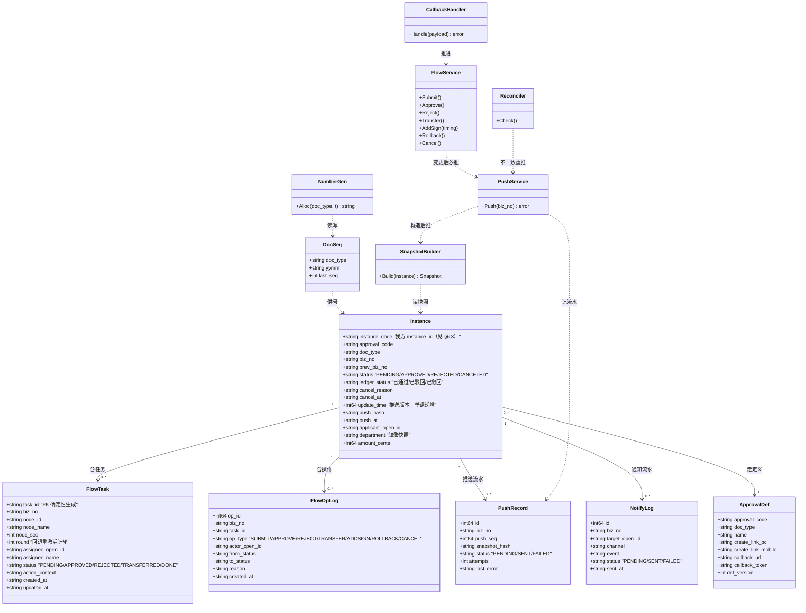
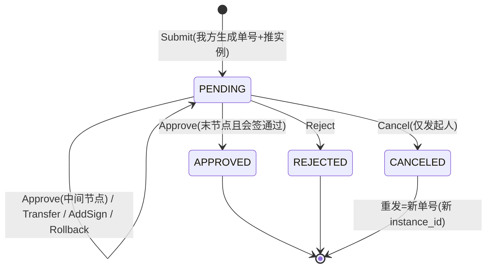
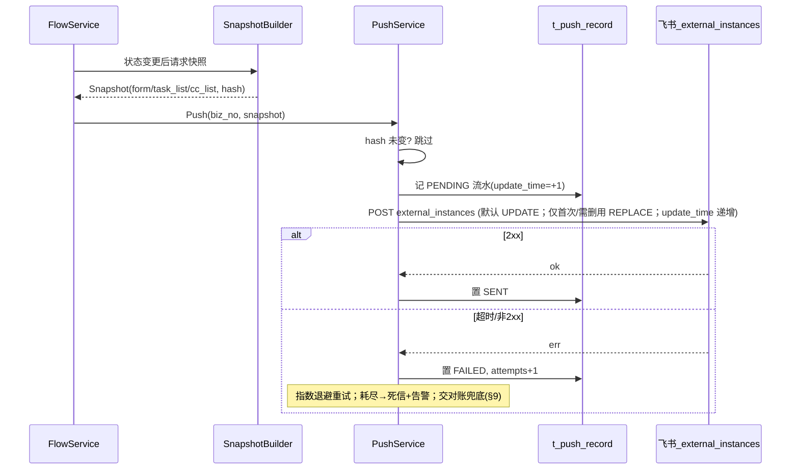
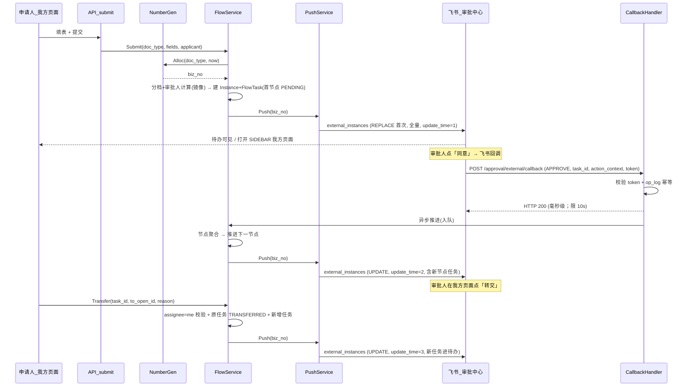
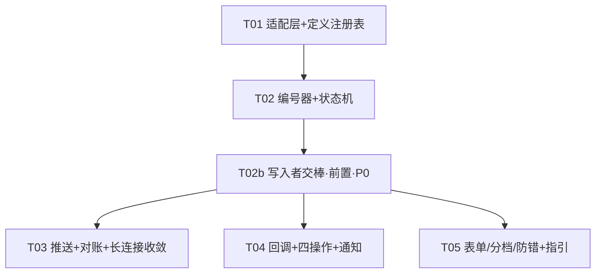

# 采购与费用审批平台（自建侧）· 增量架构设计：架构转向 ③（审批核心迁至我方 · 飞书三方审批）

> **结论先行**：审批的「**流转**」从**飞书原生审批引擎**搬到我方系统：本方成为审批真相源；飞书只保留「**展示 / 待办 / 通知 + 同意·拒绝**」两键；复杂操作（**转交 / 加签 / 回退 / 撤回**）只在我方页面完成。对外联通＝**两张三方审批接口**（`external_approvals` 建定义 + `external_instances` 推实例）+ **一个快捷回调**（`action_callback_url`）+ **一个定时对账**（`external_instances/check`）。
>
> **本文只做设计**：不含实现代码、不新增 migration、不改业务代码。migration 与实现由后续任务（§11）落地。
>
> **红线**：凡本文与 `04-Architecture.md`（V1.0）冲突处，**转向相关位点以本文为准**；未被转向影响的位点（台账 12 张 / 看板 4 张 / 行·列权限令牌 / 报送 / 审计 / 备份 / 单实例）仍以 `04-Architecture.md` + `01-PRD.md` 为准。

| 项 | 内容 |
|---|---|
| 文档名称 | 采购与费用审批平台（自建侧）· 增量架构设计（架构转向 ③） |
| 版本 | **V2.8**（★ 2026-09-28 联调收口：§4.2 内 **`V-2`/`V-3`/`V-4` 三项由「待实测」改为「已定论」** —— `message/update` 请求体＝`{"message_id","status"}` · `user_id→open_id` 需 scope `contact:user.employee_id:readonly` · 推实例须用真实 code；增量首版 + `01a` **V1.4** 同步；含 **`update_mode` 选型判据** · **从零建 HTTPS 面** · **会签本期不可配** · **三路适配性审计回填** · **单列前置任务 `T02b` 写入者交棒** · **收口：§6.4 锁号兜底索引措辞修订 + `instance_id` 口径对齐 §6.3** · **V2.2 新增 §17 部署与入网 + 静默防护 S15** · **V2.3 顺序会签 `task_order` + 不变量 + §3.5 定义装载** · **V2.4 加签 `timing` 前置/后置（§2.3 / §5.2 / 类图 `+AddSign(timing)`），逐字正本＝`05-API §3.13`** · **V2.6 新增 §17.0 前提澄清：平台未要求 HTTPS / 443** · **★ V2.7 回调链路修复收口：§3.2 `action_context` 写 `biz_no` ＋ `action_configs` 两键 / §4.2 字段映射层（官方名↔内部名 ＋ `biz_no` 三级读法 ＋ `user_id→open_id` 转换 ＋ 双 code 池）/ §5.5 通知必推（`message/send` 四 URL ＋ `message/update`）/ §6.3 `biz_no` 反解 / §10 S16–S17 ＋ §12.2 N-12–N-13 / 幂等键统一 4 列**） |
| 日期 | 2026-09-27 |
| 上游文档 | `01a-PRD-Increment-V2.md`（增量需求正本 **V1.4**，已采纳本文 §15 的 C1–C11，并入 §4.7 通知 / §5.5 配额 / QV2-A24~A25，并纠正会签误判；V1.4 并入第三轮口径 D1/D2/D6）、`01-PRD.md`（V1.6）、`04-Architecture.md`（V1.0 基线）、`08-Org-Sync-Design.md`（V1.2）、`README.md`（关键定案 #1~#46） |
| 被取代 | `04-Architecture.md` §0「本系统是审批引擎的旁路」、ADR-06（编号不在自建侧生成）、ADR-07（只 4 接口）、§4 事件流水线（仅限**流转归属**相关位点） |
| 编程语言 / 技术栈 | Go 1.24.5 · Echo v4 · SQLite（纯 Go 驱动 `modernc.org/sqlite`，严禁 cgo）· Vue3+Vite（`//go:embed` 内嵌）· 境外云主机 **systemd 单实例**（长连接集群不广播 → **严禁多副本**） |
| 语言纪律 | 简体中文 |

---

## 0. 转向对既有架构的冲击（先给结论，再逐域展开）

> 本节是全案最重要的判断：**转向 ③ 不是「加几个接口」，而是把系统定位从「旁路」翻转为「主路」**，因此会**直接破坏 `04-Architecture.md` §0 的三条否定式硬约束**。这些约束必须被**显式解除或改写**，否则联调/评审会用旧口径把「必需的入站回调」判为违规。

| 维度 | 原（模式 A / 方案 B） | 转向 ③ 后 | 对既有硬约束的影响 |
|---|---|---|---|
| 系统定位 | 审批引擎的**旁路**（只读登记，见 04 §0） | 审批**流转主路**（唯一真相源） | ★ **定位反转**：不再是旁路 |
| 飞书接口面 | **仅 4 个**（订阅 / 详情 / 批量 / 附件） | +`external_approvals` · +`external_instances` · +`check` · +`external_tasks` · +快捷回调 · 可选 `message/send` `/message/update` | ★ **「4 接口」约束作废**（ADR-07 反转） |
| 入站 | **无入站端口、无公网 IP** | ★ **必须暴露公网可达的入站回调端点**（★ **HTTPS 属我方选择、非平台要求**，见 **§17.0**） | ★ **破坏「无入站端口」**（见 §4） |
| 轮询 | **无轮询** | ★ **每 5 分钟对账轮询**（见 §9） | ★ **破坏「无轮询」** |
| 故障域 | 自建全停 → 审批照常 | 自建停 → **审批流转停**（★ **停机＝审批暂停**；恢复后与飞书侧**对账同步**；服务不可用期间的点击**未生效、需重点**，见 §4.1 / §4.4） | ★ **破坏「完全隔离」**（G1 反转） |
| 事件 | 订阅 `approval_instance` | 不订阅审批事件；改为我方主动推送 | 事件链作废（F1） |
| 单号 | 飞书「流水号控件」生成 | **我方编号器**生成 | ADR-06 反转（M3） |
| 部门 | 原生「部门控件」值 | **通讯录镜像快照** | 来源改（M4 / 08） |
| 表单 / 分档 | 飞书侧条件分支 | **我方**表单 + 分档 + 审批人计算 | F3 / F4 |
| 台账数据源 | 事件解析（抽取链） | **我方状态机终态直写** | 影响 B47 判法（§15） |

> ★ **定案（`04 §0` 三条否定式硬约束的处置 · 架构师裁定 2026-09-27）**：

| `04 §0` 原约束 | 处置 | 替代口径（新权威） |
|---|---|---|
| **无入站端口、无公网 IP** | ★ **单点解除** | 仅开**一条**入站路径 `POST /approval/external/callback`：★ **从零规划对外入站面**（★ **HTTPS 为我方选择**；若采用则：**公网域名 + 反向代理 + TLS**，建议 **Let's Encrypt** 自动签发/续期）+ `action_callback_token` 校验 + IP 白名单；**仅暴露回调一条路径、攻击面压到最小** |
| **无轮询** | ★ **解除**（**审批侧对账轮询：单点解除**） | 新增**每 5 分钟** `external_instances/check` 对账（§9）；★ **通讯录侧的周期性对账**（`08` 每周全量、`01-PRD FR-M0-07` 每日）属**既有设计、另计**，**不在本次解除范围** |
| **自建系统故障不得影响飞书侧审批**（故障完全隔离） | ★ **改写**（G1 反转） | 本方成为审批链路**必需节点**；可用性口径＝**停机＝审批暂停**（**撤销"人工 / 线下兜底"**，见 `01a` V1.4 §7.2）：恢复后与飞书侧**对账同步**（`check` 取 diff 重推，§9）；★ **服务整体不可用（进程不在）期间回调进不来、连落盘都没有 → 该次点击"未生效"（飞书卡片报错）→ 审批人重新点击**；**归高可用，不在本系统开发范围** |

> 上表三条为**定案**：凡 `01-PRD` / `04-Architecture.md` / `README.md` 仍作旧口径处，按本表 + `01a` **V1.4** §6.4/§7.2 更新；`04-Architecture.md` 顶部指针行已标注本条。

> **一句话**：转向 ③ 让系统从「可随时全停的旁路」变成「审批链路上的一个必需节点」。`04 §0` 的"故障隔离"红线**不再字面成立**，降级口径见 `01a` §7.2 / 本文 §14 冲突清单 C9。

---

## 1. 数据模型

### 1.1 表清单（新增 / 修改；**只列设计，不含 migration**）

| 表 | 动作 | 关键列 | 角色 |
|---|---|---|---|
| `t_instance` | **改** | +`update_time` +`prev_biz_no` +`cancel_reason` +`cancel_at` +`push_hash` +`push_at`；`instance_code` 语义＝**我方** `instance_id` | 审批实例（真相源） |
| `t_doc_seq` | **新** | `doc_type` `yymm` `last_seq`；PK(`doc_type`,`yymm`) | 单据编号器（§6） |
| `t_flow_task` | **新** | `task_id`(PK) `biz_no` `node_id` `node_name` `node_seq` **`task_order`** `round` `release_state` `weight` `assignee_open_id` `assignee_name` `status` `action_context` `created_at` `updated_at` `closed_at` | 任务节点（飞书 `task_list` 的真源）；**`task_order`＝同 `node_id` 内审批人声明序（1-based）**，顺序释放的**唯一契约**（见下方契约）；`release_state`＝顺序会签**分段释放**（§2.3）；`weight`＝票签扩展位（一期 null） |
| `t_flow_op_log` | **新** | `op_id`(PK) `biz_no` `node_id` `task_id` `op_type` `actor_open_id` `from_status` `to_status` `reason` `extra_json` `created_at` | 操作留痕（四操作 + 回调） |
| `t_approval_def` | **新** | `approval_code`(PK) `doc_type` `name` `group_name` `visible_scope_json` `create_link_pc` `create_link_mobile` `callback_url` `callback_token` `callback_key` `form_summary_json` `def_version` `updated_at` | 三方定义注册表（§3 / §6） |
| `t_push_record` | **新** | `id`(PK) `biz_no` `push_seq` `snapshot_hash` `status` `attempts` `last_error` `created_at` `sent_at` | 推送流水 + 幂等（§3 / §10） |
| `t_notify_log` | **新** | `id`(PK) `biz_no` `target_open_id` `channel` `event` `status` `attempts` `last_error` `sent_at` `created_at` | 通知流水（代理转交 / 退回**通知已审批通过者**；**漏发可检出**，§5.5） |

> ★ **`task_order` 唯一性契约（V2.3 · `migrations/0009_flow_task_order.sql`）**：**`task_order` 是同节点释放次序的唯一契约**（同一 `node_id` 内 1-based 声明序）。**禁止**回退到 **`rowid`**（SQLite 的 `rowid` 会因 `INSERT OR REPLACE` / 重建表 / `VACUUM` 而变，用它作顺序键会让"该谁审批"**静默漂移**）或 **`task_id` 字典序**（含 `open_id`，**字典序 ≠ 声明序**）。★ **背景**：`node_seq` 是**节点顺序**，同节点各 task 的 `node_seq` **相同**、**区分不了同节点的审批人** → 必须用显式 `task_order`。顺序会签**不变量**见 §2.3。

> **`t_biz_no_used`（已用号集合）——建议不新增**（架构判断）：`t_instance.biz_no` 有 `UNIQUE` 约束（★ **`0007` 起补建 `ux_instance_biz_no`**，此前并不存在，见 §6.4 P3）、`t_doc_seq(doc_type,yymm).last_seq` **单调递增**、且**实例永不硬删除**（撤回＝软状态 `CANCELED`，仍占号）→ **"终态锁号"已被现有约束覆盖**，再加一张"已用号"表属**冗余且引入两处真相**（正是 §10 静默防护要避免的模式）。仅当出现"**硬删除后仍需锁号**"的新需求时才引入。若保留，其唯一合法用途是**跨 doc_type 的全局保留号段**（当前无此需求）。

> **`t_instance.instance_code` 语义漂移**（★ 设计缺口）：原语义＝**飞书原生**实例 code（`04 §3`）；转向后我方自建实例，`instance_code` 应等于**我方 `instance_id`**（取值见 §6.3，建议 `{app_id}:{biz_no}`，**非**裸 `biz_no`）。既有 DDL `instance_code UNIQUE` 不变，但**其值来源从"飞书下发"改为"我方生成"**。因系统未上线、存量极少，不作数据迁移，仅在文档与实现层统一口径。

### 1.2 数据模型类图

### 1.3 关键不变量（idempotency & uniqueness）

| 不变量 | 内容 | 违反后果 |
|---|---|---|
| ID 唯一 | 同一实例内 `instance_id` / `task_id` / `cc` 标识**必须唯一** | 飞书**审批中心看不到数据（静默）**，见 §3.3 |
| `update_time` 单调 | 同一 `instance_id` 每次推送的 `update_time` **严格递增** | 推送被拒且**静默**，见 §3.1 |
| 回调幂等 | (`biz_no`,`task_id`,`op_type`) 唯一（仅 APPROVE/REJECT） | 重复回调重复推进状态机，见 §4.3 |
| 单号唯一 | `UNIQUE(biz_no)` 兜底 + 事务内 `t_doc_seq` 读改写 | 重号 → 台账/审计「同号两态」，见 §6 |
| 快照确定性 | 同一状态重推得**同一 `hash` 与同一组 ID** | 重推产生新 ID → 审批中心重复/错乱 |

---

## 2. 状态机

### 2.1 实例状态

| 实例状态 | 含义 | 飞书 `external_instances.status` | 终态 |
|---|---|---|---|
| `PENDING` | 流转中 | `PENDING` | 否 |
| `APPROVED` | 全部节点通过 | `APPROVED` | 是 |
| `REJECTED` | 任一节点驳回 | `REJECTED` | 是 |
| `CANCELED` | 发起人撤回 | `CANCELED` | 是 |
| —（我方台账口径） | `CANCELED` 在台账展示为「**已撤回**」（与「已驳回」并列），见 §5.4 | — | — |

> ★ **显式作废声明（V1.9）**：`01-PRD` **`FR-M2-03` 的「飞书 8 态映射」作废**，一律改用**上表我方 4 态**（`PENDING` / `APPROVED` / `REJECTED` / `CANCELED`）；「已撤回」是我方**台账展示口径**，**不新增飞书态**。**凡 `01-PRD` / `02-UseCase` / `03-TestCase` 仍作 8 态处，按本表更新。**

### 2.2 任务状态

| 任务状态 | 含义 | 飞书 `task.status` | 是否本任务终结 |
|---|---|---|---|
| `PENDING` | 待审批 | `PENDING` | 否 |
| `APPROVED` | 已同意 | `APPROVED` | 是 |
| `REJECTED` | 已拒绝 | `REJECTED` | 是 |
| `TRANSFERRED` | 已转交（原审批人退出） | `TRANSFERRED` | 是 |
| `DONE` | 因撤回/节点关闭被动终结 | `DONE`（或随实例 `CANCELED`） | 是 |

### 2.3 节点聚合规则（会签 / 或签）

| 场景 | 规则 |
|---|---|
| 默认（会签＝**顺序会签** ★ 用户已定） | 同 `node_id` 按 **`task_order`** **逐级释放**（`release_state`: `HELD`→`RELEASED`）：**上一位通过后才释放下一位**，下一位才收到待办/通知；**全部 `APPROVED`** → 节点通过；**任一 `REJECTED`** → 节点驳回 |
| 并行会签（★ **本期不可配**；**保留扩展位**） | **本期不做**：`01a` §4.6 已定「**加签＝会签（＝顺序会签），不可配为并签**」（仅"平台缺陷降级"例外）。★ **保留扩展位**：`t_flow_task.weight` / `node_seq` 字段保留 —— **二期若需票签 / 并行会签，按扩展位实现；本期不开口子**（并行需"一次释放全部"，会让"逐级释放"实现分叉） |
| 或签（★ **本期不可配**） | 同上，**本期不做**（保留扩展位）；一期所有会签节点一律**顺序会签** |
| 加签后 | 新任务并入**同 `node_id`**；★ **插位由操作人当场选**：`timing` ∈ { `AFTER`（**默认**）, `BEFORE` }（用户口径 ② · 实现 `f5be198`；**逐字详述见 `05-API §3.13`**）—— **`AFTER`** ＝ 新任务 `task_order` 取本节点 **`max(order) + 1`**（追至队尾）；**`BEFORE`** ＝ 取**当前办理人**的 `order`、**同节点 `order ≥` 该值者整体 +1**（插到当前办理人**之前**）；★ **已 `APPROVED` 者不动、不重审**；★ **非法值必须「可见拒绝」**（`400` / `40000`，`ErrInvalidSubmit`），**绝不静默降级为 `AFTER`**（★ 本仓库头号红线"静默"在参数层的体现）。顺序会签下，原审批人须继续等到其**之后所有人**同意 |
| 回退后 | 被回退节点任务置回 `PENDING` 且**重置释放**（按顺序位重放），`round + 1`；历史**不删除**、追加操作日志 |
| ★ **会签 × `task_list[].type`（QV2-04 / A27）** | **判点＝「谁在做节点聚合判定」**；分 **A / B / C 三情形**，**仅 C 后半段是真降级**——见下方**专表**。节点聚合**始终以我方状态机为准**。 |

**会签 × `task_list[].type`（三情形，判点＝谁在做节点聚合判定）**

| 情形 | `task_list[].type` 行为 | 会签功能 | 处置 |
|---|---|---|---|
| A | 可忽略（不传不报错） | ✅ 不受影响（我方按 `node_id` 聚合） | 不传；飞书可能不显示"会签组"（展示差异，**无需告知用户**） |
| B | 必填，但仅展示提示、**不自行聚合** | ✅ 不受影响 | 必须传（取"会签 / AND"值）；**我方聚合为准** |
| C ★ | 必填，**且飞书据此自行聚合**（如 OR 后任一同意即关闭同节点其他 task） | ❌ **真降级** | ① 有 AND 取值 → 传 AND 保住；② 只有 OR 且会提前关闭 → **才是真降级，此时必须告知用户** |

> **纪律**：① **缺必填字段致推送 400 = 我方请求有误**（失败重试 / 阻断 / 告警），**不等于**"会签不支持"；真"不支持"**只有 C 的后半段**（落 §5.5 通知告知用户）。② 节点聚合**始终以我方状态机为准**，**不因 `type` 缺失而静默改变语义**。（`01a` §4.3 已按同一三分口径落地。）

> ★ **顺序会签的实现＝分段释放**（`01a` §4.3 定"加签＝顺序会签"）：快照**只包含 `release_state=RELEASED` 的 task**（§3.2）；**未释放的 task 整体省略**（**不是**标成非 `PENDING`）——否则飞书侧可能**为它们生成待办**（★ 待实测，见 **QV2-A27 ④**）。与"**快照只增不缩**"配合（释放单向推进）。

> ★ **顺序会签不变量（V2.3 · 可测）**：**任一时刻，整个实例「可办理」的任务至多 1 个** —— `node` 间**串行** + `node` 内按 **`task_order`** 顺序释放 ⇒ **除实例终态外，恰有 1 个可办理**。**可测断言**：任一非终态实例，`COUNT(t_flow_task WHERE release_state='RELEASED' AND status='PENDING')` **= 1**；每次释放 / 推进后复算**仍 = 1**（取代原含糊表述；`task_order` 契约见 §1.1）。

### 2.4 实例状态迁移图

### 2.5 流程事件（`FlowEvent`）统一分发（★ 用户已定：保留事件机制）

> 用户裁定：**保留事件机制**，用途＝**通知 + 日志**，对齐 easy-workflow 的四类事件（**节点开始 / 节点结束 / 任务结束 / 流程撤销**）。落形态＝`internal/flow` 内**统一 `FlowEvent` 枚举 + 单一分发点**。

| 项 | 结论 | 理由 |
|---|---|---|
| 事件枚举（我方） | `InstanceSubmitted` · `NodeEntered` · `NodePassed` · `TaskActivated` · `TaskCompleted` · `OpPerformed`（转交 / 加签 / 回退 / 撤回） · `InstanceTerminated`（撤回） | 对齐四类事件并覆盖我方操作 |
| 分发点 | **单一**：状态迁移**提交事务后**统一发出；**订阅者**＝通知 / 审计 / 推送 / 台账 | 防"新增操作漏挂副作用"（§10 S2/S11 同族静默） |
| 纪律 | 事件是**旁路副作用**：**先提交事务、后异步分发**；**订阅者失败不得回滚审批**（与 §5.5 通知同纪律） | 审批正确性不被副作用绑架 |
| 不做 | **不做**"可改写流程行为"的钩子（easy-workflow 曾用任务完成事件改变会签行为）——我方**流转决策集中在状态机**，**不允许外部钩子改语义** | 避免"隐式改写流程"，与"判定权在我方"一致 |

---

## 3. 出方向推送与版本控制

### 3.1 `update_mode` 与 `update_time`（统一策略）

| 规则点 | 结论 | 理由 |
|---|---|---|
| `update_mode`（★ **首选 `UPDATE`**） | ★ **首选 `update_mode=UPDATE`**（**增量、仅当 `update_time` 变大才更新**）——**天然拒绝"落后快照覆盖"**，从**机制上**消除"陈旧快照把飞书侧 `APPROVED` 覆盖回 `PENDING`"的竞态（§10 S14） | 不依赖调用顺序、不依赖"人记得先落库"；官方语义「`update_time` 变大才更新」＝**天然防回退** |
| `REPLACE`（★ **仅限"需要删"与"首次"**） | `REPLACE`（全量替换）**仅用于两类**：① **首次推实例**（唯一例外，飞书侧无既有数据）；② **需要"删掉飞书侧 task / 抄送"的场景**（清理历史；未来若做"撤签"）。★ **"转交 / 加签 / 新增抄送"均不属于此类**（它们**不需要删任何东西**）→ **一律 `UPDATE`**（见下方"★ 选型判据"） | 判据＝"**是否需要删**"（**非**"是否新增"）；**规避 `REPLACE` 的删除副作用与 S14 覆盖风险**（`REPLACE` 不校验 `update_time`） |
| 选型判据（**结论**） | **默认 `UPDATE`；仅"需要删飞书侧 task/抄送"与"首次推实例"用 `REPLACE`**；两者**都带 `update_time` 单调递增** | 见下方"**★ 选型判据**"；与 `01a §6.1`、`§10 S3 注` **三处措辞一致**（V1.8 统一） |
| `update_time` | **每次推送严格递增**（同一实例逻辑版本号）——★ **这是"纪律"，不依赖"平台会拒绝"** | 官方文档要求递增；但据**实测 `REPLACE` 并不校验 `update_time`** → **不得**把"正确性"建立在"平台会拒"之上；改用 `UPDATE` 后，递增成为**平台更新的前置条件**，才有真实约束力 |
| `business_key` | `extra.business_key = biz_no` | 对账 / 读回锚点 |
| 推送触发 | 提交、同意、拒绝、转交、加签、回退、撤回**每次状态变更后各推一次** | 四操作在飞书侧**无按钮无回调** → 只能靠我方重推让飞书侧待办更新（口径 4） |
| 无变更跳过 | 快照 `hash` 与上次相同 → **跳过推送**，不消耗 `update_time` | 避免无意义调用与版本抖动 |

> **★★ 选型判据（唯一 · V1.8）—— 取代"按场景罗列"**：**看"是否需要删掉飞书侧的 task / 抄送"**
> - **需要删** → **`REPLACE` + 必须传全量快照**（如清理历史；未来若做"撤签"）
> - **不需要删** → **一律 `UPDATE`**（改状态、改审批人、**新增 task（加签）**、**新增抄送**）
> - **唯一例外** → **首次推实例**用 `REPLACE`（飞书侧无既有数据；且 `UPDATE` 校验 `update_time` 而首次无历史时间）
>
> ★ 判定要点：**"转交"含既有 task 的状态变更（`TRANSFERRED`）→ 不是纯新增 → `UPDATE`**；**"加签"是新增 task、不需要删任何东西 → `UPDATE`**。**能用 `UPDATE` 就不用 `REPLACE`**（`REPLACE` 有 S14 覆盖风险）。

> ★ **方向风险（S14）与三级防护**：`REPLACE` 全量是"**我方 → 飞书**"**单向覆盖**；当**本地快照落后于飞书侧**时会把飞书侧已 `APPROVED` 覆盖回 `PENDING`（**正常运行时竞态，非停机恢复**）。防护（**按优先级**）：① ★ **首选改用 `update_mode=UPDATE`**（机制消除，不靠顺序）；② **回调先落库、再触发任何推送**（顺序纪律，缩小窗口）；③ **对账重推加"方向判断"**（§9.2，禁止落后快照覆盖）。★ **待实测 QV2-A28**：飞书侧**是否允许 `APPROVED`→`PENDING` 回退**（若拒绝则会报错 / 部分失败，同为问题）。

> **★ 四操作的 `update_mode` 逐场景结论（★ V1.8 按"选型判据"修订）**：按上"**选型判据**"**逐条定**：

| 操作 | 场景性质 | `update_mode` 结论 | 理由 / 待实测 |
|---|---|---|---|
| **转交** | 既有 task 状态变更（`TRANSFERRED`）+ **追加**新 task | **`UPDATE`** | ★ **含"既有 task 状态变更" → 非纯新增**（旧稿误归"纯新增"已纠正）；增量改原 task 状态 + 追加新 task，**不重推既有 `APPROVED`**（防 §10 S14） |
| **加签** | **新增** task（顺序会签下先 `HELD`，**释放时才推**，§2.3） | **`UPDATE`** | ★ **不需要删任何东西 → 一律 `UPDATE`**（判据）；增量追加新 task；★ 若实测 **`UPDATE` 不能新增 task** → **退守 `REPLACE`+全量**（并入 **QV2-A28**） |
| **回退** | 既有 task 状态**回置** `PENDING` | **`UPDATE`** | 属"状态变更"；`UPDATE` 以 `update_time` 单调为前置 → **天然阻挡"非最新覆盖"**，回退语义明确 |
| **撤回** | **实例级** `status=CANCELED` | ★ **待实测**：`UPDATE` **能否改实例级 `status`** → 能则 `UPDATE`；不能则 **`REPLACE`+全量** | ★ 官方 FAQ「**不能只更新审批状态**」正指此处；**并入 QV2-A28 实测** |
| **新增抄送** | **新增** cc（**不需要删**） | **`UPDATE`** | ★ 不需要删 → `UPDATE`（判据）；★ 若实测 **`UPDATE` 不能新增抄送** → 退守 `REPLACE`+全量（并入 **QV2-A28**） |
| **首次推实例** | 飞书侧**无既有数据** | **`REPLACE`（全量）** | ★ **判据的唯一例外**：首次无既有数据；且 `UPDATE` 校验 `update_time`，而首次无历史时间 |

> ★ 记忆口诀：**「需要删（或首次）→ `REPLACE` + 全量；其余（改状态 / 改审批人 / 新增 task（加签）/ 新增抄送）→ `UPDATE`；实例级关闭（撤回）→ 待实测」**。

> **★ 硬论证：为何必须是「默认 `UPDATE`」而非「条件 `UPDATE`」（★ 新增 · V1.7）**：所谓"**落后才用 `UPDATE`**"**本质不可实现** —— 判断"**我方快照是否落后于飞书侧**"**必须先知道飞书侧当前状态**；而 `external_tasks` **只给粗粒度 `status` + `update_time`**、`external_instances/check` **只返 `diff_instances`**，**二者都不给"操作内容 / 审批意见"** → **拿不到"是否落后" → 做不出这个条件判断** → **`UPDATE` 只能是"默认"，不能是"条件分支"**。
>
> ★ **两项须分开写、勿混**：**(i) 场景选择** ＝ **默认 `UPDATE`；仅"需要删"与"首次推实例"用 `REPLACE`**（见上"★ 选型判据"）；**(ii) `REPLACE` 场景下的必要条件** ＝ **一旦选了 `REPLACE`，必须传全量快照**（否则删未推送项，见 §10 S3 注）。二者**维度不同、均不得删**。

### 3.2 快照构造（`form` / `task_list` / `cc_list`）

| 部分 | 构造规则 | 约束 |
|---|---|---|
| `form` | 仅关键 3 项：**申请人 / 部门 / 事项**（★★ **2026-10-05 裁定 `R-32`** —— 本节原写「单号／金额／事由」，与 `01a §8 FR-M0-18`（必须）及 `09 CHK-3` **冲突**；★ 需求正本 = `FR-M0-18`，**据正本订正**；★ `单号` 已由 `extra.business_key = biz_no` 单独承载，不必挤进摘要），`[{name,value}]` 简化键值对 | 仅前 3 条、**≤2048 字符**；超限**告警、绝不静默截断**；真正的表单在我方页面 |
| `task_list[]` | 由 `t_flow_task` 导出，**仅含 `release_state=RELEASED` 的 task**（顺序会签分段释放，§2.3）；每项含 `task_id`/assignee/`status`/`title`/`node_id`/`node_name`/三时间戳/**`action_context`**/**`action_configs`** | **≤300**；超限**直接失败告警、绝不截断**（见 §10）；★ **若用 `REPLACE`（全量替换），快照必须含「全部已 `RELEASED` 的 task」** —— 否则会**删掉本次未推送的已释放 task**（与 §2.3「未释放 task 整体省略」叠加，见 §10 S3）。★★ **`action_context` 必须写压缩 JSON 字符串 `{"biz_no":"<单号>","task_id":"<task_id>"}`** —— ★ **官方回调【不发】顶层 `biz_no`，本字段是 `biz_no` 回传的【唯一载体】**；推侧（写）与解侧（读）**键名必须同批约定**，缺一即链路断裂（定案 #53；第 2 批 `d94580f`）。★★ **`action_configs` 必须配「同意 / 拒绝」两键**（`[{"action_type":"APPROVE"},{"action_type":"REJECT"}]`）—— 与定义级 `enable_quick_operate=true` **两者都要到位**，否则飞书侧两键不出现（口径 2 落空；`reference/README.md` ★★ 条） |
| `cc_list[]` | 由规则带出的抄送人（镜像在职人员） | **≤200** |
| `display_method` | 推荐 `SIDEBAR`（不打断飞书上下文）；可选 `BROWSER` | 见 `01a` §5.1 |

### 3.3 ID 唯一生成（防「审批中心看不到数据」静默）

| 对象 | 生成规则 | 确定性 |
|---|---|---|
| `instance_id` | **建议 `{app_id}:{biz_no}`**（非裸 `biz_no`）；企业+应用内唯一 | 由 `biz_no` 决定 |
| `task_id` | `{node_id}-{assignee_open_id}-{round}-{seq}` | 同状态重推得**同一 ID** |
| `cc` 标识 | `{assignee_open_id}` 或 `{index}` | 同实例内唯一 |
| 防重复 | 推送前查本地快照，同 `task_id` 不重复生成 | — |

> **★ 相对 `01a-PRD` 的改进**：`01a` §3 建议 `instance_id = biz_no`。我方建议加 `{app_id}:` 前缀，避免"同应用被复用/多环境共用应用"时**跨环境撞 ID**（撞 ID 的后果是静默的）。见 §14 冲突清单第 5 条。

### 3.4 推送流程与失败处理

### 3.5 三方审批定义的装载与管理（C-2 · `A29`）

> **问题（`A29`）**：`t_approval_def`（§1.1）是三方定义注册表，但**正本里未见「谁写 / 从哪读 / 何时刷新」的装载源**（`04a` 原文只列表、T01 只说"定义注册/更新服务"，**没有配置源**）。本节给装载源口径。

| 项 | 结论 |
|---|---|
| 权威来源 | **`t_config_mapping`（配置导入）** —— 11 类定义的 `approval_code → doc_type` 由配置映射导入（`04 §6.1`）建立；`t_approval_def` 由此**派生**，**不再单独维护第二份真相** |
| 谁写 | **T01 的定义注册服务**（`internal/approval`）：读配置映射 → 逐个 `approval_code` 调 `external_approvals`（命中即更新、未命中即新建）→ **回写** `t_approval_def`（含 `callback_url` / `callback_token` / `group_name` 等**飞书回执**字段） |
| 从哪读 | **启动装载** + **配置导入后重载**；`t_approval_def` 的**飞书侧字段**（`callback_*` / `def_version`）**以飞书回执为准** |
| 何时刷新 | **启动时**（自检"定义已建"，`S7`）+ **配置变更时**（导入触发）+（可选）定时核对 `def_version` |
| 与配置正本的关系 | **回调配置键**（`JX_CALLBACK_DOMAIN` / `JX_ACTION_CALLBACK_TOKEN`）在 **`04-Architecture §6.4`**；定义**内容**来自配置映射。★ **`04a §6` 为单据编号节、非配置节**（配置项正本在 `04`） |

> ★ **处置**：**并入 T01 交付物**（定义注册服务 + 装载源）。落地后 `A29` 关闭。

---

## 4. 回调端点（★ 唯一入站面）

### 4.1 入站端点（破坏「无入站端口」硬约束）

| 项 | 结论 | 说明 |
|---|---|---|
| 端点 | `POST /approval/external/callback`（飞书**发起 → 我方**） | **本质是入站请求**，非"出方向"（`01a` §10.5 措辞"出方向收"自相矛盾，见 §14 第 1 条） |
| 可达性 | ★ **必须公网可达入站**（★ **HTTPS 属我方选择、非平台要求**，见 §17.0；无入站端口约束**在此单点解除**） | ★ **从零建对外 HTTPS 面**：**公网域名 + 反向代理（Nginx/Caddy，终止 TLS）+ TLS 证书**；建议 **Let's Encrypt** 自动签发/续期（代价：需 **80/443 对外可达**以过 ACME 验证、**续期失败必须监控告警**）；★ **具体域名待用户提供**（QV2-A19） |
| 安全 | 校验 `token`（定义时下发）；`encrypt` 加密体按约定解密 | 非法 token → **拒绝并告警** |
| 承载 | ★ **从零建**：新增**反向代理**（**若采用 HTTPS 则对外终止 TLS** → 转发至本机 Echo 回环端口 `127.0.0.1:8080`）；**应用侧不新增监听端口**，反代**只暴露回调一条路径**（★ **部署 / 证书 / 白名单 / 配置键细则见 §17「部署与入网」**） | 与"无入站端口"的处置：旧稿「**复用既有对外 HTTPS 面**」**不成立**（`.env.example` 仅绑回环 `127.0.0.1:8080`、仓库内**无任何反代/TLS 配置**、且尚未部署）→ 改为**从零规划**；加固＝仅暴露回调路径、`token` 校验、路径限速、body 上限 |

### 4.2 回调参数与处理（★ 含**字段映射层**，2026-09-27 按官方报文校准）

> ★★ **本层是「官方字段名 ↔ 我方内部名」的显式映射**（第 2 批 `d94580f` 落地）。★ **官方【不发】顶层 `biz_no` / `open_id` / `instance_code`** ⇒ 一律**按官方字段名解析**；旧自造字段降为**兼容读**（窗口＝一个发布版本）。

| 官方字段（主读） | 我方内部名 | 说明 |
|---|---|---|
| `action_type` | （直接） | 仅 `APPROVE` / `REJECT`（四操作**不在回调内**）；兼容期可回退读旧 `action_name` |
| `user_id` | `OperatorOpenID`（**经转换**） | 操作人**租户内 `user_id`**；★ **与我方统存的 `open_id` 不同域** → 须经 `contact/v3` 换 `open_id` 后再进 `admitCallback`（§4.2.1）；★ **绝不把 `user_id` 直接塞进 `OperatorOpenID`**（域不同 ⇒ 恒不命中 ⇒ 假 403）。旧报文带 `open_id` 时直接作 operator（同域，免转换） |
| `approval_code` | （一致性校验） | 三元定义 Code；与实例定义**双池任一命中即放行**（双 code 池，§4.2.2） |
| `token` | （校验） | 与 `t_approval_def.callback_token` 常数时间比较 |
| `action_context` | `biz_no` / `task_id` | ★★ **解 JSON**：主读 `biz_no`（`{"biz_no":…,"task_id":…}`，由推侧 §3.2 写入）；★ **非 `{` 开头（旧纯 `task_id` 串）⇒ 忽略、走兜底** |
| `instance_id` | `biz_no`（**兜底**） | `biz_no` **三级读法**之二：从 `{app_id}:{biz_no}` 反解剥 `app_id:` 前缀（§3.3 / §6.3） |
| `task_id` | `task_id` | 定位任务（官方：列表操作必填）；兼容期可读 `action_context` 内 JSON |
| `message_id` | `MessageID` | 卡片操作必填；**暂存**（迁移 `0013` 加 `t_flow_op_log.message_id`），供失败反馈 `message/update` 用（§5.5） |
| `id` / `reason` / `attachments` | （直接） | 意见 / 附件（可选，随 `action_configs`） |
| `encrypt` | （解密） | 加密体按约定解密 |

> ★ **`biz_no` 三级读法（优先级）**：① `action_context` JSON 的 `biz_no`（**主读**）→ ② `instance_id` 反解剥 `{app_id}:` → ③ 顶层 `biz_no`（**仅兼容期最后兜底、且必打 `warn` 日志**）。★ 任一级命中即用；三级全空 ⇒ **40000 可见拒绝**（不静默）。

#### 4.2.1 `user_id` ↔ `open_id` 转换（A-3 落地）

| 项 | 结论 |
|---|---|
| 我方统存 | **全库统存 `open_id`**（`t_user_role.open_id` / `t_flow_task.assignee_open_id` / `Session.OpenID`）；**不改库内 ID 域**（改域＝全系统重写，违反定案 #47） |
| 转换策略 | 回调 `user_id` → `internal/platform/feishu/contact.go` 的 **`GetOpenIDByUserID`**（`GET /open-apis/contact/v3/users/{user_id}?user_id_type=user_id`，**10min TTL 进程内缓存**）→ 得 `open_id` 后进 `admitCallback` |
| 转换失败 | ★ **400 / 40000 可见拒绝 ＋ 告警日志**；**不落盘、不占幂等键**（定案 #62）；★ 端点＝`GET /open-apis/contact/v3/users/{user_id}?user_id_type=user_id`，**已定论（2026-09-28 真机）**：需 scope **`contact:user.employee_id:readonly`**（开通后 `open_id ⇄ user_id` 双向转换皆通） |
| 排障留痕 | `flow.CallbackRequest` 保留转换前原值 `OperatorUserID`（排障用） |

#### 4.2.2 `approval_code` 双 code 池（G-8）

| 项 | 结论 |
|---|---|
| 背景 | `POST external_approvals` 用「自定义 code」匹配（命中即更新），返回**真实 code**；`GET` 与推实例**必须用真实 code**；而读回字段 `approval_code` 返回自定义 code ⇒ **同一字段名两样东西** |
| 落库归位 | 迁移 `0013` 给 `t_approval_def` 加 **`feishu_code`**（真实 code 候选列）；`Registry.Register` **双写**（`approval_code`＝我方自定义 code 作 PK、`feishu_code`＝平台响应回填值） |
| 推送 | `Pusher.Push` **优先 `feishu_code`、空则回退 `approval_code`** |
| 回调校验 | ★ **宽松档**：报文 `approval_code` 与 `inst.ApprovalCode` / `feishu_code` **任一命中即放行**；**不命中仅告警、不拒**（★ **已定论（2026-09-28 真机）：推实例必须用「真实 code」（`feishu_code`）** ⇒ **可升格为强校验**，列为待办）；★ 实测已证伪"双池归属未知"这一顾虑 |

### 4.3 回调幂等（★ 设计补强）

> `01a` FR-M0-15 只要求"校验 token、10s 回 200、`action_context` 回传"，**未定义幂等键**；而 QV2-02 已承认超时口径不一 → **重复回调必然发生**。这是 `01a` 的一处**自相矛盾**（§10.3 要求测"回调幂等"，但 §4/§8 无幂等设计）。

| 层 | 幂等手段 |
|---|---|
| 记录层 | `t_flow_op_log` 对 (`biz_no`,`task_id`,`op_type`,**`round`**) 建**唯一约束**（仅 APPROVE/REJECT）；重复 → `INSERT OR IGNORE`、直接回 200。★★ **4 列含 `round`**（迁移 `0011_flow_op_log_round.sql`）：**回退重激活复用同一 `task_id`**，仅靠 3 列会把"回退后经回调再次审批"**判成重复、静默不推进**（定案 #68 路径不对称）；4 列后才区分两次审批 |
| 状态机层 | "对已 APPROVED 的任务再 APPROVE" = **no-op**（第二道防线） |
| 响应 | 无论幂等命中与否，**≤10s 内返回 HTTP 200**（否则飞书重试） |

### 4.4 超时口径

| 项 | 结论 |
|---|---|
| 当前口径 | **10s（中文 current 页）vs 5s（英文历史页）** 未统一（QV2-02，阻塞高） |
| 我方策略 | **按 10s 设计**（官方中文 current 页）：同步路径**只做**「校验 + 写 `t_flow_op_log` + 入队」→ **毫秒级返回 HTTP 200**（**远低于** 10s 限制）；业务（状态机推进 / 重推）**全在异步侧**；绝不在回调内做飞书调用或长事务 |
| 队列 | 复用 `t_event_inbox` + worker（`instance_code` = `biz_no`，满足现有 `NOT NULL` 约束）；状态机推进在异步侧完成 |

---

## 5. 四个操作

### 5.1 通用规则（授权 / 留痕 / 推送）

| 项 | 规则 |
|---|---|
| 入口 | **仅我方页面**（飞书侧无这些按钮，口径 3） |
| 服务端硬校验 | 转交/加签/回退：`assignee=me` 且任务 `PENDING`；撤回：`applicant=me` 且实例 `PENDING` |
| 留痕 | 全部写 `t_flow_op_log`（细粒度）+ `t_audit_log`（审计视图）+ 状态史（追加不覆盖） |
| 推送 | **每次操作后必须再主动推一次实例**（★ **默认 `UPDATE`**；**仅"需要删"与"首次推实例"用 `REPLACE`**，见 §3.1 判据） | 
| 上限（可配） | 转交 ≤3 / 加签 ≤3 / 回退 ≤2；触顶拒绝 |
| 原因 | 建议必填（转交/加签/回退/撤回） |

### 5.2 操作明细

| 操作 | 谁能做 | 状态迁移 | 任务处理 | 飞书侧表现 |
|---|---|---|---|---|
| **转交** | 当前任务审批人本人 | 节点不推进 | 原任务 `TRANSFERRED`；**新增**同 `node_id` 任务给新审批人（`task_id` 换 `assignee`/`round`） | 新任务进其待办 |
| **加签** | 当前任务审批人本人 | 节点**不推进**（会签：须新加人同意） | **新增**同 `node_id` 任务；默认**会签**；★ **插位由操作人当场选** —— `timing` ∈ { `AFTER`（**默认**）, `BEFORE` }（`BEFORE` ＝ 插到当前办理人**之前**、同节点 `order ≥` 者整体 +1；**非法值「可见拒绝」** `400`/`40000`），**逐字详述见 `05-API §3.13`** | 新任务进其待办 |
| **回退** | 当前任务审批人本人 | 实例**保持 `PENDING`** | 上一节点任务置回 `PENDING`、`round+1`；后续节点任务置 `DONE` | 被退节点任务重新进待办 |
| **撤回** | **仅发起人本人** | 实例 → `CANCELED` | 全部未终结任务 → `DONE` | 实例 `CANCELED`（**关闭流程**，非删除） |

### 5.3 飞书侧"无按钮"的必然结果

> 四操作在飞书侧**没有任何按钮和回调**（`action_type` 只有 APPROVE/REJECT）。因此：
> **我方每完成一次操作 → 必须主动重推实例**（★ **默认 `UPDATE`**；**仅"需要删"与"首次推实例"用 `REPLACE`**，§3.1 判据）。否则飞书侧待办**不会更新**，形成**静默不一致**（用户以为没生效）。这是 §3.1「推送触发点」的根本原因。

### 5.4 撤回与"重新发起"（口径 4）

| 项 | 规则 |
|---|---|
| 重新发起 | **用新审批单号**（`####` 递增、**不复用**旧号）→ 新 `instance_id` |
| 旧单 | **不删除**；状态 `CANCELED`，台账口径「**已撤回**」；`prev_biz_no` 记旧号 |
| 因果链 | 台账 / 审计按 `biz_no` 可查两单因果（`new_biz_no ← prev_biz_no`） |
| 跨月边界 | 若撤回发生在跨月（1 月末发、2 月初重发），新旧号 `YYMM` 不同——**属预期**（业务本地年月，见 §6） |

### 5.5 通知（代理转交 / 退回通知已审批通过者）

| 项 | 规则 |
|---|---|
| 触发场景 | ① 代理转交后通知**被转交人**（及可选原节点相关人）；② **回退后通知已被审批通过者**（其结论被作废需知情）；③ 撤回后通知在途审批人 |
| 渠道 | 飞书**审批 Bot 消息**（**主渠道，非可选** —— 见 `01a` §5.4/§8 **FR-M0-17**）＋ 我方**站内通知兜底**；★★ **发送＝`POST /open-apis/approval/v1/message/send`**（`template_id=**1008**`「收到审批待办」）—— ★ **推实例只让任务进「待办」，不会自动发消息**，通知**必须我方主动调用**；★ `actions[]` **四个 URL 缺一不可**（`url`＋`pc_url`＋`android_url`＋`ios_url`，缺 ⇒ `60001 actionUrls incomplete error`）、该接口 **`texts` 接受 map**（与 `external_approvals` 的数组形态**相反**）、★ **`code!=0` 一律判失败（HTTP 200 不代表成功）**；★★ **失败反馈＝`POST /open-apis/approval/v1/message/update`**（回调失败时更新卡片；`message_id` 空则不发；★ **请求体已定论（2026-09-28 真机）＝ `{"message_id":…,"status":…}`**）。**通知失败不得阻塞状态机**（异步、可重试、进死信） |
| 留痕 | 每发一条写 `t_notify_log`（对象 / 渠道 / 结果 / 时间 / 重试次数 / 错误） |
| **漏发可检出** | ★ **「应有集合」的定义（V1.9 补齐）**：由 **`flow` 在每次操作后**按「**该单内已 `APPROVED` 的审批人**（+ 被转交人 / 在途审批人，按上方触发场景）」算出**应有通知对象**，**先落 `t_notify_log` 的"应发记录"（`status=EXPECTED`）**，再由**实际发送结果回填 `SENT`/`FAILED`**；巡检比对「`EXPECTED` vs 非 `SENT`」→ 缺者**补发 + 告警**（呼应 §10 静默防护主题） |
| 与状态机关系 | 通知是**旁路副作用**：状态迁移**先提交事务**，再异步发通知；**绝不**因通知失败回滚审批 |

### 5.6 本期明确不做（★ 用户已关闭）

> 以下流转操作**用户已裁定不做**（2026-09-27）；此处留痕，**防被当成"漏做"**。

| 不做项 | 用户裁定 | 备注（制度 / 设计口径） |
|---|---|---|
| **拿回**（G4） | **不做** | — |
| **终止**（G5，任意节点终止 ≠ 发起人撤回） | **不做** | 系统**唯一退出＝发起人撤回**（`01a` §4.5）；制度如需"中途终止"，另行加条款 |
| **催办 / 超时审批 / 自动提醒**（G6） | **不做** | ★ **重要差异**：制度「**超时未审**」**仍是看板 16 的预警指标** → **制度有指标、系统只记录与展示、不做提醒 / 催办 / 自动处理**（避免被当成漏做）；"超时自动通过"另有**越权放行**风险，明确不做 |
| **暂存待审**（G7） | **不做** | 无草稿态；如未来做，**仅前端本地草稿**（不入流、不占号） |

> 其余已定：**加签＝顺序会签**（§2.3）· **保留事件机制**（§2.5）· **代理人＝可转交 + 可退回**（`01a` §4.1 表二）。

---

## 6. 单据编号生成

### 6.1 规则

| 规则点 | 定义 |
|---|---|
| 格式 | `{前缀}-{YYMM}-{####}`；前缀沿用 `BA/PR/SA/RFQ/BJ/SS/CT/PC/GR/QC/SUB`（PO 沿用 `CT`） |
| `YYMM` | 业务本地年月（**Asia/Shanghai**），与 `biz_date` 同源 |
| `####` | 4 位十进制自增；**按月重置**（`t_doc_seq(doc_type,yymm).last_seq`） |
| 生成时机 | 提交页**校验通过后**，**同事务**写 `t_instance.biz_no` |

### 6.2 并发唯一

| 项 | 结论 |
|---|---|
| 生成器 | 事务内对 `t_doc_seq(doc_type,yymm)` **读改写**（`SELECT ... FOR UPDATE` 语义由 SQLite 写锁保证） |
| 兜底 | 表级 `UNIQUE(biz_no)` + 冲突重试 |
| 边界 | 单实例 + SQLite（WAL）→ 无分布式竞态；事务须短（`FR-M8-09`） |

### 6.3 `instance_id` 关系

| 项 | 结论 |
|---|---|
| 取值 | **建议 `{app_id}:{biz_no}`**（见 §3.3）；若坚持 `01a` 的裸 `biz_no`，须接受"多环境共用应用会撞 ID"风险 |
| 理由 | 一个字段同时承担"业务号 + 三方实例号"，减少对账错位；加前缀消除跨环境撞号 |
| ★ **`biz_no` 反解用途** | 回调报文**官方不发顶层 `biz_no`** ⇒ `instance_id` 的 `{app_id}:{biz_no}` 结构是 `biz_no` 的**兜底来源**：剥掉 `app_id:` 前缀即得 `biz_no`。★ 与 `action_context`（**主读**，§3.2 写入 `{"biz_no":…,"task_id":…}`）构成 `biz_no` **三级读法**（§4.2）：`action_context` → **本反解** → 顶层兜底+warn |

### 6.4 锁号的三个前提（**不得破坏**）

> 单号"撤回后重发不复用旧号"（§5.4 / FR-M9-15）依赖以下**三条隐含前提**。它们**现在成立、却无人写成纪律**——任一条被破坏，**终态锁号即失效，且失效是静默的**（表现为台账 / 审计"**同号两笔**"）。

| # | 前提 | 现状（**须保持**，非"已自动满足"） | 破坏方式 | 后果 |
|---|---|---|---|---|
| P1 | `t_doc_seq` **单调递增、只增不减、不参与任何归档 / 清理** | **须保持**：`scripts/archive-year.sh` 的 `TABLES` 数组**不含** `t_doc_seq`（现状成立，但属**纪律**、并非"已上锁"） | 有人"顺手"把 `t_doc_seq` 纳入归档并在归档后清表 → **游标归零** | **号被重发** |
| P2 | `t_instance`（及台账）**不做硬删除**，终态只改状态 | **须保持**：归档脚本**无 `DELETE FROM` / `DROP TABLE`**（只导出 CSV+SQL；`rm -rf` 删的是**旧归档目录**）（现状成立，属**纪律**） | 改成"归档即从主库删除" → 旧行 `UNIQUE(biz_no)` 消失 | **锁号失效** |
| P3 | `t_instance.biz_no` 上存在**全量** `UNIQUE(biz_no)` 兜底（**非** `source='flow'` 部分索引） | ★ **此前并不存在**：旧库 `0002` 的表达式唯一索引作用在 `t_submission` / `t_audit_log`（**非** `t_instance`），`t_instance` 仅有 `instance_code UNIQUE` → 终态锁号兜底**由 `0007` 补建 `ux_instance_biz_no`** | 移除该唯一约束（或改部分索引而漏掉分支） | **重号落库** |

> **纪律**：P1–P3 **任一条被破坏即锁号失效，且失效静默**。若确需归档 `t_doc_seq`，**必须**保留游标单调性（归档后**不回退**游标或保留下限），否则**不得**纳入归档。防护落地见 §10 **S13**（自检门禁）+ §12.2 **N-11**（负向断言）。

---

## 7. 权限与部门影响清单

### 7.1 部门来源变更

| 项 | 原 | 转向后 |
|---|---|---|
| `t_instance.department` | 原生**部门控件**值（`internal/worker/extract.go` 的原生控件抽取；**审计时点 `875b9e4`** —— ★ 现值指向：F3 弃用） | **通讯录镜像快照**（`08` `t_org_department` 名称，提交时刻冻结） |
| 申请人部门 | 实例自带字段 | 镜像 `open_id → 部门` |
| 部门 ID | 实例 `department_id`（已解析未用） | 经 `08` **路线甲**桥接为 `open_department_id`（`od-`） |

### 7.2 权限令牌：**清单不变、来源/比对改**

| 令牌 | 是否变 | 变更点 |
|---|---|---|
| `SELF` / `ALL` / `ASSIGNED` / `PARTICIPATED` / `DENY` | 不改 | 语义不变 |
| `DEPT` / `CHARGE_DEPT` | **比对方式建议改** | 现按 `department`（**名称**）`IN` 比对（`internal/permission/dataset.go` 的 **DEPT 名称比对**）→ 建议改按**部门 ID** 比对、名称兜底（`08` §4.9） |

### 7.3 与通讯录镜像的耦合（`08` V1.2）

| 依赖 | 说明 |
|---|---|
| 提交期权威 | 部门/人员默认带出、审批人计算、选择器在职校验**全部取镜像**（口径 1，`01a` §7） |
| 权限期结构约束 | 镜像**不等于**权限：准入仍走 `t_user_role`（deny by default，`08` §4.10 增强） |
| 镜像滞后 | 事件增量 + 每周对账把滞后收敛到分钟级；极端滞后由 §9 告警兜底 |

### 7.4 影响清单（对既有文档/模块）

| 模块 | 影响 |
|---|---|
| `permission` | `t_instance.department` 来源改；建议 DEPT/CHARGE_DEPT 改 ID 比对；令牌清单**不变** |
| `submission` | `t_submission` 部门列（0003 已加）来源对齐镜像；上报口径不变 |
| `ledger` / `dashboard` | 数据源由"事件解析"改"我方终态直写"；看板物化触发点改（见 B47，§15） |
| `store/models.go` | 新增 §1.1 五张表结构体 + `Instance` 增列 |
| `worker/extract.go` | 部门控件抽取分支**作废**（F3）；字段值以我方库为准 |

---

## 8. 长连接与事件订阅变更

### 8.1 订阅收敛（F1 / M1）

| 项 | 原 | 转向后 |
|---|---|---|
| 审批事件 | 订阅 `approval_instance`（+ legacy `approval_task`） | **不再订阅审批实例事件** |
| 长连接职责 | 收审批事件 | **收通讯录事件**（`08` 增量）+ 连接保活 |
| 代码位点 | `internal/platform/feishu/longconn.go` 的审批键**常量段**注册 5 键（含 `approval_instance`/`approval_task`；**审计时点 `875b9e4`** —— ★ 现值指向：已收编为 `retiredApprovalEventTypes`，`R07` 已处置） | 收敛：审批键**去订阅**；通讯录键**新增注册** |

### 8.2 防御性 no-op 处理器（★ 静默防护）

> SDK dispatcher 精确匹配：**未注册键** → 长连接回 **500 → 重试 4 次后丢弃**（`08` F19）。若飞书**仍**推送审批事件（订阅残留 / 三方实例是否也触发审批事件未知，QV2-05）而我方未注册 → **500 噪声 + 事件丢弃**。

| 措施 | 说明 |
|---|---|
| 不订阅 | 启动/上线时**不调用**审批事件订阅接口 |
| 防御注册 | 对审批键注册**返回 200 的 no-op 处理器**，避免 500 重试风暴 |
| 观察期 | 上线后观察是否仍有审批事件到达 → 回答 QV2-05 |

### 8.3 与通讯录事件并存

| 项 | 说明 |
|---|---|
| 同一 dispatcher | 复用现有长连接，多注册通讯录事件键（`08` 方案） |
| 作业分派 | inbox 按 `event_type` 分派：通讯录 → `org_sync` 作业；**不得**塞进 `fetch_detail`（会因无 `instance_code` 必失败） |
| 单实例 | 长连接不广播 → 通讯录事件同样单实例收（与 `singlelock` 一致） |

---

## 9. 对账

### 9.1 频率与内容

| 项 | 规则 |
|---|---|
| 频率 | **基线 5 分钟**（官方建议）调 `POST /approval/v4/external_instances/check`；★ **可配置 + 按在途量/配额余量自适应**（见 §9.4） |
| 范围 | 非终态实例（`PENDING`）**必查**；近期终态实例**抽样查** |
| 内容 | 三方实例当前状态 / 任务 / 抄送 是否与我方库一致 |
| 读回（★ **纪律**） | `GET /approval/v4/external_tasks` **仅用于校验"是否需要重推 / 待办存在性"**；★ **它不返回操作人 / 意见 → 严禁用它反推审批结论**（**飞书不是**我方审批的真相源，**我方才是**；拿它当真相源＝把审批结论建在错误来源上） |

### 9.2 不一致处置

| 情形 | 处置 |
|---|---|
| 不一致（一次） | ① 记 `t_audit_log`（warn）；② ★ **先判方向**：仅当"我方状态**领先或等于**飞书侧"才重推（**`UPDATE` 模式**）；**禁止用落后快照覆盖**飞书侧新状态（§10 S14）；方向**不可判** → 记 warn + **人工核对，不盲推** |
| 连续 3 次不一致 | **告警**（日志 + 通知）——防"审批中心看不到数据"长期静默 |

### 9.3 与推送的关系

| 关系 | 说明 |
|---|---|
| 兜底 | 对账是**推送失败/静默丢失**的最后防线（推送作业耗尽死信后，对账会重推） |
| 调度 | 复用 `internal/sync/scheduler.go` 的 ticker 模式，**新增自适应对账循环（基线 5 分钟，见 §9.4）**（与 24h 通讯录对账**分频**） |
| 幂等 | 重推走同一 `PushService`（`hash` 未变则跳过）；★ **重推用 `UPDATE` 模式**（不回退飞书侧新状态，§3.1） |

### 9.4 频率自适应与配额预算（`01a` §5.5）

| 项 | 规则 |
|---|---|
| 默认 / 下限 | 默认 **5 分钟**；设**下限**（如 1 分钟）——**不得无限降频**（对账是静默防护最后防线，降频＝静默窗口变宽） |
| 自适应因子 | 按**在途单数**（`PENDING` 实例数）与**配额余量**调节：在途少 → 拉长间隔；在途多 / 配额充裕 → 收紧；**仅在"无在途单"时才允许低于基线** |
| 配额监控 | **70% / 90%** 两级阈值告警；命中 90% → 优先降频**非关键**调用，**保对账** |
| 大头与省配额 | `check` 是配额最大头（8,640 ~ 17.3 万 / 月）；**回调解配额**（事件 / 通讯录不计）→ **回调是省配额主路径、对账是兜底**；**不得为省配额牺牲兜底** |
| 权衡 | 降频＝省配额但**延长静默检测窗口**；在"告警阈值 vs 在途量"间取平衡，**不提供"关闭对账"档** |

---

## 10. 静默失败防护（★ 全案主题）

> 三方审批最危险之处在于**失败往往没有异常、没有日志，只是"审批中心看不到数据"**。以下每一处都必须"制造前防 + 主动检测"。

| # | 静默点 | 触发条件 | 防护（制造前） | 检测（事后） |
|---|---|---|---|---|
| S1 | 审批中心看不到数据 | 实例内 **ID 重复** / `update_time` 不递增 | 确定性 ID 生成 + 版本号严格递增 + 推前查重 | `check` 对账（§9） |
| S2 | 待办不更新 | 四操作后**未重推** | 每次状态变更**强制推送**（`FlowService` 出口统一推） | 对账比对任务集 |
| S3 | 任务被误删 | `REPLACE` **删掉未推送任务** | ★ **当选用了 `REPLACE` 时**，**必须传「含全部已 `RELEASED` task"的完整快照**（否则删未推送的 task/抄送；顺序会签下尤其要防"漏掉某个已释放 task"）；★ 但**首选是 `UPDATE`**（§3.1），`REPLACE` **仅限「需要删」与「首次」**；`>300` **失败告警、绝不截断**。**〔注〕本条与 §3.1 不矛盾：S3 管「选了 `REPLACE` 后的必要条件」，§3.1 管「场景选择（该不该选 `REPLACE`）」。** | 对账比对 `task_list` 数量 |
| S4 | 推送失败无感 | 超时/非 2xx | 推送流水 `t_push_record` + 指数退避 + 死信 | 死信告警 + 对账重推 |
| S5 | 回调无效 | `token` 不匹配 / 解密失败 | 严格校验 → 拒绝 | 拒绝计数 + 告警 |
| S6 | 重复回调 | 超时重试 | `t_flow_op_log` 唯一约束 + 状态机 no-op | op_log 唯一冲突计数（可观测） |
| S7 | 定义缺失 | `approval_code` 未建 | 提交前**校验定义存在**（查 `t_approval_def`） | 启动自检"定义已建" |
| S8 | 事件被丢 | 未注册键 → 500 → 丢弃 | 审批键 **no-op 200** 防御注册（§8.2） | 长连接错误率监控 |
| S9 | 单号重号 | 并发/序列错乱 | `t_doc_seq` 事务读改写 + `UNIQUE(biz_no)` 重试 | 唯一冲突计数 |
| S10 | 部门漂移 | 镜像滞后于飞书 | 提交期快照冻结（write-once 语义） | 镜像每周对账（`08`） |
| S11 | 台账缺失 | 某类台账**无生产者** | 终态直写（每类 L 表显式写入）+ 测试断言非空 | 看板对账 / 断言（见 B47，§15） |
| S12 | 超限静默 | `task_list>300` / `cc_list>200` | **直接失败并告警**，不静默截断 | 失败计数 + 告警 |
| S13 | **锁号被静默破坏** | 归档/清理脚本动了 `t_doc_seq` 或删除 `t_instance` 行（破坏 §6.4 三前提） | §6.4 三前提 + 归档脚本**自检门禁**（§13 改动点） | 负向断言"**终态单号复用被拒**"（§12.2 N-11）+ 归档后复跑同断言 |
| **S14** ★ | **陈旧快照覆盖飞书侧新状态** | 本地快照**落后**于飞书侧时，`REPLACE` 全量把飞书侧 `APPROVED` 覆盖回 `PENDING`（**正常运行时竞态**，非停机恢复） | ★ 首选 **`update_mode=UPDATE`**（§3.1，机制消除）；回调**先落库再推**；对账**判方向**（§9.2） | 对账方向判断 + 告警；**待实测 QV2-A28**（飞书是否允许 `APPROVED`→`PENDING` 回退） |
| **S15** ★ | **回调面被"证书过期 / 反代失效"静默切断** | 反代 TLS 证书过期、或反代规则被误改 → 飞书回调**整体不可达**（**静默族**：不报错，只是"点了没反应 / 飞书重试后丢弃"） | ACME 自动续期 + **续期失败告警**（**§17.2**）；反代**仅放行回调一条路径**（**§17.1**）；限流**不得按 IP 单桶**（**§17.6 E-1**） | ★ **证书剩余有效期打点**（**§17.2** → `04 §8.2` 指标 + `04 §8.3` 告警）+ **回调路径连通性自检**（**§17.5**） |
| **S16** ★ | **回调字段名不匹配 ⇒ 400 且客户端零反馈** | 我方解析的字段名与官方报文不一致（如按 `biz_no`/`open_id`/`instance_code` 主读，而官方发 `action_type`/`user_id`/`approval_code`/`instance_id`）⇒ **回调恒 400**；飞书侧表现为"**点了同意没反应**"（**用户观感＝无反馈**） | ★ **按官方字段名解析 ＋ 兼容读**（§4.2 映射层，`d94580f`）；★ **留痕**：`callbackBodyLog`（**只挂回调一条路由**）记 body（token 打码）→ **一旦到达必可观测**；★ **落盘即 200**（已受理一律 200） | 回调 **400 计数 + 告警**；`grep <biz_no>` / `trace_id` 检索留痕；联调自检＝**用官方报文样例打回调确认不再 400**（`docs/14 §6`） |
| **S17** ★ | **「仅推实例」被当成「已通知」** | 只调 `external_instances`（任务进「待办」）而**不调** `message/send` ⇒ 审批人**在飞书看不到任何提醒**（本次实测**已踩中**）；而两处接口**各自都返回成功** ⇒ **"成功"≠"通知到了"** | ★ **通知＝独立动作**（§5.5 / `05-API §6.1`）：`flow.Sender` 端口接通 `NotifySender`（内调 `message/send`）；★ **两阶段 EXPECTED→SENT/FAILED**（§5.5 漏发可检出） | ★ **回读 / 对账自证**（**不得以 `code:0` 判通过**）；巡检比对 `t_notify_log` 应有集合 → 缺者补发 + 告警（§12.2 **N-10**） |

> ★ **入站面的部署 / 证书 / 白名单 / 配置键**全量细则见 **§17「部署与入网（公网入站）」**；其中配置键 `JX_CALLBACK_DOMAIN` / `JX_ACTION_CALLBACK_TOKEN` 落 **`04-Architecture.md §6.4 环境变量清单`**（配置项正本在 `04`，`04a §6` 为单据编号节）。

---

## 11. 关键时序（提交 → 同意 → 转交）

---

## 12. 测试策略

### 12.1 正例

| 类别 | 断言 |
|---|---|
| 定义 | 11 类定义可建可更新；**更新不产生重复定义** |
| 推送 | 提交后飞书"已发起 / 待办 / 抄送我"三处可见；重推**幂等** |
| 回调 | 同意/拒绝后状态机推进；**≤10s 内 200**；非法 token 拒绝 |
| 四操作 | 转交（原任务 `TRANSFERRED` + 新待办）；加签（会签须同意）；回退（重激活 + 上限）；撤回（`CANCELED` + 新单号 + 旧单留痕） |
| 编号 | 并发提交不重号；撤回重发得新号；旧单可查 |
| 对账 | 人为篡改飞书侧 → 一次对账纠正 |

### 12.2 负例（静默防护，重点）

| 编号 | 用例 |
|---|---|
| N-1 | 同实例 ID 重复 → **不推送**（或修正）→ 验证不出现"审批中心空白" |
| N-2 | `update_time` 不递增 → 推送被拒 → 验证**递增保证** |
| N-3 | 四操作后**不重推** → 对账检出差异并纠正 |
| N-4 | `task_list` 超 300 → **失败告警**（不静默截断） |
| N-5 | 回调 `token` 非法 → 拒绝 + 告警 |
| N-6 | 同回调重复到达 → op_log 唯一约束命中 → 状态机 no-op |
| N-7 | 未注册审批事件键到达 → no-op 200（不 500/丢弃） |
| N-8 | 定义缺失时提交 → 阻断 |
| N-9 | 部门镜像滞后 → 提交快照与现状不一致可追溯（快照冻结） |
| N-10 | 通知漏发（应有通知未发出）→ 巡检比对 `t_notify_log` 应有集合 → 补发 + 告警 |
| N-11 | **终态单号复用被拒**（FR-M9-15）：撤回后重发得新号、旧号不可复用；★ **归档脚本执行一次后再试复用旧号，仍须被拒**（覆盖 §6.4 前提） |
| N-12 | **回调字段名不匹配 ⇒ 400（客户端零反馈）**：用**官方报文格式**打回调（`action_type`/`user_id`/`approval_code`/`instance_id`，**无顶层 `biz_no`**）⇒ 应 **200 并推进**（**不得**再出现「缺少 biz_no/task_id」400）；★ **负向**：故意缺 `user_id` / `approval_code` ⇒ **400 ＋ 留痕可见**（不静默） |
| N-13 | **「仅推实例」不得当「已通知」**：只推 `external_instances` 时，`t_notify_log` **无 `SENT` 记录** ⇒ 巡检须能报出「应有通知未发出」（**证明两动作确实独立**）；★ 反证：接通 `message/send` 后 `SENT` 回填、且 `code!=0` 时判 `FAILED`（**HTTP 200 不算成功**） |

### 12.3 映射到 `03-TestCase.md`（`01a` §10.3 已列，本文补设计侧验收点）

| 用例 | 设计侧验收点 |
|---|---|
| 推实例幂等 | S1/S4：`push_hash` 与 `update_time` 语义 |
| 回调 10s 内 200 | §4.4「**按 10s 设计、同步路径毫秒级回**」 |
| ID 唯一性 | §3.3 确定性生成 |
| 自适应对账（基线 5 分钟） | §9.1/§9.4 自适应频率 + 配额预算（70%/90%） |
| 通知漏发检出 | §5.5 `t_notify_log` 应有集合比对 |
| 提交页防错 | §7.1 镜像来源 + 离职不可选 |

---

## 13. 增量实现任务分解（按依赖排序）

> 本清单是**增量**实现的任务分解（不含全项目 bootstrap）；配置类文件不单列任务。每组 ≥3 个相关文件/产出。
>
> ★ **任务数上限的让位规则（V2.0 改写，取代原「≤5 任务」硬上限）**：**任务数上限让位于「上线即静默项必须独立可验收」** —— 当某个缺陷会导致「**上线后数据静默错 / 静默空**」时，**必须单列为 P0 前置任务**，其优先级**高于**「任务数 ≤5」的形式约束。**理由**：「≤5」是形式约束，它真正要守的是「**任务粒度合理、可交付**」，而这恰由「**单列 P0 前置任务**」更好地满足；若拿「≤5」把静默项合回大任务，等于**用形式约束换掉正确性**。

| 任务 | 名称 | 交付物（源文件 / 产出） | 依赖 | 优先级 |
|---|---|---|---|---|
| **T01** | 三方审批适配层 + 定义注册表 | `internal/platform/feishu/external.go`（`external_approvals` 封装）· `t_approval_def` 结构体 + repo · 定义注册/更新服务 · `migrations/0007_approval_core.sql`（§1.1 表清单：6 新表 + `t_instance` 增列） | — | P0 |
| **T02** | 编号器 + 我方实例/任务状态机 + 流程事件 | `internal/number/gen.go` + `t_doc_seq` repo · `t_instance` 增列 + `t_flow_task` repo（含 **`task_order`** / `release_state` 分段释放）· `internal/flow/service.go`（提交 / 推进 / **顺序会签**节点聚合 / 快照模型）· `internal/flow/event.go`（**`FlowEvent` 枚举 + 单一分发点**）· ★ **`migrations/0008_flow_task_release.sql`（`release_state`/`weight` 补列）—— ✅ 已落地（`commit e2f6fe3`）** · ★ **`migrations/0009_flow_task_order.sql`（`task_order` 补列）** · ★ **`store/models.go` `FlowTask` 补 `ReleaseState`/`Weight`/`TaskOrder`** · **`scripts/archive-year.sh` 锁号前提自检门禁**（见下方改动点） | T01 | P0 |
| **T02b** | ★ **写入者交棒（旧退役 + 新接管）· 前置 · 单列** | `internal/flow/finalize.go`（**显式写每类 L 台账**，`FR-M9-12`）· 状态史写入者迁 **`flow.finalize`** / 附件**元数据**写入者迁 **`flow.Submit`**（终态回调无附件载荷）· `store/repo_instance.go` **write-once 修正** · `store/repo_ledger.go` `ext_json` 掩码修正 · ★ **退役旧写入者的两条触发路径**：① 事件 worker（`worker/pool.go`）；② ★ **`internal/sync/reconcile.go` 的 `ingest` 调用**（`r.ingestor.Ingest(..., worker.SourceReconcile)`；**审计时点 `875b9e4`** —— ★ 现值指向：`ingestor` 形参**已删除**、该调用**已退役**，`R23` 已处置）→ **退役前先将定时对账从 `bootstrap` 装配中摘除**（`bootstrap` 的 **`Reconciler` 装配点**）；新对账器 `sync/approval_reconcile.go`（对 `check` diff）**必须独立于 `ingest`、不得复用旧 `Reconciler`** | T02 | **P0** |
| **T03** | 出方向推送 + 自适应对账 + 长连接收敛 | `internal/platform/feishu/push.go`（`external_instances`）· `SnapshotBuilder` + `PushService` + `t_push_record` · `internal/sync/approval_reconcile.go`（**自适应，基线 5 分钟**；**独立于 `ingest`、含方向判断**）· `longconn.go` 订阅收敛 + no-op 防御 | **T02b** | P0 |
| **T04** | 回调端点 + 四操作 + 通知服务 | `internal/httpapi/handlers_approval.go`（回调 + 提交 + 四操作 REST + **我方页面 `approve`/`reject`**）· `internal/flow/ops.go`（转交/加签/回退/撤回）· `internal/flow/callback.go`（校验 + 幂等）· `internal/flow/notify.go` + `t_notify_log`（代理转交/退回通知，漏发可检出） | **T02b** | P0 |
| **T05** | 表单/分档/提交页防错 + 指引改写 | 我方 11 类表单与校验（`web/src/...`）· 分档与审批人计算（读取镜像）· 提交页部门/人员防错 · `07` 改写为「三方审批定义建立指引」 | **T02b** | P1 |

> ★ **`T02b` 的硬前置条件（V2.0）**：**① 先从 `bootstrap` 装配中摘除旧定时对账**（`bootstrap` 的 **`Reconciler` 装配点**）；**② 再退役 `ingest` 的两条触发路径**（事件 worker + `internal/sync/reconcile.go` 的 **`Ingest` 调用**）。**这一步必须早于任何新推送 / 新状态机上线** —— 否则旧对账**每跑一次就覆盖一次**我方已推进的状态（"对账"名义下的**隐蔽覆盖**，见 `docs/11` **R23**）。

> **改动点（非新任务，随 T02 落地）**：`scripts/archive-year.sh` 增加**启动自检**——断言 ① `TABLES` 数组**不含 `t_doc_seq`**；② 脚本正文**不含 `DELETE FROM` / `DROP TABLE`**；**违反则立即失败退出**（不得静默继续）。这是把 §6.4 纪律变成**可执行门禁**（比写在文档里靠人记更可靠）。

> **改动点（迁移 · V1.9 起 · V2.3 更新）**：`t_flow_task` 需 **`release_state` / `weight`** 两列（§1.1）→ `0007` 已应用不得回改 → 补列走 **`migrations/0008_flow_task_release.sql`**。★ **`0008` 已落地**（Batch A-1，`commit e2f6fe3`：`ALTER TABLE t_flow_task ADD COLUMN release_state TEXT NOT NULL DEFAULT 'RELEASED'` / `ADD COLUMN weight INTEGER`）；★ **`0008` 必带回填语句**（务必随迁移执行）：`UPDATE t_flow_task SET release_state = 'RELEASED' WHERE release_state = 'HELD';` —— **理由**：存量行是旧"**提交即全可办理**"语义，**不回填**则新门禁会把它当成"仅首个可办理" → **存量审批被静默冻结、整体走不动**（静默族）。★ **另补 `migrations/0009_flow_task_order.sql`**：加显式 **`task_order`**（同节点审批人声明序；`node_seq` 在同节点**相同**、区分不了审批人 —— 见 §1.1 契约）→ 同步补 **`store/models.go` `FlowTask` 的 `ReleaseState`/`Weight`/`TaskOrder`** 与 `repo_flow.go` 读改写。**否则"顺序会签逐级释放"无处落地**（现状 `flow` 实现的是并行会签，见 `docs/11` §2/§6）。

---

## 14. 待确认项（QV2 + 本文新增）

> 沿用 `01a` §9 的 `QV2-01~18`；本文**新增**以下项（★ 表示架构阻塞）。

| 编号 | 事项 | 类型 | 阻塞级别 | 不确认的后果 |
|---|---|---|---|---|
| **QV2-A19** ★ | **入站回调端点的公网暴露方案**（域名 / 证书 / IP 白名单 / 是否需 WAF） | 需实测 + 需集团确认 | 高 | 无法接收同意/拒绝 → 飞书两键失效 → 口径 2/3 不成立 |
| ~~**QV2-A20**~~ | **可用性降级口径** —— ★★ **已关闭（V1.7 · 对齐 `01a` V1.4 §7.2 / D2）**：用户明示"**服务挂了就挂了，是高可用要解决的问题**"；**撤销"线下 / 人工兜底 + 补录作数"**；本系统只保证"**落盘即 200、业务异步**"，**服务整体不可用归"高可用"** | **已关闭** | — | **该问题不再存在**（§0 定案表 / §4.1 / §4.4 / §9） |
| **QV2-A21** ★ | **`instance_id` 取值**：`{app_id}:{biz_no}` vs 裸 `biz_no` | 需决策 | 中 | 多环境共用应用会**静默撞 ID** |
| QV2-A22 | `update_time` 递增实现（逻辑版本 vs 时间戳） | 需实测 | 中 | 版本回退 → 推送静默失败 |
| QV2-A23 | 三方实例**是否仍触发** `approval_instance` 事件（呼应 QV2-05） | 需实测 | 中 | 决定 §8.2 防御注册的长期形态 |
| QV2-A24 | `external_instances/check` **是否支持批量**（一次查多实例） | 需实测 | **高** | 决定对账量级是 **8,640** 还是 **~17 万 / 月**，而**基线额度仅 1 万 / 月** → 不支持**会超限**（§9.4） |
| QV2-A25 | 超配额时是**允许超量**还是返回 **429 / `99991403`** | 需实测 | **高** | 决定**额度耗尽是否阻断推送**，以及 §9.4 自适应降频的触发条件与错误码分支 |
| QV2-A27 | 飞书「同 `node_id` 多 task」支持度（**四问**）：① 同 `node_id` 多 task 是否允许 ② `type` 是否必填 ③ 若必填是否**自行聚合**（会否提前关闭同节点其他 task）④ **未释放 / 未激活的 task 若也出现在推送里，飞书是否也生成待办**（顺序会签分段释放，§2.3） | 需实测 | **中→高**（**非开发阻塞**：A/B 情形功能照常） | 决定 §2.3 落在 **A/B**（功能不受影响）还是 **C**（真降级、需告知用户）；④ 决定分段释放能否用"省略 task"实现；**联调第一轮必测** |
| **QV2-A28** ★★ | **`update_mode=UPDATE` 的能力边界（三问）**：① ★ **`UPDATE` 能否"新增" task / 抄送**？（★ 决定 §3.1 整套"**选型判据**"是否成立：**能** → 判据成立；**不能** → 所有"新增"（加签 / 转交 / 新增抄送）**被迫用 `REPLACE`**，而 `REPLACE` 有 S14 覆盖风险 → **推送模型须另设计**）② `UPDATE` 能否改**实例级 `status`**（撤回）③ 飞书侧**是否允许 `APPROVED`→`PENDING` 回退**（S14） | 需实测 | **高** | 决定 §3.1 判据 / §10 S14 的最终形态与错误分支；**联调第一轮必测** |

---

## 15. 与增量 PRD 的冲突 / 不可行清单（★ 本报告最重要一节）

> 逐条给出：`01a-PRD-Increment-V2.md` 中**不可行**、**自相矛盾**或**设计缺口**之处。
>
> ✅ **处置状态（2026-09-27）**：下列 **C1–C11 已被 `01a` V1.2 全部采纳**并逐条留痕（见 `01a` §6.4 / §7.2 / §10.10「架构复核处置表」+ FR-M9-12/13 + QV2-A19~A23）；`01a` **V1.3 并入** §4.7 通知 / §5.5 配额 / QV2-A24~A25（**已回填本文** §1.1 / §5.5 / §9.4 / §14）；`01a` **V1.3.1 纠正会签误判**（C5 已对齐：会签聚合在我方、`type` 仅影响展示、新增 QV2-A27）。本节保留为**判定依据与追溯**；后续读者请以 `01a` **V1.4** 的改后口径为准。
> ★ **V1.7 补**：`01a` V1.4 另含第三轮口径 **D1（从零建 HTTPS 面）/ D2（撤销线下兜底、关闭 QV2-A20）/ D6（提交时实时回源）**，本文 §0 定案表 / §4.1 / §15 C9 已回改（见 §18 V1.7）。

### 15.1 自相矛盾（同一文档内前后打架）

| # | 位置 | 矛盾 | 建议 |
|---|---|---|---|
| C1 | `01a` §10.5「`POST /approval/external/callback`（飞书回调，**出方向收**）」 | **回调本质是入站**（飞书→我方）；"出方向收"逻辑不通，且与 `04 §0`「无入站端口、无公网 IP」**直接冲突** | 改为「**入站回调端点**」；并在 `04 §0` **显式解除**"无入站端口"约束（单点解除） |
| C2 | `01a` §10.3 要求测「**回调幂等**」，但 §4/§8 **无幂等键设计** | 要求验证一个**未定义**的能力 | 补 §4.3 幂等键 (biz_no,task_id,op_type) + 状态机 no-op |
| C3 | `01a` §7.1 要求「部门与飞书**实时**不一致 → 提示」，但同节又定「提交**不实时回源**（P95<500ms）」 | **实时不一致检测必须实时回源**，与"不回源"互斥 | 二选一：① 接受滞后、**不做实时检测**（仅快照冻结）；② 实时回源（牺牲延迟）。建议① |
| C4 | `01a` §6.1「一律 `REPLACE` 全量」+「超限**截断**（策略待定）」 | `REPLACE` 全量 + 截断 = **静默删除被截断任务**（正是官方警告的副作用） | 改为「**超限直接失败 + 告警**，绝不静默截断」 |

### 15.2 不可行 / 高风险（依赖未确认的平台能力）

| # | 位置 | 问题 | 建议 |
|---|---|---|---|
| C5 | `01a` §4.3 加签「**默认会签**」+ §8 FR-M9-05「必须」 | 原判：会签依赖 `task_list[].type`（QV2-04 阻塞高）。**已纠正**：会签聚合**在我方**；`type` 分 **A/B/C 三情形**，**仅 C 后半段是真降级**；QV2-04/A27 降为**展示→真降级待实测** | 会签语义**以我方为准**；QV2-A27 **三问**联调第一轮必测（§2.3） |
| C6 | `01a` §3 `instance_id = biz_no` | 裸单号跨环境/多应用复用会**静默撞 ID**（撞 ID = 审批中心空白，无异常） | 见 C 表第 5 条（§14 QV2-A21）：改 `{app_id}:{biz_no}` |
| C7 | `01a` §2.3 M6 附件改我方上传 | 上传依赖 **QV2-16（是否复用 ADR-08 主存，需集团确认）** | **依赖倒挂**：上传路径先以"本地暂存 + 待主存确认"落地，不阻塞主体 |

### 15.3 设计缺口（PRD 未给、架构必须补）

| # | 缺口 | 影响 |
|---|---|---|
| C8 | **入站端点与公网暴露方案**（`04 §0` 明确"无公网 IP"） | 无方案 → 口径 2/3 无法落地（见 QV2-A19） |
| C9 | **可用性降级口径**（`04 §0` "故障完全隔离"反转） | 系统成为审批必需节点；★ **已定案（V1.7）**：**停机＝审批暂停**（**撤销"人工 / 线下兜底"**），恢复后与飞书侧**对账同步**；服务不可用期间点击**"未生效、需重点"**；**QV2-A20 已关闭**（`01a` V1.4 §7.2） |
| C10 | **台账数据源的写入时机**（事件解析 → 我方终态直写） | 直接影响 B47 判法（§16）与看板物化触发点 |
| C11 | **`t_instance.instance_code` 语义迁移** | 原=飞书下发，现=我方生成；须统一口径（虽未上线、存量少） |

> **总判**：`01a` 作为**需求正本**方向正确、覆盖全面；但有 **4 处自相矛盾（C1–C4）+ 3 处依赖未确认平台能力（C5–C7）+ 4 处架构缺口（C8–C11）**。其中 **C1（入站）与 C9（降级）是架构级阻塞**，必须在开工前定案；**C4（截断）是静默缺陷，必须改口径**。

---

## 16. B47 判法（架构师裁定）

> **背景**：B47 处理"事件抽取链 + `doc_type→ledger` 一对一映射"下，某类台账（`L03` 等）**无生产者** → 看板恒 0。修复＝迁移 `0006`（`doc_type→ledger` 改为**多对一**）。团队裁定：`0006` 保留；B47 由架构师按 ③ 重新判定。

| 判点 | 结论 | 理由 |
|---|---|---|
| 「一对一」约束 | **作废** | ③ 下台账由我方**状态机终态直写**，不再受"一实例一行 / 一 doc_type 一台账"约束；同一 `doc_type` 可落多类台账（如 PC/SS→`L09` 例外事项） |
| 迁移 `0006` | **保留** | 多对一映射在 ③ 下仍必要（`L07` GR+QC 各写一行、PC/SS→L09 等）；`0006` 的 `t_config_mapping` 复合唯一键仍有效 |
| 「**每类台账必须有生产者**」纪律 | **保留并强化** | ③ 下体现为：`finalize` 服务对**每类 L 表显式写入** + **测试断言"每类台账至少一行、无静默缺失"**；看板物化**不得依赖"事件到达"**，须依赖"我方状态机终态" |
| B47 的**原始根因**（原生节点字段机制、L03 无生产者） | **随 ③ 自动消解** | 根因是"飞书原生控件/节点字段 + 抽取链"；③ 下该链路整体作废（F3），写入路径改由我方 finalize 直接产生 → **L03 有了明确生产者** |
| 对 `06-Implementation-Notes.md` 的动作 | **更新记录** | 新增条目：B47 在 ③ 下**收窄**——"一对一"作废、"生产者存在性 + 多对一映射 + 看板不依赖事件"保留；`0006` 保留 |

> **一句话**：**B47 不完全作废、收窄**——"一对一映射"约束作废（`0006` 因此保留），但"每类台账必须有生产者 + 看板不得依赖事件到达"的要求**继续成立且更严**，改为在终态直写 + 测试断言上落地。

---

## 17. 部署与入网（公网入站）

> **背景**：转向 ③ 引入**唯一一条入站面** —— 飞书 `action_callback_url` 回调（`POST /approval/external/callback`，§4）。这是全案**唯一的公网入站**（`04 §0`「无入站端口」硬约束**在此单点解除**，见 §0 定案表）。本节把"从零建**公网入站面**"这件事**逐项落成可执行设计**（对应 `11 §7.2` 部署物缺口 7 项、`13` A-1~A-7、`11 §7.3` 两隐患）。
>
> ★ **红线**：**应用仍只绑回环**（`JX_LISTEN_ADDR=127.0.0.1:8080`），**对外只经反向代理**；应用**绝不直接监听公网端口**。

### 17.0 ★ 前提澄清：平台并未要求 HTTPS / 443（2026-09-27 分级核查）

> **口径**：三方快捷审批回调的 `action_callback_url`：**平台未明文要求 HTTPS，也未要求 443**。**HTTPS 属我方选择（安全加固）**；**「平台是否接受 http / 非 443 端口」须实测** ⇒ 归 **`QV2-A19`**。★ **联调阶段可先用** `http://office.hunanyichu.com:5500/approval/external/callback`；上线前再决定是否 HTTPS 化。★ **HTTPS ≠ 443**（TLS 不绑端口）；**拿证书**通常需 80/443（ACME `http-01` / `tls-alpn-01`），但 **DNS-01 挑战 或 手工放入证书（Caddy `tls <cert> <key>`）都不需要 80/443**。
>
> **来源清单（分级）**：
> - **一级（官方）**：《三方快捷审批回调》（open.feishu.cn，最后更新 **2025-04-21**）—— ★ **全文未提 HTTPS、未提任何端口**；其示例 URL 是 `https://…`，但文档**自注「仅为示例」**；而《创建三方审批定义》的示例里 `action_callback_url` 甚至写作 `http://feishu.cn/approval/openapi/operate`。《创建三方审批定义》的 `action_callback_url` 字段说明只有一句「三方系统的操作回调 URL」，**同样无协议 / 端口要求**。
> - **三级（不采用）**：CSDN 社区问答称「飞书**强制 443 端口**、自签名证书拒绝、域名须白名单」⇒ ★ **不采用**：与一级来源冲突；且它讲的是**「应用凭证 → 回调地址」那一类（事件订阅 / 免登）**，**不是**三方审批的 `action_callback_url`。
>
> ★ **关键区分**：「回调地址必须 HTTPS」这条**属事件订阅（Webhook）**；★ **我们的事件走长连接 `larkws`，不需要任何公网 URL** ⇒ 该要求**对我们不适用**。
>
> ★ **本条修正了本节原先「必须公网可达 HTTPS」的表述 —— 原表述无一级来源支撑。**
>
> **指针**：`QV2-A19`（入站回调端点的公网暴露方案）· `QV2-02`（回调超时口径：官方 CN **10s** / 国际 **5s**，两份文档不一致）。

### 17.1 反向代理（A-1）

| 项 | 结论 |
|---|---|
| 反代角色 | **（若采用 HTTPS）**终止 TLS（对外 `443`）；★ **亦可先用 HTTP（见 §17.0）**→ 转发至本机 Echo 回环端口（`127.0.0.1:8080`）；`80` **仅**用于 ACME 验证与 `301` 跳 `https` |
| ★ **仅放行一条路径** | 反代**只暴露** `POST /approval/external/callback`；**其余路径一律 `404`/`deny`**（尤其 `/internal/*`、`/api/*`、`/healthz` **不得对外**） |
| 其余方法 | 同路径非 `POST` → `405` |
| body 上限 | **`client_max_body_size ≤ 64KB`**（A-4）；超限**反代层直接 `413`**，不落到应用 |
| 路径限速 | 对该路径**限速 / 限连接**（如 `limit_req`），防刷（A-3）；★ 与 §17.6 **E-1** 联动（不得按 IP 单桶） |

### 17.2 TLS 与证书（A-2 · ★ 仅当采用 HTTPS 时）

| 项 | 结论 |
|---|---|
| 证书来源 | **Let's Encrypt（ACME）自动签发 / 续期**；需 `80/443` 对外可达以过 `http-01` / `tls-alpn-01` 验证 |
| ★ 续期失败监控 | **续期失败必须告警**（落 `04-Architecture.md §8.3`）；续期成功写日志 |
| ★ 回调打点追加「证书到期」 | 打点**证书剩余有效期（天）**：`≤14 天` 告警、`≤3 天`**升级告警** → 防「证书悄悄过期 → **回调静默不可达**」（§10 **S15**）；落 `04 §8.2` 指标 + `04 §8.3` 告警 |
| 端口 | 对外仅 `443`（+ `80` 仅 ACME / 跳转）；**回环端口不出网**；★ 该端口为**我方选择**，非平台要求（见 §17.0） |

### 17.3 防火墙 / IP 白名单 / WAF（A-3）

| 项 | 结论 |
|---|---|
| ★ IP 白名单 | 反代侧**仅放行飞书回调出口 IP 段**（飞书官方公布的出口网段，**待官方核对 / 实测**，并入 QV2）；其余源 IP → `403`，**记拒绝计数** |
| WAF | **建议**：至少开启**基础规则集**（SQLi / XSS / 超大 header）；回调体**只按约定解密、绝不动态求值** |
| 兜底 | IP 白名单是**纵深防御**，**不能替代 `token` 校验**（§4.1：非法 token → 拒绝并告警） |

### 17.4 应用侧监听与配置键（A-5 / A-6）

| 项 | 结论 |
|---|---|
| ★ `JX_LISTEN_ADDR` | **保持回环**（`127.0.0.1:8080`）；**对外只在反代**。这同时是 §4.1「应用侧不新增监听端口」的落地 |
| 配置键 | 回调域名 / 回调校验 token **不硬编码**，走配置：`JX_CALLBACK_DOMAIN`（对外回调域名，用于自检与 `action_callback_url`）、`JX_ACTION_CALLBACK_TOKEN`（定义下发的回调 token，**敏感**）。★ **落 `04-Architecture.md §6.4 环境变量清单`**（`04a §6` 为**单据编号**节、非配置节——配置项正本在 `04`）|
| `preflight.sh` 校验 | 启动前**必须校验**：`JX_CALLBACK_DOMAIN` 非空且可解析、`JX_ACTION_CALLBACK_TOKEN` 非空；反代**已配**且回调路径**可达**（见 §17.5） |
| `.env.example` | 增注释：`JX_LISTEN_ADDR` **保持回环、不得改 `0.0.0.0`** |

### 17.5 部署自检与 `preflight.sh`（A-1 / A-6）

| 检查 | 判据 | 失败处置 |
|---|---|---|
| 反代已配 + 回调路径可达 | `curl -X POST https://$JX_CALLBACK_DOMAIN/approval/external/callback` **命中应用**（非 `404`/`502`） | **拒绝启动**（或拒绝启用回调面） |
| 仅暴露一条路径 | `GET https://$JX_CALLBACK_DOMAIN/internal/...`、`/api/...` → **`404`** | 告警（**入站面被放大**） |
| 证书有效期 | 剩余 ≥ 14 天 | 告警 / 升级告警 |
| 回环 | `JX_LISTEN_ADDR` 为回环地址 | **拒绝以 `0.0.0.0` 启动**（除非显式覆盖并留痕） |

### 17.6 ★ 两个「反代引入后才暴露」的应用侧隐患（E-1 / E-2）

> 这两条**不是部署配置问题，是代码前提问题**：`04` 原文假定"无入站 + 全靠回环"，引入反代后**前提被打破**。代码位点见 `11 §7.3`（`router.go` 的 **`internalAuth` / 限流中间件**）。

| # | 隐患 | 机理 | 处置 |
|---|---|---|---|
| **E-1** | **`RealIP` 限流塌缩** | 反代后**所有回调请求的源 IP 都是反代本机** → 限流按 IP 分桶时**所有回调共用同一个桶** → **一个桶被打满，飞书全部回调被限流**；表现为"**回调偶发失败**"而非报错（**静默族**） | ① 反代透传真实源（`X-Forwarded-For` / `X-Real-IP`），应用**只信任受信反代的该头**（`RealIP` 中间件配置**受信代理**）；② 或回调路径**改按来源身份限流**（不以 IP 为唯一键）。★ 二者**择一**，**不得放任共用单桶** |
| **E-2** | **`internalAuth` 依赖回环** | 内部端点现靠"**仅回环可访问**"做鉴权（`router.go` 的 **`internalAuth`**）。一旦反代在**另一台机器**（或容器），回环前提失效 → 内部端点要么**不可达**、要么**对全网开放** | 内部端点**改为凭据鉴权**：`JX_INTERNAL_TOKEN`（Header `X-Internal-Token`）；与"应用绑回环"**解耦**（见 `05-API §3.8`） |

> ★ **判据一句话**：E-1 不修 → **回调限流塌缩成静默失败**；E-2 不修 → **"绑回环"与"靠回环鉴权"互相锁死**，反代换机器即**内部端点裸奔或全断**。二者都属"**上反代才炸、且不报错**"。

### 17.7 部署 Runbook（A-7）

> ★ **落点为独立文档** `docs/14-Deploy-Runbook-Callback.md`（编号顺延，`13` 已被占）。步骤：域名 → 证书 → 反代 → IP 白名单 → 启动自检（§17.5）→ 回调连通性联调 → 回滚。**骨架已建，未完成步骤标 `TODO`**。

---

## 18. 变更记录

| 版本 | 日期 | 变更 | 作者 |
|---|---|---|---|
| V1.0 | 2026-09-27 | 增量架构设计首版（架构转向 ③）：§0 冲击评估、§1 数据模型、§2 状态机、§3 推送与版本控制、§4 回调端点、§5 四操作、§6 编号、§7 权限/部门影响、§8 长连接收敛、§9 对账、§10 静默防护（S1–S12）、§11 时序、§12 测试策略、§13 任务分解 T01–T05、§14 待确认（QV2 + A19–A23）、§15 与增量 PRD 冲突清单（C1–C11）、§16 **B47 判法**。★ 明确解除 `04 §0`「无入站端口 / 无轮询 / 故障隔离」三条约束（转向相关位点）。 | 架构师（Bob） |
| V1.1 | 2026-09-27 | ① §0 新增「**定案表**」：把 `04 §0` 三条否定式硬约束的处置正式定案（无入站端口→单点解除 / 无轮询→解除 / 故障隔离→改写）；`04-Architecture.md` 顶部指针行同步写死处置。② §15 标注 **C1–C11 已被 `01a` V1.2 全部采纳**（逐条留痕见 `01a` §10.10）。③ 版本引用对齐 `01a` V1.2。 | 架构师（Bob） |
| V1.2 | 2026-09-27 | 同步 `01a` **V1.3** 的三点架构相关变更：① §1.1 新增 `t_notify_log`（通知流水，**漏发可检出**）；并**判断不新增 `t_biz_no_used`**（`UNIQUE(biz_no)` + `t_doc_seq` 单调 + 不硬删除已覆盖终态锁号，加表反而制造两处真相）。② 新增 **§5.5 通知**（代理转交/退回通知，**异步不阻塞**状态机）+ 负例 **N-10 通知漏发检出**。③ §2.3 新增**会签降级分支**（QV2-04：节点聚合**始终以我方为准**；飞书侧不支持则降级并签**但绝不静默**）。④ §9.1/§9.4 对账**频率自适应 + 配额预算**（基线 5 分钟、下限保护、70%/90% 监控、**保对账**）。⑤ §14 新增 **QV2-A24/A25**。⑥ §13 T03/T04 交付物同步。 | 架构师（Bob） |
| V1.3 | 2026-09-27 | 依团队裁定把**锁号三前提**写成显式纪律与防护：① 新增 **§6.4 锁号的三个前提（不得破坏）**（`t_doc_seq` 不归档/单调、不做硬删除、`UNIQUE(biz_no)` 兜底；破坏即**静默失效**）；② §10 新增 **S13** 锁号被静默破坏；③ §12.2 新增 **N-11**（终态单号复用被拒，**含归档后仍不可复用**）；④ §13 新增**改动点**：`scripts/archive-year.sh` 加**启动自检门禁**（断言不含 `t_doc_seq`、无 `DELETE FROM`/`DROP TABLE`，违反即失败退出），并入 T02 交付物。⑤ 对齐 `01a` **V1.3.1 会签纠正**：§2.3 改为"会签聚合在我方、`type` 仅影响展示、非功能阻塞"、QV2-04 降为展示层、§14 新增 **QV2-A27**、§15 C5 措辞对齐。 | 架构师（Bob） |
| V1.4 | 2026-09-27 | 按 team-lead 裁定 + `01a` §4.3 细化：`task_list[].type` 由**二分改三分**——§2.3 新增**三情形专表（A/B/C）**：A 可忽略 / B 必填但不自聚合 / **C 必填且飞书自聚合＝真降级**；明确「**缺必填字段致推送 400 = 我方请求有误，不等于会签不支持**，真不支持只有 C 后半段」；QV2-A27 扩展为**三问**并**中→高（非开发阻塞）**；§15 C5 同步。 | 架构师（Bob） |
| V1.5 | 2026-09-27 | 依 team-lead 裁定（引擎对照 `10 §4` 一致性检查）回填：① ★ **§3.1 推送策略改为"首选 `update_mode=UPDATE`、仅新增场景用 `REPLACE`"**（**机制消除 S14 陈旧快照覆盖回退**），`update_time` 措辞**降级为"纪律、不依赖平台拒绝"**，并列**三级防护**；② §10 新增 **S14**；§9.2 对账**先判方向**、§9.3 重推用 `UPDATE`；③ §9.1 明确 `external_tasks` **只校验待办存在性 / 是否需重推，严禁反推审批结论**（显式纪律）；④ §2.3 会签改**顺序会签**（**分段释放 `release_state`**），§1.1 `t_flow_task` 增 `release_state`/`weight`，§3.2 快照**只推已释放 task**；⑤ 新增 **§2.5 流程事件（`FlowEvent`）统一分发**（保留事件机制＝通知+日志）；⑥ 新增 **§5.6 本期明确不做**（拿回 / 终止 / 催办超时 / 暂存；G6 注明"制度有指标、系统只展示"）；⑦ §14 QV2-A27 扩为**四问**、新增 **QV2-A28**；§13 T02 增 `FlowEvent` 与分段释放。 | 架构师（Bob） |
| V1.6 | 2026-09-27 | 依 team-lead 二次裁定回填两处：① **§3.1 新增「四操作的 `update_mode` 逐场景结论」表**（转交/回退＝`UPDATE`；加签＝`REPLACE`（新增场景）；撤回＝**待实测**能否改实例级 `status`（并入 QV2-A28）；首次/抄送＝`REPLACE`）＋记忆口诀；② **§10 S3 处置栏按场景改写**（"选用了 `REPLACE` 时必须传全量；但首选 `UPDATE`，仅限新增场景"）并**行内加注「S3 与 §3.1 不矛盾：S3 管必要条件、§3.1 管场景选择」**（防后人误删）。★ 另：`01a` **重度引用旧"一律 `REPLACE`"口径 ≥15 处**，受影响位点清单移交 `docs/10 §8`（交 PM 执行）。 | 架构师（Bob） |
| V1.7 | 2026-09-27 | 依 team-lead 裁定 + `01a` **V1.4** 回改 6 处（**不重排章节号**）：**(a)** §0 冲击表/定案表 + §4.1：HTTPS 面由「**复用现有**」改为「**从零规划**」（公网域名 + 反向代理 + TLS，建议 Let's Encrypt 自动签发/续期）；**(b)** 撤销"人工兜底"——§0 冲击表/定案表 + §15 C9 改为「**停机＝审批暂停；恢复后对账同步；服务不可用期间点击"未生效、需重点"；归高可用**」，并 **关闭 QV2-A20**（留痕、不删）；**(c)** §3.1 补**硬论证**「"落后才 `UPDATE`"**本质不可实现**」（`external_tasks`/`check` 都不给操作内容 → 拿不到"是否落后" → `UPDATE` 只能默认），并**把"场景选择"与"`REPLACE` 场景下的必要条件"分开写**；**(d)** §2.3 会签「并行可配/或签可配」→ **本期不可配**（仅保留 `weight`/`node_seq` 扩展位，二期按票签/并行实现）；**(e)** `01a` 版本引用统一 **V1.4**；**(f)** QV2-A24/A25 级别 **中→高**（A24 决定对账量级 vs 1 万/月额度；A25 决定额度耗尽是否阻断推送）。 | 架构师（Bob） |
| V1.8 | 2026-09-27 | 依 team-lead 裁定**统一推送选型口径**（**不重排章节号**）：① **§3.1 新增「★ 选型判据（唯一）」** —— **看"是否需要删飞书侧 task/抄送"**：**需要删 → `REPLACE`+全量**；**不需要删 → 一律 `UPDATE`**；**唯一例外＝首次推实例** —— **取代原"按场景罗列"**；② **纠正 §3.1 分类错误**：「**转交**」从"纯新增 / `REPLACE`"**移出**（其**含既有 task 状态变更** `TRANSFERRED`）→ **转交＝`UPDATE`**；**「加签」从 `REPLACE` 改 `UPDATE`**（新增 task、**不需删任何东西**）；③ **统一 §3.1 措辞**（"混合策略" → "**选型判据**"），并与 **§10 S3 注**、`01a §6.1` **三处一致**；④ 同步 §3.2 触发点措辞 / §11 时序图 / §5.1 / §5.3；⑤ **QV2-A28 扩为"三问"**（新增 ★**"`UPDATE` 能否新增 task/抄送"** —— 决定整套判据是否成立）+ **中→高** + **联调第一轮必测**。 | 架构师（Bob） |
| V1.9 | 2026-09-27 | 依 team-lead 裁定回填**三路适配性审计（`docs/11`）**发现的 7 处（**不重排章节号**）：① **§4.4 / §11 时序图 / §12.3** 三处「按最严 5s」残留 → 统一为「**按 10s 设计**（官方中文 current 页）；**同步路径毫秒级回**」（对齐 `01a` V1.4 的"落盘即 200"）；② **§13 T02** 补 `release_state`/`weight` 的 **migration 变更点**（★ **`0007` 已应用 → 须 `0008`**）+ `store/models.go` `FlowTask` 补字段提示；③ **§0 定案表**「仅此一处轮询」→ 改「**审批侧对账轮询：单点解除**；通讯录侧周期对账属既有设计、另计」；④ **§3.2 / §10 S3** 补硬约束：**用 `REPLACE` 必须传"含全部已释放 task"的完整快照**；⑤ **§5.5** 补齐「**应有通知集合**」的定义（`flow` 落 `EXPECTED` → 回填 `SENT`/`FAILED` → 比对待发）；⑥ **§2.1** 显式声明 **`FR-M2-03` 原「飞书 8 态」作废、改我方 4 态**；⑦ §14 `QV2-A28` 三问确认。 | 架构师（Bob） |
| V2.0 | 2026-09-27 | 依 team-lead 裁定落实两件事（**不重排章节号**）：① ★ **改写 §13 的「≤5 任务」形式约束** → 新增「**任务数上限让位规则**」（**上线即静默项必须独立可验收，其优先级高于「≤5」**）；② ★ **§13 单列前置任务 `T02b · 写入者交棒（旧退役 + 新接管）· P0`**（置于 T02 之后、T03/T04/T05 之前），范围含 **退役旧写入者的两条触发路径**（① 事件 worker；② ★ **`internal/sync/reconcile.go:99`（当时行号）的 `r.ingestor.Ingest(...)` 调用**）+ **退役前先摘除 `bootstrap` 的旧定时对账装配**（`bootstrap.go:119-120`，当时行号）+ 新对账器 `sync/approval_reconcile.go` **独立于 `ingest`、不得复用旧 `Reconciler`**；T03/T04/T05 依赖改挂 **T02b**；时序图加 T02b 节点与硬前置条件。 | 架构师（Bob） |
| V2.1 | 2026-09-27 | 收口批次（**不重排章节号**，与 `docs/11` V1.2 同步）：① ★ **修订 §6.4 前提 P3 措辞** —— 终态锁号兜底 `UNIQUE(biz_no)` **此前并不存在**（旧库 `0002` 表达式唯一索引作用在 `t_submission` / `t_audit_log`，**非** `t_instance`；`t_instance` 仅 `instance_code UNIQUE`）→ 由 `0007` **补建 `ux_instance_biz_no`**（全量 `UNIQUE(biz_no)`，**非** `source='flow'` 部分索引），杜绝"以为兜底早已存在"；② **§6.4 表头列名**由"现状（已核实）"改"**现状（须保持，非已自动满足）**"，P1/P2 的 `✅` 改"**须保持**"表述（三前提是**纪律**、非既成事实）；③ **§1.1 `instance_code` 语义漂移行 + §1.2 类图注**的"`instance_id = biz_no`"→ 对齐 **§6.3（建议 `{app_id}:{biz_no}`）**，消除 `04a` 内部口径不一致；④ **§1.1 `t_biz_no_used` 说明行**"`t_instance.biz_no` **已有** `UNIQUE`"的"已有"→"**`0007` 起补建 `ux_instance_biz_no`**（此前不存在）"，与 §6.4 P3 同源同修。 | 架构师（Bob） |
| V2.2 | 2026-09-27 | 执行 `13` **A / E 组**（**新增节，末节号顺延**）：① ★ **新增 §17「部署与入网（公网入站）」**（原变更记录顺延为 **§18**）—— 覆盖 **A-1~A-7**：反代仅放行 `POST /approval/external/callback` 一条路径、TLS/ACME + 续期失败告警、IP 白名单（仅飞书出口段）/WAF、`body ≤64KB`、`JX_LISTEN_ADDR` 保持回环、配置键 `JX_CALLBACK_DOMAIN` / `JX_ACTION_CALLBACK_TOKEN`（落 `04 §6.4`）、部署 runbook（落 `docs/14`）；② ★ **§17.6 落地两个反代隐患** —— **E-1**（`RealIP` 限流塌缩）/ **E-2**（`internalAuth` 依赖回环 → 改 `JX_INTERNAL_TOKEN`）；③ §10 **新增 S15**（回调面被"证书过期 / 反代失效"静默切断）+ **回调打点追加"证书到期"**；④ §4.1 承载行补 **§17** 交叉引用。 | 架构师（Bob） |
| V2.3 | 2026-09-27 | 执行 `13` **N1–N6**（收口 + 前批遗留）：① ★ **§1.1 `t_flow_task` 增 `task_order`** + **唯一性契约**（禁 `rowid` / `task_id` 字典序）；② ★ **§2.3 顺序会签不变量**（任一时刻整实例「可办理」任务 ≤1，可测）+ 把两处 `node_seq`→`task_order` 修正；③ **§13 T02**：`0008` 标**已落地**（`commit e2f6fe3`）+ 补 **`0009_flow_task_order.sql`**；迁移改动点加**回填**语句与理由；④ **§13 T02b** 附件元数据写入者精确为 **`flow.Submit`**；⑤ ★ **新增 §3.5 三方审批定义的装载与管理**（C-2 / `A29`）。 | 架构师（Bob） |
| V2.4 | 2026-09-27 | 执行 `#48` 遗留补正（**`#51` 契约落地**）：★ **加签补 `timing` 前置/后置契约**（用户第四轮口径 ②「前置后置都支持、由操作人当场选」；实现 `f5be198`，常量 `flow.AddSignAfter` / `flow.AddSignBefore`）—— ① **§2.3「加签后」行**：`timing` ∈ { `AFTER`（默认）, `BEFORE` }；`AFTER`＝`task_order` 取本节点 `max(order) + 1`；`BEFORE`＝取**当前办理人** `order`、同节点 `order ≥` 者整体 +1；**已 `APPROVED` 者不动、不重审**；★ **非法值「可见拒绝」 `400`/`40000`**（`ErrInvalidSubmit`）、**绝不静默降级**；② **§5.2「加签」行** 同步补 `timing`；③ **类图 `+AddSign()` → `+AddSign(timing)`**。★ **逐字正本＝ `05-API §3.13`（V2.4）**，本节只做**指向**，避免双写漂移。 | 架构师（Bob） |
| V2.5 | 2026-09-27 | 执行 **`#72` 符号化**（`04a` 12 处引用，定案 #74）：正文引用改**以符号 / 模式为准**（行号仅快照；下录均为**当时行号**）：① `extract.go:81-84` → 「`internal/worker/extract.go` 的原生控件抽取」（标 **审计时点 `875b9e4`**；F3 弃用）；② `dataset.go:89-101/224-236` → 「`internal/permission/dataset.go` 的 **DEPT 名称比对**」；③ `longconn.go:22-28` → 「`longconn.go` 审批键**常量段**」（现值指向 `retiredApprovalEventTypes`，`R07` 已处置）；④ §13 `T02b` 的 `reconcile.go:99` / `bootstrap.go:119-120` → 「`reconcile.go` 的 **`ingest` 调用** / `bootstrap` 的 **`Reconciler` 装配点**」；⑤ §17.6 的 `router.go:184` / `:219` → 「`router.go` 的 **`internalAuth` / 限流中间件**」；⑥ V2.0 变更行内行号标「（当时行号）」。 | 架构师（Bob） |
| V2.6 | 2026-09-27 | 依 team-lead **分级核查**裁定，修正「回调**必须**公网可达 HTTPS」这条**缺一级来源**的断言（**不重排章节号**）：① ★ **§17 新增 §17.0「前提澄清：平台并未要求 HTTPS / 443（2026-09-27 分级核查）」** —— 列**分级来源**（**一级**：飞书开放平台《三方快捷审批回调》**2025-04-21** ·《创建三方审批定义》，**两页均无协议 / 端口要求**；**三级**：CSDN 社区问答「强制 443」**不采用**）＋ **关键区分**（「必须 HTTPS」**属事件订阅（Webhook）**；我方事件走**长连接 `larkws`、不需公网 URL** ⇒ 不适用）＋ 明确 **HTTPS ≠ 443**（TLS 不绑端口；DNS-01 / 手工放证书可绕开 80/443）＋ `QV2-A19` / `QV2-02` 指针；② **§17.1「反代角色」行** 加注「**（若采用 HTTPS）**…★ **亦可先用 HTTP（见 §17.0）**」；③ **§17.2 标题** 加「**· ★ 仅当采用 HTTPS 时**」、**端口行**加注「★ 该端口为**我方选择**，非平台要求（见 §17.0）」；④ ★ **同批第二批收口（同断言多处消歧）**：**§0 冲击表「入站」行** + **§0 定案表** 去「**必须** HTTPS」绝对化 → 「**公网可达入站**（★ HTTPS 属我方选择、非平台要求，见 §17.0）」/「**从零规划对外入站面**（若采用 HTTPS 则加 TLS）」；**§4.1「可达性」行**同步改「**必须公网可达入站**」、**§4.1「承载」行**改「**若采用 HTTPS 则**对外终止 TLS」；**§17 背景句**「从零建 HTTPS 面」→「从零建**公网入站面**」。★ 与 `14-Deploy-Runbook` V1.2、`09` V1.3、`reference/README` 同批。 | 架构师（Bob） |
| V2.7 | 2026-09-27 | **回调链路修复的文档收口（纯文档，事实＝已落地代码，4 批：`5fe1671` / `d94580f` / `36df709` / `c6e26d7`）**：① ★ **§3.2 快照构造** —— `task_list[]` 的 **`action_context` 必须写压缩 JSON `{"biz_no":…,"task_id":…}`**（官方回调**不发**顶层 `biz_no`，本字段是 `biz_no` 回传**唯一载体**）；补 **`action_configs` 必须配「同意/拒绝」两键**（与定义级 `enable_quick_operate=true` 两者都要到位）。② ★★ **§4.2 重写为「字段映射层」** —— 官方字段名 ↔ 内部名逐项对照 ＋ **`biz_no` 三级读法**（`action_context` → `instance_id` 反解 → 顶层兜底+warn）＋ 旧格式兼容读；**新增 §4.2.1 `user_id ↔ open_id` 转换**（`contact.go` 的 `GetOpenIDByUserID`，10min TTL，**绝不把 `user_id` 塞进 `OperatorOpenID`**，失败 400 可见拒绝）＋ **§4.2.2 `approval_code` 双 code 池**（`0013` 加 `feishu_code`、推实例优先 `feishu_code`、回调校验**宽松档**）。③ ★ **§4.3 幂等键由 3 元组改 4 列**（含 `round`，迁移 `0011`；回退重激活复用同一 `task_id`，缺 `round` 会静默不推进）。④ ★ **§5.5 通知流水** —— 通知**必推**（FR-M0-17）＋ 接口归属（`message/send` `template_id=1008` · **四 URL 缺一不可** · `texts` 收 map · **`code!=0` 判失败**）＋ 失败反馈 `message/update`。⑤ **§6.3** 补 `instance_id` → `biz_no` 反解用途。⑥ **§10 新增 S16/S17** ＋ **§12.2 新增 N-12/N-13**。★ 仍待联调实测的**平台行为**：`V-1`~`V-4`（见 `docs/09` §2 / `docs/16 §7`），**不得写成结论**。 | 产品经理（Alice） |
| V2.8 | 2026-09-28 | **联调收口连带翻面（纯文档，定案 #59）**：把 **§4.2** 内三处**过期的「待实测」**改为**已定论（2026-09-28 真机）** —— ① **`V-3`**：端点＝`GET /open-apis/contact/v3/users/{user_id}?user_id_type=user_id`，**需 scope `contact:user.employee_id:readonly`**（开通后 `open_id ⇄ user_id` 双向转换皆通）；② **`V-4`**：**推实例必须用「真实 code」（`feishu_code`）** ⇒「硬拦截升格」改列待办；③ **`V-2`**：`message/update` 请求体**已定稿＝`{"message_id","status"}`**。★ 与 `05-API` **V2.12** / `09` **V1.7** / `16` **V1.2** / `reference/README` 同批；★ 变更记录内的史实表述**保持原样**（未回改）。 | 交付总监 |
