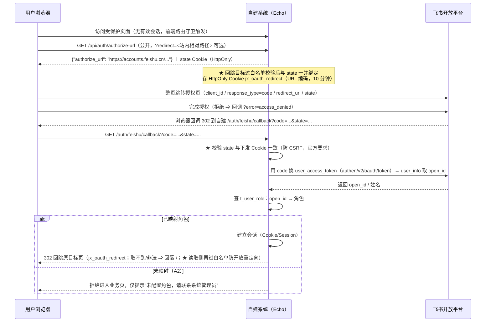

# 采购与费用审批平台（自建侧）· 接口设计

> 结论先行：本系统**只提供自建侧 HTTP 接口**。它与飞书之间**只有 4 个飞书接口 + 1 条长连接**（出方向），**不存在「创建审批实例」接口——这是设计约束，不是遗漏**（见 §9）。
> 所有业务接口默认**飞书免登 + 角色最小权限**；行级过滤 + 列级投影在**服务端**强制执行。
> 凡涉及未定口径（`approval_code`、字段 `id`、行·列权限矩阵）一律**接口不变量、口径走配置**，本文标注「待确认（Qx）」。

| 项 | 内容 |
|---|---|
| 文档名称 | 采购与费用审批平台（自建侧）· 接口设计 |
| 版本 | **V2.15**（+ 2026-09-28：**审批操作台体验三改 + 组织查询接口** —— ① §3.13 任务列表（`GET /api/approval/tasks` 与 `GET /api/approval/{biz_no}` 的 `tasks[]`）新增 **`assignee_name` / `assignee_department`**（数据源 `t_user_role`，批量查询防 N+1；查不到 ⇒ 留空，绝不把 `open_id` 塞进 `name`）；② **新增 §3.15 `GET /api/org/users` / `GET /api/org/departments`**（会话域；数据源＝**`t_user_role` 已配置角色者、非飞书通讯录全量**；支持 `?department=`/`?q=`；空表 ⇒ 空数组不报错）；③ 前端配套：办理人列显示「人名（部门）」、四操作改「部门 + 姓名筛选器」点选（提交字段仍为 `target`）、无本人可办任务时「审批操作」面板整体不渲染。含 V2.14（+ 2026-09-28：**免登登录成功后回跳原目标页（含开放重定向防护）** —— ① `GET /api/auth/authorize-url` 新增可选参数 `?redirect=<站内相对路径>`：仅接受单个 `/` 开头的站内路径（拒绝 `//`、`/\`、`http(s)://`、任意 `://`、反斜杠、控制字符、超长 >512），不合法 ⇒ **丢弃并记 warn**（不报错、回落 `/`）；合法目标与 `state` 一并绑定存入 HttpOnly Cookie `jx_oauth_redirect`（URL 编码、10 分钟 TTL）；★ **不拼进 `redirect_uri`**（飞书只认白名单地址，加参数可能不被放行）。② `GET /auth/feishu/callback` 登录成功后 302 回跳该目标（取不到/被篡改 ⇒ 回落 `/`；★ 读取侧**再次**过白名单 —— 纵深防御）；`error=access_denied` ⇒ 仍 `/login?error=denied` 且保留目标 Cookie（重试可沿用）；`DEV_MODE ?open_id=` 直连支持 `?redirect=`（同样过白名单）。③ 前端路由守卫跳授权页携带 `to.fullPath`；登录页透传 `?redirect=`。含 V2.13（+ 2026-09-28：**飞书免登（授权登录）链路补全** —— ① 新增 **`GET /api/auth/authorize-url`**（公开，下发官方授权页 URL ＋ `crypto/rand` 随机 `state` 存 HttpOnly Cookie）；② `GET /auth/feishu/callback` 补 **`state` 真校验**（Cookie 常量时间比对，不一致 400 拒绝）与 **`error=access_denied` 友好分支**（302 → `/login?error=denied`，不 500）；③ 后端 `ExchangeCode` 按官方《获取 user_access_token（v2）》补齐 **`client_id` / `client_secret` / `redirect_uri`**（此前缺凭据必失败）＋ `code != 0` / `error` 非空判失败）。含 V2.12（**回调链路端到端联调收口** —— ① §6.1 飞书接口契约表**新增「字段类型」「值语义 / 必填」两列**（`node_name` 须 `@i18n@` key、`message_id` 官方 **int64** 且读写不对称、`start_time`/`end_time`/`update_time` 为**毫秒字符串**、实例级＋task 级**两层各有独立必填**、本接口 `i18n_resources.texts` 是**数组**）；② §6.1 补 `message/update` **请求体**（`V-2` 已实测定稿＝`{"message_id","status"}`）与**「卡片需单独刷新」机制**（★ 平台**不自动刷新**卡片 ⇒ 我方处理成功后**主动**调 `message/update`）；③ §3.14 末注的 `V-1~V-4` **由「待实测」翻为「已定论」**（逐条给结论）；④ §6 主表「更新审批 Bot 消息」行由「请求体待实测 `V-2`」改为「`V-2` 已定稿」。含 V2.11 §3.14 缺口清单 6 条翻面 ＋ §6 计数 5→6 ＋ 幂等键 4 列；另 V2.10 §3.9 `defs/sync` ＋ V2.9 §3.14 官方字段校准 ＋ V2.8 §6 计数 4→5 ＋ V2.7 §6.1 出方向契约 ＋ V2.6 §3.8 入参校正） |
| 日期 | 2026-09-26 |
| 上游文档 | `01-PRD.md`、`02-UseCase.md`、`03-TestCase.md`、`04-Architecture.md` |
| 语言纪律 | 简体中文 |

---

## 1. 鉴权与会话

### 1.1 飞书免登回调流程（FR-M0-10 / UC-01）



**★ 授权页 URL 官方契约**（《获取授权码》，端点域名 **`accounts.feishu.cn`**，非 `open.feishu.cn`）：

| 参数 | 必填 | 说明 |
|---|---|---|
| `client_id` | 是 | App ID（我方 `JX_APP_ID`，如 `cli_a5d611352af9d00b`） |
| `response_type` | 是 | 固定值 `code` |
| `redirect_uri` | 是 | **URL 编码**；必须在开放平台【安全设置】的重定向 URL 列表内；★ **不得含 `#`**（官方：fragment 会被拼到回调末尾，SPA 取不到 code） |
| `state` | 否 | ★ 官方要求「务必校验 state 前后一致」以防 CSRF —— 我方 `crypto/rand` 16 字节，存 HttpOnly Cookie（10 分钟），回调时比对、不一致 400 拒绝 |
| `scope` | 否 | 空格分隔；★ 拼接了应用未开通的权限用户侧报 20027，故我方默认不拼 |

**★ 用 code 换 token**（《获取 user_access_token（v2）》，★ v2 已被官方标为**历史版本**、推荐 v3，我方现用 v2，待后续平迁）：`POST /open-apis/authen/v2/oauth/token`，JSON 请求体 `grant_type` / `client_id` / `client_secret` / `code` **必填**（`redirect_uri` 非必填，与授权时一致带上）；响应 `access_token` 即 user_access_token（★ `open_id` 不在该响应里，须另调 `GET /authen/v1/user_info`）；★ `code != 0` 或 `error` 非空一律判失败（HTTP 200 不代表成功）。

**★ 回调分支**：成功 `<redirect_uri>?code=…&state=<原值>`；用户拒绝授权 `<redirect_uri>?error=access_denied&state=<原值>` ⇒ 我方友好 302 `/login?error=denied`，不 500。

**★ 开放平台侧前置条件**（由项目负责人配置）：① 应用 →【安全设置】→ 重定向 URL 列表须含我方回调地址（逐字一致）；② 所需 scope 已开通（默认免登不拼 scope）；③ 生产面走 HTTPS。

### 1.2 会话载体

| 项 | 约定 |
|---|---|
| 载体 | **服务端 Session + HttpOnly / Secure / SameSite=Lax Cookie**（不把角色放进前端可读的 JWT payload） |
| 会话内容 | `open_id`、`session_id`、签发时间；**不缓存角色决策**（角色每请求实时解析，保证即时生效 TC-11） |
| 传输 | 全站 HTTPS（FR-M8-07），Cookie `Secure` 强制 |
| 有效期 | 空闲超时 + 绝对超时（具体值属运维配置，非本文硬编码） |
| CSRF | ★ **现状（C-1 澄清）**：代码**未安装 CSRF 中间件**；跨站写操作防护依赖 Cookie `SameSite=Lax` + 同源策略（跨站 POST 不携带会话 Cookie）。**待补**：CSRF 中间件（P2，可随联调并行） |

### 1.3 `open_id → 角色` 解析

| 场景 | 行为 | 对应 |
|---|---|---|
| `open_id` 命中 `t_user_role` 且 `active=1` | 取得角色 + 行级范围令牌 + 列级规则 | TC-10 |
| `open_id` 未映射 | **默认拒绝（deny by default）**，拒绝进入业务页，仅提示 | UC-01/A2、TC-32 |
| `active=0`（停用） | 视为未映射 | — |
| 角色/部门变更 | 下次请求实时生效，无需重登 | TC-11 |

---

## 2. 通用约定

| 项 | 约定 |
|---|---|
| BasePath | 业务接口 `/api`；免登 `/auth`；内部运维 `/internal` 与 `/healthz` `/readyz`；★ **回调 `/approval/external/callback`**（**独立入站面**、不在 `/api` 组、**绕开会话中间件**，见 §3.14） |
| 版本 | 首发 `v1` 语义（路径不带版本号，响应头 `X-API-Version: 1`）；重大不兼容变更时再引入 `/api/v2` |
| 响应包裹 | 统一 `{ "code": 0, "data": ..., "message": "ok", "trace_id": "..." }`；`code=0` 表示成功 |
| 分页 | 台账/审计等列表支持**页码分页**（`page`/`page_size`，默认 1/50，上限 200）与**游标分页**（`cursor`，用于大表/导出）；不混用 |
| 时间格式 | 所有时间为 **ISO 8601 UTC**（`2026-09-26T08:30:00Z`）；账期用 `YYYY-MM` |
| 金额 | 出参统一 `*_cents`（整数分）与 `*_display`（字符串）；避免浮点 |
| 幂等头 | 写操作支持 `Idempotency-Key` 请求头（可选）。语义三分支：**同键 + 同载荷 → 200 且返回首次结果**（响应附 `idempotent_replay:true`）；**同键 + 异载荷 → 40900**；未带键 → 不做幂等保护。用于报送登记等易重试写操作 |
| 敏感列 | 列级投影在**序列化阶段**裁剪；无权限字段**不出现在响应 JSON 中**（连字段名都没有） |
| 错误包裹 | 出错时 `code != 0`，`data` 为空，`message` 为可读文案，附 `trace_id` |

### 2.1 错误码表

| HTTP | `code` | 含义 | 典型场景 |
|---|---|---|---|
| 400 | 40000 | 参数校验失败 | 缺参、类型错、金额越界 |
| 401 | 40100 | 未登录 / 会话失效 | 无有效 Cookie（TC-09） |
| 401 | 40101 | 未映射角色 | `open_id` 不在 `t_user_role`（TC-32） |
| 403 | 40300 | 无权限（资源级） | 该角色无该看板/接口权限（TC-06/07） |
| 403 | 40301 | 行级越权 | 按 ID 访问他人/他部门记录（TC-06） |
| 404 | 40400 | 资源不存在 | 实例/台账记录不存在 |
| 410 | 41000 | **入口已退役** | 调用**已退役端点**（如 `POST /internal/sync/reconcile`；**body 指明权威入口**）。Batch B-2 新增 |
| 409 | 40900 | 冲突 | **幂等键冲突（同一键用于不同请求载荷）**、唯一约束（重复事件写入 / 业务单号重复） |
| 409 | 40901 | 状态不允许该操作 | 向只读同步存档表写入（TC-31）、已提交再改状态 |
| 429 | 42900 | 限流 | 触发速率限制（对应飞书 429 语义的可观测化） |
| 500 | 50000 | 服务器内部错误 | 未预期异常 |
| 503 | 50300 | 服务不可用 / 未就绪 | 自检未过、DB 不可写（TC-28） |

---

## 3. 业务接口

> 「权限要求」列同时给出**角色**与**行级范围**；具体角色-列映射由 `t_permission_rule` 决定（**默认取 PRD §4.2 口径；Q3 已于 2026-09-26 定案**）。
> 所有台账/看板接口**自动施加行·列过滤**，无需前端传权限参数。

### 3.1 鉴权

#### `GET /api/auth/authorize-url`

| 项 | 内容 |
|---|---|
| 用途 | 下发飞书免登**授权页 URL**：生成随机 `state`（`crypto/rand` 16 字节，存 HttpOnly Cookie `jx_oauth_state`，10 分钟）→ 按官方拼装 `https://accounts.feishu.cn/open-apis/authen/v1/authorize?client_id=…&response_type=code&redirect_uri=<URL编码>&state=…`；前端（路由守卫 / 登录页）据此整页跳转 |
| 权限要求 | **公开**（★ 挂 root `e`，不进 `requireSession` 组 —— 未登录时也要能拿到，否则死循环） |
| 请求参数 | Query：`redirect`（可选，**登录后回跳目标**）—— ★ **开放重定向防护（安全红线）**：仅接受**站内相对路径**（单个 `/` 开头；拒绝 `//`、`/\` 开头的协议相对路径、`http(s)://` 及任意 `://`、反斜杠 `\`、控制字符、长度 >512）；**不合法 ⇒ 丢弃并记 warn（不报错），回调回落 `/`**。合法目标与 `state` 一并绑定存入 HttpOnly Cookie `jx_oauth_redirect`（URL 编码存储、10 分钟 TTL、与 state 同 Secure/SameSite 口径）。★ **不拼进 `redirect_uri`**（飞书侧只认白名单地址，加参数可能不被放行）；未传参数 ⇒ 保留既有 Cookie（授权被拒后于登录页重试可沿用原目标，TTL 自然过期兜底） |
| 响应字段 | `authorize_url`（完整授权页 URL） |
| 配置 | `redirect_uri` 取 `JX_OAUTH_REDIRECT_URI`，未配置缺省 `JX_CALLBACK_DOMAIN + "/auth/feishu/callback"`；须与开放平台【安全设置】重定向 URL 白名单一致、不得含 `#` |
| 错误码 | 40000（未配置 `JX_APP_ID` / 回调地址未配置 / 回调地址含 `#` —— **可见报错，不静默编造**）、50000 |
| 关联 FR | FR-M0-10 |

#### `GET /auth/feishu/callback`

| 项 | 内容 |
|---|---|
| 用途 | 飞书免登回调；用 `code` 换取身份并建立会话 |
| 权限要求 | 公开（免登入口） |
| 请求参数 | Query：`code`（必填，`DEV_MODE` + `open_id` 直连除外）、`state`（必填；★ **真校验**：与 `authorize-url` 下发并存入 HttpOnly Cookie 的值做常量时间比对，不一致 ⇒ 400 拒绝，Cookie 用毕即清防重放）、`error`（官方失败回调 `error=access_denied` ⇒ 友好 302 `/login?error=denied`，不 500，且**保留**回跳目标 Cookie 供重试沿用）、`redirect`（仅 `DEV_MODE` 直连路径接受：无目标 Cookie 时作回跳目标，★ 同样过站内白名单校验） |
| 响应 | `302` 重定向到**原目标页**（`authorize-url` 绑定于 HttpOnly Cookie `jx_oauth_redirect` 的站内相对路径；取不到 / 非法 ⇒ 回落 `/`；★ **纵深防御**：读取侧**再次**过白名单校验，Cookie 被篡改也只回落 `/`，绝不外跳；目标用毕即清）；失败/拒绝授权不建立会话、302 登录错误页 |
| 错误码 | 40000（缺 code/state、state 不一致）、40101（未映射角色） |
| 关联 FR | FR-M0-10 |

#### `POST /auth/logout`

| 项 | 内容 |
|---|---|
| 用途 | 注销会话 |
| 权限要求 | 已登录 |
| 请求参数 | 无（★ 当前无 CSRF Token 头，见 §1.2 C-1 澄清） |
| 响应 | `{code:0}` |
| 错误码 | 40100 |
| 关联 FR | FR-M0-10 |

#### `GET /api/me`

| 项 | 内容 |
|---|---|
| 用途 | 返回当前会话身份、角色、可见范围摘要（供前端展示降级） |
| 权限要求 | 已登录 |
| 请求参数 | 无 |
| 响应字段 | `open_id`、`name`、`role`、`departments[]`、`column_policy_summary`（**仅摘要，真拦截在服务端**） |
| 错误码 | 40100、40101 |
| 关联 FR | FR-M0-10、FR-M5-04 |

### 3.2 台账（M4）

#### `GET /api/ledger/{table}`

> ★ **派生台账**：`{table}=L11`（订单执行台账）**不读 `t_ledger_archive` 的 L11 行**，而以 `L04`（合同台账）为骨架、关联 `L07`（到货验收）**查询时派生**。响应含 `derived:true` 与 `source:["L04","L07"]`；派生行**无 `id`**，故不支持 `GET /api/ledger/L11/{id}`（400）与任何写入（40901）。`delay_days` 仅在合同交期与实际到货**都能解析为日期**时出现（缺数据不臆造 0）。

| 项 | 内容 |
|---|---|
| 用途 | 台账列表查询；**自动施加行级过滤 + 列级投影**；返回公式列红标 |
| 权限要求 | 各角色按 `t_permission_rule`；行范围见 §5.2 令牌（申请人 SELF / 主管领导 DEPT / 副总 CHARGE_DEPT / 采购经办人 ASSIGNED / 验收人 PARTICIPATED / 总经理·综合运营主管·系统管理员 ALL） |
| 路径参数 | `{table}`：台账类型语义键（`L01`~`L12`，见架构 §3.4） |
| 请求参数 | `page`、`page_size` 或 `cursor`；筛选：`department`、`biz_no`、`supplier`、`date_from`、`date_to`、`status` |
| 响应字段 | `items[]`：业务单号、部门、金额（若有权）、供应商、日期、`formula_flags{}`（红标：`same_person` / `supplier_month_sum` / `spot_check_range`）、`source`（archive/ops 合并视图）；`total` |
| 错误码 | 40300、40301、40000 |
| 关联 FR | FR-M4-01、FR-M4-04、FR-M4-05、FR-M5-02、FR-M5-03、FR-M7-01 |

#### `GET /api/ledger/{table}/{id}`

| 项 | 内容 |
|---|---|
| 用途 | 单条台账记录查询；**同样施加行·列过滤**（按 ID 直取也过滤，TC-06） |
| 权限要求 | 同列表接口的行范围；越权 → 40301 并留痕 |
| 路径参数 | `{table}`、`{id}` |
| 响应字段 | 单条记录（含 `archive`/`ops` 合并后的可写字段与公式列红标） |
| 错误码 | 40301、40400 |
| 关联 FR | FR-M5-02、FR-M5-03、FR-M7-01 |

#### `PATCH /api/ledger/{table}/{id}`

| 项 | 内容 |
|---|---|
| 用途 | **仅运营表可写字段**的登记/回填（付款凭据号、抽查状态、经办状态、集团侧人工字段等）——★ **Q14 已定案** |
| 权限要求 | ① `t_permission_rule.writable_fields` 限定角色（如综合运营主管、被指定经办人）；`writable_fields` 为空 → 该台账整体只读（**40901**）。② ★ **该台账在 `t_ledger_field_def` 登记过字段定义时，`fields` 的键名必须已在其中**（否则 **40901**）——白名单**逐台账逐步生效**，未登记任何字段的台账仍只按 `writable_fields` 校验（向后兼容） |
| 字段定义来源 | 由 `jxapproval import-config` 的第五类映射 **`ledger_field`** 写入 `t_ledger_field_def`（只开放 `ledger_type` / `field_key` / `is_sensitive` 三项；其余无消费端故不开放）。该表同时是 `SensitiveFields` 的**敏感列清单**来源 |
| 首次引入 | 2026-09-26（docs/06 §K.1 第 4 项 / §K-2） |
| 路径参数 | `{table}`、`{id}` |
| 请求体 | `{ "fields": { "<business_field>": <value> } }`（业务字段名，非控件 id） |
| 响应字段 | 更新后的运营字段 + 审计回执 |
| 错误码 | 40300（无写权/字段不可写）、40901（同步存档表 / 只读台账 / 派生视图 / **字段未在台账字段定义中登记**）、40000 |
| 关联 FR | FR-M1-03、FR-M4-03、FR-M4-09、FR-M6-07 |

> 说明：**同步存档表无写入口**（TC-31）；若 `{table}` 对应纯只读台账（如 `L02` / `L10`）则一律 40901。

### 3.3 看板（M5）

#### `GET /api/dashboard/{id}`

| 项 | 内容 |
|---|---|
| 用途 | 看板指标数据；数据源指向**运营表**（FR-M5-05）；按角色返回过滤后数据 |
| 权限要求 | 各角色按规则表；不属于该角色的看板 → 40300（TC-14/A1） |
| 路径参数 | `{id}`：13 预算执行 / 14 采购执行 / 15 费用结构 / 16 异常预警 |
| 请求参数 | `period`（如 `2026-09`）、筛选维度 |
| 响应字段 | 指标卡与图表序列（见 §4.4）；异常预警面板含红标项（拆分嫌疑、经办超期、紧急未闭合、集团驳回未处置等） |
| 错误码 | 40300、50300（预算看板本期空态**不报错**，返回空序列） |
| 关联 FR | FR-M5-01、FR-M5-05、FR-M5-06、FR-M5-07、FR-M5-08、FR-M5-01（看板 16 异常预警） |

#### `GET /api/dashboard/{id}/export`

| 项 | 内容 |
|---|---|
| 用途 | 看板数据导出；**复用行·列投影器**（禁止绕过列过滤） |
| 权限要求 | 同看板接口；导出行为**留痕** |
| 路径参数 | `{id}` |
| 请求参数 | `period`、`format`（`csv`/`xlsx`） |
| 响应 | 文件流（`Content-Disposition`） |
| 错误码 | 40300、42900 |
| 关联 FR | FR-M7-03、FR-M5-06 |

### 3.4 实例（M2）

#### `GET /api/instances`

| 项 | 内容 |
|---|---|
| 用途 | 实例列表查询；自动施加行·列过滤 |
| 权限要求 | 各角色按规则表行范围 |
| 请求参数 | `approval_code`、`doc_type`、`status`、`department`、`date_from`、`date_to`、分页 |
| 响应字段 | `items[]`：`instance_code`、`approval_code`、`doc_type`、`biz_no`、`status`、`status_raw`、`applicant`、`department`、`amount`（若有权）、`created_at`、`source`（event/reconcile） |
| 错误码 | 40300、40301 |
| 关联 FR | FR-M2-01、FR-M2-03、FR-M2-05、FR-M5-02、FR-M5-03 |

#### `GET /api/instances/{instance_code}`

| 项 | 内容 |
|---|---|
| 用途 | 单实例详情（含当前状态、业务单号归档、`approval_code→doc_type` 映射结果） |
| 权限要求 | 行级过滤（越权 40301，TC-06） |
| 路径参数 | `instance_code` |
| 响应字段 | 实例主记录（见 §4.1） |
| 错误码 | 40301、40400 |
| 关联 FR | FR-M2-01、FR-M2-04、FR-M2-06 |

#### `GET /api/instances/{instance_code}/fields`

> ★ **作废（转向 ③ · F3）** —— 原生控件链作废，本端点**恒空、再无生产者**（`t_instance_field` 已弃用，见 `04 §3.1` / `11 §3 R03`）。保留签名仅为兼容旧前端，**前端不应再依赖**；表单字段改由**我方提交页 / 三方审批定义**持有（`04a §3`）。

| 项 | 内容 |
|---|---|
| 用途 | 实例表单字段（**键值对**，按映射表转业务字段名；未映射字段一并返回但不进业务列） |
| 权限要求 | 行级过滤；敏感字段列级裁剪 |
| 路径参数 | `instance_code` |
| 响应字段 | `fields[]`：`field_id`（**具体值待确认（Q1）**）、`field_name`、`biz_field`（映射结果，未映射为 `null`）、`value`、`value_type` |
| 错误码 | 40301、40400 |
| 关联 FR | FR-M2-02、FR-M2-05 |

> **设计不变量**：字段以键值对返回，**不依赖字段顺序**；模板新增/改名不报错（TC-23）。

#### `GET /api/instances/{instance_code}/timeline`

| 项 | 内容 |
|---|---|
| 用途 | 状态变更史（**含驳回重提完整链条**：首次提交→驳回(含意见)→重提→通过） |
| 权限要求 | 行级过滤 |
| 路径参数 | `instance_code` |
| 响应字段 | `events[]`：`status`、`task_node`、`operator`、`opinion`、`occurred_at`、`event_seq` |
| ★ `task_node` 口径 | **预留未用：本期恒为 `null`**。节点级事件（`approval_task`）本期不订阅（PRD §3.2 **N10** / FR-M2-07 降级），字段保留以免将来启用时改表。**客户端不得依赖该字段非空**；逐审批人轨迹请以飞书审批详情页为准 |
| 错误码 | 40301、40400 |
| 关联 FR | FR-M3-04、FR-M3-05、FR-M7-02 |

### 3.5 报送（M6）

> ★ **本节端点清单已补全**（架构审查 C-2）：除下列端点外，M6 还实现了 `POST /api/submission/{id}/receipt`（登记/补填移交凭证）、`POST /api/submission/{id}/group`（登记集团受理与流程状态）、`POST /api/submission/{id}/reject`（登记集团驳回与处置）—— 三者均落 `t_submission` 的集团侧人工登记字段，并由 `router.go` 注册、前端 `api-m1m6.js` 在用。对应 FR-M6-02 / FR-M6-05 / FR-M6-08。

#### `POST /api/submission`

| 项 | 内容 |
|---|---|
| 用途 | 提交集团登记（含关联单据清单、事项类型、金额、付款方式、湖南侧完成日期） |
| 权限要求 | 综合运营主管（归口核心）；行范围 ALL |
| 请求体 | 见 §4.5；支持 `Idempotency-Key`。★ `biz_no` **必填**（业务唯一键 + 去重锚点；SQLite 列级 `UNIQUE` 对 NULL 不生效，缺省会造成重复登记） |
| 响应字段 | 新建 `submission.id`、`submit_state`（无凭证 → 未提交）；幂等复用额外含 `idempotent_replay: true` |
| 错误码 | 40300、40000（缺 `biz_no` / 事项类型 / 日期格式 / 非法状态 / **无凭证登记「未提交」以外的状态**）、40900（同键异载荷的幂等冲突 / 业务单号重复） |
| 关联 FR | FR-M6-01、FR-M6-02、FR-M6-05；3 个工作日内提交（FR-M6-03） |

#### `GET /api/submission`

| 项 | 内容 |
|---|---|
| 用途 | 报送记录列表 / 月度「已提交未付款」对账清单 |
| 权限要求 | 综合运营主管（ALL）；项目总经理（ALL，只读） |
| 请求参数 | `state`（未提交/已提交/办理中/已付款/已驳回）、`period`、`overdue`（是否超期）、分页 |
| 响应字段 | 列表（见 §4.5）；`overdue` 标记 3 个工作日超期 |
| 错误码 | 40300 |
| 关联 FR | FR-M6-03、FR-M6-04、FR-M6-08 |

#### `GET /api/submission/{id}/package`

> ★ **包内容**（B39 缺口② 补全）：`报送登记.json` · `关联单据清单.csv` · **`附件清单.csv`** · `移交凭证.txt` · `凭证包说明.txt`。附件清单列出关联单据的附件引用与**入库状态**；文件本体经 `GET /api/attachment/{file_id}` 按需拉取。

| 项 | 内容 |
|---|---|
| 用途 | **报送凭证包导出**（关联单据清单 + 移交凭证 + 湖南侧完成日期 + 付款方式等） |
| 权限要求 | 综合运营主管；导出留痕（TC-26） |
| 路径参数 | `{id}` |
| 请求参数 | `format`（`zip`/`pdf`） |
| 响应 | 文件流（凭证包） |
| 错误码 | 40300、40400 |
| 关联 FR | FR-M6-06、FR-M7-03 |

### 3.6 备付金（M1）

#### `GET /api/petty-cash/balance`

| 项 | 内容 |
|---|---|
| 用途 | 备付金余额**只读**展示（做法 A：综合运营主管审批前查看） |
| 权限要求 | **综合运营主管**（登记岗，读写）+ **主管领导**（只读，做法 A）；项目总经理是否可见列入待确认 Q20（当前**不可见**） |
| 请求参数 | `period`（可空，默认当月） |
| 响应字段 | `issued_cents`、`spent_cents`、`balance_cents`、`as_of` |
| 错误码 | 40300 |
| 关联 FR | FR-M1-04、FR-M1-07 |
| ★ | **无修改入口**；不提供任何写入能力 |

#### `POST /api/petty-cash/receipt`

| 项 | 内容 |
|---|---|
| 用途 | 备付金签领登记（签领人 / 金额 / 日期），关联采购报备单 |
| 权限要求 | 综合运营主管（登记岗） |
| 请求体 | `biz_no`（关联 BA，**待确认（Q1）** 复核）、`receiver_open_id`、`receiver_name`、`amount_cents`、`received_date` |
| 响应字段 | 新建 `receipt.id` |
| 错误码 | 40300、40000 |
| 关联 FR | FR-M1-01、FR-M1-05 |

#### `POST /api/petty-cash/monthly-close`

| 项 | 内容 |
|---|---|
| 用途 | 备付金月核销（按月登记签领、支出与核销后余额） |
| 权限要求 | 综合运营主管 |
| 请求体 | `period`（`YYYY-MM`）、`issued_cents`、`spent_cents`、`balance_cents`、`remark` |
| 响应字段 | 核销记录（唯一一个账期一条） |
| 错误码 | 40300、40000、40900（该账期已核销） |
| 关联 FR | FR-M1-07 |

### 3.7 审计（M7）

#### `GET /api/audit/logs`

| 项 | 内容 |
|---|---|
| 用途 | 审计日志查询（操作日志 + 状态变更史 + 越权留痕 + 导出留痕） |
| 权限要求 | **系统管理员**（ALL，只读）+ **项目总经理**（只读）；其余角色默认拒绝（Q3 已定案） |
| 请求参数 | `actor`、`role`、`action`、`resource`、`result`（allow/deny）、`date_from`、`date_to`、分页 |
| 响应字段 | `items[]`：`actor_open_id`、`actor_role`、`action`、`resource`、`target_id`、`result`、`feishu_log_id`、`created_at` |
| 错误码 | 40300 |
| 关联 FR | FR-M7-01、FR-M7-02、FR-M7-03、FR-M7-04 |

### 3.8 内部运维端点（★ 需管理凭据，非飞书免登）

> 与业务接口**不同鉴权域**：**必须**走 `JX_INTERNAL_TOKEN`（Header `X-Internal-Token`）。★ **转向 ③（E-2）**：**不得**再依赖「仅绑定回环 / 内网」做鉴权 —— 引入反向代理后回环前提失效，内部端点会**不可达或对全网开放**；回环绑定只作**纵深防御**、**不替代 token**（见 `04a §17.6`）。**不参与飞书免登**。

#### `GET /healthz`

| 项 | 内容 |
|---|---|
| 用途 | 存活探针：进程存活 + 启动自检四项快照（**回调面连通 / 长连接 / DB 可写 / 单实例**） |
| 权限要求 | 管理凭据或内网 |
| 响应字段 | `{alive:true, checks:{callback, longconn, db_writable, single_instance}, version}` |
| 关联 FR | FR-M8-02、FR-M0-05 |

> ★ **转向 ③（B-2）**：原「**订阅**」自检项**作废**（审批事件订阅 F1 取消），改为「**回调面连通**」（`04a §17.5`）；`t_subscribe_state` 已弃用（`04 §3.1` / `11 §3 R11`）。

#### `GET /readyz`

| 项 | 内容 |
|---|---|
| 用途 | 就绪探针：是否可以接收并处理事件 |
| 权限要求 | 管理凭据或内网 |
| 响应字段 | 自检四项 + `worker_queue_depth`、`deadletter_total`、`last_reconcile{missing,filled}`、**回调面连通 / 证书剩余天数** |
| 错误码 | 50300（未就绪） |
| 关联 FR | FR-M8-02、FR-M1-05（自检四项可查） |

#### `POST /internal/sync/reconcile` ★ **已退役（`410 Gone`）**

> ★ **已退役此入口**（Batch B-2，`c940603`）：**返回 HTTP `410 Gone` + `code=41000`**，body **指明权威入口** `POST /internal/approval/check`。原"手动触发对账补拉"语义**已作废**（③ 下审批对账＝对 `check` 的**方向判断**，见 §3.8；本路由**收敛为通讯录侧**）。

| 项 | 内容 |
|---|---|
| 用途 | ★ **已退役** —— 原"手动触发对账补拉"不再提供；调用返回 `410 Gone` |
| 鉴权 | 管理凭据（`X-Internal-Token`）；退役后仍校验 |
| 响应 | ★ `410 Gone` · `code=41000` · body＝`该入口已退役：审批对账唯一入口为 POST /internal/approval/check（本路由收敛为通讯录侧，待 docs/08 实施）`（`handlers_ops.go` 的 **`handleReconcile`** —— 退役 `410 Gone` body） |
| 关联 FR | ~~FR-M0-07、FR-M0-08~~ → 转 **`POST /internal/approval/check`**（§3.8） |

#### `POST /internal/approval/check`

| 项 | 内容 |
|---|---|
| 用途 | 手动触发**审批对账**（对 `external_instances/check` 的 diff **判方向**后重推，`04a §9.2`）—— ★ **非**"缺则补"的旧 `reconcile`（旧路径退役见 `docs/11 T02b`） |
| 鉴权 | `JX_INTERNAL_TOKEN`（`X-Internal-Token`，见 §3.8 前言） |
| 响应 | `{ checked, missing, repushed }` |
| ★ 上游入参（`external_instances/check`） | ★ **2026-09-27 实测校正**：请求体字段名为 **`instances[]`**，且每项**必须含 `update_time` ＋ `tasks`**（只给 `instance_id` ⇒ 飞书报 `99992402 field validation failed`） |
| ★ 上游读回（`external_approvals`） | ★ **2026-09-27 实测**：读回**必须用创建响应返回的 `approval_code`** 作**路径参数**（`GET /open-apis/approval/v4/external_approvals/{该值}`）—— ★ **`?approval_code=` 形态不通** |
| 关联 FR | FR-M0-07、FR-M0-08 |

> ★★ **`approval_code` 字段名歧义（2026-09-27 实测，★ 必须写清）**：三方审批定义里**两个 `approval_code` 不是同一样东西** —— ① **创建响应返回的 / 路径参数里的那个 `approval_code` ＝「查询键」**（`GET /open-apis/approval/v4/external_approvals/{该值}` 才通；**用我方传入的 code 做路径参数查不到**，报 `1390002 approval code not found`；**`?approval_code=` 形态也不通**）；② **定义体 `data.approval_code` ＝ 我方传入的值**（实测**客户端指定并生效**）。⇒ **读回用①**、**配置 / 映射用②**。

#### `POST /internal/sync/subscribe`

| 项 | 内容 |
|---|---|
| 用途 | 手动（重）订阅审批事件（逐个 `approval_code`） |
| 权限要求 | 管理凭据 |
| 请求体 | `{ "approval_codes": ["…(待确认（Q1）)"] }`（可空 → 全部） |
| 响应字段 | 各 `approval_code` 的订阅结果 |
| 关联 FR | FR-M0-03、FR-M0-04 |

#### `POST /internal/events/{id}/replay`

| 项 | 内容 |
|---|---|
| 用途 | 人工重放死信事件（复用原 payload 重投 worker） |
| 权限要求 | 管理凭据 |
| 路径参数 | `{id}`：`t_deadletter.id`（或 `t_event_inbox.id`） |
| 响应字段 | 重放结果 + `replay_count` |
| 关联 FR | FR-M3-07 |
| 备注 | 重放仍走幂等键（TC-30） |

#### `POST /internal/dev/inject-event`（★ 仅 `DEV_MODE=true` 时注册）

| 项 | 内容 |
|---|---|
| 用途 | 开发/冒烟用：手工注入一条 `approval_instance` 事件，端到端验证「事件 → 落库 → 台账／看板」（B13） |
| 权限要求 | 管理凭据（与其余内部端点同） |
| 注册条件 | **仅当 `DEV_MODE=true`**；生产环境该路由**不存在**（404） |
| 关联 FR | FR-M3-01、FR-M3-03（可测性） |
| 备注 | ★ 与「我方不创建审批实例」的约束**不冲突**：本端点注入的是**事件**而非审批实例，且不进生产路径（B13、N2） |

> ★ **为什么补登这一条**（2026-09-27 静默审计 C5）：该路由在 `DEV_MODE` 下真实存在，
> 但文档未列。文档与实现不一致的后果是**反向**的 —— 联调时看到"多出来一个端点"，
> 会怀疑是不是漏了鉴权或多了攻击面；写清楚"仅 DEV_MODE 注册"才是准确的口径。

---

### 3.9 系统管理（M5，★ 仅「系统管理员」角色）

> 供管理员**自助配置行·列权限**（FR-M5-09~11）。**任何写操作均写 `t_audit_log`（改前 / 改后 diff）**。
> 非「系统管理员」调用 → `40300`（资源级无权限），并留痕。**本组接口不涉及任何审批流转。**

#### `GET /api/admin/permission-rules`

| 项 | 内容 |
|---|---|
| 用途 | 读取「角色 × 资源」权限矩阵（`row_scope`、`column_allow` / `column_deny`、`writable_fields`、`effective_from`） |
| 权限要求 | 系统管理员 |
| 响应字段 | `items[]`（同 `t_permission_rule` 行）＋ `resources[]`（可选资源枚举：`ledger:*` / `dashboard:1..4` / `api:*`）＋ `roles[]`（角色枚举）＋ `row_scopes[]`（6 令牌 + `DENY` 的语义说明，供前端下拉） |
| 错误码 | 40300 |
| 关联 FR | FR-M5-09 |

#### `PUT /api/admin/permission-rules`

| 项 | 内容 |
|---|---|
| 用途 | **批量保存**权限矩阵（按 `resource × role` 覆盖）；保存后**立即 `Invalidate()` 清缓存** → 即时生效 |
| 权限要求 | 系统管理员 |
| 请求体 | `{rules:[{resource, role, row_scope, column_allow[], column_deny[], writable_fields[]}]}` |
| 校验 | `row_scope` 必须 ∈ {`SELF`,`DEPT`,`CHARGE_DEPT`,`ALL`,`ASSIGNED`,`PARTICIPATED`,`DENY`}；**不接受条件表达式**（Q3 定案） |
| 响应字段 | `{saved:n, effective:"immediate"}` |
| 错误码 | 40000（令牌非法）、40300 |
| 关联 FR | FR-M5-09、FR-M5-11 |

#### `GET /api/admin/users` · `POST /api/admin/users` · `PATCH /api/admin/users/{open_id}`

| 项 | 内容 |
|---|---|
| 用途 | 人员角色管理：列出 / 新增 / 修改 `t_user_role`（角色、部门、分管部门、启用停用） |
| 权限要求 | 系统管理员 |
| 请求 / 响应字段 | `open_id`、`name`、`role`、`department`、`extra_depts[]`、`active` |
| 错误码 | 40000、40300、40400（`open_id` 不存在） |
| 关联 FR | FR-M5-10、FR-M5-11 |
| 备注 | 停用 / 改角色后**下一次请求即时生效**（每请求实时解析角色，不缓存决策，TC-11） |

#### `POST /api/admin/approval/defs/sync`

> ★ **为什么补登这一条**（2026-09-27 静默审计 C5）：该端点为回调链路修复第 1 批（docs/16 §2-C
> 通道①）新增的定义装载**主通道**，已注册于 `router.go`（admin 组）但本文件未列 ⇒ 门禁 C5 报红；本条补齐契约。

| 项 | 内容 |
|---|---|
| 用途 | 三方审批定义装载（主通道，docs/16 §2-C 通道①）：读 `t_config_mapping(map_kind='approval_code')` 清单（正本＝`docs/reference/config-mapping.sample.json` 的 approval_code 节，11 类）→ 逐条注册/更新到飞书 `external_approvals` 并落 `t_approval_def`（**幂等**：approval_code 命中即更新，不产生第二条定义） |
| 权限要求 | 系统管理员（与 §3.9 其余端点同口径） |
| 请求体 | 无 |
| 响应字段 | `{synced, created, updated, skipped, failed, items[]}`（items 逐条：`doc_type` / `approval_code` / `created` / `error`）；`synced = created + updated` |
| 错误码 | **400**（清单为空 / code 仍为 `REPLACE_ME_` 占位符 / doc_type 不在 11 类内——**可见拒绝，绝不 200 静默**）；**503**（`JX_ACTION_CALLBACK_TOKEN` 或 `JX_CALLBACK_DOMAIN` 未配置——定义无 token 则回调校验恒失败，拒绝装载）；**500**（部分定义同步失败，`approval.ErrSyncFailed`；计数与 `items` 明细照返，供运维核对失败条目） |
| 关联 | `04a §3.5`（定义装载源）、`docs/16` §2-C、FR-M0-13；★ 飞书侧伴生调用＝`POST external_approvals`（§6.1），响应回填值落 `t_approval_def.feishu_code`（双 code 池消歧，docs/16 G-8） |

### 3.10 集团报销跟踪（M1）

> ★ 口径：报销**不进入本办法审批流程**（五条前提第 ④ 条：报销类可提前支出、公户转账一律走集团），
> 由人工走集团。本资源只承接「关联事前申请单号 → 初审 → 移交集团 → 集团付款」的**审批外登记**，
> 供台账（L06 集团提交与付款衔接台账）与看板引用。与 §3.5 报送（`t_submission`）是**两条独立业务**：
> 报送 = 湖南侧流程完成后的对外报送（含移交凭证 / 集团受理 / 驳回处置）；报销跟踪 = 报销类事前申请的单独跟踪（票据张数 / 初审状态 / 超支说明）。
>
> ★ 与 §3.5 / §3.6 同口径：**不进行·列权限矩阵**，只由处理器显式校验角色（避免「矩阵可配、处理器更严」的假配置，README 定案 #10）。

#### `POST /api/reimbursement`

| 项 | 内容 |
|---|---|
| 用途 | 集团报销跟踪登记（人工） |
| 权限要求 | 综合运营主管（登记岗） |
| 请求体 | ★ `src_biz_no` **必填**（关联事前申请单号，业务关联键）、`applicant_open_id`、`department`、`actual_cents`（**必须为正整数**）、`invoice_count`（≥0）、`review_state`、`handover_date`（`YYYY-MM-DD`） |
| 响应字段 | `id`、`src_biz_no`、`actual_cents`、`amount_display` |
| 错误码 | 40300、40000（缺 `src_biz_no` / 金额非正 / 票据张数为负 / 状态非法 / 日期格式） |
| 关联 FR | FR-M1-02 |
| 备注 | `review_state` 枚举：待初审 / 初审通过 / 初审退回 / 已移交集团 / 集团已付款（空 = 未填） |

#### `GET /api/reimbursement`

| 项 | 内容 |
|---|---|
| 用途 | 集团报销跟踪列表（分页） |
| 权限要求 | 综合运营主管 / 主管领导 / 项目总经理 / 系统管理员（**只读**，服务端二次校验） |
| 请求参数 | 筛选：`src_biz_no`、`department`、`review_state`；分页 `page` / `page_size`（上限 200） |
| 响应字段 | `items[]`：`id`、`src_biz_no`、`applicant`、`department`、`actual_cents`+`amount_display`、`invoice_count`、`review_state`、`handover_date`、`paid_date`、`paid_cents`+`paid_display`、`overrun_note`、`source`（恒为 `人工登记`）、`created_at` |
| 错误码 | 40300 |
| 关联 FR | FR-M1-02 |

#### `PATCH /api/reimbursement/{id}`

| 项 | 内容 |
|---|---|
| 用途 | 更新报销跟踪记录（集团侧付款字段人工登记） |
| 权限要求 | 综合运营主管 |
| 请求体 | 至少一项：`review_state`、`handover_date`、`paid_date`、`paid_cents`、`overrun_note`（**指针语义**：未提供 = 不改动，可传空串清空文本字段） |
| 响应字段 | `{id, updated:true}` |
| 错误码 | 40300、40000（未提供任何字段 / 状态非法 / 日期格式 / 金额为负）、40400（记录不存在） |
| 关联 FR | FR-M1-02 |
| ★ | 集团侧字段**只接受人工传入值，不做任何派生或回填**（与 FR-M6-07 同源口径） |

### 3.11 变更链回溯（M4）

### 3.12 附件（M0 / FR-M0-09 · B39 最小集）

> ★ **只做下载**：模式 A 下本系统**不创建实例**，附件由申请人在飞书侧上传 → 本节只提供
> 「按引用取回」，**不提供上传**（原上传方法属模式 B 遗留，已从接口移除）。

#### `GET /api/instances/{code}/attachments`

| 项 | 内容 |
|---|---|
| 用途 | 列出该实例的附件**元数据**（**不拉取文件本体**，不触发任何飞书调用） |
| 权限 | `api:instances` + 行级（以 `t_instance` 判定；谓词别名 `a`） |
| 响应字段 | `items[]`：`file_id`/`instance_code`/`biz_no`/`field_id`/`file_name`/`size_bytes`/`fetched`/`storage_kind`/`fetched_at` |
| 错误码 | 40300（无权限/越权）、40301、40000 |

#### `GET /api/attachment/{file_id}`

| 项 | 内容 |
|---|---|
| 用途 | **下载附件**：主存命中直接返回；未命中**回源拉取** → 落主存 → 回填，再返回 |
| 权限 | 同 `api:instances`；**行级以「附件所属实例」为准**（不冗余身份列，避免两处不同步） |
| 响应 | `200` + `application/octet-stream`（`Content-Disposition` 用 `filename*=UTF-8''` 转义）+ `nosniff` |
| 错误码 | **404**（附件未登记/不存在 —— 无法判定归属时**一律拒绝**：附件是"内容"而非"计数"，越权后果更重）、40300/40301、50200 |
| 降级 | 未配置对象存储（`JX_S3_*` 与 `JX_ATTACH_DIR` 均空）时**不缓存、每次回源**（链路仍可用、日志有痕迹），**不是静默丢功能** |

> ★ **对象存储装配**（ADR-08）：`JX_S3_*` 齐备 → **S3 主存**（手写 SigV4，零新增依赖）；`JX_RUSTFS_*` 齐备 → 与其组成 **主备双写**（写双写、读优先主存并回退备份）；只配 `JX_ATTACH_DIR` → 本地落盘；全空 → 降级直通。


#### `GET /api/contract/{biz_no}/changes`

| 项 | 内容 |
|---|---|
| 用途 | 按**合同号**回溯历次变更：**次数 / 累计变更金额 / 所取档位**（制度第五十二条） |
| 权限要求 | 沿用台账口径：以资源 `ledger:L09`（例外事项台账）解析行·列规则；无权限 → 40300 且留痕 |
| 行级 / 列级 | 行级过滤在 **SQL 层**（`RowFilter`），列级投影在**序列化层**（`Project`）；越权行不返回、无权列连字段名都不出现 |
| 响应字段 | `contract_no`、`count`、`cumulative_change_cents`+`cumulative_change_display`、`amount_hidden`、`items[]`：`biz_no`、`instance_code`、`department`、`biz_date`、`change_cents`+`change_display`、`original_cents`+`original_display`、`tier`、`archive` |
| 错误码 | 40000（合同号为空）、40300 |
| 关联 FR | FR-M4-07 |
| ★ 档位口径 | 变更审批档位 = **max（变更差额, 原合同金额）**（批复 A8，化整为零通道已关闭）。显式存了 `tier` 就用存的；否则按 max 现算并标注「max 取档 → …」 |
| ★ 匹配方式 | 变更单指向原合同的 **JSON 键名尚未定稿（Q14）**，故匹配做成**键名无关的精确值比较**：`json_each(ext_json)` 展开对象后对**任意键的值**做等值比较（**绝不使用 `LIKE`**，防止 `ou_ab` 命中 `ou_abc` 式前缀越权，见 docs/06 §H.10 P0-A）；脏 JSON 由 `json_valid` 守卫，不使整条查询失败（同 §H.10 P0-B） |
| 备注 | `ext_json` 键名候选：变更差额 `change_cents`/`change_amount_cents`/`delta_cents`；原合同金额 `original_cents`/`contract_cents`；档位 `tier`/`approval_tier`/`档位`。定稿后收敛为单键 |

### 3.13 审批流转（我方页面 · **转向 ③ 新增**）

> ★ **本节是 `docs/11 §4.2`「须新增路由」的契约正本**，补 `docs/11 **R11**`「我方页面两键端点缺失」缺口。★ **与 `04a §4 / §5` 一致**：四操作**仅在我方页面**发起（飞书侧无这些按钮），回调只有 APPROVE/REJECT。

| 项 | 约定 |
|---|---|
| 鉴权 | **飞书免登会话**（`requireSession`）；逐端点叠加本人 / 角色 / 行级校验 |
| 路径形如 | `POST /api/approval/{biz_no}/<action>` —— `{biz_no}` ＝**业务单号**（非 `instance_id`） |
| 幂等 | 写操作支持 `Idempotency-Key`（§8）；★ **四操作 / 两键另以 `t_flow_op_log` 唯一约束兜底**（`04a §4.3`）；★★ **该唯一键为 4 列 `(biz_no, task_id, op_type, round)`**（迁移 `0011_flow_op_log_round.sql` 已扩 `round`；回合用于「回退重激活」后区分同一 `task_id` 的两次审批，`04a §4.3`） |
| ★ 推送 | 每次操作后**必须主动重推实例**（★ **默认 `update_mode=UPDATE`**；**仅"需删"与"首次"用 `REPLACE`**，`04a §3.1` 判据）；否则飞书待办**静默不更新**。★★ **且每个 `RELEASED` 任务的 `task_list[].action_context` 必须设为含 `biz_no` 的 JSON 字符串**（如 `{"biz_no":"PR-…","task_id":"…"}`）—— ★ **官方回调【不发】顶层 `biz_no`，本字段是 `biz_no` 回传的唯一载体**；不设 ⇒ 回调取不到 `biz_no`、恒 400（第 2 批 `d94580f`；详 §3.14） |
| 响应 | 统一包裹（§2）；**状态机推进在异步侧** → 同步路径**只写 `op_log` + 入队**、返回成功（`code=0`） |

#### `POST /api/approval/submit`

| 项 | 内容 |
|---|---|
| 用途 | 我方提交：**生成编号** + 建实例 + **首推飞书**（`04a §3`） |
| 鉴权 | 免登会话（申请人本人） |
| 请求体 | `doc_type` · 表单字段 · `department` / `contact`（默认带出镜像，★ 提交时**实时回源校验一次**，D6） |
| 响应 | `{ biz_no, instance_id, status }` |
| 幂等 | `Idempotency-Key`；★ **业务单号唯一**（`UNIQUE(biz_no)`，重复 → `40900`） |
| 错误码 | 40000、40100、40900、**40901**（定义缺失，`S7`：提交前校验 `t_approval_def` 存在） |
| 关联 FR | FR-M2-01、FR-M9-11、FR-M9-17 |

#### `POST /api/approval/{biz_no}/approve` 与 `/reject`

| 项 | 内容 |
|---|---|
| 用途 | ★ **我方页面两键**（补 `docs/11 R11`）；★ **与回调走同一状态机出口**（`flow`），**不得两套语义** |
| 鉴权 | 免登会话；**须 `assignee=me` 且任务 `PENDING`**（`04a §5.1`） |
| 请求体 | `task_id` · `opinion`（可选）· `attachments`（可选） |
| 响应 | `{ biz_no, node_id, status }` |
| 幂等 | `t_flow_op_log`（`biz_no`,`task_id`,`op_type`,**`round`**）唯一；重复 → `INSERT OR IGNORE` + 200 no-op（`04a §4.3`） |
| 错误码 | 40100、40301、40400、**40901**（非本人任务 / 非 `PENDING`） |
| 关联 FR | FR-M0-15、★ **FR-M9-18**（我方页面 `approve` / `reject`） |

#### 四操作：`transfer` / `addsign` / `rollback` / `cancel`

| 操作 | 谁能做 | 关键规则（与 `01a §4` / `04a §5.2` 一致） | 推送 |
|---|---|---|---|
| `POST /api/approval/{biz_no}/transfer` 转交 | 当前任务审批人本人 | 原任务 `TRANSFERRED`；**新增**同 `node_id` 任务（`task_id` 换 `assignee`/`round`）；★ **`update_mode=UPDATE`（非 `REPLACE`）** | `UPDATE` |
| `POST /api/approval/{biz_no}/addsign` 加签 | 当前任务审批人本人 | **新增**同 `node_id` 任务；★ **插位由操作人当场选**：`timing`∈{`AFTER`（默认）,`BEFORE`} —— `AFTER`＝追加本节点队尾；`BEFORE`＝插到**当前办理人**之前（同节点 `task_order ≥ 当前办理人 order` 者**整体 +1**）；★ **顺序会签**（`01a §4.3`）；**不得使已 `APPROVED` 者重审** | `UPDATE` |
| `POST /api/approval/{biz_no}/rollback` 回退 | 当前任务审批人本人 | 实例**保持 `PENDING`**；上一节点任务置回 `PENDING` + `round+1`；★ **通知已被审批通过者**（`01a §4.7`） | `UPDATE` |
| `POST /api/approval/{biz_no}/cancel` 撤回 | **仅发起人本人** | 实例 → `CANCELED`；全部未终结任务 → `DONE`；**关闭流程、非删除**；重发＝**新号、不复用旧号**（`04a §5.4`） | `UPDATE`（终态） |

> **四操作公共**：鉴权＝免登会话 + 本人/角色校验；幂等＝`t_flow_op_log` 唯一约束；**上限（可配）** 转交 ≤3 / 加签 ≤3 / 回退 ≤2（触顶 → `40901`）；原因**建议必填**；错误码 40000 / 40100 / 40301 / 40400 / 40900 / 40901；关联 FR＝**FR-M9-13 ~ FR-M9-16** 与 `01a §4`。

> ★ **`addsign` 的 `timing` 契约（`#51`，实现 `f5be198`）**：入参 `timing` ∈ {`AFTER`, `BEFORE`}，缺省 `AFTER`（**依据＝用户口径「加签前置后置都支持，由操作人当场选，默认后置」**）。`AFTER`＝追加本节点队尾；`BEFORE`＝插入到**当前办理人**之前，同节点 `task_order ≥ 当前办理人 order` 者**整体 +1**（**仅影响未办理者的次序**，已 `APPROVED` 者**不重审**）。★ **非法值必须"可见拒绝"** —— 返回 **`400` / `code=40000`**（`ErrInvalidSubmit`），**绝不静默按后置处理**（静默降级＝本仓库头号红线）。实现侧常量 `flow.AddSignAfter` / `flow.AddSignBefore`。

#### ★ 全路径清单（C5 契约锚：`scripts/audit_silent.py` 双向核对 `router.go`）

| 方法 | 全路径 | 请求字段 | 响应字段 |
|---|---|---|---|
| POST | `/api/approval/submit` | `doc_type`·表单·`department`/`contact` | `biz_no`·`instance_id`·`status` |
| POST | `/api/approval/{biz_no}/approve` | `task_id`·`opinion?`·`attachments?` | `biz_no`·`node_id`·`status` |
| POST | `/api/approval/{biz_no}/reject` | `task_id`·`opinion?`·`attachments?` | `biz_no`·`node_id`·`status` |
| POST | `/api/approval/{biz_no}/transfer` | `task_id`·`assignee`·`reason?` | `biz_no`·`node_id`·`status` |
| POST | `/api/approval/{biz_no}/addsign` | `task_id`·`assignee`·**`timing`**∈{`AFTER`,`BEFORE`}·`reason?` | `biz_no`·`node_id`·`status` |
| POST | `/api/approval/{biz_no}/rollback` | `task_id`·`reason?` | `biz_no`·`node_id`·`status` |
| POST | `/api/approval/{biz_no}/cancel` | `reason?` | `biz_no`·`status` |
| GET | `/api/approval/tasks` | —（会话） | `items[]` |
| GET | `/api/approval/{biz_no}` | —（会话 + 行级） | 主记录·`tasks[]`·`ops[]` |
| GET | `/api/approval/defs` | —（管理员） | 定义清单 |
| GET | `/api/org/users` | `department?` · `q?` | `items[]`（§3.15） |
| GET | `/api/org/departments` | — | `items[]`（§3.15） |
| POST | `/approval/external/callback` | 见 §3.14 | 见 §3.14 |

> ★ 本表为 **C5 双向核对的锚**：`router.go`（`:119-131` 已实现 + `:98` 回调）↔ 本表**全路径一一对应**。★ **`submit` / `{biz_no}` / `defs` 三条此前仅以「路径形如」模板（`:559`）出现，现补为独立全路径行**；`approve` / `reject` 同理（原仅以 heading 内「与 `/reject`」简写）。★ 另：回调 `POST /approval/external/callback` 属**独立入站面**（不在 `/api` 组，见 §3.14）。

#### `GET /api/approval/tasks`（我的待办）

| 项 | 内容 |
|---|---|
| 用途 | 我方「我的待办」列表（★ **命名已定 ＝ `/tasks`**；`/my-tasks` 语义冗余，见 `docs/11 §4.2`） |
| 数据源 | `t_flow_task`（`release_state='RELEASED'` ∧ `status='PENDING'` ∧ `assignee_open_id=me`） |
| ★ 不变量 | 任一**非终态实例**的此类任务**恰 1 个**（`04a §2.3` 顺序会签不变量） |
| 响应 | `items[]`：`biz_no` · `doc_type` · `node_name` · `task_id` · `task_order` · `applicant` · `amount`（有权）· ★ **`assignee_name` / `assignee_department`**（2026-09-28 新增；数据源 `t_user_role` 批量 LEFT 查询；**查不到 ⇒ 留空**，绝不把 `open_id` 塞进 `name`） |
| 关联 FR | FR-M9-14 |

#### `GET /api/approval/{biz_no}`（详情 + 时间线）

| 项 | 内容 |
|---|---|
| 用途 | 单实例审批详情；★ **时间线 ＝ `t_flow_op_log`**（细粒度操作留痕，含四操作 + 回调） |
| 鉴权 | 免登会话 + **行级过滤**（越权 40301） |
| 响应 | 主记录 + `tasks[]`（含 `release_state` / `task_order`；★ **2026-09-28 新增 `assignee_name` / `assignee_department`**，数据源 `t_user_role` 一次批量 IN 查询防 N+1；**查不到 ⇒ 留空**，绝不把 `open_id` 塞进 `name` —— 前端回落 `-`，绝不显示裸 `open_id`）+ `ops[]` |
| 错误码 | 40301、40400 |
| 关联 FR | FR-M2-01、FR-M2-04、FR-M9-14 |

#### `GET /api/approval/defs`（可选管理页）

| 项 | 内容 |
|---|---|
| 用途 | 三方审批定义清单（`t_approval_def`）；管理页**可选** |
| 鉴权 | 系统管理员（`/api/admin` 域语义） |
| 关联 | `04a §3.5`（定义装载源）、FR-M0-13 |

### 3.14 回调（入站面 · **转向 ③ 新增**）

#### `POST /approval/external/callback`

| 项 | 内容 |
|---|---|
| 用途 | 飞书 → 我方：`action_callback_url`；**仅 `APPROVE` / `REJECT`**（四操作**不在回调内**） |
| ★ **鉴权＝绕开会话 / OIDC 中间件** | **不在 `/api` 组**、**绝不挂 `requireSession`** —— `docs/11 R14`：飞书回调请求**无 cookie**，挂上会话中间件＝ **401 全失败且静默**；本路由在会话路由组**之外**单独注册 |
| 鉴权（业务层） | 校验 `token`（定义下发；非法 → **拒绝 + 告警**，`S5`）；`encrypt` 体按约定解密 |
| 请求体 | ★★ **官方报文（2026-09-27 实测校准，来源《三方快捷审批回调》）**：`action_type`(必) · **`user_id`**(必，**操作人的 user_id**) · **`approval_code`**(必) · `token`(必) · `action_context` · `instance_id` · `task_id` · `message_id` · `id` · `reason` · `attachments` · `encrypt`。★★ **官方【不发】顶层 `biz_no`** ⇒ 本系统的 `biz_no` **只能靠 `action_context` 携带 JSON 回传**（★ **推实例时必须把 `task_list[].action_context` 设为含 `biz_no` 的 JSON 字符串**，如 `{"biz_no":"PR-…","task_id":"…"}`；本字段为**我方自定义**、飞书原样回传）。★ **不要**在顶层找 `biz_no` / `open_id` / `instance_code` —— 官方字段名是 `approval_code` / `user_id` / `instance_id` |
| ★ **幂等键** | `t_flow_op_log`（`biz_no`,`task_id`,`op_type`,**`round`**）**唯一约束**（4 列，迁移 `0011_flow_op_log_round.sql`）；重复 → `INSERT OR IGNORE`、**直接回 200**（`04a §4.3`） |
| ★ **响应＝落盘即 200** | 同步路径**只做**「校验 + 写 `op_log` + 入队」→ **毫秒级返回 HTTP 200**（官方口径 ≤10s，本设计**远低于**）；★ **不是**"按 10s 设计业务"；**业务（状态机推进 / 重推）全在异步侧**（`04a §4.4`） |
| 错误码 | 40000（体非法）、40900（幂等冲突路径）、50000；★ **非法 token → 拒绝（40300）+ 告警**（**不返回 401**，避免暴露会话语义给飞书） |
| 关联 FR | FR-M0-15、`04a §4` |

#### 回调错误 → 状态码（枚举 · `#62` 实现）

> 逐枚举项测试见 `internal/httpapi/approval_routes_test.go` 的 `TestCallbackErrorStatusEnumerated`。业务码数值见 §2.1；`codeApprovalConflict` ＝ **40901**。

| 领域错误 / 情形 | 触发点 | HTTP | 业务码 |
|---|---|---|---|
| 报文 JSON 解不出 | handler 反序列化 | **400** | `codeBadRequest`（40000） |
| `flow.ErrInvalidToken` | `verifyCallbackToken`（token 空 / 不匹配） | **403** | `codeForbidden`（40300）（并留审计 `deny`） |
| `flow.ErrNotAssignee` | `admitCallback`（operator ≠ assignee） | **403** | `codeRowForbidden`（40301） |
| `flow.ErrInvalidSubmit` | 缺 `biz_no`/`task_id`/`operator`、`biz_no` 无实例、`instance_code` 不一致、`task_id` 不存在 | **400** | `codeBadRequest`（40000） |
| `flow.ErrIllegalTransition` | op ∉ {APPROVE,REJECT}、任务不属实例 | **409** | `codeApprovalConflict`（40901） |
| `flow.ErrTaskHeld` | 顺序会签未轮到 | **409** | `codeApprovalConflict`（40901） |
| `flow.ErrNodeNotReached` | 节点未到达 | **409** | `codeApprovalConflict`（40901） |
| `flow.ErrDefinitionMissing` | 定义未注册 | **409** | `codeApprovalConflict`（40901） |
| 未分类 / DB 故障（`%w` 包装） | verify/admit/record 的包装错 | **500** | `codeInternal`（50000） |

> ★★ **可达性（比表本身更重要）**：**同步回调路径实际可命中** `ErrInvalidToken` / `ErrInvalidSubmit` / `ErrNotAssignee` / `ErrIllegalTransition` / 包装错；而 **`ErrTaskHeld` / `ErrNodeNotReached` / `ErrDefinitionMissing` 属 `act` 内状态机错误、在同步路径不可达** —— 把它们列入表**系"防御性对齐"**（若将来测试注入同步 advancer 使 `act` 错误同步透出，也**正确落 409 而非 500**）。★ **不得**把它们写成"已在回调可达"。

#### ★ 落盘即 200 + 派生式修复循环（`#69` 实现 `5f8e35b`）

| 规则 | 内容 |
|---|---|
| ★ **`Accepted == true` ⇒ 一律 `200`** | ＝已落盘 / 幂等命中，**即使状态机推进失败也回 200**（响应含 `advance_deferred:true`）；★ **失败详情只入日志、不参与状态码**。依据＝用户 D2 逐字「**先落盘，只要落盘成功就返回 200，然后慢慢跑业务**」 |
| **4xx 只用于「未受理」** | 即**准入未通过**（token / 归属 / 字段校验）；一旦受理落盘，后续一律 `200` |
| ★ **派生式修复循环** | 推进失败的可恢复路径：**启动 catch-up 一次** + **每 `30s`** 扫「`t_flow_op_log` 有 `APPROVE`/`REJECT` 留痕、但对应任务仍 `PENDING`」的行，经 `act` **重驱动** |
| 修复循环不变量 | ★ **按 `round` 对齐**（`op_log.round == task.round`）；**`HELD` 不动**；**实例终态不动**；**幂等**（重驱动不产生二次副作用） |

> ★ **门禁（`C5`）**：本节与 §3.13 的端点**必须与 `router.go` 已注册路由双向一致** —— 否则 `scripts/audit_silent.py` 的 **C5**（路由 ↔ 05-API 双向差集）报「已注册但未提及」（`docs/11 §4.2` 注）。

#### ★★ 实测缺口清单（2026-09-27）—— ★ **6 条全部已闭合（留痕，不删原文）**

> 场景（**闭合前**）：审批人在飞书 Bot 卡片点「同意」⇒ 飞书回调我方 ⇒ **实测返回 400，客户端零反馈**。实测证据与根因如下。★★ **下表 6 条现已全部修复落地**（提交号见「状态」列）；**原文保留作史实留痕**（仓库纪律：史实留痕不篡改、加**前向指针**，对齐 `#73`）。★ **曾待联调实测的平台行为 `V-1`~`V-4` 现已全部定论**（见本节末注；属**平台侧实测项**，与下列"已闭合的本方缺陷"不是一回事）。

| # | 缺口（原文，闭合前） | 实测证据 | 修复方向 | ★ 状态（提交） |
|---|---|---|---|---|
| 1 | ★★★ **顶层字段名与官方不一致** | 用**官方报文格式**打我方 ⇒ `回调缺少 biz_no/task_id`；用**我方自造格式**（含顶层 `biz_no`）⇒ 才走到 `无对应实例` | 按官方字段为准：`user_id` / `approval_code` / `instance_id`；**不要在顶层取 `biz_no`** | ✅ **已闭合** —— `extCallbackBody` 按官方 12 字段重写、旧字段降为**兼容读**（窗口＝一个发布版本）（第 2 批 **`d94580f`**） |
| 2 | ★★★ **`biz_no` 传递链路未闭合** | 官方**不发**顶层 `biz_no`；本系统依赖 **`action_context` 携带 JSON** | ★ **推实例时**把 `task_list[].action_context` 设为 `{"biz_no":…,…}`；★ 当前推的是纯 `task_id` 字符串 ⇒ 回调必然取不到 `biz_no` | ✅ **已闭合** —— `push.go` 的 `ExternalTask` 新增 `action_context`；`biz_no` **三级读法**（`action_context` JSON 主读 → `instance_id` 反解剥 `{app_id}:` → 顶层兜底且**必打 warn**）（第 2 批 **`d94580f`**） |
| 3 | ★★ **`open_id` 应为 `user_id`** | 官方字段表：`user_id`（操作人 user_id）**必填**，无 `open_id` | 双读兼容：`user_id` 优先、`open_id` 兜底；★ 注意两者**不同域**，需转换或统一存储口径 | ✅ **已闭合** —— 新增 `internal/platform/feishu/contact.go` 的 `GetOpenIDByUserID`（`GET /open-apis/contact/v3/users/{user_id}?user_id_type=user_id`，10min TTL 缓存）；★★ **红线：绝不把 `user_id` 塞进 `OperatorOpenID`**（域不同 ⇒ 假 403）；转换失败 ⇒ **400/40000 可见拒绝、不落盘不占幂等键**（第 2 批 **`d94580f`**） |
| 4 | ★ **`message_id` 未解析** | 官方：**卡片操作时必填**；且「卡片更新失败时需调【更新审批 Bot 消息】」 | 解析并暂存 `message_id`，供卡片状态更新用 | ✅ **已闭合** —— `flow.CallbackRequest` 加 `MessageID`；迁移 `0013` 加 `t_flow_op_log.message_id`；`message/update` 已实现（第 2 批 **`d94580f`** ＋ 第 3 批 **`36df709`**） |
| 5 | ★ **失败无用户反馈** | 官方：失败时卡片**退化为"只显示查看详情"**；超时才报错 | 回调必须可成功；失败路径需有可见反馈（"更新审批 Bot 消息"） | ✅ **已闭合** —— 新增 `message.go` 的 `UpdateApprovalMessage`（`POST /open-apis/approval/v1/message/update`）＋ `RepairCardFeedback`；修复循环对最终失败行据此更新卡片。★ **该接口请求体已实测定稿**（`{"message_id","status"}`；原「待实测 `V-2`」已消解）（第 3 批 **`36df709`** ＋ 定稿见 §3.14 末注） |
| 6 | ★ **本地无数据（P0-2）** | `t_approval_def` / `t_instance` 均 **0 行** | 定义装载（`defregistry` 接通）＋ 实例/任务落库 | ✅ **已闭合** —— 新增管理端点 `POST /api/admin/approval/defs/sync`（§3.9）＋ 启动自检（`t_approval_def` 为空 ⇒ warn ＋ `/healthz` 状态位 `approval_defs`，**只进 `/healthz` 快照、不进 `Ready()`**）（第 1 批 **`5fe1671`**） |

> ★ **修复顺序（原文留痕）**：#2 与 #1 必须**同批**（否则回调永远取不到 `biz_no`）；#6 是 #1/#2 的前置（否则过了字段关也过不了实例关）。★ **实际批次**：第 1 批＝#6（C+D，`5fe1671`）→ 第 2 批＝#1+#2+#3+#4（A+B+E+`0013`，`d94580f`）→ 第 3 批＝#5+通知 Sender（F，`36df709`）→ 第 4 批＝「新待办产生」通知接线（`c6e26d7`）。
> ★★ **平台行为实测结论（2026-09-28 联调；原「待实测 `V-1`~`V-4`」现已全部定论）**：`V-1` ✅ **已定论** —— 飞书**原样回传** `action_context`（我方埋入的 JSON 一位不差回来）⇒ **B 项（本系统 `biz_no` 靠 `action_context` 回传）前提成立**；`V-2` ✅ **已定论** —— `message/update` 请求体**恰为 `{"message_id":…,"status":…}`**（只传 `message_id` ⇒ `60001 no Status error`）；`V-3` ✅ **已定论** —— `user_id→open_id` 需 scope **`contact:user.employee_id:readonly`**（开通后**双向转换皆通**）；`V-4` ✅ **已定论** —— 推实例**必须用真实 code**（`feishu_code`）。★ 另 ★★ **卡片与「审批应用内状态」是两处、分开更新；平台【不会自动刷新】卡片** ⇒ 我方已改为**主动调 `message/update`**（已验证有效，日志有证）。★ **端到端闭环已达成**（真机确认）：`飞书点击 → 回调 → user_id→open_id 转换 → token 校验 → 落盘 → 状态机推进 → 重推飞书 → Bot 卡片刷新` **全链路自动跑通**；最终 `push_record=SENT`、对账 `{"alerts":0,"checked":0,"repushed":0}`（**零差异**）。★ 详＝`docs/16 §9`（联调实测记录）、`docs/09 §7`、`docs/reference/README.md` 实测条。

---

### 3.15 组织查询（人员 / 部门 · 2026-09-28 新增）

> ★ **用途**：审批操作台「转交 / 加签」的**办理人选择器**数据源（此前要求手填 `open_id`，用户实测反馈改为筛选器直选）。两者均挂 **`api` 组（`requireSession` 会话域）**：未登录 ⇒ **401/40100**。
>
> ★★ **数据源边界（务必如实理解，不是通讯录）**：数据源为 **`t_user_role`（＝已在系统内配置角色的人员）**，**不是**飞书全量通讯录 —— 组织架构同步 / 镜像属另一工程，本期未做。这与业务语义一致：**转交 / 加签的目标必须是有权限的审批人**，把单据转给系统里没角色的人是无效的。故 `t_user_role` 只有 1 条，接口就返回 1 条 —— **不造假数据、不回落飞书通讯录实时拉取**。加人入口＝**系统管理 `POST /api/admin/users`**（§3.9，仅系统管理员）。
>
> ★ **空表语义**：列表为空 ⇒ 返回**空数组**（HTTP 200、`code=0`），**不报错**；前端给「暂无可选人员」提示。

#### `GET /api/org/users`

| 项 | 内容 |
|---|---|
| 用途 | 可选人员清单（转交 / 加签目标选择器） |
| 鉴权 | 免登会话（`requireSession`） |
| 查询参数 | `department`（可选，精确匹配部门）；`q`（可选，按 `name` **模糊**匹配）。均可组合 |
| 数据源 | `t_user_role`（**仅 `active=1` 启用者**：停用者已不是有效审批人，不进选择器） |
| 响应 | `items[]`：`open_id` · `name` · `role` · `department`；稳定排序＝部门 → 姓名 → `open_id` |
| 错误码 | 40100、50000 |

#### `GET /api/org/departments`

| 项 | 内容 |
|---|---|
| 用途 | 部门清单（选择器的「部门下拉」级联筛选源） |
| 鉴权 | 免登会话（`requireSession`） |
| 数据源 | `t_user_role.department` **非空去重**（空串 / 纯空白不进清单）、稳定排序（字典序） |
| 响应 | `items[]`：字符串数组 |
| 错误码 | 40100、50000 |

---

## 4. 数据契约（关键对象 JSON 结构）

> 所有时间为 ISO 8601 UTC；金额同时给 `*_cents` 与 `*_display`。

### 4.1 实例（Instance）

```json
{
  "instance_code": "字符串（飞书实例 ID）",
  "approval_code": "字符串（映射前，具体值待确认（Q1））",
  "doc_type": "BA|PR|SA|RFQ|BJ|SS|CT|PC|GR|QC|SUB",
  "biz_no": "PR-2609-0001",
  "biz_no_parts": { "prefix": "PR", "yymm": "2609", "seq": "0001" },
  "status": "APPROVED",
  "status_raw": "APPROVED",
  "applicant": { "open_id": "ou_xxx", "name": "张三", "department": "生产部" },
  "amount_cents": 480000,
  "amount_display": "4,800.00",
  "purpose": { "class_l1": "生产采购", "class_l2": "备品备件" },
  "supplier": "某某五金",
  "source": "event",
  "created_at": "2026-09-26T08:30:00Z",
  "updated_at": "2026-09-26T09:10:00Z"
}
```

### 4.2 表单字段键值对（InstanceField）

```json
{
  "fields": [
    { "field_id": "控件id（待确认（Q1））", "field_name": "预估总金额", "biz_field": "estimated_amount", "value": "4800.00", "value_type": "number" },
    { "field_id": "控件id（待确认（Q1））", "field_name": "指定采购经办人", "biz_field": "assigned_handler", "value": "ou_yyy", "value_type": "user" },
    { "field_id": "新增控件（未映射）", "field_name": "新字段", "biz_field": null, "value": "…", "value_type": "text" }
  ]
}
```

> 不变量：**键值对、无序、可新增**；`biz_field=null` 表示尚未配置映射（Q1），历史数据不报错。

### 4.3 台账行（LedgerRow，存档 + 运营合并视图）

```json
{
  "id": 1024,
  "ledger_type": "L03",
  "biz_no": "PR-2609-0001",
  "department": "生产部",
  "applicant": "ou_xxx",
  "supplier": "某某五金",
  "amount_cents": 480000,
  "amount_display": "4,800.00",
  "biz_date": "2026-09-10",
  "archive": { "指定经办人": "ou_yyy", "指定人": "ou_zzz", "指定时间": "2026-09-10T...", "档位": "采二档" },
  "ops": { "经办状态": "进行中", "完成日期": null, "是否按期": "是" },
  "formula_flags": {
    "same_person": false,
    "supplier_month_sum": { "supplier": "某某五金", "month": "2026-09", "sum_cents": 130000, "over_threshold": true },
    "spot_check_range": false
  }
}
```

> `archive` / `ops` 的具体键**口径属约定**（Q14 待定）：`ops` 的键名不受系统约束（写接口只按 `writable_fields` 白名单校验，见 §3.7）；`t_ledger_field_def` 当前**无写入通道**、仅承载 `is_sensitive` 敏感列清单（docs/06 §J.5 **B27**）。无权限列被**移除**（不出现在 JSON）。

### 4.4 看板指标（Dashboard）

```json
{
  "id": 14,
  "name": "采购执行看板",
  "period": "2026-09",
  "cards": [
    { "key": "in_flight_orders", "label": "在途订单数", "value": 12 },
    { "key": "avg_cycle_days", "label": "平均采购周期", "value": 6.3 }
  ],
  "charts": [
    { "key": "monthly_amount_trend", "type": "line", "series": [ { "x": "2026-07", "y": 1280000 } ] },
    { "key": "top_supplier_month", "type": "bar", "series": [ { "x": "某某五金", "y": 130000 } ] }
  ],
  "supervision": {
    "requester_as_handler_count": 0,
    "handler_concentration": [ { "handler": "ou_yyy", "ratio": 0.42 } ]
  },
  "alerts": [
    { "key": "split_suspect", "level": "warn", "count": 2 },
    { "key": "emergency_unclosed_over_24h", "level": "warn", "count": 1 }
  ]
}
```

> 数据源必须指向**运营表**，否则 `avg_cycle_days`、`handler_concentration` 等为空（FR-M5-05 / TC-24）。

### 4.5 报送记录（Submission）

```json
{
  "id": 88,
  "biz_no": "SUB-2609-0003",
  "subject_type": "公户付款",
  "amount_cents": 480000,
  "amount_display": "4,800.00",
  "pay_method": "对公直付",
  "hn_finish_date": "2026-09-20",
  "submit_date": "2026-09-23",
  "receipt_ref": "签收记录/移交凭证号",
  "submit_state": "已提交",
  "items": [
    { "item_biz_no": "PR-2609-0001", "item_type": "PR" },
    { "item_biz_no": "CT-2609-0001", "item_type": "CT" },
    { "item_biz_no": "GR-2609-0001", "item_type": "GR" }
  ],
  "group": { "accept_no": null, "state": null, "paid_date": null },
  "overdue": false
}
```

> `receipt_ref` 为空 → `submit_state` 强制为「未提交」（FR-M6-02 / TC-15）；`group.*` 为**人工登记**、不回填。

---

## 5. 权限在接口层的落地

| 环节 | 位置 | 说明 |
|---|---|---|
| 资源鉴权 | 中间件 + 规则表 | 角色对某接口/看板无权限 → 40300（TC-14/A1） |
| 行级过滤 | Store 层 SQL | 按 `row_scope` 令牌拼 `WHERE`；按 ID 直取也过滤 → 40301（TC-06） |
| 列级投影 | 序列化层 | `column_deny` 优先；无权限字段不出现在 JSON（TC-07） |
| 写权限 | 规则表 `writable_fields` | 仅运营表可写字段；同步存档字段 → 40901（TC-31） |
| 留痕 | audit | `deny` 与 `export` 均写审计 |

> **口径不在本文硬编码**：以上规则的具体角色-列对应关系由 `t_permission_rule` 数据行提供，**默认取 PRD §4.2 建议值；Q3 定案后仅改数据**。

---

## 6. 飞书侧接口（**实际调用 6 个，出方向**）

> 以下路径**抄自输入文件**（README / 技术方案书 §6.1），不自造。
> ★ **本表第 1–4 行是「模式 A」遗留口径**（订阅 / 取详情 / 对账 / 附件）；**转向 ③ 后新增的在 §6.1**。★ 计数：**4 → 5**（③ 新增**发审批 Bot 消息** `message/send`）→ **5 → 6**（③ 新增**更新审批 Bot 消息** `message/update`，回调失败反馈，`docs/16 §2-F`）。

| 用途 | 接口 | 方向 / 计费 |
|---|---|---|
| 订阅审批事件 | `POST /open-apis/approval/v4/approvals/:approval_code/subscribe` | 出方向；审批 API（计入） |
| 取实例详情 | `GET /open-apis/approval/v4/instances/:instance_id` | 出方向；计入 |
| 批量取实例 ID（对账） | `GET /open-apis/approval/v4/instances` | 出方向；计入 |
| 附件下载 | `GET`（飞书附件下载接口） | 出方向；计入 |
| ~~附件上传~~ | ~~`POST /open-apis/approval/openapi/v2/file/upload`~~ | ★ **本期不调用**：模式 A 下本系统**不创建实例**，附件由申请人在飞书侧上传 → 上传链路属模式 B 遗留、**零调用点**（FR-M0-09 / 实现说明 §M.3）。**接口能力仍在飞书侧，只是本系统不用** |
| 事件接收 | 长连接 WebSocket：**只订阅 `approval_instance`** | 出方向；**事件订阅不计入调用量**。★ `approval_task` **本期不订阅**（PRD §3.2 N10） |
| ★★ **发审批 Bot 消息（通知）** | `POST /open-apis/approval/v1/message/send`（**`template_id=1008`「收到审批待办」**） | 出方向；审批 API（**计入**）。★ **③ 口径 2「飞书只做展示 / 待办 / 通知」里的「通知」＝本接口**，**须我方主动调用**（见 §6.1） |
| ★ **更新审批 Bot 消息（失败反馈）** | `POST /open-apis/approval/v1/message/update` | 出方向；审批 API（**计入**）。★ **用途＝① 修复循环对「最终失败」行把卡片标注为「处理失败、到我方页面重试」**（`docs/16 §2-F`）**；② 「状态机推进成功」路径主动刷新卡片为终态**（★ 平台**不自动刷新**卡片，见 §6.1）；★ **`message_id` 为空则不发请求**；★ **请求体＝`{"message_id","status"}`（`V-2` 已实测定稿，见 §6.1）** |

- **设计纪律**：**用事件订阅，绝不轮询**（FR-M0-12 / TC-25）。
- ★ **只订阅 `approval_instance`**：`approval_task`（节点级）本期不订阅 —— 订阅了却无处理逻辑，等于凭空增加事件量与失败面。**逐模板订阅**时只开 `approval_instance`。
- 调用量目标：**数百次/月量级**（FR-M0-08）。
- `approval_code` 具体值：**待确认（Q1）**。

### 6.1 ★ 转向 ③ 新增的出方向接口（**契约按 2026-09-27 实测校准**）

> 应用实例：`cli_aa33a8b22f78dcb4`。★ 下表「关键契约」列均为**实测所得**，与官方文档不符处已标注；★ **「字段类型」「值语义 / 必填」两列为本轮（2026-09-28 联调）新增**，专门拦截「字段名对、但类型 / 值语义错 ⇒ 整包被拒」这一族坑（`docs/16 §9`）。

| 用途 | 接口 | 关键契约（实测） | ★ 字段类型（实测） | ★ 值语义 / 必填（实测） |
|---|---|---|---|---|
| 建/改三方审批定义 | `POST /open-apis/approval/v4/external_approvals` | ★ **`approval_code` 走「自定义 code」池**：命中即更新、**未命中静默新建**（返回新真实 code）。★ `i18n_resources[].texts` **必须是数组** `[{"key":…,"value":…}]`（传 map ⇒ `9499 Invalid parameter type`）。★ `locale` 须 `zh-CN`、`is_default` 须 `true`（**飞书不校验，须自查**）。★ `group_code` 与 `group_name` **必须成对** | `i18n_resources[].texts` ＝ **数组**（`array<object>`）；`enable_quick_operate` / `allow_batch_operate` / `support_batch_read` / `enable_mark_readed` ＝ bool；`approval_name` 传纯文本会被服务端转成 `@i18n@<uuid>` | `approval_code` ＝「自定义 code」查询键；★ **upsert 语义＝「重置未传字段」** ⇒ 装载**必须显式传全开关**（`enable_quick_operate` 等，否则两键被打回，`1410e9e`）；`group_code`+`group_name` 成对；`locale` 须自查 `zh-CN` |
| 查三方审批定义 | `GET /open-apis/approval/v4/external_approvals/{真实code}` | ★ **路径参数必须是「真实 code」**（＝创建响应返回值）；**读回字段 `approval_code` 返回的却是「自定义 code」** ⇒ 同一字段名两样东西 | 路径参数 ＝ 字符串（真实 code） | 读回用「真实 code」；**配置 / 映射用「自定义 code」**；两者**不可互代** |
| 推/更实例 | `POST /open-apis/approval/v4/external_instances` | ★ 审批人在 **`task_list[].open_id` / `user_id`**（**官方无 `assignees`**；传错**静默忽略** ⇒ 任务不进「待办」）。★ 「同意/拒绝」两键在 **`task_list[].action_configs`**（`action_type` = `APPROVE` / `REJECT`）。★ 单据编号走顶层 **`extra.business_key`**。★ 成功回显为 **`data.data` 双层嵌套** | ★ **`start_time` / `end_time` / `update_time` ＝ 毫秒字符串**（非 int）；★ **`message_id`（回调侧）＝官方 `int64`**（数字形态）；`task_list[].open_id`/`user_id` ＝ 字符串；`extra.business_key` ＝ **压缩转义后的字符串** | ★★ **实例级与 task 级【两层各有独立必填】**（实例级 `start_time`/`end_time`/`i18n_resources`；task 级 `links`/`create_time`/`end_time`/`update_time`）；★★ **`task_list[].node_name` 必须传 `@i18n@` key**（**非实际文案**），**文案须配对于同请求 `i18n_resources.texts`** 的 `value`；★ 推实例必须用**真实 code**（`feishu_code`）；★ **实例级 `title` 我方【未下发】**（遵「官方标否不新增」，实例名依赖官方回退＝审批定义 `name`）⇒ 「是否可下发 `title=@i18n@key` 覆盖实例名」**待实测 `V-6`**（见 `docs/09 §3` / `docs/16 §7`） |
| 实例对账 | `POST /open-apis/approval/v4/external_instances/check` | ★ 入参 **`instances[]`** 每项含 `update_time`＋`tasks`；成功返回 `data.diff_instances`（**空数组＝零差异**） | ★ 响应 `diff_instances[].update_time` ＝ **字符串**（我方按 `flexInt64` 宽容接收，`956f3c8`） | ★ 入参 **`instances[]` 不可缺**，每项**必须含 `update_time` ＋ `tasks`**（只给 `instance_id` ⇒ `99992402 field validation failed`）；`diff_instances` **空数组＝零差异**（联调对账硬证据） |
| ★★ **发通知（Bot 消息）** | `POST /open-apis/approval/v1/message/send` | ★★ **这是「通知」的唯一实现路径**（官方原文：「当有新的审批待办…时，**可以通过**飞书审批的 Bot 告知用户」）—— **推实例 `external_instances` 只让任务进「待办」，不会自动发消息**。★ `template_id=**1008**`＝「收到审批待办」（**支持快捷审批参数**）。★ **`actions[]` 四个 URL 缺一不可**（`url`＋`pc_url`＋`android_url`＋`ios_url`，只给 3 个 ⇒ **`60001 actionUrls incomplete error`**）。★ 本接口 **`i18n_resources.texts` 接受 map 形态**（与 `external_approvals` 的数组形态**相反**）。★ 成功返回 `data.message_id`。★★ **`code != 0` 一律判失败**（**HTTP 200 不代表成功**，须按 body 的 `code` 判） | `i18n_resources.texts` ＝ **map**（`{"@i18n@x":"…"}`，与 `external_approvals` 的数组**相反**）；`actions[]` 每项四 URL；回执 `data.message_id` ＝ 字符串 | ★ **`code!=0` 一律判失败**（HTTP 200 ≠ 成功）；`actions[]` 四 URL **缺一不可**；★ **「待办进列表」与「发消息通知」是两个独立动作**，后者**必须我方主动调** |
| ★ **更新 Bot 消息（失败反馈 / 卡片刷新）** | `POST /open-apis/approval/v1/message/update` | ★★ **这是「刷新卡片状态」的唯一实现路径**（官方：回调**处理失败** ⇒ 卡片**退化为"只显示查看详情"**）。★ **`message_id` 为空 ⇒ 不发请求**（无卡片语义）。★ ★ **请求体已实测定稿（`V-2`，2026-09-28）＝ `{"message_id":"<id>","status":"<status>"}`**（只传 `message_id` ⇒ `60001 "no Status error"`，HTTP 仍 200；加 `status` ⇒ `{"code":0,"data":{"message_id":…},"success"}`） | ★ **请求体 `message_id` / `status` 均为字符串**（★ **读写不对称**：`message_id` 官方 `int64`、在 `external_instances` 回调侧按 **int64** 接收；而**本接口发送时用字符串**）；`status` 取值与审批状态一致 | `status` 取值与审批状态一致（实测 `"APPROVED"` 成功）；★ **「失败态」`status` 取值仍未实测**（`RepairCardFeedback` 暂缓调用、Error 告警，**不臆造**）；★★ **卡片与「审批应用内状态」是两处、分开更新；平台【不自动刷新】卡片** ⇒ 我方处理成功后须**主动**调本接口刷成终态（`956f3c8`）；★ 卡片 id 须由我方**发通知时自记**（`t_notify_log.message_id`，迁移 `0014`） |

- ★★ **铁律（③ 口径 2）**：**「待办进列表」与「发消息通知」是两个独立动作**，后者必须我方主动调用。仅推 `external_instances` ⇒ 审批人**在飞书看不到任何提醒**（本次实测踩中）。

- ★★ **三类静默缺陷**（联调必须以**回读 / 对账**自证，**不得以 `code:0` 判通过**）：① **未知字段被静默忽略**（`assignees`）；② **不校验 `locale` 枚举**（`zh_cn` 被接受）；③ **列表类接口权限不足时报误导性 `99991663`**（而非 `99991672`）。
- ★ **计费**：审批 API **计入**调用量（与上表一致）；建定义应**幂等缓存、不重复调用**。

---

## 7. 状态与枚举契约

| 类别 | 取值 |
|---|---|
| 实例状态（飞书原始） | `PENDING` / `APPROVED` / `REJECTED` / `CANCELED` / `DELETED` / `REVERTED` / `OVERTIME_CLOSE` / `OVERTIME_RECOVER` |
| 节点级事件（approval_task） | `TRANSFERRED` / `ROLLBACK` / `DONE` —— ★ **本期不接收、不落库**（PRD §3.2 N10 / FR-M2-07 降级）；此处仅登记飞书侧取值域备用 |
| 本地状态收敛 | 与飞书状态一一映射并保留历史（终态不被中间态覆盖，FR-M3-04） |
| 单据类型 | `BA` / `PR` / `SA` / `RFQ` / `BJ` / `SS` / `CT` / `PC` / `GR` / `QC` / `SUB`（PO 沿用 `CT`，Q6） |
| 报送状态 | 未提交 / 已提交 / 办理中 / 已付款 / 已驳回 |
| 角色 | 申请人 / 主管领导 / 项目总经理 / 副总 / 综合运营主管 / 采购经办人 / 验收人 / 系统管理员（**采购岗、财务岗、出纳已取消，不得出现**） |
| 档位 | 采一档 `<1,000` / 采二档 `1,000–5,000`（含端点于低档）/ 采三档 `>5,000` |

---

## 8. 幂等与重试约定（接口侧）

| 场景 | 约定 |
|---|---|
| 事件接收（内部） | 幂等键 = **事件级唯一 ID**（2.0 版 `header.event_id` / 1.0 版 `uuid`，见架构 §4.3）；重复 → 200 直接返回，不新增。★ **不用 `instance_code + status`**（会吞掉驳回重提的第二次 PENDING） |
| 报送登记 | 支持 `Idempotency-Key` 头。**载荷指纹 = 规范化业务字段的 SHA-256**（业务单号 / 事项类型 / 金额 / 付款方式 / 湖南侧完成日期 / 提交日期 / 移交凭证号 / 状态 / 关联单据集合；**关联项按「单号:类型」排序后参与指纹，顺序不敏感**；「未传金额」与「传 0」视为不同载荷）。① **同键 + 同指纹 → 200 复用首次结果**（响应附 `idempotent_replay:true`，不重复落库）；② **同键 + 异指纹 → 40900**；③ 历史无指纹的键按**保守冲突**（40900）处理。★ 携带键但**业务单号重复** → 40900（唯一键路径，与幂等无关） |
| 台账写（PATCH） | 天然幂等（按业务单号 UPSERT 运营字段）；重复提交同值不产生副作用 |
| 对账补录 | 幂等 UPSERT，`source=reconcile` |

---

## 9. 明确不存在的接口（★ 设计约束，非遗漏）

> ★ **转向 ③ 更新（V2.1）**：本表原为**模式 A（旁路）**下的"刻意不做"；③ 下**部分已反转**（审批流转迁至我方）—— 受影响行已就地标注（★ 行）。

| 不存在 | 原因 | 依据 |
|---|---|---|
| ~~**创建审批实例的接口 / 调用路径**~~ ★ **③ 后已反转** | ~~模式 A 下自建系统不参与审批流转~~ → ③ 下 `POST /api/approval/submit` **会调 `external_instances` 建实例**（§3.13） | ~~README 硬约束 7~~ → `04a §3` |
| ~~审批同意 / 驳回 / 转交 / 撤销接口~~ ★ **③ 后已存在** | ~~审批动作全部在飞书原生引擎内完成~~ → ③ 下**我方页面** `approve`/`reject`/四操作（§3.13）；飞书侧仅**展示 + 两键** | ~~PRD N1~~ → `04a §4 / §5` |
| 审批流实时预警 / 事前硬校验拦截接口 | 甲案下无法在发起时拦截，只做台账红标 + 只读提示 | PRD §8.1 / N5；UC-02 |
| 集团侧数据回传 / 对齐接口 | 集团侧全人工、**不回传**；湖南侧止于「提交集团」 | PRD N3 / FR-M6-07；UC-12 |
| 发票验真接口 | 本期不做 | PRD N8 |
| **`approval_task` 节点级事件订阅** | **本期不做**：`inbox` 只订阅 `approval_instance`；节点轨迹的权威来源在**飞书审批详情页**，本系统再存一份是冗余副本。★ 这条**不是遗漏**——`t_status_history.task_node` 列保留但恒为 `null` | PRD **N10** / FR-M2-07（降级）；实现说明 §M.2 |
| ~~定时轮询审批状态的接口 / 任务~~ ★ **③ 后部分反转** | ~~用事件订阅，绝不轮询~~ → ③ 下加**审批侧对账 5 分钟轮询**（`04a §9`；`04 §0`「无轮询」**单点解除**）；通讯录侧周期对账属既有设计、另计 | ~~README 硬约束 7~~ → `04a §0 / §9` |

> **不存在上述接口是刻意的架构选择**：本系统是审批引擎的**旁路**，任何会让它"参与/影响审批流转"的能力都不提供。这条同时是 G1（自建系统故障不影响审批）的实现前提。

---

## 10. 接口 → FR 追溯

| 接口 | 关联 FR |
|---|---|
| `GET /auth/feishu/callback`、`POST /auth/logout`、`GET /api/me` | FR-M0-10、FR-M5-04 |
| `GET /api/ledger/{table}`、`GET /api/ledger/{table}/{id}`、`PATCH /api/ledger/{table}/{id}` | FR-M4-01/03/04/05/09、FR-M5-02/03、FR-M7-01 |
| `GET /api/dashboard/{id}`、`/export` | FR-M5-01/05/06/07/08、FR-M7-03 |
| `GET /api/instances`、`/fields`、`/{code}`、`/{code}/timeline` | FR-M2-01~06、FR-M3-04/05、FR-M7-02；**FR-M2-07 本期降级**（`task_node` 预留未用，PRD N10） |
| `POST /api/submission`、`GET /api/submission`、`/package` | FR-M6-01~08、FR-M7-03 |
| `GET /api/petty-cash/balance`、`POST /receipt`、`/monthly-close` | FR-M1-01/04/05/07 |
| `POST /api/reimbursement`、`GET /api/reimbursement`、`PATCH /api/reimbursement/{id}` | FR-M1-02 |
| `GET /api/contract/{biz_no}/changes` | FR-M4-07 |
| `GET /api/audit/logs` | FR-M7-01~04 |
| `GET /healthz`、`/readyz` | FR-M8-02、FR-M0-04/05 |
| `POST /internal/sync/reconcile` ★ **已退役（`410 Gone`）** | ~~FR-M0-07、FR-M0-08~~ → 转 `POST /internal/approval/check` |
| `POST /internal/sync/subscribe` | FR-M0-03、FR-M0-04 |
| `POST /internal/events/{id}/replay` | FR-M3-07 |
| `POST /approval/external/callback` | FR-M0-15（`04a §4`） |
| `POST /api/approval/submit` · `…/approve` · `/reject` · `/transfer` · `/addsign` · `/rollback` · `/cancel` · `GET /api/approval/tasks` · `GET /api/approval/{biz_no}` · `GET /api/approval/defs` | FR-M2-01、★ **FR-M9-11 / FR-M9-13~18**、FR-M0-13（§3.13） |
| `GET /api/org/users` · `GET /api/org/departments` | ★ **FR-M9-13 / FR-M9-14**（转交 / 加签目标选择；数据源边界见 §3.15 —— **`t_user_role`，非通讯录全量**） |
| `POST /internal/approval/check` | FR-M0-07、FR-M0-08 |

---

## 11. 待确认事项对本接口文档的影响

| 编号 | 事项 | 影响接口 | 当前处理 |
|---|---|---|---|
| Q1 | `approval_code` 清单 + 字段 `id` 映射 | `GET /api/instances*`（`approval_code`、`field_id` 取值）、`POST /internal/sync/subscribe` | 一律「待确认（Q1）」，走配置 |
| ~~Q3~~ | 行·列权限矩阵 | 全部业务接口的权限列 | ★ **已定案（2026-09-26）**：默认取 PRD §4.2 口径；新增 §3.9 系统管理接口（`/api/admin/*`）供管理员自助配置 |
| Q6 | PO 是否独立单据 | `GET /api/ledger/L11`（订单执行台账数据源） | 按技术方案书 r1：PO 沿用 CT 号 |
| Q7 | `####` 是否按月重置 | `biz_no_parts.seq` 语义 | 归档只读，不生成 |
| Q8 | 代理人名单 | 角色解析 / 行范围 | 未实现代理模型，待定 |
| ~~Q14~~ | 运营表字段清单 + 登记责任人 | `PATCH /api/ledger/...` 的 `fields`、`ops` 键；`t_permission_rule.writable_fields`；`t_ledger_field_def` | ★ **已闭合（2026-09-26）**：可写范围与责任人＝纯配置；字段定义已补写入通道（映射 `ledger_field`）并成为写接口键名白名单。详见 docs/06 §K |

---

## 12. 变更记录

| 版本 | 日期 | 变更 | 作者 |
|---|---|---|---|
| V2.15 | 2026-09-28 | **审批操作台体验三改 + 组织查询接口（用户实测反馈驱动）**：① **§3.13 任务列表新增 `assignee_name` / `assignee_department`**（解「绿框」：办理人列此前被迫显示裸 `open_id`）—— `GET /api/approval/tasks` 与 `GET /api/approval/{biz_no}` 的 `tasks[]` 同批补齐；数据源＝**`t_user_role`**（新增批量仓储 `MapUserRolesByOpenIDs`，一次 IN 查询防 N+1）；**查不到 ⇒ 字段留空**（前端回落 `-`），**绝不把 `open_id` 塞进 `name`**；不改既有字段名/语义。② **新增 §3.15 组织查询**（解「红框」的前置）—— `GET /api/org/users`（仅启用者；`?department=` 精确 / `?q=` 姓名模糊；稳定排序＝部门→姓名→open_id）与 `GET /api/org/departments`（非空去重、字典序）；挂 `api` 组（未登录 ⇒ 401）；★★ **数据源边界如实写明：`t_user_role`（已配置角色者），非飞书通讯录全量** —— 转交/加签目标必须是有权限的审批人；空表 ⇒ 空数组不报错；加人入口＝§3.9 `POST /api/admin/users`。③ **前端配套（`ApprovalConsole.vue`）**：办理人列显示「人名（部门）」（任一缺失回落：有名无部门 → 只显示名；都无 → `-`；**绝不显示裸 `open_id`**）；四操作「办理人 open_id」文本框**替换为筛选器**（部门下拉 + 姓名搜索 + 可滚动点选清单，选中展示「人名（部门）」，可清除重选；**提交字段保持 `target` 不改契约**，另附既有展示字段 `target_name`；未选中时「执行」按钮禁用）；「审批操作」面板显示条件 `v-if="detail"` → **`v-if="detail && actionable"`**（复用页内既有判据，无本人可办任务时**整体不渲染**）。④ **测试**：新增 5 用例（users 形态/active 过滤/两参数筛选 · departments 去重+稳定排序 · 空表 ⇒ 空数组 · 未登录 ⇒ 401 · 任务列表携带姓名/部门且无映射者留空不塞 open_id）。 | 工程师（Alex） |
| V2.14 | 2026-09-28 | **免登登录成功后回跳原目标页（含开放重定向防护）**：① **§3.1 `GET /api/auth/authorize-url` 新增可选参数 `?redirect=<站内相对路径>`** —— ★ **开放重定向防护（安全红线）**：仅接受单个 `/` 开头的站内路径（拒绝 `//`、`/\` 开头的协议相对路径、`http(s)://` 及任意 `://`、反斜杠、控制字符、长度 >512）；不合法 ⇒ **丢弃并记 warn（不报错、不 500）**；合法目标与 `state` 一并绑定存入 HttpOnly Cookie `jx_oauth_redirect`（`url.QueryEscape` 编码、10 分钟 TTL、与 state 同 Secure/SameSite 口径）；★ **不拼进 `redirect_uri`**（飞书侧只认白名单地址，加参数可能不被放行）；未传参数 ⇒ 保留既有 Cookie（授权被拒后重试可沿用原目标）。② **`GET /auth/feishu/callback` 登录成功后 302 回跳原目标页**（原为固定 `302 → /`，用户点推送卡片进详情页却落首页的真实反馈缺口）—— 目标取自回跳 Cookie，取不到/非法 ⇒ 回落 `/`；★ **纵深防御：读取侧再次过白名单校验**（Cookie 被篡改也只回落 `/`），目标用毕即清；`error=access_denied` ⇒ 仍 `/login?error=denied` 且保留目标 Cookie；★ `DEV_MODE ?open_id=` 直连路径支持 `?redirect=`（同样过白名单）。③ **前端**：路由守卫跳授权页携带 `to.fullPath`（防重入逻辑不变；目标页跳转由后端 302 完成、前端不二次跳转避免双跳）；登录页透传 `?redirect=`（含 DEV 直连入口）。④ **测试**：新增 7 个用例（回跳端到端 / 开放重定向 9 形态拒绝 / 无参数回落 / 篡改 Cookie 回落 / 编码损坏回落 / access_denied 保留 / DEV 直连回跳）。 | 工程师（Alex） |
| V2.13 | 2026-09-28 | **飞书免登（授权登录）链路补全**：① **新增 §3.1 `GET /api/auth/authorize-url`**（公开路由，挂 root `e` 不进 `requireSession`）—— 生成 `crypto/rand` 16 字节随机 `state`（存 HttpOnly Cookie `jx_oauth_state`，10 分钟，用毕即清）→ 按官方《获取授权码》拼装 `accounts.feishu.cn/open-apis/authen/v1/authorize`（`client_id` / `response_type=code` / `redirect_uri` URL 编码 / `state`）→ 返回 `authorize_url`；未配置 `JX_APP_ID` / 回调地址 / 回调地址含 `#` ⇒ **可见 400**（新配置键 `JX_OAUTH_REDIRECT_URI`，缺省 `JX_CALLBACK_DOMAIN` + 回调路径）。② **`GET /auth/feishu/callback` 补 state 真校验与拒绝分支** —— state 与下发 Cookie 常量时间比对，不一致 ⇒ 400（官方要求「务必校验 state 前后一致」防 CSRF）；`error=access_denied` ⇒ 友好 302 `/login?error=denied`（不 500）；★ `DEV_MODE` 的 `?open_id=` 直连路径不受影响。③ **后端 `ExchangeCode` 按官方《获取 user_access_token（v2）》补齐 `client_id` / `client_secret` / `redirect_uri`**（此前仅 `grant_type`+`code`，缺凭据必失败）；响应 `code != 0` / `error` 非空判失败并带 `error_description`；open_id 经 `/authen/v1/user_info` 另取；★ v2 已被官方标为历史版本，v3 平迁列为 TODO。④ 前端：路由守卫无会话自动发起免登（防重入，失败落 `/login` 可见报错）+ 登录页新增「用飞书账号登录」。 | 工程师（Alex） |
| V2.12 | 2026-09-28 | **回调链路端到端联调收口（纯文档，事实＝已实测）**：① ★ **§6.1 飞书接口契约表新增「字段类型」「值语义 / 必填」两列** —— 拦截「字段名对、但类型 / 值语义错 ⇒ 整包被拒」一族：`task_list[].node_name` **必须传 `@i18n@` key**（非实际文案）且**文案须配对于 `i18n_resources.texts`**；`message_id` **官方 `int64`** 且**读写不对称**（`external_instances` 侧按 int64 收、`message/update` 侧发字符串）；`start_time`/`end_time`/`update_time` 为**毫秒字符串**；**实例级与 task 级两层各有独立必填**；**本接口 `i18n_resources.texts` 是数组**（与 `message/send` 的 map **相反**）。② ★ **§6.1 补 `message/update` 请求体**（`V-2` 实测定稿＝`{"message_id":"<id>","status":"<status>"}`）与**「卡片需单独刷新」机制**（★★ **卡片与「审批应用内状态」是两处、分开更新；平台【不自动刷新】卡片** ⇒ 我方处理成功后**主动**调 `message/update`，`956f3c8`）。③ ★ **§3.14 末注 `V-1`~`V-4` 由「待实测」翻为「已定论」**（逐条给结论：`action_context` 原样回传 / `message/update` 请求体 / scope `contact:user.employee_id:readonly` / 推实例须用真实 code），并记**端到端闭环已达成**（对账**零差异**）。④ **§6 主表「更新审批 Bot 消息」行**由「请求体待实测 `V-2`」改「`V-2` 已定稿」。 | 产品经理（Alice） |
| V2.11 | 2026-09-27 | **回调链路修复的文档收口（纯文档，事实＝已落地代码）**：① ★★ **§3.14「实测缺口清单」由「待修复」翻面为「6 条全部已闭合」** —— 新增「★ 状态（提交）」列（逐条附提交号：第 1 批 `5fe1671` / 第 2 批 `d94580f` / 第 3 批 `36df709` / 第 4 批 `c6e26d7`），**原文一字不删（史实留痕，对齐 `#73`）**；并显式区分「已闭合的本方缺陷」与「仍待联调实测的平台行为 `V-1`~`V-4`」。② **§3.13 推送行补硬要求** —— 每个 `RELEASED` 任务的 `task_list[].action_context` 必须设为含 `biz_no` 的 JSON 字符串（官方回调不发顶层 `biz_no`，本字段是 `biz_no` 回传的唯一载体）。③ **§6 计数 5 → 6** 并补「更新审批 Bot 消息」`POST /open-apis/approval/v1/message/update` 条目（§6 主表 ＋ §6.1；用途＝回调失败反馈、`message_id` 空则不发、**请求体字段待实测 `V-2`**）。④ ★ **幂等键口径统一为 4 列** —— §3.13 / §3.14 的「3 元组 `(biz_no,task_id,op_type)`」全部改为「**4 列 `(biz_no,task_id,op_type,round)`**」，与实现 `migrations/0011_flow_op_log_round.sql`（`round` 用于回退重激活后区分同一 `task_id` 的两次审批）一致。 | 产品经理（Alice） |
| V2.10 | 2026-09-27 | **§3.9 补 `POST /api/admin/approval/defs/sync` 契约条目**（回调链路修复第 1 批新增的定义装载主通道，docs/16 §2-C 通道①；随第 2 批补登）：路径 / 鉴权（系统管理员）/ 请求（无体）/ 响应计数（`synced`·`created`·`updated`·`skipped`·`failed` ＋ `items` 明细）/ 错误码（**400**＝清单为空或含 `REPLACE_ME_` 占位符或 doc_type 越界；**503**＝`JX_ACTION_CALLBACK_TOKEN`/`JX_CALLBACK_DOMAIN` 未配置；**500**＝部分同步失败且明细照返）。★ 静默审计 **C5（「已注册但未文档」）归零**。 | 交付总监 |
| V2.9 | 2026-09-27 | ★★ **§3.14 回调报文按官方实测校准 ＋ 新增「实测缺口清单」**：① **「请求体」行重写** —— 官方真实报文字段为 `action_type` / **`user_id`**（操作人 **user_id**）/ **`approval_code`** / `token` / `action_context` / `instance_id` / `task_id` / `message_id` / `id` / `reason` / `attachments` / `encrypt`；★★ **官方【不发】顶层 `biz_no`** ⇒ `biz_no` **只能靠 `action_context` 携带 JSON 回传**（★ 推实例时须把 `task_list[].action_context` 设为含 `biz_no` 的 JSON）。② **新增「实测缺口清单（6 条，属 P0）」** —— 顶层字段名不一致 / **`biz_no` 传递链路未闭合** / `open_id` 应为 `user_id` / `message_id` 未解析 / 失败无用户反馈 / 本地无数据（P0-2）。③ 实测证据：**用官方报文格式打我方 ⇒ `回调缺少 biz_no/task_id`**；用含顶层 `biz_no` 的自造格式才走到"无对应实例"⇒ ★ 定位「用户点同意后回调 400、界面零反馈」的**真实原因**。 | 交付总监 |
| V2.8 | 2026-09-27 | ★★ **补齐「通知」链路（实测驱动）**：① **§6 标题计数 4 → 5** 并新增行「**发审批 Bot 消息**」`POST /open-apis/approval/v1/message/send`（`template_id=1008` 收到审批待办）；② **§6.1 新增该接口契约** —— ★★ **「待办进列表」与「发消息通知」是两个独立动作**（官方原文「当有新的审批待办…时，**可以通过**飞书审批的 Bot 告知用户」），**仅推 `external_instances` 不会产生任何提醒**；★ `actions[]` **四个 URL 缺一不可**（`url`+`pc_url`+`android_url`+`ios_url`；缺 ⇒ `60001 actionUrls incomplete error`）；★ 本接口 **`texts` 接受 map**（与 `external_approvals` 的数组形态**相反**）；成功返回 `data.message_id`（实测 `{"code":0,…}`）。③ 与 `01a §…` **通知渠道「飞书 Bot（主）＋ 站内兜底」口径对齐** —— PRD 已规划、**此前代码零实现**。 | 交付总监 |
| V2.7 | 2026-09-27 | **新增 §6.1「转向 ③ 新增的出方向接口」（契约按实测校准）**：① **`POST /external_approvals`** —— ★ **`approval_code` 走「自定义 code」池**（命中即更新、**未命中静默新建**）；★ **`i18n_resources[].texts` 必须是数组**（传 map ⇒ `9499`，**与官方文档示例不符**）；★ `locale`/`is_default` 飞书**不校验**，须自查。② **`GET /external_approvals/{真实code}`** —— ★ 路径参数须「真实 code」，而读回字段返回「自定义 code」。③ **`POST /external_instances`** —— ★ 审批人在 **`task_list[].open_id`/`user_id`**（**官方无 `assignees`**，传错**静默忽略** ⇒ 任务不进「待办」）；★ 两键在 **`task_list[].action_configs`**；★ 单据编号走 **`extra.business_key`**；★ 成功回显 `data.data` 双层。④ **`check`** 成功返回 `data.diff_instances`。⑤ ★ 归纳**三类静默缺陷**（未知字段忽略 / 不校验 `locale` / 列表接口缺权限报误导性 `99991663`）⇒ **不得以 `code:0` 判通过**。 | 交付总监 |
| V2.6 | 2026-09-27 | 依 team-lead 飞书**实测裁定**（**纯文档**）：**§3.8 `POST /internal/approval/check`** 补两条上游契约 —— ① **`external_instances/check` 入参字段名校正为 `instances[]`，且每项必须含 `update_time` ＋ `tasks`**（只给 `instance_id` ⇒ `99992402 field validation failed`）；② **`external_approvals` 读回须用创建响应返回的 `approval_code` 作路径参数**（**`?approval_code=` 形态不通**）；并**写清 `approval_code` 字段名歧义**（创建响应 / 路径参数里的＝「查询键」；定义体 `data.approval_code` ＝我方传入的值）。 | 架构师（Bob） |
| V2.5 | 2026-09-27 | 执行 `#74` **批量 A**：§3.8 退役端点 **body** 引用改为符号 **`handlers_ops.go` 的 `handleReconcile`**（退役 `410 Gone` body）。 | 架构师（Bob） |
| V2.4 | 2026-09-27 | 执行 `#48`（回填他批交付）：① **§3.13** —— `addsign` 补 **`timing`** 入参（∈{`AFTER`(默认),`BEFORE`}；`BEFORE`＝插到**当前办理人**之前、同节点 `order ≥` 者整体 +1；★ **非法值"可见拒绝"** `400`/`40000`，**不静默降级**；依据用户口径「由操作人当场选、默认后置」，实现 `f5be198`）+ ★ **新增「全路径清单」表**（补 `scripts/audit_silent.py` **C5** 报出的 5 条「已注册未文档」路由 `addsign`/`cancel`/`reject`/`rollback`/`transfer`，及 `submit`/`{biz_no}`/`defs` 三条独立全路径行）；② **§3.14** —— 新增**回调错误 → 状态码枚举表**（`codeApprovalConflict` ＝ **40901**；★ 附**可达性**：`ErrTaskHeld`/`ErrNodeNotReached`/`ErrDefinitionMissing` **同步路径不可达**、系防御性对齐）+ **`#69` 契约**（`Accepted==true` ⇒ 一律 `200`、4xx 只用于未受理、**派生式修复循环** `30s` / `round` 对齐 / `HELD`·终态不动，实现 `5f8e35b`）。 | 架构师（Bob） |
| V2.2 | 2026-09-27 | 执行 `13` **Batch P**（命名裁定）：§3.13 `GET /api/approval/tasks` 的「命名待统一」→「★ **命名已定 ＝ `/tasks`**」（`/my-tasks` 语义冗余，与 `GET /api/approval/{biz_no}` 同级）。其余端点契约不变。 | 架构师（Bob） |
| V2.1 | 2026-09-27 | 执行 `13` **Batch O**（补 ③ 新增端点契约，对齐 `docs/11 §4.2` 与 `04a §4/§5`）：① **新增 §3.13 审批流转** —— `submit` / `approve`+`reject`（补 **`R11`**，与回调**同一状态机出口**）/ 四操作 `transfer`·`addsign`·`rollback`·`cancel`（转交＝`UPDATE` 非 `REPLACE`；加签＝**顺序会签**、按 `task_order` 插队尾）/ `GET /tasks`（待办，数据源 `t_flow_task`、不变量恰 1 个）/ `GET /{biz_no}`（时间线＝`t_flow_op_log`）/ `GET /defs`；② **新增 §3.14 回调** `POST /approval/external/callback`（★ **绕开会话/OIDC 中间件**、幂等键、**落盘即 200**）；③ §3.8 增 `POST /internal/approval/check`（**判方向**、非旧 reconcile）；④ §2 BasePath 补回调路径；⑤ **§9 反转标注**（创建实例 / 审批动作 / 轮询三条，③ 后已反转或部分反转）；⑥ §10 追溯补行。 | 架构师（Bob） |
| V2.0 | 2026-09-27 | 执行 `13` **B / E 组**（接口侧正本回填）：① §3.4 `GET /api/instances/{code}/fields` 标 **【作废（F3）】**（原生控件链作废、端点恒空，不再有生产者）（B-1）；② §3.8 `/healthz` 自检项「**订阅**」→「**回调面连通**」（响应键 `subscribe` → `callback`）、`/readyz` 的"订阅状态"改"回调面连通 / 证书剩余天数"（B-2）；③ §3.8 内部端点鉴权**明确为 `JX_INTERNAL_TOKEN`**、**不得**再依赖回环（E-2）。 | 架构师（Bob） |
| V1.9 | 2026-09-27 | **B38/B39 降级标注落地（纯文档，零代码）**：① §3.4 `/{code}/timeline` 响应字段 **`task_node` 标注「预留未用，本期恒为 `null`」**；② §6 事件接收行标注**只订阅 `approval_instance`**（`approval_task` 本期不接收）；③ ★ **§6 飞书接口清单修正** —— 原「附件**上传** / 下载」并称「仅 4 个」→ 拆为「**附件下载**（实用）」与「~~附件上传~~（**本期不调用**，模式 A 零调用点）」，标题改「**实际调用 4 个**」；④ §7 节点级事件行标注**本期不落库**；⑤ §9「明确不存在的接口」新增 **`approval_task` 节点级事件订阅**一行；⑥ §10 FR 追溯表 FR-M2-07 标注**降级**。对应 PRD §3.2 **N10** 与实现说明 §M.2 / §M.3。 | 交付总监 |
| V1.8 | 2026-09-27 | **对象存储接入 + 凭证包含附件**：① §3.12 补「对象存储装配」（S3 主存手写 SigV4 / RustFS 主备双写 / 本地兜底 / 全空降级）；② §3.5 凭证包补「包内容」含 **`附件清单.csv`**（B39 缺口②：否则集团收到的是只有清单没有文件的空包）。 | 交付总监 |
| V1.7 | 2026-09-27 | **附件（B39）**：新增 **§3.12 附件** —— `GET /api/instances/{code}/attachments`（元数据列表）与 `GET /api/attachment/{file_id}`（**按需拉取 + 主存缓存**；行级以**所属实例**为准；未登记 file_id → 404）。★ 明确**不提供上传**：模式 A 下附件由申请人在飞书侧上传，本系统只做接收。 | 交付总监 |
| V1.6 | 2026-09-26 | **架构完整性审查轮**：① §3.5 补登已实现但未文档化的三个端点（`/receipt` `/group` `/reject`，C-2）；② §1.2 澄清 **CSRF 现状**——代码未装 CSRF 中间件，跨站防护依赖 `SameSite=Lax` + 同源（C-1），不再声称已实现；③ 台账列表补 L11 派生视图说明（A-1 关联）。 | 交付总监 |
| V1.5 | 2026-09-26 | **Q14 定案实施轮**：§3.7 增「字段定义来源 / 键名白名单（40901）」；§3.6 台账列表补 **L11 派生视图**语义（`derived:true`、无写入口、不支持按 id 读）；§11 Q14 行改为**已闭合**。 | 交付总监 |
| V1.4 | 2026-09-26 | **据实修正 Q14 相关的三处表述（B27）**：原写「`archive` / `ops` 的具体键由 `t_ledger_field_def` 决定」，核查后发现**该表无写入通道、也无读取消费端**（`UpsertLedgerFieldDef` / `ListLedgerFieldDefs` 均零调用者，仅 `SensitiveFields` 被台账列表/详情/变更链使用）。改为：① §3.7 增「字段名校验」行，明确只按 `writable_fields` 白名单校验、**不校验字段定义**，键名口径属**约定**；② §3.7 权限行补「`writable_fields` 为空 → 整体只读（40901）」；③ §4.3 注记与 §11 Q14 行按实情改写。**同时修正头部版本号**（原停留在 V1.0，而变更记录已到 V1.3）。 | 交付总监 |
| V1.3 | 2026-09-26 | **补齐两处缺口 + 一处口径硬化**：① §3.5 报送请求体标注 **`biz_no` 必填**（B20；SQLite 列级 `UNIQUE` 对 NULL 不生效，缺省会重复登记）；② 新增 **§3.10 集团报销跟踪（M1，FR-M1-02）** 与 **§3.11 变更链回溯（M4，FR-M4-07）**；③ §10 FR 追溯表补两行。 | 交付总监 |
| V1.2 | 2026-09-26 | **幂等语义澄清（消除 B15 自相矛盾）**：§2.2 幂等头、§2.1 错误码 `40900`、§3.5 报送错误码、§8 报送登记四处统一为「**同键同载荷 → 200 复用首次结果；同键异载荷 → 40900**」，并写明载荷指纹构成（含关联项顺序不敏感、「未传金额」≠「传 0」）。对应实现 `internal/submission/idem.go`、TC-36 / TC-37。 | 交付总监 |
| V1.1 | 2026-09-26 | **Q3 定案**：新增 **§3.9 系统管理（M5）** —— `GET/PUT /api/admin/permission-rules`、`GET/POST/PATCH /api/admin/users`；更新 §3 前言与 §11 Q3 行。 | 交付总监 |
| V1.0 | 2026-09-26 | 首版。鉴权与会话、通用约定与错误码表、分模块业务接口、数据契约、幂等约定、飞书 4 接口、**明确不存在的接口**、FR 追溯与待确认影响。 | Bob（架构师） |
