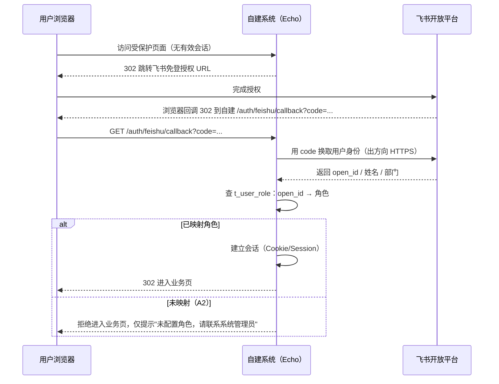

# 采购与费用审批平台（自建侧）· 接口设计

> 结论先行：本系统**只提供自建侧 HTTP 接口**。它与飞书之间**只有 4 个飞书接口 + 1 条长连接**（出方向），**不存在「创建审批实例」接口——这是设计约束，不是遗漏**（见 §9）。
> 所有业务接口默认**飞书免登 + 角色最小权限**；行级过滤 + 列级投影在**服务端**强制执行。
> 凡涉及未定口径（`approval_code`、字段 `id`、行·列权限矩阵）一律**接口不变量、口径走配置**，本文标注「待确认（Qx）」。

| 项 | 内容 |
|---|---|
| 文档名称 | 采购与费用审批平台（自建侧）· 接口设计 |
| 版本 | V1.9 |
| 日期 | 2026-09-26 |
| 上游文档 | `01-PRD.md`、`02-UseCase.md`、`03-TestCase.md`、`04-Architecture.md` |
| 语言纪律 | 简体中文 |

---

## 1. 鉴权与会话

### 1.1 飞书免登回调流程（FR-M0-10 / UC-01）



### 1.2 会话载体

| 项 | 约定 |
|---|---|
| 载体 | **服务端 Session + HttpOnly / Secure / SameSite=Lax Cookie**（不把角色放进前端可读的 JWT payload） |
| 会话内容 | `open_id`、`session_id`、签发时间；**不缓存角色决策**（角色每请求实时解析，保证即时生效 TC-11） |
| 传输 | 全站 HTTPS（FR-M8-07），Cookie `Secure` 强制 |
| 有效期 | 空闲超时 + 绝对超时（具体值属运维配置，非本文硬编码） |
| CSRF | ★ **现状（C-1 澄清）**：代码**未安装 CSRF 中间件**；跨站写操作防护依赖 Cookie `SameSite=Lax` + 同源策略（跨站 POST 不携带会话 Cookie）。**待补**：CSRF 中间件（P2，可随联调并行） |

### 1.3 `open_id → 角色` 解析

| 场景 | 行为 | 对应 |
|---|---|---|
| `open_id` 命中 `t_user_role` 且 `active=1` | 取得角色 + 行级范围令牌 + 列级规则 | TC-10 |
| `open_id` 未映射 | **默认拒绝（deny by default）**，拒绝进入业务页，仅提示 | UC-01/A2、TC-32 |
| `active=0`（停用） | 视为未映射 | — |
| 角色/部门变更 | 下次请求实时生效，无需重登 | TC-11 |

---

## 2. 通用约定

| 项 | 约定 |
|---|---|
| BasePath | 业务接口 `/api`；免登 `/auth`；内部运维 `/internal` 与 `/healthz` `/readyz` |
| 版本 | 首发 `v1` 语义（路径不带版本号，响应头 `X-API-Version: 1`）；重大不兼容变更时再引入 `/api/v2` |
| 响应包裹 | 统一 `{ "code": 0, "data": ..., "message": "ok", "trace_id": "..." }`；`code=0` 表示成功 |
| 分页 | 台账/审计等列表支持**页码分页**（`page`/`page_size`，默认 1/50，上限 200）与**游标分页**（`cursor`，用于大表/导出）；不混用 |
| 时间格式 | 所有时间为 **ISO 8601 UTC**（`2026-09-26T08:30:00Z`）；账期用 `YYYY-MM` |
| 金额 | 出参统一 `*_cents`（整数分）与 `*_display`（字符串）；避免浮点 |
| 幂等头 | 写操作支持 `Idempotency-Key` 请求头（可选）。语义三分支：**同键 + 同载荷 → 200 且返回首次结果**（响应附 `idempotent_replay:true`）；**同键 + 异载荷 → 40900**；未带键 → 不做幂等保护。用于报送登记等易重试写操作 |
| 敏感列 | 列级投影在**序列化阶段**裁剪；无权限字段**不出现在响应 JSON 中**（连字段名都没有） |
| 错误包裹 | 出错时 `code != 0`，`data` 为空，`message` 为可读文案，附 `trace_id` |

### 2.1 错误码表

| HTTP | `code` | 含义 | 典型场景 |
|---|---|---|---|
| 400 | 40000 | 参数校验失败 | 缺参、类型错、金额越界 |
| 401 | 40100 | 未登录 / 会话失效 | 无有效 Cookie（TC-09） |
| 401 | 40101 | 未映射角色 | `open_id` 不在 `t_user_role`（TC-32） |
| 403 | 40300 | 无权限（资源级） | 该角色无该看板/接口权限（TC-06/07） |
| 403 | 40301 | 行级越权 | 按 ID 访问他人/他部门记录（TC-06） |
| 404 | 40400 | 资源不存在 | 实例/台账记录不存在 |
| 409 | 40900 | 冲突 | **幂等键冲突（同一键用于不同请求载荷）**、唯一约束（重复事件写入 / 业务单号重复） |
| 409 | 40901 | 状态不允许该操作 | 向只读同步存档表写入（TC-31）、已提交再改状态 |
| 429 | 42900 | 限流 | 触发速率限制（对应飞书 429 语义的可观测化） |
| 500 | 50000 | 服务器内部错误 | 未预期异常 |
| 503 | 50300 | 服务不可用 / 未就绪 | 自检未过、DB 不可写（TC-28） |

---

## 3. 业务接口

> 「权限要求」列同时给出**角色**与**行级范围**；具体角色-列映射由 `t_permission_rule` 决定（**默认取 PRD §4.2 口径；Q3 已于 2026-09-26 定案**）。
> 所有台账/看板接口**自动施加行·列过滤**，无需前端传权限参数。

### 3.1 鉴权

#### `GET /auth/feishu/callback`

| 项 | 内容 |
|---|---|
| 用途 | 飞书免登回调；用 `code` 换取身份并建立会话 |
| 权限要求 | 公开（免登入口） |
| 请求参数 | Query：`code`（必填）、`state`（必填；登录回调防 CSRF，**这是当前唯一的 CSRF 防护点**） |
| 响应 | `302` 重定向到目标业务页（成功）或登录错误页（失败）；失败不建立会话 |
| 错误码 | 40000（缺 code/state）、40101（未映射角色） |
| 关联 FR | FR-M0-10 |

#### `POST /auth/logout`

| 项 | 内容 |
|---|---|
| 用途 | 注销会话 |
| 权限要求 | 已登录 |
| 请求参数 | 无（★ 当前无 CSRF Token 头，见 §1.2 C-1 澄清） |
| 响应 | `{code:0}` |
| 错误码 | 40100 |
| 关联 FR | FR-M0-10 |

#### `GET /api/me`

| 项 | 内容 |
|---|---|
| 用途 | 返回当前会话身份、角色、可见范围摘要（供前端展示降级） |
| 权限要求 | 已登录 |
| 请求参数 | 无 |
| 响应字段 | `open_id`、`name`、`role`、`departments[]`、`column_policy_summary`（**仅摘要，真拦截在服务端**） |
| 错误码 | 40100、40101 |
| 关联 FR | FR-M0-10、FR-M5-04 |

### 3.2 台账（M4）

#### `GET /api/ledger/{table}`

> ★ **派生台账**：`{table}=L11`（订单执行台账）**不读 `t_ledger_archive` 的 L11 行**，而以 `L04`（合同台账）为骨架、关联 `L07`（到货验收）**查询时派生**。响应含 `derived:true` 与 `source:["L04","L07"]`；派生行**无 `id`**，故不支持 `GET /api/ledger/L11/{id}`（400）与任何写入（40901）。`delay_days` 仅在合同交期与实际到货**都能解析为日期**时出现（缺数据不臆造 0）。

| 项 | 内容 |
|---|---|
| 用途 | 台账列表查询；**自动施加行级过滤 + 列级投影**；返回公式列红标 |
| 权限要求 | 各角色按 `t_permission_rule`；行范围见 §5.2 令牌（申请人 SELF / 主管领导 DEPT / 副总 CHARGE_DEPT / 采购经办人 ASSIGNED / 验收人 PARTICIPATED / 总经理·综合运营主管·系统管理员 ALL） |
| 路径参数 | `{table}`：台账类型语义键（`L01`~`L12`，见架构 §3.4） |
| 请求参数 | `page`、`page_size` 或 `cursor`；筛选：`department`、`biz_no`、`supplier`、`date_from`、`date_to`、`status` |
| 响应字段 | `items[]`：业务单号、部门、金额（若有权）、供应商、日期、`formula_flags{}`（红标：`same_person` / `supplier_month_sum` / `spot_check_range`）、`source`（archive/ops 合并视图）；`total` |
| 错误码 | 40300、40301、40000 |
| 关联 FR | FR-M4-01、FR-M4-04、FR-M4-05、FR-M5-02、FR-M5-03、FR-M7-01 |

#### `GET /api/ledger/{table}/{id}`

| 项 | 内容 |
|---|---|
| 用途 | 单条台账记录查询；**同样施加行·列过滤**（按 ID 直取也过滤，TC-06） |
| 权限要求 | 同列表接口的行范围；越权 → 40301 并留痕 |
| 路径参数 | `{table}`、`{id}` |
| 响应字段 | 单条记录（含 `archive`/`ops` 合并后的可写字段与公式列红标） |
| 错误码 | 40301、40400 |
| 关联 FR | FR-M5-02、FR-M5-03、FR-M7-01 |

#### `PATCH /api/ledger/{table}/{id}`

| 项 | 内容 |
|---|---|
| 用途 | **仅运营表可写字段**的登记/回填（付款凭据号、抽查状态、经办状态、集团侧人工字段等）——★ **Q14 已定案** |
| 权限要求 | ① `t_permission_rule.writable_fields` 限定角色（如综合运营主管、被指定经办人）；`writable_fields` 为空 → 该台账整体只读（**40901**）。② ★ **该台账在 `t_ledger_field_def` 登记过字段定义时，`fields` 的键名必须已在其中**（否则 **40901**）——白名单**逐台账逐步生效**，未登记任何字段的台账仍只按 `writable_fields` 校验（向后兼容） |
| 字段定义来源 | 由 `jxapproval import-config` 的第五类映射 **`ledger_field`** 写入 `t_ledger_field_def`（只开放 `ledger_type` / `field_key` / `is_sensitive` 三项；其余无消费端故不开放）。该表同时是 `SensitiveFields` 的**敏感列清单**来源 |
| 首次引入 | 2026-09-26（docs/06 §K.1 第 4 项 / §K-2） |
| 路径参数 | `{table}`、`{id}` |
| 请求体 | `{ "fields": { "<business_field>": <value> } }`（业务字段名，非控件 id） |
| 响应字段 | 更新后的运营字段 + 审计回执 |
| 错误码 | 40300（无写权/字段不可写）、40901（同步存档表 / 只读台账 / 派生视图 / **字段未在台账字段定义中登记**）、40000 |
| 关联 FR | FR-M1-03、FR-M4-03、FR-M4-09、FR-M6-07 |

> 说明：**同步存档表无写入口**（TC-31）；若 `{table}` 对应纯只读台账（如 `L02` / `L10`）则一律 40901。

### 3.3 看板（M5）

#### `GET /api/dashboard/{id}`

| 项 | 内容 |
|---|---|
| 用途 | 看板指标数据；数据源指向**运营表**（FR-M5-05）；按角色返回过滤后数据 |
| 权限要求 | 各角色按规则表；不属于该角色的看板 → 40300（TC-14/A1） |
| 路径参数 | `{id}`：13 预算执行 / 14 采购执行 / 15 费用结构 / 16 异常预警 |
| 请求参数 | `period`（如 `2026-09`）、筛选维度 |
| 响应字段 | 指标卡与图表序列（见 §4.4）；异常预警面板含红标项（拆分嫌疑、经办超期、紧急未闭合、集团驳回未处置等） |
| 错误码 | 40300、50300（预算看板本期空态**不报错**，返回空序列） |
| 关联 FR | FR-M5-01、FR-M5-05、FR-M5-06、FR-M5-07、FR-M5-08、FR-M5-01（看板 16 异常预警） |

#### `GET /api/dashboard/{id}/export`

| 项 | 内容 |
|---|---|
| 用途 | 看板数据导出；**复用行·列投影器**（禁止绕过列过滤） |
| 权限要求 | 同看板接口；导出行为**留痕** |
| 路径参数 | `{id}` |
| 请求参数 | `period`、`format`（`csv`/`xlsx`） |
| 响应 | 文件流（`Content-Disposition`） |
| 错误码 | 40300、42900 |
| 关联 FR | FR-M7-03、FR-M5-06 |

### 3.4 实例（M2）

#### `GET /api/instances`

| 项 | 内容 |
|---|---|
| 用途 | 实例列表查询；自动施加行·列过滤 |
| 权限要求 | 各角色按规则表行范围 |
| 请求参数 | `approval_code`、`doc_type`、`status`、`department`、`date_from`、`date_to`、分页 |
| 响应字段 | `items[]`：`instance_code`、`approval_code`、`doc_type`、`biz_no`、`status`、`status_raw`、`applicant`、`department`、`amount`（若有权）、`created_at`、`source`（event/reconcile） |
| 错误码 | 40300、40301 |
| 关联 FR | FR-M2-01、FR-M2-03、FR-M2-05、FR-M5-02、FR-M5-03 |

#### `GET /api/instances/{instance_code}`

| 项 | 内容 |
|---|---|
| 用途 | 单实例详情（含当前状态、业务单号归档、`approval_code→doc_type` 映射结果） |
| 权限要求 | 行级过滤（越权 40301，TC-06） |
| 路径参数 | `instance_code` |
| 响应字段 | 实例主记录（见 §4.1） |
| 错误码 | 40301、40400 |
| 关联 FR | FR-M2-01、FR-M2-04、FR-M2-06 |

#### `GET /api/instances/{instance_code}/fields`

| 项 | 内容 |
|---|---|
| 用途 | 实例表单字段（**键值对**，按映射表转业务字段名；未映射字段一并返回但不进业务列） |
| 权限要求 | 行级过滤；敏感字段列级裁剪 |
| 路径参数 | `instance_code` |
| 响应字段 | `fields[]`：`field_id`（**具体值待确认（Q1）**）、`field_name`、`biz_field`（映射结果，未映射为 `null`）、`value`、`value_type` |
| 错误码 | 40301、40400 |
| 关联 FR | FR-M2-02、FR-M2-05 |

> **设计不变量**：字段以键值对返回，**不依赖字段顺序**；模板新增/改名不报错（TC-23）。

#### `GET /api/instances/{instance_code}/timeline`

| 项 | 内容 |
|---|---|
| 用途 | 状态变更史（**含驳回重提完整链条**：首次提交→驳回(含意见)→重提→通过） |
| 权限要求 | 行级过滤 |
| 路径参数 | `instance_code` |
| 响应字段 | `events[]`：`status`、`task_node`、`operator`、`opinion`、`occurred_at`、`event_seq` |
| ★ `task_node` 口径 | **预留未用：本期恒为 `null`**。节点级事件（`approval_task`）本期不订阅（PRD §3.2 **N10** / FR-M2-07 降级），字段保留以免将来启用时改表。**客户端不得依赖该字段非空**；逐审批人轨迹请以飞书审批详情页为准 |
| 错误码 | 40301、40400 |
| 关联 FR | FR-M3-04、FR-M3-05、FR-M7-02 |

### 3.5 报送（M6）

> ★ **本节端点清单已补全**（架构审查 C-2）：除下列端点外，M6 还实现了 `POST /api/submission/{id}/receipt`（登记/补填移交凭证）、`POST /api/submission/{id}/group`（登记集团受理与流程状态）、`POST /api/submission/{id}/reject`（登记集团驳回与处置）—— 三者均落 `t_submission` 的集团侧人工登记字段，并由 `router.go` 注册、前端 `api-m1m6.js` 在用。对应 FR-M6-02 / FR-M6-05 / FR-M6-08。

#### `POST /api/submission`

| 项 | 内容 |
|---|---|
| 用途 | 提交集团登记（含关联单据清单、事项类型、金额、付款方式、湖南侧完成日期） |
| 权限要求 | 综合运营主管（归口核心）；行范围 ALL |
| 请求体 | 见 §4.5；支持 `Idempotency-Key`。★ `biz_no` **必填**（业务唯一键 + 去重锚点；SQLite 列级 `UNIQUE` 对 NULL 不生效，缺省会造成重复登记） |
| 响应字段 | 新建 `submission.id`、`submit_state`（无凭证 → 未提交）；幂等复用额外含 `idempotent_replay: true` |
| 错误码 | 40300、40000（缺 `biz_no` / 事项类型 / 日期格式 / 非法状态 / **无凭证登记「未提交」以外的状态**）、40900（同键异载荷的幂等冲突 / 业务单号重复） |
| 关联 FR | FR-M6-01、FR-M6-02、FR-M6-05；3 个工作日内提交（FR-M6-03） |

#### `GET /api/submission`

| 项 | 内容 |
|---|---|
| 用途 | 报送记录列表 / 月度「已提交未付款」对账清单 |
| 权限要求 | 综合运营主管（ALL）；项目总经理（ALL，只读） |
| 请求参数 | `state`（未提交/已提交/办理中/已付款/已驳回）、`period`、`overdue`（是否超期）、分页 |
| 响应字段 | 列表（见 §4.5）；`overdue` 标记 3 个工作日超期 |
| 错误码 | 40300 |
| 关联 FR | FR-M6-03、FR-M6-04、FR-M6-08 |

#### `GET /api/submission/{id}/package`

> ★ **包内容**（B39 缺口② 补全）：`报送登记.json` · `关联单据清单.csv` · **`附件清单.csv`** · `移交凭证.txt` · `凭证包说明.txt`。附件清单列出关联单据的附件引用与**入库状态**；文件本体经 `GET /api/attachment/{file_id}` 按需拉取。

| 项 | 内容 |
|---|---|
| 用途 | **报送凭证包导出**（关联单据清单 + 移交凭证 + 湖南侧完成日期 + 付款方式等） |
| 权限要求 | 综合运营主管；导出留痕（TC-26） |
| 路径参数 | `{id}` |
| 请求参数 | `format`（`zip`/`pdf`） |
| 响应 | 文件流（凭证包） |
| 错误码 | 40300、40400 |
| 关联 FR | FR-M6-06、FR-M7-03 |

### 3.6 备付金（M1）

#### `GET /api/petty-cash/balance`

| 项 | 内容 |
|---|---|
| 用途 | 备付金余额**只读**展示（做法 A：综合运营主管审批前查看） |
| 权限要求 | **综合运营主管**（登记岗，读写）+ **主管领导**（只读，做法 A）；项目总经理是否可见列入待确认 Q20（当前**不可见**） |
| 请求参数 | `period`（可空，默认当月） |
| 响应字段 | `issued_cents`、`spent_cents`、`balance_cents`、`as_of` |
| 错误码 | 40300 |
| 关联 FR | FR-M1-04、FR-M1-07 |
| ★ | **无修改入口**；不提供任何写入能力 |

#### `POST /api/petty-cash/receipt`

| 项 | 内容 |
|---|---|
| 用途 | 备付金签领登记（签领人 / 金额 / 日期），关联采购报备单 |
| 权限要求 | 综合运营主管（登记岗） |
| 请求体 | `biz_no`（关联 BA，**待确认（Q1）** 复核）、`receiver_open_id`、`receiver_name`、`amount_cents`、`received_date` |
| 响应字段 | 新建 `receipt.id` |
| 错误码 | 40300、40000 |
| 关联 FR | FR-M1-01、FR-M1-05 |

#### `POST /api/petty-cash/monthly-close`

| 项 | 内容 |
|---|---|
| 用途 | 备付金月核销（按月登记签领、支出与核销后余额） |
| 权限要求 | 综合运营主管 |
| 请求体 | `period`（`YYYY-MM`）、`issued_cents`、`spent_cents`、`balance_cents`、`remark` |
| 响应字段 | 核销记录（唯一一个账期一条） |
| 错误码 | 40300、40000、40900（该账期已核销） |
| 关联 FR | FR-M1-07 |

### 3.7 审计（M7）

#### `GET /api/audit/logs`

| 项 | 内容 |
|---|---|
| 用途 | 审计日志查询（操作日志 + 状态变更史 + 越权留痕 + 导出留痕） |
| 权限要求 | **系统管理员**（ALL，只读）+ **项目总经理**（只读）；其余角色默认拒绝（Q3 已定案） |
| 请求参数 | `actor`、`role`、`action`、`resource`、`result`（allow/deny）、`date_from`、`date_to`、分页 |
| 响应字段 | `items[]`：`actor_open_id`、`actor_role`、`action`、`resource`、`target_id`、`result`、`feishu_log_id`、`created_at` |
| 错误码 | 40300 |
| 关联 FR | FR-M7-01、FR-M7-02、FR-M7-03、FR-M7-04 |

### 3.8 内部运维端点（★ 需管理凭据，非飞书免登）

> 与业务接口**不同鉴权域**：走 `JX_INTERNAL_TOKEN`（Header `X-Internal-Token`）或仅绑定内网/本机；**不参与飞书免登**。

#### `GET /healthz`

| 项 | 内容 |
|---|---|
| 用途 | 存活探针：进程存活 + 启动自检四项快照（订阅 / 长连接 / DB 可写 / 单实例） |
| 权限要求 | 管理凭据或内网 |
| 响应字段 | `{alive:true, checks:{subscribe, longconn, db_writable, single_instance}, version}` |
| 关联 FR | FR-M8-02、FR-M0-05 |

#### `GET /readyz`

| 项 | 内容 |
|---|---|
| 用途 | 就绪探针：是否可以接收并处理事件 |
| 权限要求 | 管理凭据或内网 |
| 响应字段 | 自检四项 + `worker_queue_depth`、`deadletter_total`、`last_reconcile{missing,filled}`、各 `approval_code` 订阅状态 |
| 错误码 | 50300（未就绪） |
| 关联 FR | FR-M8-02、FR-M1-05（自检四项可查） |

#### `POST /internal/sync/reconcile`

| 项 | 内容 |
|---|---|
| 用途 | 手动触发对账补拉（批量取实例 ID → 求差 → 取实例详情补录） |
| 权限要求 | 管理凭据 |
| 请求体 | `{ "approval_code": "…(可选，默认全部，待确认（Q1）)", "from": "…", "to": "…" }`（可空 → 使用默认时间窗） |
| 响应字段 | `{ "missing": N, "filled": M }` |
| 关联 FR | FR-M0-07、FR-M0-08 |
| 备注 | 幂等；不属轮询（TC-05、TC-25） |

#### `POST /internal/sync/subscribe`

| 项 | 内容 |
|---|---|
| 用途 | 手动（重）订阅审批事件（逐个 `approval_code`） |
| 权限要求 | 管理凭据 |
| 请求体 | `{ "approval_codes": ["…(待确认（Q1）)"] }`（可空 → 全部） |
| 响应字段 | 各 `approval_code` 的订阅结果 |
| 关联 FR | FR-M0-03、FR-M0-04 |

#### `POST /internal/events/{id}/replay`

| 项 | 内容 |
|---|---|
| 用途 | 人工重放死信事件（复用原 payload 重投 worker） |
| 权限要求 | 管理凭据 |
| 路径参数 | `{id}`：`t_deadletter.id`（或 `t_event_inbox.id`） |
| 响应字段 | 重放结果 + `replay_count` |
| 关联 FR | FR-M3-07 |
| 备注 | 重放仍走幂等键（TC-30） |

---

### 3.9 系统管理（M5，★ 仅「系统管理员」角色）

> 供管理员**自助配置行·列权限**（FR-M5-09~11）。**任何写操作均写 `t_audit_log`（改前 / 改后 diff）**。
> 非「系统管理员」调用 → `40300`（资源级无权限），并留痕。**本组接口不涉及任何审批流转。**

#### `GET /api/admin/permission-rules`

| 项 | 内容 |
|---|---|
| 用途 | 读取「角色 × 资源」权限矩阵（`row_scope`、`column_allow` / `column_deny`、`writable_fields`、`effective_from`） |
| 权限要求 | 系统管理员 |
| 响应字段 | `items[]`（同 `t_permission_rule` 行）＋ `resources[]`（可选资源枚举：`ledger:*` / `dashboard:1..4` / `api:*`）＋ `roles[]`（角色枚举）＋ `row_scopes[]`（6 令牌 + `DENY` 的语义说明，供前端下拉） |
| 错误码 | 40300 |
| 关联 FR | FR-M5-09 |

#### `PUT /api/admin/permission-rules`

| 项 | 内容 |
|---|---|
| 用途 | **批量保存**权限矩阵（按 `resource × role` 覆盖）；保存后**立即 `Invalidate()` 清缓存** → 即时生效 |
| 权限要求 | 系统管理员 |
| 请求体 | `{rules:[{resource, role, row_scope, column_allow[], column_deny[], writable_fields[]}]}` |
| 校验 | `row_scope` 必须 ∈ {`SELF`,`DEPT`,`CHARGE_DEPT`,`ALL`,`ASSIGNED`,`PARTICIPATED`,`DENY`}；**不接受条件表达式**（Q3 定案） |
| 响应字段 | `{saved:n, effective:"immediate"}` |
| 错误码 | 40000（令牌非法）、40300 |
| 关联 FR | FR-M5-09、FR-M5-11 |

#### `GET /api/admin/users` · `POST /api/admin/users` · `PATCH /api/admin/users/{open_id}`

| 项 | 内容 |
|---|---|
| 用途 | 人员角色管理：列出 / 新增 / 修改 `t_user_role`（角色、部门、分管部门、启用停用） |
| 权限要求 | 系统管理员 |
| 请求 / 响应字段 | `open_id`、`name`、`role`、`department`、`extra_depts[]`、`active` |
| 错误码 | 40000、40300、40400（`open_id` 不存在） |
| 关联 FR | FR-M5-10、FR-M5-11 |
| 备注 | 停用 / 改角色后**下一次请求即时生效**（每请求实时解析角色，不缓存决策，TC-11） |

### 3.10 集团报销跟踪（M1）

> ★ 口径：报销**不进入本办法审批流程**（五条前提第 ④ 条：报销类可提前支出、公户转账一律走集团），
> 由人工走集团。本资源只承接「关联事前申请单号 → 初审 → 移交集团 → 集团付款」的**审批外登记**，
> 供台账（L06 集团提交与付款衔接台账）与看板引用。与 §3.5 报送（`t_submission`）是**两条独立业务**：
> 报送 = 湖南侧流程完成后的对外报送（含移交凭证 / 集团受理 / 驳回处置）；报销跟踪 = 报销类事前申请的单独跟踪（票据张数 / 初审状态 / 超支说明）。
>
> ★ 与 §3.5 / §3.6 同口径：**不进行·列权限矩阵**，只由处理器显式校验角色（避免「矩阵可配、处理器更严」的假配置，README 定案 #10）。

#### `POST /api/reimbursement`

| 项 | 内容 |
|---|---|
| 用途 | 集团报销跟踪登记（人工） |
| 权限要求 | 综合运营主管（登记岗） |
| 请求体 | ★ `src_biz_no` **必填**（关联事前申请单号，业务关联键）、`applicant_open_id`、`department`、`actual_cents`（**必须为正整数**）、`invoice_count`（≥0）、`review_state`、`handover_date`（`YYYY-MM-DD`） |
| 响应字段 | `id`、`src_biz_no`、`actual_cents`、`amount_display` |
| 错误码 | 40300、40000（缺 `src_biz_no` / 金额非正 / 票据张数为负 / 状态非法 / 日期格式） |
| 关联 FR | FR-M1-02 |
| 备注 | `review_state` 枚举：待初审 / 初审通过 / 初审退回 / 已移交集团 / 集团已付款（空 = 未填） |

#### `GET /api/reimbursement`

| 项 | 内容 |
|---|---|
| 用途 | 集团报销跟踪列表（分页） |
| 权限要求 | 综合运营主管 / 主管领导 / 项目总经理 / 系统管理员（**只读**，服务端二次校验） |
| 请求参数 | 筛选：`src_biz_no`、`department`、`review_state`；分页 `page` / `page_size`（上限 200） |
| 响应字段 | `items[]`：`id`、`src_biz_no`、`applicant`、`department`、`actual_cents`+`amount_display`、`invoice_count`、`review_state`、`handover_date`、`paid_date`、`paid_cents`+`paid_display`、`overrun_note`、`source`（恒为 `人工登记`）、`created_at` |
| 错误码 | 40300 |
| 关联 FR | FR-M1-02 |

#### `PATCH /api/reimbursement/{id}`

| 项 | 内容 |
|---|---|
| 用途 | 更新报销跟踪记录（集团侧付款字段人工登记） |
| 权限要求 | 综合运营主管 |
| 请求体 | 至少一项：`review_state`、`handover_date`、`paid_date`、`paid_cents`、`overrun_note`（**指针语义**：未提供 = 不改动，可传空串清空文本字段） |
| 响应字段 | `{id, updated:true}` |
| 错误码 | 40300、40000（未提供任何字段 / 状态非法 / 日期格式 / 金额为负）、40400（记录不存在） |
| 关联 FR | FR-M1-02 |
| ★ | 集团侧字段**只接受人工传入值，不做任何派生或回填**（与 FR-M6-07 同源口径） |

### 3.11 变更链回溯（M4）

### 3.12 附件（M0 / FR-M0-09 · B39 最小集）

> ★ **只做下载**：模式 A 下本系统**不创建实例**，附件由申请人在飞书侧上传 → 本节只提供
> 「按引用取回」，**不提供上传**（原上传方法属模式 B 遗留，已从接口移除）。

#### `GET /api/instances/{code}/attachments`

| 项 | 内容 |
|---|---|
| 用途 | 列出该实例的附件**元数据**（**不拉取文件本体**，不触发任何飞书调用） |
| 权限 | `api:instances` + 行级（以 `t_instance` 判定；谓词别名 `a`） |
| 响应字段 | `items[]`：`file_id`/`instance_code`/`biz_no`/`field_id`/`file_name`/`size_bytes`/`fetched`/`storage_kind`/`fetched_at` |
| 错误码 | 40300（无权限/越权）、40301、40000 |

#### `GET /api/attachment/{file_id}`

| 项 | 内容 |
|---|---|
| 用途 | **下载附件**：主存命中直接返回；未命中**回源拉取** → 落主存 → 回填，再返回 |
| 权限 | 同 `api:instances`；**行级以「附件所属实例」为准**（不冗余身份列，避免两处不同步） |
| 响应 | `200` + `application/octet-stream`（`Content-Disposition` 用 `filename*=UTF-8''` 转义）+ `nosniff` |
| 错误码 | **404**（附件未登记/不存在 —— 无法判定归属时**一律拒绝**：附件是"内容"而非"计数"，越权后果更重）、40300/40301、50200 |
| 降级 | 未配置对象存储（`JX_S3_*` 与 `JX_ATTACH_DIR` 均空）时**不缓存、每次回源**（链路仍可用、日志有痕迹），**不是静默丢功能** |

> ★ **对象存储装配**（ADR-08）：`JX_S3_*` 齐备 → **S3 主存**（手写 SigV4，零新增依赖）；`JX_RUSTFS_*` 齐备 → 与其组成 **主备双写**（写双写、读优先主存并回退备份）；只配 `JX_ATTACH_DIR` → 本地落盘；全空 → 降级直通。


#### `GET /api/contract/{biz_no}/changes`

| 项 | 内容 |
|---|---|
| 用途 | 按**合同号**回溯历次变更：**次数 / 累计变更金额 / 所取档位**（制度第五十二条） |
| 权限要求 | 沿用台账口径：以资源 `ledger:L09`（例外事项台账）解析行·列规则；无权限 → 40300 且留痕 |
| 行级 / 列级 | 行级过滤在 **SQL 层**（`RowFilter`），列级投影在**序列化层**（`Project`）；越权行不返回、无权列连字段名都不出现 |
| 响应字段 | `contract_no`、`count`、`cumulative_change_cents`+`cumulative_change_display`、`amount_hidden`、`items[]`：`biz_no`、`instance_code`、`department`、`biz_date`、`change_cents`+`change_display`、`original_cents`+`original_display`、`tier`、`archive` |
| 错误码 | 40000（合同号为空）、40300 |
| 关联 FR | FR-M4-07 |
| ★ 档位口径 | 变更审批档位 = **max（变更差额, 原合同金额）**（批复 A8，化整为零通道已关闭）。显式存了 `tier` 就用存的；否则按 max 现算并标注「max 取档 → …」 |
| ★ 匹配方式 | 变更单指向原合同的 **JSON 键名尚未定稿（Q14）**，故匹配做成**键名无关的精确值比较**：`json_each(ext_json)` 展开对象后对**任意键的值**做等值比较（**绝不使用 `LIKE`**，防止 `ou_ab` 命中 `ou_abc` 式前缀越权，见 docs/06 §H.10 P0-A）；脏 JSON 由 `json_valid` 守卫，不使整条查询失败（同 §H.10 P0-B） |
| 备注 | `ext_json` 键名候选：变更差额 `change_cents`/`change_amount_cents`/`delta_cents`；原合同金额 `original_cents`/`contract_cents`；档位 `tier`/`approval_tier`/`档位`。定稿后收敛为单键 |

---

## 4. 数据契约（关键对象 JSON 结构）

> 所有时间为 ISO 8601 UTC；金额同时给 `*_cents` 与 `*_display`。

### 4.1 实例（Instance）

```json
{
  "instance_code": "字符串（飞书实例 ID）",
  "approval_code": "字符串（映射前，具体值待确认（Q1））",
  "doc_type": "BA|PR|SA|RFQ|BJ|SS|CT|PC|GR|QC|SUB",
  "biz_no": "PR-2609-0001",
  "biz_no_parts": { "prefix": "PR", "yymm": "2609", "seq": "0001" },
  "status": "APPROVED",
  "status_raw": "APPROVED",
  "applicant": { "open_id": "ou_xxx", "name": "张三", "department": "生产部" },
  "amount_cents": 480000,
  "amount_display": "4,800.00",
  "purpose": { "class_l1": "生产采购", "class_l2": "备品备件" },
  "supplier": "某某五金",
  "source": "event",
  "created_at": "2026-09-26T08:30:00Z",
  "updated_at": "2026-09-26T09:10:00Z"
}
```

### 4.2 表单字段键值对（InstanceField）

```json
{
  "fields": [
    { "field_id": "控件id（待确认（Q1））", "field_name": "预估总金额", "biz_field": "estimated_amount", "value": "4800.00", "value_type": "number" },
    { "field_id": "控件id（待确认（Q1））", "field_name": "指定采购经办人", "biz_field": "assigned_handler", "value": "ou_yyy", "value_type": "user" },
    { "field_id": "新增控件（未映射）", "field_name": "新字段", "biz_field": null, "value": "…", "value_type": "text" }
  ]
}
```

> 不变量：**键值对、无序、可新增**；`biz_field=null` 表示尚未配置映射（Q1），历史数据不报错。

### 4.3 台账行（LedgerRow，存档 + 运营合并视图）

```json
{
  "id": 1024,
  "ledger_type": "L03",
  "biz_no": "PR-2609-0001",
  "department": "生产部",
  "applicant": "ou_xxx",
  "supplier": "某某五金",
  "amount_cents": 480000,
  "amount_display": "4,800.00",
  "biz_date": "2026-09-10",
  "archive": { "指定经办人": "ou_yyy", "指定人": "ou_zzz", "指定时间": "2026-09-10T...", "档位": "采二档" },
  "ops": { "经办状态": "进行中", "完成日期": null, "是否按期": "是" },
  "formula_flags": {
    "same_person": false,
    "supplier_month_sum": { "supplier": "某某五金", "month": "2026-09", "sum_cents": 130000, "over_threshold": true },
    "spot_check_range": false
  }
}
```

> `archive` / `ops` 的具体键**口径属约定**（Q14 待定）：`ops` 的键名不受系统约束（写接口只按 `writable_fields` 白名单校验，见 §3.7）；`t_ledger_field_def` 当前**无写入通道**、仅承载 `is_sensitive` 敏感列清单（docs/06 §J.5 **B27**）。无权限列被**移除**（不出现在 JSON）。

### 4.4 看板指标（Dashboard）

```json
{
  "id": 14,
  "name": "采购执行看板",
  "period": "2026-09",
  "cards": [
    { "key": "in_flight_orders", "label": "在途订单数", "value": 12 },
    { "key": "avg_cycle_days", "label": "平均采购周期", "value": 6.3 }
  ],
  "charts": [
    { "key": "monthly_amount_trend", "type": "line", "series": [ { "x": "2026-07", "y": 1280000 } ] },
    { "key": "top_supplier_month", "type": "bar", "series": [ { "x": "某某五金", "y": 130000 } ] }
  ],
  "supervision": {
    "requester_as_handler_count": 0,
    "handler_concentration": [ { "handler": "ou_yyy", "ratio": 0.42 } ]
  },
  "alerts": [
    { "key": "split_suspect", "level": "warn", "count": 2 },
    { "key": "emergency_unclosed_over_24h", "level": "warn", "count": 1 }
  ]
}
```

> 数据源必须指向**运营表**，否则 `avg_cycle_days`、`handler_concentration` 等为空（FR-M5-05 / TC-24）。

### 4.5 报送记录（Submission）

```json
{
  "id": 88,
  "biz_no": "SUB-2609-0003",
  "subject_type": "公户付款",
  "amount_cents": 480000,
  "amount_display": "4,800.00",
  "pay_method": "对公直付",
  "hn_finish_date": "2026-09-20",
  "submit_date": "2026-09-23",
  "receipt_ref": "签收记录/移交凭证号",
  "submit_state": "已提交",
  "items": [
    { "item_biz_no": "PR-2609-0001", "item_type": "PR" },
    { "item_biz_no": "CT-2609-0001", "item_type": "CT" },
    { "item_biz_no": "GR-2609-0001", "item_type": "GR" }
  ],
  "group": { "accept_no": null, "state": null, "paid_date": null },
  "overdue": false
}
```

> `receipt_ref` 为空 → `submit_state` 强制为「未提交」（FR-M6-02 / TC-15）；`group.*` 为**人工登记**、不回填。

---

## 5. 权限在接口层的落地

| 环节 | 位置 | 说明 |
|---|---|---|
| 资源鉴权 | 中间件 + 规则表 | 角色对某接口/看板无权限 → 40300（TC-14/A1） |
| 行级过滤 | Store 层 SQL | 按 `row_scope` 令牌拼 `WHERE`；按 ID 直取也过滤 → 40301（TC-06） |
| 列级投影 | 序列化层 | `column_deny` 优先；无权限字段不出现在 JSON（TC-07） |
| 写权限 | 规则表 `writable_fields` | 仅运营表可写字段；同步存档字段 → 40901（TC-31） |
| 留痕 | audit | `deny` 与 `export` 均写审计 |

> **口径不在本文硬编码**：以上规则的具体角色-列对应关系由 `t_permission_rule` 数据行提供，**默认取 PRD §4.2 建议值；Q3 定案后仅改数据**。

---

## 6. 飞书侧接口（**实际调用 4 个，出方向**）

> 以下路径**抄自输入文件**（README / 技术方案书 §6.1），不自造。

| 用途 | 接口 | 方向 / 计费 |
|---|---|---|
| 订阅审批事件 | `POST /open-apis/approval/v4/approvals/:approval_code/subscribe` | 出方向；审批 API（计入） |
| 取实例详情 | `GET /open-apis/approval/v4/instances/:instance_id` | 出方向；计入 |
| 批量取实例 ID（对账） | `GET /open-apis/approval/v4/instances` | 出方向；计入 |
| 附件下载 | `GET`（飞书附件下载接口） | 出方向；计入 |
| ~~附件上传~~ | ~~`POST /open-apis/approval/openapi/v2/file/upload`~~ | ★ **本期不调用**：模式 A 下本系统**不创建实例**，附件由申请人在飞书侧上传 → 上传链路属模式 B 遗留、**零调用点**（FR-M0-09 / 实现说明 §M.3）。**接口能力仍在飞书侧，只是本系统不用** |
| 事件接收 | 长连接 WebSocket：**只订阅 `approval_instance`** | 出方向；**事件订阅不计入调用量**。★ `approval_task` **本期不订阅**（PRD §3.2 N10） |

- **设计纪律**：**用事件订阅，绝不轮询**（FR-M0-12 / TC-25）。
- ★ **只订阅 `approval_instance`**：`approval_task`（节点级）本期不订阅 —— 订阅了却无处理逻辑，等于凭空增加事件量与失败面。**逐模板订阅**时只开 `approval_instance`。
- 调用量目标：**数百次/月量级**（FR-M0-08）。
- `approval_code` 具体值：**待确认（Q1）**。

---

## 7. 状态与枚举契约

| 类别 | 取值 |
|---|---|
| 实例状态（飞书原始） | `PENDING` / `APPROVED` / `REJECTED` / `CANCELED` / `DELETED` / `REVERTED` / `OVERTIME_CLOSE` / `OVERTIME_RECOVER` |
| 节点级事件（approval_task） | `TRANSFERRED` / `ROLLBACK` / `DONE` —— ★ **本期不接收、不落库**（PRD §3.2 N10 / FR-M2-07 降级）；此处仅登记飞书侧取值域备用 |
| 本地状态收敛 | 与飞书状态一一映射并保留历史（终态不被中间态覆盖，FR-M3-04） |
| 单据类型 | `BA` / `PR` / `SA` / `RFQ` / `BJ` / `SS` / `CT` / `PC` / `GR` / `QC` / `SUB`（PO 沿用 `CT`，Q6） |
| 报送状态 | 未提交 / 已提交 / 办理中 / 已付款 / 已驳回 |
| 角色 | 申请人 / 主管领导 / 项目总经理 / 副总 / 综合运营主管 / 采购经办人 / 验收人 / 系统管理员（**采购岗、财务岗、出纳已取消，不得出现**） |
| 档位 | 采一档 `<1,000` / 采二档 `1,000–5,000`（含端点于低档）/ 采三档 `>5,000` |

---

## 8. 幂等与重试约定（接口侧）

| 场景 | 约定 |
|---|---|
| 事件接收（内部） | 幂等键 = **事件级唯一 ID**（2.0 版 `header.event_id` / 1.0 版 `uuid`，见架构 §4.3）；重复 → 200 直接返回，不新增。★ **不用 `instance_code + status`**（会吞掉驳回重提的第二次 PENDING） |
| 报送登记 | 支持 `Idempotency-Key` 头。**载荷指纹 = 规范化业务字段的 SHA-256**（业务单号 / 事项类型 / 金额 / 付款方式 / 湖南侧完成日期 / 提交日期 / 移交凭证号 / 状态 / 关联单据集合；**关联项按「单号:类型」排序后参与指纹，顺序不敏感**；「未传金额」与「传 0」视为不同载荷）。① **同键 + 同指纹 → 200 复用首次结果**（响应附 `idempotent_replay:true`，不重复落库）；② **同键 + 异指纹 → 40900**；③ 历史无指纹的键按**保守冲突**（40900）处理。★ 携带键但**业务单号重复** → 40900（唯一键路径，与幂等无关） |
| 台账写（PATCH） | 天然幂等（按业务单号 UPSERT 运营字段）；重复提交同值不产生副作用 |
| 对账补录 | 幂等 UPSERT，`source=reconcile` |

---

## 9. 明确不存在的接口（★ 设计约束，非遗漏）

| 不存在 | 原因 | 依据 |
|---|---|---|
| **创建审批实例的接口 / 调用路径** | 发起入口为**飞书原生发起**（模式 A）；自建系统不参与审批流转，**不调「创建审批实例」** | README 硬约束 7；PRD N2 / FR-M0-11；技术方案书 §0 / §3.1；TC-25 |
| 审批同意 / 驳回 / 转交 / 撤销接口 | 审批动作全部在飞书原生审批引擎内完成 | PRD N1 / §3.1 |
| 审批流实时预警 / 事前硬校验拦截接口 | 甲案下无法在发起时拦截，只做台账红标 + 只读提示 | PRD §8.1 / N5；UC-02 |
| 集团侧数据回传 / 对齐接口 | 集团侧全人工、**不回传**；湖南侧止于「提交集团」 | PRD N3 / FR-M6-07；UC-12 |
| 发票验真接口 | 本期不做 | PRD N8 |
| **`approval_task` 节点级事件订阅** | **本期不做**：`inbox` 只订阅 `approval_instance`；节点轨迹的权威来源在**飞书审批详情页**，本系统再存一份是冗余副本。★ 这条**不是遗漏**——`t_status_history.task_node` 列保留但恒为 `null` | PRD **N10** / FR-M2-07（降级）；实现说明 §M.2 |
| 定时轮询审批状态的接口 / 任务 | 设计纪律：**用事件订阅，绝不轮询** | README 硬约束 7；FR-M0-12 |

> **不存在上述接口是刻意的架构选择**：本系统是审批引擎的**旁路**，任何会让它"参与/影响审批流转"的能力都不提供。这条同时是 G1（自建系统故障不影响审批）的实现前提。

---

## 10. 接口 → FR 追溯

| 接口 | 关联 FR |
|---|---|
| `GET /auth/feishu/callback`、`POST /auth/logout`、`GET /api/me` | FR-M0-10、FR-M5-04 |
| `GET /api/ledger/{table}`、`GET /api/ledger/{table}/{id}`、`PATCH /api/ledger/{table}/{id}` | FR-M4-01/03/04/05/09、FR-M5-02/03、FR-M7-01 |
| `GET /api/dashboard/{id}`、`/export` | FR-M5-01/05/06/07/08、FR-M7-03 |
| `GET /api/instances`、`/fields`、`/{code}`、`/{code}/timeline` | FR-M2-01~06、FR-M3-04/05、FR-M7-02；**FR-M2-07 本期降级**（`task_node` 预留未用，PRD N10） |
| `POST /api/submission`、`GET /api/submission`、`/package` | FR-M6-01~08、FR-M7-03 |
| `GET /api/petty-cash/balance`、`POST /receipt`、`/monthly-close` | FR-M1-01/04/05/07 |
| `POST /api/reimbursement`、`GET /api/reimbursement`、`PATCH /api/reimbursement/{id}` | FR-M1-02 |
| `GET /api/contract/{biz_no}/changes` | FR-M4-07 |
| `GET /api/audit/logs` | FR-M7-01~04 |
| `GET /healthz`、`/readyz` | FR-M8-02、FR-M0-04/05 |
| `POST /internal/sync/reconcile` | FR-M0-07、FR-M0-08 |
| `POST /internal/sync/subscribe` | FR-M0-03、FR-M0-04 |
| `POST /internal/events/{id}/replay` | FR-M3-07 |

---

## 11. 待确认事项对本接口文档的影响

| 编号 | 事项 | 影响接口 | 当前处理 |
|---|---|---|---|
| Q1 | `approval_code` 清单 + 字段 `id` 映射 | `GET /api/instances*`（`approval_code`、`field_id` 取值）、`POST /internal/sync/subscribe` | 一律「待确认（Q1）」，走配置 |
| ~~Q3~~ | 行·列权限矩阵 | 全部业务接口的权限列 | ★ **已定案（2026-09-26）**：默认取 PRD §4.2 口径；新增 §3.9 系统管理接口（`/api/admin/*`）供管理员自助配置 |
| Q6 | PO 是否独立单据 | `GET /api/ledger/L11`（订单执行台账数据源） | 按技术方案书 r1：PO 沿用 CT 号 |
| Q7 | `####` 是否按月重置 | `biz_no_parts.seq` 语义 | 归档只读，不生成 |
| Q8 | 代理人名单 | 角色解析 / 行范围 | 未实现代理模型，待定 |
| ~~Q14~~ | 运营表字段清单 + 登记责任人 | `PATCH /api/ledger/...` 的 `fields`、`ops` 键；`t_permission_rule.writable_fields`；`t_ledger_field_def` | ★ **已闭合（2026-09-26）**：可写范围与责任人＝纯配置；字段定义已补写入通道（映射 `ledger_field`）并成为写接口键名白名单。详见 docs/06 §K |

---

## 12. 变更记录

| 版本 | 日期 | 变更 | 作者 |
|---|---|---|---|
| V1.9 | 2026-09-27 | **B38/B39 降级标注落地（纯文档，零代码）**：① §3.4 `/{code}/timeline` 响应字段 **`task_node` 标注「预留未用，本期恒为 `null`」**；② §6 事件接收行标注**只订阅 `approval_instance`**（`approval_task` 本期不接收）；③ ★ **§6 飞书接口清单修正** —— 原「附件**上传** / 下载」并称「仅 4 个」→ 拆为「**附件下载**（实用）」与「~~附件上传~~（**本期不调用**，模式 A 零调用点）」，标题改「**实际调用 4 个**」；④ §7 节点级事件行标注**本期不落库**；⑤ §9「明确不存在的接口」新增 **`approval_task` 节点级事件订阅**一行；⑥ §10 FR 追溯表 FR-M2-07 标注**降级**。对应 PRD §3.2 **N10** 与实现说明 §M.2 / §M.3。 | 交付总监 |
| V1.8 | 2026-09-27 | **对象存储接入 + 凭证包含附件**：① §3.12 补「对象存储装配」（S3 主存手写 SigV4 / RustFS 主备双写 / 本地兜底 / 全空降级）；② §3.5 凭证包补「包内容」含 **`附件清单.csv`**（B39 缺口②：否则集团收到的是只有清单没有文件的空包）。 | 交付总监 |
| V1.7 | 2026-09-27 | **附件（B39）**：新增 **§3.12 附件** —— `GET /api/instances/{code}/attachments`（元数据列表）与 `GET /api/attachment/{file_id}`（**按需拉取 + 主存缓存**；行级以**所属实例**为准；未登记 file_id → 404）。★ 明确**不提供上传**：模式 A 下附件由申请人在飞书侧上传，本系统只做接收。 | 交付总监 |
| V1.6 | 2026-09-26 | **架构完整性审查轮**：① §3.5 补登已实现但未文档化的三个端点（`/receipt` `/group` `/reject`，C-2）；② §1.2 澄清 **CSRF 现状**——代码未装 CSRF 中间件，跨站防护依赖 `SameSite=Lax` + 同源（C-1），不再声称已实现；③ 台账列表补 L11 派生视图说明（A-1 关联）。 | 交付总监 |
| V1.5 | 2026-09-26 | **Q14 定案实施轮**：§3.7 增「字段定义来源 / 键名白名单（40901）」；§3.6 台账列表补 **L11 派生视图**语义（`derived:true`、无写入口、不支持按 id 读）；§11 Q14 行改为**已闭合**。 | 交付总监 |
| V1.4 | 2026-09-26 | **据实修正 Q14 相关的三处表述（B27）**：原写「`archive` / `ops` 的具体键由 `t_ledger_field_def` 决定」，核查后发现**该表无写入通道、也无读取消费端**（`UpsertLedgerFieldDef` / `ListLedgerFieldDefs` 均零调用者，仅 `SensitiveFields` 被台账列表/详情/变更链使用）。改为：① §3.7 增「字段名校验」行，明确只按 `writable_fields` 白名单校验、**不校验字段定义**，键名口径属**约定**；② §3.7 权限行补「`writable_fields` 为空 → 整体只读（40901）」；③ §4.3 注记与 §11 Q14 行按实情改写。**同时修正头部版本号**（原停留在 V1.0，而变更记录已到 V1.3）。 | 交付总监 |
| V1.3 | 2026-09-26 | **补齐两处缺口 + 一处口径硬化**：① §3.5 报送请求体标注 **`biz_no` 必填**（B20；SQLite 列级 `UNIQUE` 对 NULL 不生效，缺省会重复登记）；② 新增 **§3.10 集团报销跟踪（M1，FR-M1-02）** 与 **§3.11 变更链回溯（M4，FR-M4-07）**；③ §10 FR 追溯表补两行。 | 交付总监 |
| V1.2 | 2026-09-26 | **幂等语义澄清（消除 B15 自相矛盾）**：§2.2 幂等头、§2.1 错误码 `40900`、§3.5 报送错误码、§8 报送登记四处统一为「**同键同载荷 → 200 复用首次结果；同键异载荷 → 40900**」，并写明载荷指纹构成（含关联项顺序不敏感、「未传金额」≠「传 0」）。对应实现 `internal/submission/idem.go`、TC-36 / TC-37。 | 交付总监 |
| V1.1 | 2026-09-26 | **Q3 定案**：新增 **§3.9 系统管理（M5）** —— `GET/PUT /api/admin/permission-rules`、`GET/POST/PATCH /api/admin/users`；更新 §3 前言与 §11 Q3 行。 | 交付总监 |
| V1.0 | 2026-09-26 | 首版。鉴权与会话、通用约定与错误码表、分模块业务接口、数据契约、幂等约定、飞书 4 接口、**明确不存在的接口**、FR 追溯与待确认影响。 | Bob（架构师） |
