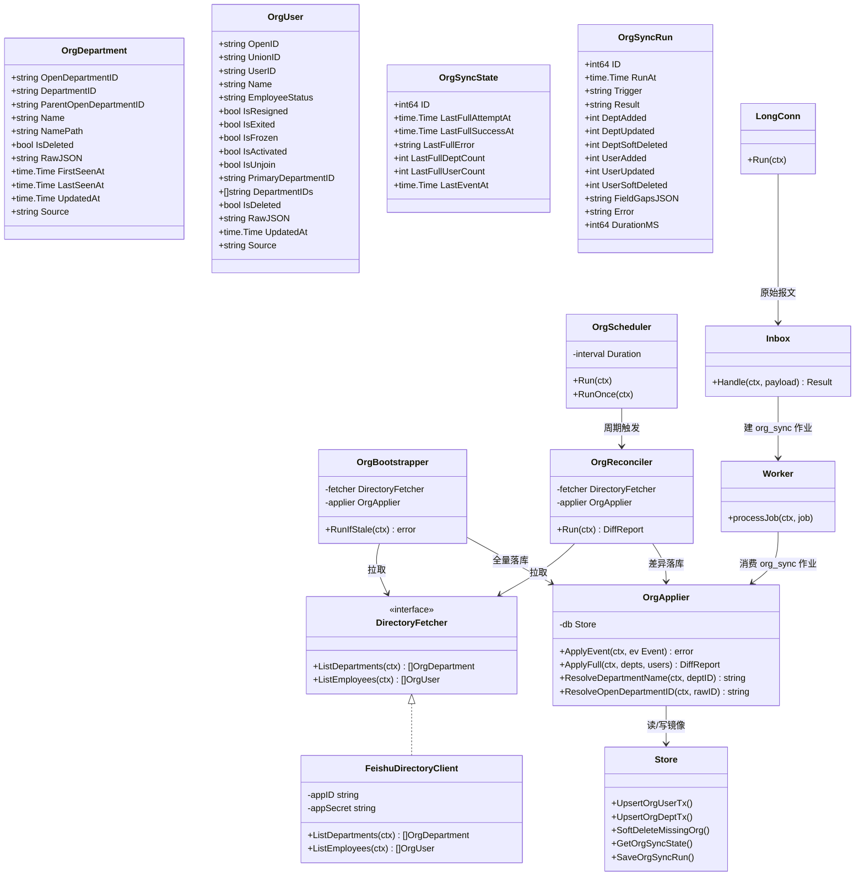
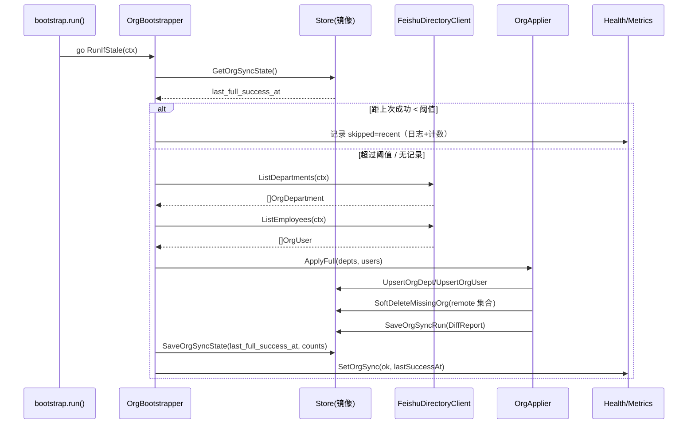
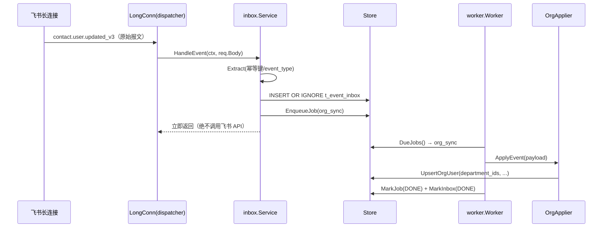
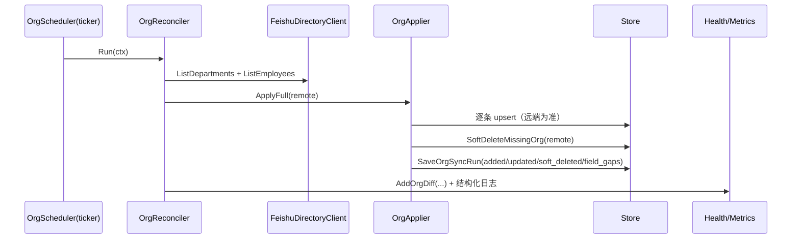
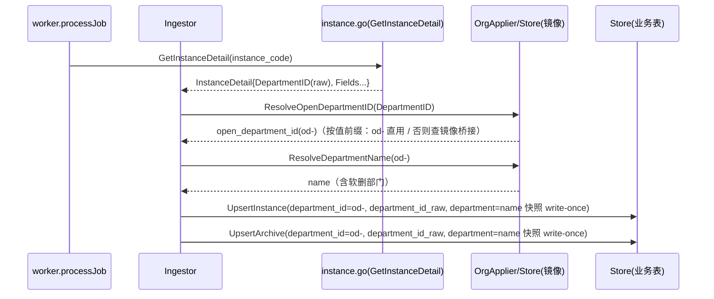
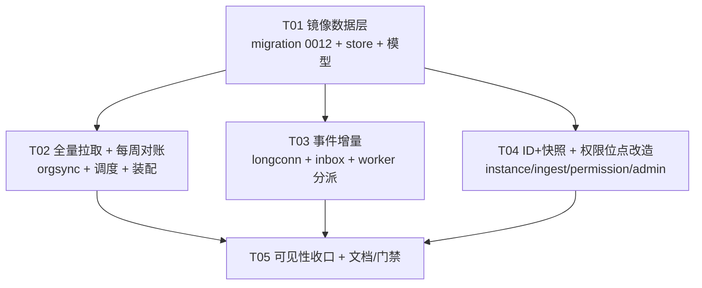

# 飞书人员与部门同步设计方案（通讯录镜像）

> **定位**：本文是「模式 A（审批跑在飞书原生引擎、自建侧只读接收）」下**新增的一块只读镜像能力**：
> 让自建侧拥有一份**本地的人员目录 / 部门目录**，用于**显示姓名与部门、算行级范围**，
> 并把审批记录里的「人 / 部门」从**易变的名称**改为**稳定的 ID + 名称快照**。
> **本文只做设计，不含实现代码、不新增 migration、不改业务代码**；migration 与实现由后续任务落地。
>
> **一句话红线**：**镜像 ≠ 权限**。同步来的通讯录是「人事目录」，**准入一律仍走 `t_user_role`（人工配置、deny by default）**。
>
> **版本**：V1.8 · **状态**：待评审（§5 的 **C-A~C-E** 已按**官方来源 + SDK v3.12.0 源码**查实；**C-A 经复核改定路线甲**；**V1.3 回填 D6「提交时实时回源」**，见 §2 注 / §4.12；**V1.4 迁移改号 `0007` → `0012`**，见 §4.2 注 / §12；★ **V1.5 行号引用符号化**（`README` 定案 **#74**）—— 全文「`文件:行`」改为「**`文件` ＋ 符号/模式**」，**行号只作快照**；**V1.6 按 team-lead 裁定**：`S12` 补「只管实例侧」、`§6 订正 1` 标「后被取代」；**V1.7 缺口闭合后翻面**（`engineer-glm` 交 **`cc753c4`**：`t_ledger_archive.department` 补 write-once，`S13` 落地）；**V1.8 史实留痕加前向指针**（`V1.6`/`V1.5` 两行，定案 **#73**）） · **依仓库现状（2026-09-27 代码基线）撰写**

---

## 0. 适用与不适用

| 项 | 结论 |
|---|---|
| 适用 | 应用启动全量拉通讯录、订阅人员/部门变动事件增量更新、每周全量对账修正、软删只增不减、审批记录关联 ID + 保留名称快照 |
| 不适用 | 用通讯录数据自动发放系统角色（**结构性禁止**，见 §4.10）；数据出境合规评估（用户已明确「不用管」，本文不作为阻塞项） |
| 不改 | 现有审批链路（订阅审批事件 → inbox → worker 拉详情 → 落库 → 台账/看板）的既有语义 |

---

## 1. 背景与既有约束（基于真实代码，不是描述）

| # | 既有事实 | 出处（文件 · 符号；★ 行号只作快照，以符号为准 —— `README` 定案 #74） |
|---|---|---|
| 1 | 长连接用 **`dispatcher.NewEventDispatcher` + `OnCustomizedEvent(键, handler)` 注册原始报文**，handler 内只调 `sink.HandleEvent(ctx, req.Body)` | `internal/platform/feishu/longconn.go` 的 `LongConn.Run`（`dispatcher.NewEventDispatcher` → `OnCustomizedEvent` → `sink.HandleEvent`） |
| 2 | 审批事件同时注册了 **v2.0 与 legacy 两种键名**（`approval.instance.status_changed_v4` … 与 `approval_instance`/`approval_task`） | `internal/platform/feishu/longconn.go` 的 `retiredApprovalEventTypes`（★ ③ 下这些键**仍注册、但处理器 no-op**，**不进** `sinkEventTypes`） |
| 3 | inbox 同步极短路径：解析幂等键 → `INSERT OR IGNORE` 写 `t_event_inbox` + 落一条 `fetch_detail` 作业 → 立即返回 | `internal/inbox/inbox.go` 的 `Service.Handle` |
| 4 | 幂等键：2.0 版 `header.event_id`；1.0 版顶层 `uuid`；取不到则 **拒绝入库并告警** | `internal/inbox/idempotent.go` 的 `Extract` |
| 5 | worker 轮询 `t_worker_job`，`processJob` **写死「拉实例详情」**，缺 `instance_code` 即失败 | `internal/worker/pool.go` 的 `Worker.processJob` |
| 6 | worker 已具备**指数退避 + 死信 + 人工重放**（`maxAttempts=5`） | `internal/worker/pool.go` 的 `Worker.handleFailure`（`maxAttempts`） |
| 7 | 已有**定时对账**：`sync.Scheduler` 用 `time.Ticker`（默认 24h，`JX_RECONCILE_INTERVAL_HOURS`），启动即跑一次；游标持久化在 `t_sync_cursor` | `internal/sync/scheduler.go` 的 `NewScheduler`（`time.Ticker`）、`internal/sync/cursor.go`、`internal/config/env.go` 的 `JX_RECONCILE_INTERVAL_HOURS` |
| 8 | `t_sync_cursor` 主键 `UNIQUE(approval_code, cursor_kind)` | `migrations/0001_init.sql` 的 `t_sync_cursor` 表定义 |
| 9 | 行级 `DEPT`/`CHARGE_DEPT` **按 `department` 列(=名称/文本) 与 `t_user_role.department`/`extra_depts` 做 `IN` 比对** | `internal/permission/dataset.go` 的 `ScopeDept` / `ScopeChargeDept` 分支（台账与报送各一对） |
| 10 | 身份里的部门来自 `t_user_role`（`SELECT … WHERE open_id=? AND active=1`） | `internal/httpapi/helpers.go` 的 `identityFrom`（`permission.Identity{…}`）、`internal/store/repo_permission.go` 的 `GetUserRole` |
| 11 | `t_instance.department` **来自表单控件值**；`applicant_open_id` 来自实例自带字段 | `internal/worker/extract.go` 的 `case config.BizFieldDepartment`、`internal/platform/feishu/instance.go` 的 `ApplicantOpenID` 赋值 |
| 12 | 实例详情**已反序列化 `department_id`（发起人部门 ID）但全库从未使用** | `internal/platform/feishu/instance.go` 的 `DepartmentID` 字段（仅解析、无消费端） |
| 13 | `t_instance.department` / `t_ledger_archive.department` **UPSERT 的覆盖语义** ★ **复核（#74/#73）**：**两侧均已 write-once** —— `t_instance` 侧 `#46` 落地、`t_ledger_archive` 侧 **`cc753c4`** 落地（两侧同形 `COALESCE(NULLIF(t_xxx.department,''), excluded.department)`）⇒ **均不再被非空后续值覆盖** | `internal/store/repo_instance.go` 的 `upsertInstance`、`internal/store/repo_ledger.go` 的 `upsertArchive` |
| 14 | 准入解析只读 `t_user_role`；未映射/停用 → `ErrRoleNotMapped`（deny by default） | `internal/access/auth.go` 的 `ResolveRole`、`internal/store/repo_permission.go` 的 `GetUserRole` |
| 15 | `/healthz` 暴露 `Checks()`；`/readyz` 的 `ready` = 四项自检 **AND** | `internal/httpapi/handlers_ops.go` 的 `handleHealthz` / `handleReadyz`、`internal/observ/health.go` 的 `Health.Checks` / `Health.Ready` |
| 16 | 单实例部署（长连接集群不广播，禁止多副本），启动即抢 `singlelock`，失败拒绝启动 | `cmd/jxapproval/bootstrap.go` 的 `singlelock.New(...)` + `Acquire()` |
| 17 | 迁移按文件名升序执行；**`0001`–`0010` 已落地**；本文 `org_directory` 迁移占用的序号＝ **`0012`**（★ `0011` 已由 `0011_flow_op_log_round.sql` 占用；原设计号 `0007` 与已落地的 `0007_approval_core.sql` 撞号，见 §12「编号变更」） | `internal/store/migrate.go`、`migrations/` |

---

## 2. 五条口径 → 设计落点（逐条对齐）

| 口径（用户已拍板） | 设计落点 | 触发时机 |
|---|---|---|
| ① 启动时一次性拉取全部人员与部门 | 新增 `internal/orgsync` 启动全量（异步 goroutine）；**距上次成功同步超阈值才拉**（避免每次重启打一波） | 进程启动后异步 |
| ② 订阅部门与人员变动事件，增量更新 | **同一个 dispatcher** 多注册通讯录事件键；inbox 按 `event_type` 分派到新作业类型；worker 消费落镜像 | 事件到达即时 |
| ③ 本地定期（如每周）全量拉取与本地对比修正 | 新增周调度（复用 `ticker` 模式）；产出**可见**差异报告 | 每周（可配） |
| ④ 人员/部门被删除，本地**只增不减**（软删） | 镜像表 `is_deleted` 标记；**删除事件**与**全量缺失**两条路径统一为同一软删动作；软删行**仍参与 ID→名称解析** | 删除事件 / 每周对账 |
| ⑤ 审批信息关联 ID，保留发生当时的「人/部门」关系 | `t_instance` / `t_ledger_archive` / `t_submission` 增 **ID 列**（**一律 `open_department_id`(`od-`)**；由实例自带 `department_id` 经**镜像桥接**得出，§5-C-A/§5.4）+ **名称快照**（write-once）；行级过滤改**按 ID 比对、名称兜底** | 入库（Ingest）时解析并冻结 |

> ★ **D6 补充（提交时点强校验，2026-09-27 回填）**：口径 ①～⑤ 解决的是「日常同步」的收敛（启动 / 事件 / 每周，均为**异步、可能滞后**）；**用户第三轮 D6 另加「提交时点」的实时校验**（详见 **§4.12**）：**提交时实时调飞书一次**、校验申请人当前**部门 / 在职**；**超时或失败 ＝ 告警放行 + 落「不一致」标记、不阻断提交**（`01a §4.2` / FR-M9-17）。★ 本条**修正**了"提交页不做实时比对、接受镜像滞后"的旧口径（`01a` C3 已被 D6 推翻）。

---

## 3. 技术事实与来源（一级 / 二级 / 待确认 标注）

> **来源分级**：**一级**＝飞书开放平台官方文档页（域名 `open.feishu.cn`）/ 官方 FAQ；
> **二级**＝社区/博客等二手转述；**待确认**＝无一手来源，必须实测（见 §5）。

| # | 事实 | 级别 | 出处 |
|---|---|---|---|
| F1 | **没有「一次拿全组织」接口**，必须「先枚举部门 → 再按部门取人」；**根部门 ID = `0`** | 一级 | 开放平台 FAQ（通讯录拉取） |
| F2 | 推荐 **`directory/v1/*`**（枚举型 `filter`，`page_size` ≤ **100**）：`POST /open-apis/directory/v1/departments/filter`、`.../employees/filter`；另有 `.../departments/mget`、`.../employees/mget` | 一级 | 开放平台《获取部门列表（filter）》等 |
| F3 | 备选 **`contact/v3/*`**（需递归，`page_size` ≤ **50**）：`GET /open-apis/contact/v3/departments`、`GET /open-apis/contact/v3/users/find_by_department`、`GET /open-apis/contact/v3/users/batch`（**单次 ≤ 50 个 user_ids**） | 一级 | 开放平台《获取部门信息列表》等 |
| F4 | 频控：两族均 **1000 次/分钟、50 次/秒** | 一级 | 开放平台频控说明 |
| F5 | **通讯录 API 与事件订阅不占「1 万次/月」套餐额度**（官方公告原文：「基础 API 和独立付费的接口不计入 API 用量统计，如…事件订阅、通讯录、飞书人事…」） | 一级 | 开放平台《接口调用量统计说明》 |
| F6 | 调用量估算（100 人 / 15 部门）：`directory/v1` 约 **2 次**；`contact/v3` 递归约 **16 次** | 一级推算 | 结合 F1/F2/F3 |
| F7 | 人员在职/离职字段：`status{is_resigned,is_exited,is_frozen,is_activated,is_unjoin}` | 一级 | 开放平台《用户身份信息》 |
| F8 | 六个事件（均 `schema:"2.0"`）：`contact.user.created_v3` / `contact.user.updated_v3` / `contact.user.deleted_v3` / `contact.department.created_v3` / `contact.department.updated_v3` / `contact.department.deleted_v3`；`updated`/`deleted` 带 **`old_object`（改前）**；`deleted.old_object` 仅含 `open_id` + `department_ids` | 一级 | 开放平台通讯录事件页 |
| F9 | 人员事件部门字段是 **`department_ids`（`string[]`，元素为 `od-` 前缀 `open_department_id`）**，**≠** 实例详情里单个的 `department_id` | 一级 | 开放平台事件字段说明 |
| F10 | **订正**：员工状态变更是 **v1.0** 事件 `user_status_change`（`event.type="user_status_change"`）；**不存在** `contact.user.status_changed_v3`。`contact.scope.updated_v3`（**通讯录权限范围变更**）存在 | 一级 | 官方《user status changed》/ 通讯录事件列表（§5-C-D） |
| F11 | 长连接**只支持企业自建应用**、每应用**≤ 50 连接**、**集群模式不广播**（多客户端仅随机一个收到） | 一级 | 开放平台长连接说明 |
| F12 | 通讯录 6 个事件页的「事件订阅示例代码」区**同时提供「使用长连接接收事件」（`larkws`）与「推送到开发者服务器」两个 tab** → **支持长连接** | 一级 | 开放平台事件页示例区 |
| F13 | 实例详情含 `open_id`、`user_id`、**`department_id`（发起人所属部门 ID）**、`serial_number`、`form`、`task_list`、`comment_list`；**无姓名字段**。★ `department_id` 的 **ID 类型官方未标注**（无 `department_id_type` 可切），**不得当作 `open_department_id` 直接关联**（§5-C-A） | 一级 | 开放平台《获取单个审批实例详情》 |
| F14 | SDK 版本：`github.com/larksuite/oapi-sdk-go/v3 v3.12.0`（间接含 `gorilla/websocket v1.5.0`）→ **无需新增依赖** | 一级 | `go.mod:7`、`go.mod:15` |
| F15 | 二级来源称「`object.department_ids` 实际无返回值、要用 `old_object.department_ids`」，一级页折叠未证 | **二级** | 需实测（§5-C2） |
| F16 | `directory/v1/*`：**`required_fields` 必填**（「不传则不会返回任何字段」）；**`page_request` 必填**，`page_size` **最大 100**（错误码 `2220010`）、**默认值未查到**；分页靠 `page_token`；**响应体未列 `total`**；**`department_id_type` 默认 `open_department_id`**、`employee_id_type` 默认 `open_id`；权限名＝「调用 API 获取部门列表」/「调用 API 获取员工列表」 | 一级 + 未查到 | 官方《获取部门列表》/《批量获取员工列表》/《字段枚举》（§5-C-C） |
| F17 | 部门 ID 分两种：`department_id`（**可自定义**，示例 `h121921`，**不得以 `od-` 开头**）与 `open_department_id`（**前缀固定 `od-`**，租户内全局唯一）——**两者不是同一空间** | 一级 | 官方《部门资源介绍》「部门 ID」节（§5-C-A） |
| F18 | 创建审批实例的 `department_id` 入参「**需填写 `department_id` 类型的部门 ID**」「不支持填写根部门」 | 一级 | 官方《创建审批实例》（§5-C-A） |
| F19 | SDK dispatcher 按 **`header.event_type`(2.0) / `event.type`(1.0)** 精确匹配；**未注册键**：长连接回 **500 → 重试 4 次后丢弃**、Webhook 回 200 不重试；**不支持通配** | 一级（SDK 源码） | `oapi-sdk-go/v3@v3.12.0`：`event/dispatcher/dispatcher.go`、`ws/client_message.go`（§5-C-B） |
| F20 | 部门控件 `value[].open_id` 返回的是 **`open_department_id`（`od-xxx`）**，**不是名称** | 一级 | 官方《获取单个审批实例详情》控件值说明（§5-C-A） |
| F21 | 部门实体**同时**含两套 ID：`department_id`（**可变自定义**，可用《Update DepartmentID》修改）与 `open_department_id`（**系统生成、不可编辑、全局唯一**）；**《批量获取部门信息》同一对象同时返回两套**；`directory/v1`《字段枚举》**只列 `department_id`**（单次仅给一套） | 一级 | 官方《部门资源介绍》/《批量获取部门信息》/《Update DepartmentID》/《字段枚举》（§5-C-A） |
| F22 | 官方**明确建议**：「不要永久存储 `department_id`」「推荐使用不可编辑的 `open_department_id`」 | 一级 | 官方公告《Department ID and City ID updates…》（§5-C-A 证据 4） |

---

## 4. 系统设计

### 4.1 实现路径与取舍

| 设计点 | 采用方案 | 理由 | 代价 |
|---|---|---|---|
| 传输 | **沿用现有长连接**，同一 dispatcher 多注册通讯录事件键 | 长连接已被官方文档证实支持通讯录事件（F12）；符合仓库纪律「新增依赖需先经用户同意」——**零新增依赖**（F14） | 长连接不广播 → 通讯录事件同样**只能单实例收**（与既有 `singlelock` 一致） |
| handler 风格 | **沿用 `OnCustomizedEvent` 原始报文**，不切 SDK 强类型 handler | 与既有审批事件风格一致（§1-1）；原始报文保真，字段演进时无编译期耦合；解析放在异步 worker | 需自己解析字段（已有 `jsonutil` 可复用）；强类型 handler 能省解析但会**把 SDK 事件结构固化进代码**，飞书改字段即编译失败/静默丢字段 |
| 拉取接口 | **首选 `directory/v1/*`**，`contact/v3/*` 作为兜底 | `directory/v1` 调用量小（约 2 次 vs 16 次，F6）、枚举型无需自己递归、配额不计费（F5） | `required_fields`/`page_request` **必填**、`department_id_type` 默认 `open_department_id`（§5-C-C） |
| **部门 ID 口径（路线甲）** | **镜像双 ID 列**：`open_department_id`（`od-`，稳定 PK）＋ `department_id`（可变二级键）；关联/权限**一律用 `open_department_id`**；实例 `department_id` 经**镜像桥接**解析（§5.4） | 部门实体**一次查询同时返回两套 ID**（F21）；官方**建议使用不可编辑的 `open_department_id`**（F22） | `department_id` 可被修改 → 镜像该列须**每次全量刷新**、**入库即时桥接冻结**（§5.4） |
| 增量通道 | inbox 按 `event_type` **分派新作业类型 `org_sync`** | **不得**把通讯录事件塞进 `fetch_detail`（会因无 `instance_code` 而必然失败入死信，§1-5） | `processJob` 增加分支 |
| 镜像表 | **独立 `t_org_department` / `t_org_user` / `t_org_sync_state` / `t_org_sync_run`** | 与 `t_user_role`（权限表）**物理隔离**，从表结构上保证「镜像 ≠ 权限」（§4.10） | 4 张新表 |
| 同步元信息 | **新建 `t_org_sync_state`**，**不复用 `t_sync_cursor`** | `t_sync_cursor` 主键是 `(approval_code, cursor_kind)`，通讯录无 `approval_code`；硬塞哨兵值（如 `__org__`）是「假配置」式隐患 | 多一张单行表 |
| 部门权限 | **ID 比对为主 + 名称兜底**（双列并存） | 部门改名后按名称比对会**静默失效**（权限漏放或漏收，§1-9） | 需给 `t_user_role` 增 ID 列并改权限引擎（§4.9） |

### 4.2 表设计（草案，**不落库**；由任务 T01 落为 `0012_org_directory.sql`）

> ★ **编号变更（2026-09-27，team-lead 裁定）**：本节 `org_directory` 迁移**原设计号为 `0007`**，但 `0007` 已被**已落地**的 `0007_approval_core.sql` 占用 → **本设计改用 `0012_org_directory.sql`**（`0008`–`0010` 亦已落地；`0011` 归 `t_flow_op_log` 轮次去重）。★ 口径：**已落地编号不可回退，未落地设计让号**。登记见 `15-Code-Collision-Register.md` §2 行 11。
>
> 命名沿用仓库 `t_*` 前缀与 `*_at` ISO8601 UTC 约定；所有时间列文本存储（与既有表一致）。

**`t_org_department`（部门镜像）**

| 列 | 类型 | 约束 | 说明 |
|---|---|---|---|
| `open_department_id` | TEXT | **PK** | `od-` 前缀；**系统生成、不可编辑**；**根部门 = `0`**（F1） |
| `department_id` | TEXT | | **可变自定义 ID（桥接键）**：由《批量获取部门信息》与 `open_department_id` 一并返回（F21）；**可被飞书改名**（F22）→ 每次全量刷新；判定按「值前缀」不按字段名（§5-C-A 证据 5） |
| `parent_open_department_id` | TEXT | | 上级部门 ID；根为 `0` |
| `name` | TEXT | | 部门当前名称（来自飞书，可随后续同步更新） |
| `name_path` | TEXT | | 全路径（`A/B/C`，派生，供展示/检索；可空） |
| `is_deleted` | INTEGER | NOT NULL DEFAULT 0 | **软删标记**（0 在用 / 1 已删）——**只增不减**落此列 |
| `raw_json` | TEXT | NOT NULL DEFAULT '{}' | 原始报文保真 |
| `first_seen_at` | TEXT | NOT NULL | 首次进入本地时刻 |
| `last_seen_at` | TEXT | NOT NULL | 最近一次在「全量拉取」中被观测到的时刻 |
| `updated_at` | TEXT | NOT NULL | 最近一次被事件/全量更新时刻 |
| `source` | TEXT | NOT NULL | `bootstrap` / `event` / `full` |

**`t_org_user`（人员镜像）**

| 列 | 类型 | 约束 | 说明 |
|---|---|---|---|
| `open_id` | TEXT | **PK** | 飞书 `open_id` |
| `union_id` | TEXT | | 飞书 `union_id`（跨应用稳定；可空） |
| `user_id` | TEXT | | 飞书 `user_id`（可空） |
| `name` | TEXT | | 姓名（**展示用**，可更名） |
| `employee_status` | TEXT | | 归一后的在职态（`在职`/`离职`/`冻结`/`未激活`/`未入职`） |
| `is_resigned` | INTEGER | NOT NULL DEFAULT 0 | 离职（F7） |
| `is_exited` | INTEGER | NOT NULL DEFAULT 0 | 退出（F7） |
| `is_frozen` | INTEGER | NOT NULL DEFAULT 0 | 冻结（F7） |
| `is_activated` | INTEGER | NOT NULL DEFAULT 0 | 激活（F7） |
| `is_unjoin` | INTEGER | NOT NULL DEFAULT 0 | 未入职（F7） |
| `primary_department_id` | TEXT | | 主部门 `open_department_id`（取 `department_ids` 首项或目录接口给出者） |
| `department_ids` | TEXT | NOT NULL DEFAULT '[]' | **关系数组**（JSON 串，元素为 `od-`，见 F9） |
| `is_deleted` | INTEGER | NOT NULL DEFAULT 0 | **软删标记**（离职/删除事件/全量缺失统一置 1） |
| `raw_json` | TEXT | NOT NULL DEFAULT '{}' | 原始报文保真 |
| `first_seen_at` | TEXT | NOT NULL | 首次进入本地时刻 |
| `last_seen_at` | TEXT | NOT NULL | 最近一次在「全量拉取」中被观测时刻 |
| `updated_at` | TEXT | NOT NULL | 最近更新时刻 |
| `source` | TEXT | NOT NULL | `bootstrap` / `event` / `full` |

**索引（草案）**

| 索引 | 目标 | 用途 |
|---|---|---|
| `ux_org_dept_pk` | `t_org_department(open_department_id)` | 主键 |
| `idx_org_dept_custom_id` | `t_org_department(department_id)` | **桥接**：实例 `department_id` → `open_department_id` |
| `idx_org_dept_parent` | `t_org_department(parent_open_department_id)` | 树上溯 |
| `idx_org_dept_deleted` | `t_org_department(is_deleted)` | 软删筛选 |
| `ux_org_user_pk` | `t_org_user(open_id)` | 主键 |
| `idx_org_user_primary_dept` | `t_org_user(primary_department_id)` | 按部门列人 |
| `idx_org_user_deleted` | `t_org_user(is_deleted)` | 软删筛选 |

> ★ `department_ids` **不做** `UNIQUE`、**不建 JSON 索引**：它是关系数组，检索靠应用层解析（与既有 `ext_json` 检索策略一致，避免 `json_each` 误用）。

**`t_org_sync_state`（单行同步状态）**

| 列 | 类型 | 约束 | 说明 |
|---|---|---|---|
| `id` | INTEGER | **PK, CHECK(id=1)** | 单行 |
| `last_full_attempt_at` | TEXT | | 上次全量尝试时刻 |
| `last_full_success_at` | TEXT | | **上次全量成功时刻**（启动阈值判据） |
| `last_full_error` | TEXT | | 上次全量失败原因（成功则清空） |
| `last_full_dept_count` | INTEGER | DEFAULT 0 | 上次全量部门条数 |
| `last_full_user_count` | INTEGER | DEFAULT 0 | 上次全量人员条数 |
| `last_event_at` | TEXT | | 最近一次通讯录事件落库时刻 |
| `updated_at` | TEXT | NOT NULL | 本行最近更新时刻 |

**`t_org_sync_run`（全量运行流水，append，供「差异报告可见」）**

| 列 | 类型 | 约束 | 说明 |
|---|---|---|---|
| `id` | INTEGER | **PK AUTOINCREMENT** | |
| `run_at` | TEXT | NOT NULL | 本次运行时刻 |
| `trigger` | TEXT | NOT NULL | `startup` / `weekly` / `manual` |
| `result` | TEXT | NOT NULL | `ok` / `failed` |
| `dept_added` | INTEGER | DEFAULT 0 | 新增部门 |
| `dept_updated` | INTEGER | DEFAULT 0 | 名称/父级变化 |
| `dept_soft_deleted` | INTEGER | DEFAULT 0 | 被判定删除的部门 |
| `user_added` | INTEGER | DEFAULT 0 | 新增人员 |
| `user_updated` | INTEGER | DEFAULT 0 | 属性/部门变化 |
| `user_soft_deleted` | INTEGER | DEFAULT 0 | 被判定离职/删除的人员 |
| `field_gaps_json` | TEXT | DEFAULT '{}' | **字段覆盖缺口**（如 `name` 空、`department_ids` 空 的条数）——静默防护用 |
| `error` | TEXT | | 失败原因 |
| `duration_ms` | INTEGER | DEFAULT 0 | 耗时 |

> ★ 保留策略：`t_org_sync_run` 仅保留最近 N 条（如 90），由任务清理，避免无界增长（与 `t_audit_log` 的归档策略同思路）。

### 4.3 数据模型与接口（类图）

> ★ 关键结构约束：`OrgApplier` **只依赖 `Store` 的镜像方法**，**不依赖 `t_user_role` / `permission` / `access`**（§4.10）。
> `ResolveDepartmentName` **无视 `is_deleted`**（软删部门仍能解析历史单据的部门名，口径④）。

### 4.4 程序调用流（时序图）

**流程 A：启动全量（异步、不阻塞 `/readyz`）**

**流程 B：事件增量（即时）**

**流程 C：每周对账**

**流程 D：入库时解析 ID + 名称快照**

---

### 4.5 设计点 2：启动全量

| 子问题 | 决策 | 理由 | 代价 |
|---|---|---|---|
| 触发条件 | **距 `last_full_success_at` 超过阈值（默认 24h，可配 `JX_ORG_SYNC_STALE_HOURS`）才拉**；无记录则拉 | 避免「每次重启打一波全量」；与 `sync.Scheduler` 启动即跑一次的行为不同（那是审批对账，量小） | 首次部署必然拉一次（预期） |
| 执行方式 | `bootstrap.go` 里 **`go orgBootstrapper.RunIfStale(ctx)`**，**绝不阻塞 `run()`** | `/readyz` 的四项自检不包含通讯录；通信录拉取**不得**进入就绪判据 | 全量失败时应用仍就绪（这是**要的**，见下） |
| 失败可见 | 失败 → `log.Error`（含 `trigger`/`error`）+ `metrics.IncOrgSyncFailure()` + `t_org_sync_run(result=failed)` + `t_org_sync_state.last_full_error` + `/healthz` 暴露 `org_sync.last_error` | 本项目反复栽在「静默无数据」；**不得静默** | 需要新增一个健康暴露字段（非就绪判据） |
| 与单实例锁 | 全量前**不额外加锁**：进程内已有全局 `singlelock`（`cmd/jxapproval/bootstrap.go` 的 `singlelock.New(...).Acquire()`）+ 长连接单连接 | 多副本已被结构性禁止（ADR-01），重复拉取不可能发生 | 无 |
| 就绪判据 | **不加入 `Health.Ready()`** | 若加入：飞书瞬时故障 → `ready=false` → systemd/探针可能重启应用，**把一个外部依赖故障放大成本地宕机** | 需在 `/readyz` body 里单列 `org_sync` 字段（非门禁）供观测 |

> ★ **不要**把通讯录全量放进 `store.Migrate` 之前/之内：镜像表由 `0012` 建，全量必须在迁移完成后、且**异步**执行。

### 4.6 设计点 3：事件增量

**（a）要注册的事件键（已按 §5-C-B/C-D 定稿）**

| 事件键 | 信封 | 用途 | 是否必订 |
|---|---|---|---|
| `contact.user.created_v3` | 2.0 | 员工入职 | 是 |
| `contact.user.updated_v3` | 2.0 | 员工信息修改（**官方明确含「所属部门」**，F9） | 是 |
| `contact.user.deleted_v3` | 2.0 | 员工离职/删除 | 是 |
| `contact.department.created_v3` | 2.0 | 部门新建 | 是 |
| `contact.department.updated_v3` | 2.0 | 部门改名/换父级 | 是 |
| `contact.department.deleted_v3` | 2.0 | 部门删除 | 是 |
| `contact.scope.updated_v3` | 2.0 | 通讯录权限范围变更（**事件体含 `added.{departments,users}`**，§4.11-D） | 是 |
| `user_status_change` | **1.0** | 员工状态变更（在职↔冻结/离职；**不存在 `_v3` 版**，§5-C-D） | **建议**（口径④需要状态变化及时反映） |

> ★ **（订正）不双拼写、且必须处理一个 1.0 信封事件**：
> 1. **2.0 与 1.0 是同一业务事件的两代**（§5-C-B 证据 1）：同一员工离职，若同时订「通讯录变更 v1.0」与「员工离职 v2.0」，**会收到两份**。故 6 个通讯录事件**只按 2.0（`*_v3`）注册**，**不制造 `user_add`/`dept_add` 等 legacy 兼容键**（「订阅了却不处理＝纯负债」，见 README 定案 #44 的思路）。
> 2. 但 **员工状态变更没有 2.0 版**，只有 v1.0 `user_status_change`（§5-C-D）——**这是本方案唯一需要按 1.0 信封处理的事件**：`event_type` 取自顶层 `event.type`、幂等键取顶层 `uuid`（既有 `idempotent.go` 已同时兼容 `header.event_id` 与 `uuid`，无需改幂等逻辑，仅需把它纳入「已知事件集合」）。
> 3. **真正未注册的键本应用收不到、也无法计数**（dispatcher 精确匹配、无通配，未注册键长连接侧 500→重试 4 次→丢弃）→ 兜底见 §4.11-A「订阅键清单显式登记 ＋ 启动自检」。

**（b）inbox 分派扩展（不改变同步路径纪律）**

| 步骤 | 现状 | 改造 | 理由 |
|---|---|---|---|
| 解析 | `Extract` 取幂等键 + `event_type` | **不变**（2.0 通讯录事件用 `header.event_id`；1.0 `user_status_change` 用顶层 `uuid`——`Extract` 已兼容两者） | 幂等键口径统一（`idempotent.go` 头注释） |
| 判类 | 一律当审批事件 | 按 `event_type` 分派：**`contact.` 前缀 与 `user_status_change`** → `JobTypeOrgSync`；其余 → 现 `JobTypeFetchDetail` | 通讯录事件**无 `instance_code`**，走 `fetch_detail` 必失败入死信（`user_status_change` **不含 `contact.` 前缀**，须显式纳入） |
| 落库 | `INSERT OR IGNORE` + `EnqueueJob` | **不变**（只是 `job_type` 不同） | `t_worker_job` 已有 `UNIQUE(inbox_id, job_type)` |
| 未知 `event_type` | 现无分支 | **计入 `unknown_event_total` + `log.Warn` + 仍落 `t_event_inbox`（不丢报文）** | 静默防护（§4.11-A） |
| 同步路径耗时 | `syncPathWarnThreshold` 1s 告警 | **不变** | 通讯录事件同样必须极短返回 |

> ★ `t_event_inbox.instance_code` 是 `NOT NULL`（`migrations/0001_init.sql` 的 `t_event_inbox.instance_code` 列定义）；通讯录事件填 **空串**（`NOT NULL` 允许空串），worker 分派**先判 `job_type` 再要求 `instance_code`**，避免误报「缺少 instance_code」。

**（c）worker 消费**

| 子问题 | 决策 | 理由 | 代价 |
|---|---|---|---|
| 复用还是新建池 | **复用 `t_worker_job` / `pool.go`**，`processJob` 内按 `job_type` 分支 | 直接继承**退避重试 + 死信 + 人工重放**（§1-6），零新增调度设施 | `processJob` 变大；需保证 `org_sync` 分支**不调用飞书 API**（事件报文已含变更） |
| 增量是否回源 | **默认不回源**：事件报文（`object` / `old_object`）足够更新镜像；缺口由每周全量修正 | 减少 API 调用与失败面；符合「增量走事件、纠偏走全量」 | 若事件字段不全（F15 疑点），增量可能不完整 → **由全量兜底** |
| 幂等 | 依赖 `t_event_inbox.UNIQUE(idem_key)` + 镜像表 UPSERT | 与审批事件同机制 | 无需新增幂等表 |
| 顺序 | 无强顺序假设；**「最后写入者赢」+ 全量兜底** | 通讯录事件非有序保证，且 `updated` 带 `old_object` 便于覆盖 | 极端并发下短暂不一致，全量自愈 |

### 4.7 设计点 4：每周对账

**（a）现有 worker 池有没有定时能力？（Read 代码确认）**

> **结论：没有。** `internal/worker/pool.go` 只有 `time.Ticker` 驱动的**作业轮询**（`loop` → `ProcessDueOnce`），
> **不产生产业**——它只消费 `t_worker_job` 里已到期的行。**定时「发起」任务的能力在 `internal/sync/scheduler.go`**
> （`ticker` + `RunOnce`），且它**只针对审批对账**（`rec.Run`），与 worker 池无关。故通讯录周对账需**新增调度**。

**（b）最简可行调度方案**

| 方案 | 做法 | 取舍 |
|---|---|---|
| **✅ 采用**：新增 `OrgScheduler`（复用 `sync.Scheduler` 的 ticker 模式） | `bootstrap.go` 里 `go orgScheduler.Run(ctx)`；`interval` 来自 `JX_ORG_SYNC_INTERVAL_HOURS`（默认 168） | 与既有 `Scheduler` 同构、易读、零依赖；**不新增持久化调度库** |
| 备选：复用 `sync.Scheduler` | 把 `OrgReconciler` 塞进现有 Scheduler | **拒绝**：会把两类对账的间隔/游标耦合，且 `RunOnce` 签名不同 |
| 备选：cron/外部定时 | systemd timer 调 `/internal/sync/org` | 拒绝：部署已「systemd 单实例」，再加外部定时增加运维面；且进程内 ticker 已足够 |

**（c）差异报告如何产出、如何可见**

| 产出物 | 内容 | 可见位置 |
|---|---|---|
| `t_org_sync_run` 一行 | 本次 `added/updated/soft_deleted/field_gaps` + 耗时 + 结果 | 运维可查（后续加只读接口或直接查库） |
| 结构化日志 | `log.Info("通讯录对账完成", "trigger", ..., "dept_added", ...)` | 日志系统 |
| 指标 | `org_sync_added_total` / `org_sync_updated_total` / `org_sync_soft_deleted_total` / `org_sync_failure_total` | `/readyz` 的 `metrics` |
| 健康页 | `org_sync.last_full_success_at` / `last_error` / `last_diff` | `/healthz`（新增 `org_sync` 段，**非就绪门禁**） |

> ★ 对账**只做 upsert + 软删**，**绝不物理删除**（口径④）；也**绝不**因为「本地有、远端无」而删除历史单据上的引用（软删即可，见 §4.8）。

### 4.8 设计点 5：软删

| 来源 | 动作 | 统一落点 |
|---|---|---|
| `contact.user.deleted_v3` / `contact.department.deleted_v3` | 置 `is_deleted=1`；**保留全部字段**（尤其 `name`、`department_ids`） | 镜像表 `is_deleted` 列 |
| 每周全量对账「本地有、远端无」 | 同上置 `is_deleted=1` | 同一列 |
| 全量对账「远端有、本地有」 | 置 `is_deleted=0`（**复活**）并更新属性 | 同一列 |
| 全量对账「远端有、本地无」 | 新增行（`is_deleted=0`） | — |

**「已软删的人/部门仍必须能用于历史单据显示」如何保证**

| 环节 | 保证方式 |
|---|---|
| 历史单据的部门名 | **入库时已写名称快照**（§4.9，write-once）→ **不依赖镜像**即可显示 |
| 只有 ID 需反查名称时 | `ResolveDepartmentName` / `ResolveUserName` **不按 `is_deleted` 过滤**（镜像行保留） |
| 行级过滤 | 软删**不影响**已落库的历史行（过滤按行上快照的 ID/名比对，不联镜像表求 `is_deleted`） |

> ★ 纪律：**镜像表的软删只影响「目录列表/选择器」的展示集合，不影响「历史解析」**。两者用不同查询（前者过滤 `is_deleted=0`，后者不过滤）。

### 4.9 设计点 6：ID + 快照（口径⑤）与**受影响位点清单**

**（a）数据模型改动（草案列）**

| 表 | 新增列 | 含义 | 快照语义 |
|---|---|---|---|
| `t_instance` | `department_id TEXT` | 发起人部门 **`open_department_id`（`od-`，稳定）**：由**实例自带 `department_id`**（`internal/platform/feishu/instance.go` 的 `DepartmentID`）经**镜像 `department_id→open_department_id` 映射桥接**得到（§5-C-A/§5.4） | 不可变（write-once） |
| `t_instance` | `department_id_raw TEXT` | 实例自带 `department_id` **原样留痕**（用于桥接与审计；值可能是 `od-` 也可能是自定义 ID，判定按「**值前缀**」见 §5-C-A 证据 5） | 不可变 |
| `t_instance` | `department`（既有列） | 部门**名称快照**（按上面的 `od-` 经镜像解析） | **write-once ✅**（`#46` 已落地，见 §4.9-b） |
| `t_ledger_archive` | `department_id TEXT` | 同上（`od-`，桥接所得） | 不可变 |
| `t_ledger_archive` | `department_id_raw TEXT` | 同上（留痕） | 不可变 |
| `t_ledger_archive` | `department`（既有列） | 名称快照 | **write-once ✅**（`cc753c4` 已落地，见 §4.9-b） |
| `t_submission` | `department_id TEXT` | 申请人部门 ID（`od-`） | write-once |
| `t_user_role` | `department_id TEXT` | 主部门 ID（`od-`，**权限比对主键**） | 人工配置（**目录选择器写 `od-`**） |
| `t_user_role` | `extra_dept_ids TEXT` | 分管部门 ID 数组（JSON，`od-`） | 人工配置 |

> ★ **C-A 落点（路线甲）**：关联键**统一 `open_department_id`（`od-`）**。入库时**先用 `internal/platform/feishu/instance.go` 的 `DepartmentID` 去镜像桥接**得到 `od-`（**按值前缀判定、不迷信字段名**）；**部门控件 `od-` 仅作交叉校验**（不一致 `log.Warn`、以实例系统字段为准，§5.4）。

**（b）★ 必须改「write-once」的两个 UPSERT（否则改名会改写历史）—— ★ 两处均已落地（`#46` / `cc753c4`）**

| 位点 | 现状 | 需改为 |
|---|---|---|
| `internal/store/repo_instance.go` 的 `upsertInstance` | ★ **`#46` 起已是 write-once**：`department = COALESCE(NULLIF(t_instance.department,''), excluded.department)`（库中非空则保留，**不再被后续非空值覆盖**） | ✅ **已达成**（本行原列"待改"；`#46` 已落地） |
| `internal/store/repo_ledger.go` 的 `upsertArchive` | ★ **`cc753c4` 起已是 write-once**：`department = COALESCE(NULLIF(t_ledger_archive.department,''), excluded.department)`（库中非空则保留，**不再被后续非空值覆盖**） | ✅ **已达成**（与 instance 侧同形） |

> ★ `department_id` / `department_id_raw` 为**新增列**，天然 write-once（后续事件无此字段时保持 NULL 不覆盖）。

**（c）★ 受影响位点清单（文件:行 级别）**

| # | 位点 | 文件 · 符号（★ 行号只作快照，以符号为准 —— #74） | 现状 | 处置 |
|---|---|---|---|---|
| S1 | 行级 `DEPT` 过滤（台账） | `internal/permission/dataset.go` 的 `case ScopeDept` | `col("department") IN (id.Department + extra)`，**按名称** | 改**按 ID 比对**（`department_id IN (id.department_id + extra_ids)`），**缺失时回退名称**（fail-closed 不变） |
| S2 | 行级 `CHARGE_DEPT` 过滤（台账） | `internal/permission/dataset.go` 的 `case ScopeChargeDept` | 同上（取 `ExtraDepts`） | 同上（取 `extra_dept_ids`） |
| S3 | 行级 `DEPT` 过滤（报送） | `internal/permission/dataset.go` 的 `case ScopeDept`（`dataset.go` 报送分支） | 按名称 | 同上 |
| S4 | 行级 `CHARGE_DEPT` 过滤（报送） | `internal/permission/dataset.go` 的 `case ScopeChargeDept`（报送分支） | 按名称 | 同上 |
| S5 | 身份装配 | `internal/httpapi/helpers.go` 的 `identityFrom` | `Department/ExtraDepts` 来自 `UserRole` | 增 `DepartmentID/ExtraDeptIDs` |
| S6 | `t_user_role` 读取 | `internal/store/repo_permission.go` 的 `GetUserRole` | 只读 `department/extra_depts` | 增读 `department_id/extra_dept_ids` |
| S7 | `t_user_role` 写入 | `internal/store/repo_permission.go` 的 `UpsertUserRole` | 同上 | 增写两列 |
| S8 | 实例部门名称来源 | `internal/worker/extract.go` 的 `case config.BizFieldDepartment` | `department` 仅来自**控件值** | 名称改为**镜像按解析出的 `od-` 取**；控件值**降为交叉校验**（§5-C-A/§5.4） |
| S9 | 实例自带部门 ID | `internal/platform/feishu/instance.go` 的 `DepartmentID` | `DepartmentID` **解析未用** | **消费为桥接键**：`department_id → open_department_id`（按值前缀）；同时落 `department_id_raw` 留痕 |
| S10 | 实例落库 | `internal/worker/ingest.go` 的 `Department: det.Department`（实例落库分支） | `Department: det.Department` | 加 `department_id`(`od-`，桥接所得) ＋ `department_id_raw`；名称走镜像快照 |
| S11 | 台账落库 | `internal/worker/ingest.go` 的 `Department: det.Department`（台账落库分支） | `Department: det.Department` | 同上 |
| S12 | 实例 UPSERT | `internal/store/repo_instance.go` 的 `upsertInstance` | ★ **`#46` 起已是 write-once**（名称**不再**被覆盖） | ✅ **已达成**（原「改 write-once」已落地；见 §4.9-b）★ **ledger 侧（S13）亦已于 `cc753c4` 落地 ⇒ 两侧齐** |
| S13 | 台账 UPSERT | `internal/store/repo_ledger.go` 的 `upsertArchive` | ★ **`cc753c4` 起已是 write-once**（名称**不再**被覆盖） | ✅ **已达成** —— 已按 `§4.9-b` 落地（`#46` 补 instance 侧，`cc753c4` 补齐 ledger 侧） |
| S14 | 台账展示 | `internal/httpapi/helpers.go` 的 `row["department"]=a.Department`（台账行组装） | `row["department"]=a.Department` | 展示沿用快照名（可另附 `department_id`） |
| S15 | 看板部门分组 | `internal/dashboard/dashboard.go` 的 `expense_by_department` 图（`r.Department` 分组） | 按 `r.Department` 分组 | 明确「按快照名分组」；如需跨改名归一，可改按 ID 分组 |
| S16 | 看板取数 | `internal/dashboard/dashboard.go` 的看板取数 SQL（`SELECT … department`） | `SELECT department` | 增取 `department_id`（备用） |
| S17 | 实例详情出参 | `internal/httpapi/handlers_biz.go` 的实例详情出参（`"department": it.Department`） | 返回 `department` | 可附 `department_id` |
| S18 | `/api/me` 部门列表 | `internal/httpapi/handlers_biz.go` 的 `/api/me`（`ur.Department + ExtraDepts`） | `ur.Department + ExtraDepts` | 增 ID 列表 |
| S19 | 实例列表部门过滤 | `internal/store/repo_instance.go` 的实例列表 `department = ?` 条件 | `department = ?`（**按名称**） | 视需要改按 ID；至少统一口径 |
| S20 | 台账列表部门过滤 | `internal/store/repo_ledger.go` 的台账列表 `department = ?` 条件 | 按名称 | 同上 |
| S21 | 报销跟踪部门过滤 | `internal/store/repo_misc.go` 的报销跟踪列表 `department = ?` 条件 | 按名称 | 同上（人工登记表，优先级低） |
| S22 | 部门索引 | `migrations/0001_init.sql` 的索引 `idx_instance_dept`（`t_instance(department)`）/ `idx_arch_type_dept`（`t_ledger_archive(ledger_type, department)`） | 按名称索引 | 若改按 ID 过滤，需补 `*_department_id` 索引 |
| S23 | 权限矩阵后台 | `internal/httpapi/handlers_admin.go` 的 `handleAdminUsersPost` | 人员表单填 `department/extra_depts`（名称） | 增 ID 列 + **目录选择器**（从 `t_org_department` 选，同时写 id 与 name） |
| S24 | 准入解析 | `internal/access/auth.go` 的 `ResolveRole` | 只读 `t_user_role` | **不改**（保持 deny by default；见 §4.10） |

**（d）迁移策略（历史数据怎么办）**

| 对象 | 能否回填 | 策略 |
|---|---|---|
| `t_instance.department_id` / `t_ledger_archive.department_id` | **可部分回填** | 来源二选一：① 历史 `department` 若为**部门控件原始 JSON**（含 `od-`，B50）→ 解析回填；② 否则按 `department` **名称**在镜像中匹配（重名/改名需人工复核）。仍无法定的保持 NULL；**ID 为空的行回退按名称比对**（与现状等价，不劣化） |
| `t_instance.department` 历史值可靠性 | 部分 | 若某行 `department` 为 JSON 串（控件未解析，B50），在 T04 中用镜像**按控件里的 `od-` 解析出名称**回填（**能则填、不能则留原值**），并写 `t_org_sync_run.field_gaps_json` 留痕 |
| `t_user_role.department_id` | 不能自动定 | 由管理员在后台按目录选择器补选；**未补选的角色 → 该角色行级过滤继续走名称兜底**（不因缺 ID 而放行更多，fail-closed） |

> ★ 迁移**不阻塞**：所有新列可空；过滤逻辑「有 ID 走 ID、无 ID 走名」→ 上线当天系统行为与现状**等价**，随配置补齐逐步收敛。

### 4.10 设计点 7：镜像 ≠ 权限（结构性约束）

> **红线**：**同步来的通讯录只作「人事目录」，系统准入一律仍走 `t_user_role`（人工配置、deny by default）。绝不能因为「通讯录里有这个人」就自动给他角色。**

| 层面 | 结构性约束 | 落地方式 |
|---|---|---|
| **表层** | 镜像表 **不含任何「准入/角色」列** | `t_org_user` 只有目录属性（姓名、部门、在职态）；`role`/`active` 仅存在于 `t_user_role` |
| **表层** | 镜像表与权限表**物理分离**，无外键关联 | 两张表独立；不建 `t_org_user → t_user_role` 的约束 |
| **代码层** | `orgsync` 包**不得 import** `permission` / `access` | 包依赖约束（用 `go list`/grep 门禁固化） |
| **代码层** | `orgsync` **不持有** `t_user_role` 的写通道 | 只注入镜像 Store 方法，不注入 `UpsertUserRole` |
| **代码层** | 准入链路（`requireSession → identityFrom → ResolveRole → GetUserRole`）**不接触**镜像表 | 现状即如此（`internal/access/auth.go` 的 `ResolveRole` / `internal/store/repo_permission.go` 的 `GetUserRole`）；本设计**不改**该链路 |
| **数据流** | 同步**单向**：飞书 → 镜像表。**不反向写** `t_user_role` | 明确禁止「自动开通」等任何镜像→权限的写 |
| **数据流** | **提交页防错 / 提交时实时回源（D6）只读** —— 可读镜像与飞书、**不可写**镜像 / 权限 | 见 **§4.12**；防错**不得**成为"镜像 → 权限"的旁路 |

**可验证的检查（负向断言，必须可执行）**

| 检查 | 方法 | 期望 |
|---|---|---|
| 未登记 `open_id` 仍被拒 | 向 `t_org_user` 插入一个 `open_id`（通讯录有），**不**插入 `t_user_role`；以该 `open_id` 访问 `/api/me` | **40100**（`ErrRoleNotMapped` / 未映射角色） |
| 未登记 `open_id` 无行可见 | 以该 `open_id` 查询 `/api/ledger/*`、`/api/instances` | 一律 `1=0`（DENY），**0 行** |
| 镜像与权限无强耦合 | `grep -r "t_user_role" internal/orgsync/` | **0 命中** |
| 包依赖隔离 | `go list -deps ./internal/orgsync` 中**不含** `internal/permission`、`internal/access` | 通过 |
| 结构上无法承载权限 | 断言 `t_org_user` 的列集合中**不存在** `role`/`active`/`row_scope` | 通过 |

> ★ 与既有定案 #8/#10 的关系：本设计**不动**行·列权限口径（仍 6 令牌 + DENY），只是把 `DEPT`/`CHARGE_DEPT` 的**比对键**从名称改为 ID（§4.9），并新增镜像目录。权限语义不变。

### 4.11 设计点 8：静默防护矩阵（每类都要「可见」）

> ★ 本项目「静默缺陷族」已出现多次（docs/06 §J/§K/§L 的 P0-C/D、B31、B37）。**凡是「该有却没有」的现象，都必须留下可见痕迹。**

| 失效类 | 检测点 | 可见处置（日志 / 计数 / 健康 / 告警） | 如何验证「确实可见」 |
|---|---|---|---|
| A. **已注册但未处理的事件键** | inbox 分派处（`event_type` 已注册、但无分派分支） | `log.Warn("未知事件类型")` + `metrics.unknown_event_total++` + **仍落 `t_event_inbox`**（丢报文＝重犯静默） | 注入一个「已注册未处理」的 `event_type` → 断言 `unknown_event_total == 1` **且** `t_event_inbox` 有该行 |
| B. **拉取失败（超时/鉴权/频控）** | `DirectoryFetcher` 返回 err | `log.Error` + `org_sync_failure_total++` + `t_org_sync_run(result=failed)` + `t_org_sync_state.last_full_error` + `/healthz` 段 | 让 fetcher 返回错 → 断言 `t_org_sync_run` 有 failed 行、`/healthz` 可见 `last_error` |
| C. **字段权限没开导致字段为空** | 全量落库前统计覆盖率：`name` 空、`department_ids` 空、`open_id` 空 | `field_gaps_json` 记条数 + `log.Warn`（含样例 open_id）+ `/healthz` 段 | 造一批 `department_ids=[]` 的响应 → 断言 `field_gaps_json.department_ids_empty > 0` |
| D. **权限范围外的人收不到事件** | 事件不可直接检测（收不到就是收不到） | **兜底＝每周全量**（D 类最终以「全量补齐的差值」暴露）＋ 订阅 `contact.scope.updated_v3`：**事件体含 `added.{departments,users}`**，可记录「本次新增进范围的部门/人员」（**但无 `removed`**，被移出者仍靠全量兜底） | 断言订阅了 `contact.scope.updated_v3`；断言全量把「只有远端有」的人补齐并计入 `user_added` |
| E. **对账无差异但其实没拉到数据** | 全量结果 `dept_count==0 && user_count==0` 但本地非空 | `log.Error("全量返回空，疑似权限/接口异常")` + `org_sync_failure_total++` + 不更新 `last_full_success_at` | 造空响应 → 断言 `last_full_success_at` **未推进**、失败计数 +1 |
| F. **事件到达但落库被静默跳过** | worker `org_sync` 分支返回 nil 但未改任何行 | `ApplyEvent` 返回「已处理条数」；0 条时 `log.Warn` | 注入一条不含 `open_id` 的 `updated` → 断言 warn 且计数 +1 |

> ★ **A 类的边界（C-B 结论）**：**真正「未注册」的键，本应用根本收不到**——dispatcher 精确匹配、**无通配**，未注册键长连接侧 `500 → 重试 4 次 → 丢弃`（无回调、无计数）。故 A 类**只能覆盖「已注册但未处理」的键**。
> **对「漏注册」的补充防护**：把**预期订阅键清单固化为常量**，启动时与 dispatcher 实际注册集合**自检比对**，缺项 `log.Error` ＋ 计数（这是唯一能发现「漏注册」的位置，因为运行时收不到事件是**不可观测**的）。

### 4.12 设计点 9：提交页防错 + 提交时实时回源校验（★ D6 定稿）

> **来源**：`01a-PRD-Increment-V2.md` **D6**（用户第三轮口径）· FR-M9-11 / **FR-M9-17**；`11 §8.3`（`08` 正本此前**未回填 D6**）。★ 本设计点**修正**「提交页不做实时比对、接受镜像滞后」的旧口径（C3 已被 D6 推翻）。

| 项 | 结论 |
|---|---|
| 默认带出 | 提交页**默认带出镜像中的部门 / 主管（联系人）**，作为 `t_instance.department` 的**快照基线** |
| ★ 提交时实时回源（D6） | **提交时实时调飞书一次**，校验申请人当前**部门 / 在职**信息（FR-M9-17） |
| 不一致处置 | **以实时值为准**落库 + 落 **「不一致」标记**（可观测）；申请人若已知部门变更，**可手动改但必填理由 + 留痕**（`01a §4.2`） |
| ★ 超时 / 失败策略 | **告警放行 + 落「不一致」标记，不阻断提交** —— 飞书抖动**不应让员工提不了单**；失败**必须可见**（告警 + 标记） |
| 防错 | **离职 / 停用人员不可选**；镜像查询**命不中 → 阻断**提交（FR-M9-11） |
| ★ 只读红线 | 实时回源**只读**飞书；**绝不回写**镜像表 / 权限表（与 **§4.10** 一致） |

> ★ **与 §4.10 的关系**：提交页防错与实时回源**只能"读"**、**不能"写"**权限或镜像；防错**不改变**"镜像 ≠ 权限"的结构性约束（§4.10）。

---

## 5. 待确认项清单（C-A～C-D 已查实 · C-E 为新增约定）

> **本节目标**：把「不依赖用户决策、且能从官方来源查实」的待确认项**先钉死**。
> 每条给：**结论 → 来源级别 → 官方 URL → 原文摘句**；查不到就写「**未查到**」并列出检索词，**不作推测**。
> 来源分级沿用 §3：**一级**＝`open.feishu.cn` 官方页（含官方 SDK 源码）；**三级线索**＝第三方镜像（如 apifox）**仅作佐证，不作结论依据**。

### 5.1 结论速览（含「是否推翻现设计」）

| 编号 | 一句话结论 | 是否推翻现设计 | 影响章节 |
|---|---|---|---|
| **C-A** | 部门实体**同时**持有两套 ID：`department_id`（**可变自定义**）与 `open_department_id`（**系统生成、不可编辑、租户内全局唯一**）；**一次部门查询（`departments/batch`）即同时返回两套**；实例自带的 `department_id` 属「可变自定义」那套，可经镜像 `department_id→open_department_id` 映射**桥接** | **是（再次修订→路线甲）**：改为**镜像双 ID 列**；关联/权限**统一用 `open_department_id`**，但**由镜像桥接得出**，**不再押在可被申请人修改的部门控件上**（控件降为交叉校验） | §2-⑤ / §3（F21·F22）/ §4.1 / §4.9(a)(c)(d) / §5.4 / §6（订正 4） / §11 |
| **C-B** | 通讯录 6 事件**均为 2.0**；**存在 v1.0 legacy 同名事件**（`user_add`/`user_leave`/`user_update`/`dept_add`/`dept_delete`/`dept_update`/`user_status_change`/`contact_scope_change`）；**同时订阅 v1.0+v2.0 同一事件会收到两份**；dispatcher **精确匹配、不支持通配**；**未注册键在长连接侧回 `500` → 重试 4 次 → 丢弃、且无任何回调** | 部分：**不双拼写**（避免双份）；「未知键计数」边界收紧为「**已注册但未处理**的键才可计」 | §4.6(a) / §4.11(A) / §7(N1) |
| **C-C** | `directory/v1/*` 的 **`required_fields` 必填**（「不传则不会返回任何字段」）；`page_request` 必填，`page_size` **最大 100**（错误码 `2220010`）、**默认值未查到**；分页靠 `page_token`；**响应体未列出 `total`**；`department_id_type`/`employee_id_type` **默认 `open_department_id`/`open_id`**；权限名＝部门「调用 API 获取部门列表」、员工「调用 API 获取员工列表」 | 否（细化实现参数，不改变架构） | §3(F16) / §4.1 / §4.5 / §7 |
| **C-D** | **不存在** `contact.user.status_changed_v3`；员工状态变更是 **v1.0** 事件 `user_status_change`（无 `schema`，用 `ts`/`uuid` 信封，「此事件不依赖于任何权限」）。`contact.scope.updated_v3` 存在，且**事件体确含 `event.added.{departments,users}`**（即**能**知道「本次新增进权限范围」的部门/人员） | **是**：状态事件键由「`status_changed_v3`」**订正为 v1.0 `user_status_change`**；scope 事件能力**上调** | §3(F8·F10) / §4.6(a) / §4.11(D) |
| **C-E** | （**自证口径**，无需外部来源）**历史人/部门名称解析必须查镜像表、且「不加 `is_deleted=1` 过滤」**，并配负向用例 | 是（新增显式约定，防「软删后历史部门名静默变空」） | §4.8 / §7(N2) / §9 |

### 5.2 逐条证据（URL ＋ 原文摘句）

**C-A · 部门 ID 空间 与「能否同时拿到两套 ID」**

- **结论**：`department_id` 与 `open_department_id` 是**同一部门实体的两套编号**（`department_id` 支持自定义、**可被修改**；`open_department_id` 系统生成、**不可编辑**、租户内全局唯一），**不是两个实体**。**一次部门查询（`departments/batch`）即同时返回两套 ID** → 可在镜像里**双列保存**，**无需把权威 ID 押在可被申请人修改的部门控件上**。
- 证据 1（一级）《部门资源介绍》<https://open.feishu.cn/document/server-docs/contact-v3/department/field-overview>
  - 「部门 ID 分为两种类型，department_id 和 open_department_id」
  - 「department_id……为了和 open_department_id 区分，当你自定义设置 department_id 时，**不能以 `od-` 开头**。」
  - 「open_department_id：由系统自动生成，**ID 前缀固定为 `od-`**，无法自定义编辑。open_department_id 在**租户内全局唯一**。」
  - 字段数据示例的**同一部门对象同时列出**：`"department_id": "h121921"` 与 `"open_department_id": "od-4e6ac4d14bcd5071a37a39de902c7141"`。
- 证据 2（一级）《批量获取部门信息》<https://open.feishu.cn/document/contact-v3/department/batch>
  - 响应示例的**同一部门对象同时含两键**：`"department_id": "D096"` 与 `"open_department_id": "od-4e6ac4d14bcd5071a37a39de902c7141"`（示例请求 `department_id_type=open_department_id`）。
  - 查询参数 `department_id_type` **默认 `open_department_id`**；单次 `department_ids` **≤ 50**。
- 证据 3（一级）《Update DepartmentID》<https://open.feishu.cn/document/uAjLw4CM/ukTMukTMukTM/reference/contact-v3/department/update_department_id>
  - 请求体 `new_department_id`：「The new custom department ID, **which is the department's `department_id`**」；限制「Cannot start with od-」「Cannot be set to 0」→ 证明 **`department_id` 是部门实体的一个「可变属性」**（可被更新），而 `open_department_id` 恒定。
- 证据 4（一级·官方公告）《Department ID and City ID updates…》<https://open.larkoffice.com/document/platform-notices/breaking-change/id-update-available-and-sub-departments-restrict>
  - 「Users have **unlimited modifications**, so long as all department IDs under the same organization remain unique.」
  - 「Please **do not permanently store department IDs (`department_id`)**, and use real-time IDs……We also recommend that you use **`open_department_id`, which is uneditable**.」
- 证据 5（一级·FAQ）《通讯录常见问题—为什么获取到的 department_id 有的带 od- 前缀，有的不带？》<https://open.feishu.cn/document/server-docs/contact-v3/faqs>
  - 「……请确认各请求之间是否指定了不同的 `department_id_type`，如果 `department_id_type` 取值为 `open_department_id`，则会带有 `od-` 前缀。」
  - → ★ **坑**：响应里**名为 `department_id` 的字段，其值可能是 `od-` 值**（当 `department_id_type=open_department_id`）。**故落库应按「值前缀」判定，而非「字段名」**（`od-` → `open_department_id`；否则 → `department_id`）。
- 证据 6（一级·FAQ 同页）《新增用户接口返回 department id is not exist》排查建议第 2 条：「确认是否误用了 `open_department_id`。**`open_department_id` 和 `department_id` 是两个不同的 ID**。」→ 印证两套 ID **不可互换使用**。
- 证据 7（一级）《获取单个审批实例详情》<https://open.feishu.cn/document/server-docs/approval-v4/instance/get>
  - 查询参数**只有** `locale`/`user_id`/`user_id_type`/`nested_mutable_group`（**二次确认无任何部门 ID 类型参数**）→ 实例自带的 `department_id` **无法声明类型**，须靠镜像桥接。
  - 部门控件值说明：「部门控件。**open_id 返回的是部门的 open_department_id**」，示例 `{"type":"department","value":[{"open_id":"od-xxx"}]}`。
- 证据 8（一级）`directory/v1`《字段枚举》<https://open.feishu.cn/document/uAjLw4CM/ukTMukTMukTM/directory-v1/field-enumeration>
  - 部门字段枚举只列 `department_id`（部门ID）、`name`、`parent_department_id`……**未列 `open_department_id`** → `directory/v1` 单次**只给一套 ID**（按 `department_id_type` 决定）；**要一次拿两套，用 `contact/v3/departments/batch`**。
- **设计影响（修订为路线甲）**：镜像表**双 ID 列**（`open_department_id` 作稳定 PK、`department_id` 作可变二级键）；实例 `department_id` **经镜像映射桥接**为稳定 `open_department_id`；**部门控件 `od-` 降级为「一致性交叉校验 / 兜底」**，**不再作权威**（详见 §5.4）。

**C-B · 通讯录事件键 / 信封版本 / 未注册键行为**

- **结论**：**只按 2.0 注册 6 个 `*_v3`**；**不双拼写**；**真正未注册的键本应用收不到、无法计数**。
- 证据 1（一级·官方文档）《事件概述》<https://open.feishu.cn/document/ukTMukTMukTM/uUTNz4SN1MjL1UzM>
  - 事件版本：「开放平台提供的事件包括 **v1.0 和 v2.0** 两个版本。」
  - **重复投递风险**：「如果开发者**同时订阅了 v1.0 版本和 v2.0 版本的事件**，请确保不要重复订阅同一事件……如果订阅了『通讯录变更v1.0』和『员工离职 v2.0』事件，当有一个员工离职时，应用会收到**两个**相同的员工离职事件。」
  - 结构：v1.0 用 `ts`/`uuid`/`token`/`event.type`；v2.0 用 `schema`/`header.event_id`/`header.event_type`。
  - 重试：「……以 **15 秒、5 分钟、1 小时、6 小时** 的间隔重新推送事件，**最多重试 4 次**。」
  - 幂等：「对于 1.0 版本的事件，通过……**`uuid`** 字段判断……对于 2.0 版本的事件，通过……**`event_id`** 字段判断。」
- 证据 2（一级·SDK 源码 `oapi-sdk-go/v3@v3.12.0`）
  - dispatcher 按 **`header.event_type`(2.0) / `event.type`(1.0) 精确匹配**，**无通配**；`OnCustomizedEvent` **重复注册即 panic**。
  - **未注册键**：长连接侧回 **HTTP 500** → 触发「最多重试 4 次」→ **丢弃，且无任何回调 / 无计数**（Webhook 侧回 200 不重试）。
- **设计影响**：（1）**不制造 v1.0 兼容键**（否则双份事件，见证据 1）；（2）§4.11-A 的「未知键计数」**只能覆盖「已注册但未处理」的键**——真正未注册的键本应用**根本收不到**，故补「**订阅键清单显式登记 ＋ 启动自检**」作为兜底。

**C-C · `directory/v1` 分页 / `required_fields` / 权限名**

- 证据（一级）《获取部门列表》<https://open.feishu.cn/document/directory-v1/department/filter>、《批量获取员工列表》<https://open.feishu.cn/document/directory-v1/employee/filter>：
  - `required_fields`：类型 `string[]`、**必填「是」**——「需要查询的字段列表……**不传则不会返回任何字段**」。
  - `page_request`：类型 `page_condition`、**必填「是」**；`page_size` **最大 100**（错误码 `2220010`：「分页大小超过限制，请将 page_size 参数调整至最大 100 以内」）；分页字段名 `page_token`（错误码 `2221004 invalid page token`、`2221005 no page request`）。
  - `page_size` **默认值**：**未查到**（检索词：`directory/v1 page_size 默认`、`page_condition page_size`）。
  - 响应体：仅列 `code`/`msg`/`data`，**未列出 `total`**；**是否返回总数 未查到**（检索词：`directory/v1 filter total`）。
  - `department_id_type` 默认 `open_department_id`；`employee_id_type` 默认 `open_id`。
  - 权限名：部门「**调用 API 获取部门列表**」；员工「**调用 API 获取员工列表**」；另有大量**字段级权限**（「查看部门的名称」「查看员工所属部门信息」「查看员工离职状态」等）。
- 证据（一级）《字段枚举》<https://open.feishu.cn/document/uAjLw4CM/ukTMukTMukTM/directory-v1/field-enumeration>
  - 部门字段：`department_id`（部门ID）、`name`（部门名称）、`parent_department_id`（父部门ID）。
  - 员工字段：`base_info.name`（员工的姓名）、`base_info.is_resigned`（是否离职）、`base_info.departments.department_id`（所属部门的部门ID）、`base_info.departments.name`（部门名称）；并提示「对于依赖的对象……只能获取到 ID，详细信息需要指定具体的字段」。
- **设计影响**：拉取实现**必须显式传 `required_fields` 与 `page_request`**；分页以 `page_token` 驱动、`page_size=100`；**不假设返回 `total`**（以 `page_token` 是否为空判结束）。

**C-D · 员工状态事件 与 权限范围变更事件**

- **结论**：**不存在** `contact.user.status_changed_v3`；员工状态变更是 **v1.0** 的 `user_status_change`。
- 证据 1（一级）《用户状态变更》<https://open.feishu.cn/document/ukTMukTMukTM/uITNxYjLyUTM24iM1EjN>
  - 「当员工的激活、暂停账号/恢复账号、操作离职时会触发此事件。**此事件不依赖于任何权限**。」
  - 回调示例：顶层 `ts`/`uuid`/`token`/`type`；**`event.type = "user_status_change"`**；含 `before_status`/`current_status`（`is_active`/`is_frozen`/`is_resigned`）、`change_time`。
  - → **v1.0 信封、无 `schema`、无 `_v3` 拼写**。
- 证据 2（一级）《通讯录权限范围变更》<https://open.feishu.cn/document/server-docs/contact-v3/scope/events/updated>
  - 事件类型 `contact.scope.updated_v3`；「……如果应用的通讯录权限范围发生变更，则会触发该事件。」
  - 事件体**含 `event.added.{departments,users}`**（示例见官方国际站 <https://open.larksuite.com/document/server-docs/contact-v3/scope/events/updated>；第三方镜像 <https://feishu.apifox.cn/doc-1942224> 收录同一示例，**仅作佐证**）。
  - **未查到**「移出范围（`removed`）」明细字段（检索词：`contact.scope.updated_v3 removed`、`通讯录权限范围变更 removed`）。
- **设计影响**：状态变更**改订 v1.0 `user_status_change`**（若订阅，则走 **1.0 信封**、幂等键取顶层 `uuid`——既有 `idempotent.go` 已兼容）；`contact.scope.updated_v3` 能力**上调**：**可用于记录「本次新增进范围的部门/人员」**（§4.11-D），但仍**不能**据此判断「谁被移出范围而漏收事件」（无 `removed`）。

**C-E · 历史名称解析：必须无视软删（自证口径）**

- **约定**：任何「**由 ID 反查名称**」的历史解析（`ResolveDepartmentName` / `ResolveUserName`，以及单据展示、行级过滤的名称兜底）**必须查镜像表、且不得过滤 `is_deleted=1`**。
- **原因**：软删部门/人员**仍须支撑历史单据显示**（口径④）；若误加 `WHERE is_deleted=0`，历史单据部门名会**静默变空**。
- **配套负向用例**：**N2**（把 `D1` 软删后，`ResolveDepartmentName(D1)` 仍返回原名称、历史实例部门名快照照常显示）。
- **查询约定（写进实现与测试）**：目录选择器 / 列表 = `WHERE is_deleted=0`；历史解析 = **不加该条件**；两者**函数分离**，避免误用。

### 5.3 仍**需实测**、但非本次「可查实」范围的项

| 编号 | 待实测 | 影响 |
|---|---|---|
| **C2** | `contact.user.updated_v3` 的 `object.department_ids` 是否实际为空、须用 `old_object`（F15，二级来源） | 增量部门关系是否准确（全量兜底） |
| **C3** | `directory/v1` 的 `page_size` 默认值与是否返回 `total`（C-C 已确认最大 100，默认/总数**未查到**） | 已规避：显式传参 ＋ `page_token` 判结束 |
| **C4** | 真实报文里 v2.0 通讯录事件的 `header.event_id` 是否稳定（C-B 已给信封结论） | 幂等键（既有逻辑已兼容 1.0/2.0） |
| **C7** | 线上表单「部门控件」实际报文是否确为 `od-`（C-A 已由官方示例确认为 `open_id:"od-xxx"`，仍需线上样本印证） | 历史 `department` 列回填可行性 |

### 5.4 C-A 复核结论：采用**路线甲（镜像双 ID）**

> **触发**：team-lead 指出原 C-A 处置把权威 ID 押在「**可被申请人修改的部门控件**」上是薄弱环节，主张「镜像表同时保存两套 ID」。经查证（§5.2 证据 1–8），**该主张成立**，现修订如下。

| 对比项 | **路线甲（✅ 采用）** | 路线乙（拒绝） |
|---|---|---|
| 镜像表 | **双 ID 列**：`open_department_id`(PK, 稳定) ＋ `department_id`(可变二级键) | 只存一套 |
| 一次查询能否拿两套 | **能**（`departments/batch` 同一对象同时返回两套，证据 2） | — |
| 关联/权限用的 ID | **`open_department_id`**（官方明示「不可编辑」并**建议使用**，证据 4） | 若只用可变 `department_id`，改名即失效 |
| 实例 `department_id` 的角色 | **桥接键**：经镜像 `department_id→open_department_id` 映射解析出稳定 ID（证据 7 支持） | — |
| 控件 `od-` 的角色 | **交叉校验 / 兜底**（与实例解析结果不一致时以**实例系统字段**为准 ＋ `log.Warn`） | — |
| 与口径⑤ | **满足**（行级 `DEPT`/`CHARGE_DEPT` 按 `open_department_id` 比对） | 只能退回按名称比对，**违背口径⑤** |
| 主要代价 | `department_id` **可被改**（证据 3/4）→ 镜像 `department_id` 列须**每次全量刷新**；历史行应在**入库时即时解析并冻结** `open_department_id`＋名称快照 | — |

**★ 「内控漏洞」是否成立 / 如何补偿（结论）**

| 问 | 结论 |
|---|---|
| 「权威＝控件」是否造成「部门 ID ≠ 真实所在部门」的内控漏洞？ | **成立**（申请人在表单可改控件值）。这是 team-lead 指出的关键点，**故弃用「控件作权威」** |
| 路线甲下是否仍存在？ | **不成立**：权威来自**实例的系统字段 `department_id`**（申请人不可改），控件仅作**交叉校验**；不一致时**以实例字段为准**并告警 |
| 补偿控制（写进 T04） | ① 部门控件尽量设**必填/只读/带默认值**；② 入库校验「控件 `od-`」与「实例 `department_id` 解析出的 `od-`」**一致性**，不一致 `log.Warn` ＋ 计入 `field_gaps`；③ 行级权限**只认** `open_department_id` |
| 残余风险 | `department_id` 被 `Update DepartmentID` 改动后，**旧实例的留痕 `department_id`** 可能无法再桥接 → 靠「入库即时桥接冻结」＋「每周全量对账 ＋ `unknown_department_id` 统计」暴露，不静默 |

---

## 6. 设计点 12：与既有决策的冲突点 / 简报中需订正之处

| # | 冲突/订正 | 说明 | 处置建议 |
|---|---|---|---|
| **★ 订正 1** | **代码已注册 `approval_task` 事件键**（`internal/platform/feishu/longconn.go` 的 `retiredApprovalEventTypes` 含 `approval.task.status_changed_v4` 与 `approval_task`），**与 N10 / B38「本期不订阅 `approval_task`」直接矛盾** | 简报只提到「通讯录事件要不要双拼写」，但真正已存在的漂移是审批侧：代码注册了节点事件，而 PRD §3.2 **N10** 说本期不订。当前 inbox 一视同仁 → 节点事件会产生多余 inbox 行（由 B46 同状态去重兜底） | **需在 N10 相关文档与代码间对齐**：要么从键表移除 task 键（贴合 N10），要么改写 N10 承认订阅。**本设计默认对齐 N10**：新增通讯录键时一并**移除 `approval_task` 键**（或标注为已知偏差由 team-lead 定）。★ **后被取代（team-lead 裁定）**：③ 后该键表**已改名 `retiredApprovalEventTypes`**，并改为「**仍然注册 ＋ 处理器 no-op**」（该变量注释理由：**完全不注册 → 飞书重试风暴**；`sinkEventTypes` 现为空）；故原「**移除 task 键**」**不再适用** |
| **冲突 1** | **N10 需改写**：N10 原文「本期只订阅 `approval_instance`」将因新增 6~8 个 `contact.*` 订阅而不成立 | 建议改写为「本期订阅＝`approval_instance` + 通讯录 6 事件（`*_v3`）+ `contact.scope.updated_v3` + v1.0 `user_status_change`；**不订阅** `approval_task`」 | 由 team-lead 在 PRD/API/07 指引同步（本设计不改这些文档） |
| **关联 1** | **B49（指定人与指定时间无数据来源）** | 通讯录同步**不解决** B49：B49 的数据源是**实例详情 `task_list` / 表单控件**，与通讯录镜像无关。**唯一交集**：任务列表里的 `open_id` 可借镜像解析出**姓名**用于展示 | 明确「B49 与本文无关，本文只顺带提供 `open_id→name` 解析」 |
| **关联 2** | **B50（联系人/部门控件值未被正确解析）** | 与本文 **C7 强相关**：`department` 列的**历史值**是否可靠取决于 B50 的控件解析结论 | **C-A 已查实**：控件值就是 `od-`（F20），**但控件可被申请人改**（§5.4）→ 控件**只作交叉校验**；权威 ID 由**实例 `department_id` 经镜像桥接**得出。T04 把「按 `od-` 解析名称」与 B50 控件解析**同批处理** |
| **关联 3** | **Q17** | 本文把 Q17 从「审批事件」**扩展**到「通讯录事件」（=§5-C-B）：同类风险（幂等键）在两张事件族上都要实测（2.0 取 `header.event_id`、1.0 取顶层 `uuid`） | 更新 Q17 描述为「审批 + 通讯录报文」 |
| **关联 4** | **配额** | 通讯录 API 与事件订阅**不计入套餐额度**（F5）→ **不构成**「1 万次/月」压力 | 在 `05-API` 的调用量表补注 |
| **订正 2** | 简报称「worker 池是否具备定时调度能力」 | **已 Read 确认：`worker` 池无定时能力**，定时能力在 `internal/sync/scheduler.go`（且只对审批对账） | 本文 §4.7 已按此设计新增 `OrgScheduler` |
| **订正 3** | 本人 V1.0 曾把 `contact.user.status_changed_v3` 列为「建议订阅」 | **不存在该事件**（§5-C-D）：员工状态变更是 **v1.0** `user_status_change`（无 `_v3`、无 `schema`、幂等键取顶层 `uuid`） | 已订正 §3-F10 / §4.6-a；订阅该事件须按 **1.0 信封**处理 |
| **订正 4** | 本人 V1.0 曾把实例自带 `department_id` 当作可用关联 ID；V1.1 一度改为「控件 `od-` 作权威」 | **§5-C-A 复核（§5.4）**：`department_id` 与 `open_department_id` 是**同一实体的两套编号、一次查询两套都返回**；官方**建议用不可编辑的 `open_department_id`** | 已订正 §2-⑤ / §4.1 / §4.9：**镜像双 ID 列**；权威＝`open_department_id`，由**实例 `department_id` 经镜像桥接**得出；**控件降为交叉校验** |

---

## 7. 设计点 11：测试策略（含**负向断言**）

**（a）正常路径**

| 用例 | 断言 |
|---|---|
| 启动全量 | `t_org_department`/`t_org_user` 行数 == 远端；`t_org_sync_state.last_full_success_at` 推进 |
| 事件增量（updated 含部门变更） | 目标 `open_id` 的 `department_ids` 更新为事件值 |
| 每周对账 | `t_org_sync_run` 新增一行，`added/updated/soft_deleted` 与构造的差异一致 |
| 名称解析 | 给定 `department_id` 能解析出 `name`（含**软删**部门） |

**（b）★ 负向断言（必须存在，且必须「可观察」）**

| # | 负向用例 | 断言（可执行/可观察） |
|---|---|---|
| N1 | **「已注册但未处理」的事件键必须被计数而非静默丢弃** | 注入一个**已注册**但无分派分支的 `event_type` → `metrics.unknown_event_total == 1` **且** `t_event_inbox` 有该 `idem_key` 行（**未注册**键本应用收不到，改由「订阅清单自检」覆盖，见 §4.11-A） |
| N2 | **软删后历史单据仍能显示姓名/部门** | 先入库一张 `department_id=D1` 的实例 → 把 D1 软删 → 查该实例 → `department` 名快照**照常显示**；`ResolveDepartmentName(D1)` 返回原名称 |
| N3 | **部门改名后既有审批的部门展示不变** | 入库实例（快照名 "采购部"）→ 远端把 D1 改名 "采购中心" → 再次全量 → 该实例 `department` **仍为 "采购部"**（write-once） |
| N4 | **未登记 `open_id` 仍被拒绝进入系统** | `t_org_user` 有该 `open_id`、`t_user_role` 无 → `/api/me` **40100**；`/api/ledger/*` **0 行** |
| N5 | 拉取失败 **不得静默** | fetcher 返回错 → `t_org_sync_run(result=failed)` 存在、`/healthz.org_sync.last_error` 非空、`org_sync_failure_total >= 1` |
| N6 | 全量返回空 **不得推进成功时间** | 远端返回空集 → `last_full_success_at` **不变**、`org_sync_failure_total++` |
| N7 | 字段权限没开 **可被识别** | 构造 `name` 全空响应 → `t_org_sync_run.field_gaps_json.name_empty > 0` |
| N8 | 行级过滤 **不越权**（改 ID 比对后回归） | 我 `department_id=D9`，记录 `department_id=D1` → `DEPT` 过滤**看不到**该记录；且「空 ID 行」按名称兜底仍 fail-closed |
| N9 | 同步路径 **不得阻塞** | 通讯录事件 `Handle` 耗时 < 1s（`syncPathWarnThreshold` 不变）；`Handle` 内**零飞书 API 调用** |
| N10 | 幂等 | 同一事件重放两次 → 镜像行状态一致、`t_event_inbox` 仅 1 行、`IdempotentHitTotal == 1` |
| N11 | **1.0 信封事件的幂等键取顶层 `uuid`** | 注入一条 `user_status_change`（v1.0、无 `schema`）并重放两次 → `t_event_inbox` 仅 1 行、镜像状态一致（验证既有 `idempotent.go` 对 1.0 的兼容，§5-C-D） |
| N12 | **历史名称解析不得过滤软删（C-E）** | 将 `D1` 软删后，`ResolveDepartmentName(D1)` 仍返回原名称；**反向断言**：把解析查询误加 `is_deleted=0` 会让该用例**失败**（用于守住回归） |
| N13 | **部门 ID 桥接（C-A/路线甲）** | 镜像中 `department_id=D096 ↔ open_department_id=od-X`；入库一条 `department_id=D096` 的实例 → 落 `department_id=od-X`、`department_id_raw=D096`、`department` 名称由 `od-X` 解析 |
| N14 | **控件与实例部门不一致必须告警（内控）** | 实例字段解析出 `od-X`、控件给 `od-Y`（≠）→ `log.Warn` ＋ 计入 `field_gaps`；落库 `department_id` **取实例侧 `od-X`**（控件不作权威） |

**（c）门禁/静态检查**

| 检查 | 命令 |
|---|---|
| 表格列数（本文必须过） | `python scripts/check_md_tables.py` |
| 静默审计 | `python scripts/audit_silent.py` |
| 包隔离 | `grep -rn "internal/permission\|internal/access" internal/orgsync/` → 期望 0 命中 |
| 无 cgo 驱动 | 构建用 `modernc.org/sqlite`（现状），新增代码不得引 cgo 驱动 |

---

## 8. 任务分解（有序 · 含依赖 · 含验收）

> ★ 依「任务分组、不按单文件拆」「≤ 5 个任务」原则分组；每个任务含**涉及文件**与**验收标准**。
> 依赖关系：**T01 → {T02, T03, T04} → T05**（T05 收口）。

### T01 · 镜像数据层（迁移 + store + 模型）
- **涉及文件**：`migrations/0012_org_directory.sql`（新建 4 表，其中 `t_org_department` 含 **`department_id` 桥接键**；+ `t_instance`/`t_ledger_archive`/`t_user_role` 新列）、`internal/store/models.go`（+4 模型）、`internal/store/repo_org.go`（新建：Upsert/Get/List/SoftDeleteMissing/SyncState/SyncRun）、`internal/store/repo_instance.go`（+`department_id`＋`department_id_raw` 列读写）、`internal/store/repo_ledger.go`（+`department_id`＋`department_id_raw`、改 write-once）
- **依赖**：无
- **验收**：`go build ./...` 通过；`storetest` 新用例覆盖「增/改/软删/复活/单行 state」；`go test ./internal/store/...` 全绿；`t_instance`/`t_ledger_archive` 的 `department` 在二次 upsert 非空不同值时**不覆盖**（N3 单测）
- **优先级**：P0

### T02 · 全量拉取 + 每周对账（orgsync 包 + 调度 + 装配）
- **涉及文件**：`internal/orgsync/fetcher.go`（`DirectoryFetcher` 接口 + `directory/v1` 枚举实现 + **`contact/v3/departments/batch` 取双 ID**）、`internal/orgsync/applier.go`（`ApplyFull`/`ResolveDepartmentName`/`ResolveOpenDepartmentID` 桥接）、`internal/orgsync/bootstrap.go`（`RunIfStale`）、`internal/orgsync/reconciler.go`、`internal/orgsync/scheduler.go`、`internal/config/env.go`（`JX_ORG_SYNC_*`）、`cmd/jxapproval/bootstrap.go`（异步装配）、`internal/platform/feishu/client.go`（+通讯录拉取，**仅 HTTPClient**）
- **依赖**：T01
- **验收**：`go test ./internal/orgsync/...` 全绿（含 N5/N6/N7）；启动日志可见 `trigger=startup`；`/healthz` 出现 `org_sync` 段；`ready` 不受通讯录失败影响（单测断言 `Ready()` 仍为真）
- **优先级**：P0

### T03 · 事件增量（注册 + inbox 分派 + worker 分派 + applier）
- **涉及文件**：`internal/platform/feishu/longconn.go`（+通讯录事件键：6 个 `*_v3` ＋ `contact.scope.updated_v3` ＋ **v1.0 `user_status_change`**；按 N10 处理 `approval_task` 键）、`internal/inbox/inbox.go`（按 `event_type` 分派 `JobTypeOrgSync`，含 `contact.` 前缀与 `user_status_change`）、`internal/inbox/idempotent.go`（如需）、`internal/worker/pool.go`（`processJob` 分 `org_sync` 分支）、`internal/orgsync/applier.go`（`ApplyEvent`）、`internal/observ/metrics.go`（+`unknown_event_total` 等）
- **依赖**：T01
- **验收**：`/internal/dev/inject-event` 注入一条 `contact.user.updated_v3` → 镜像更新（N10 幂等）；注入未知键 → N1 通过；`grep` 断言 `Handle` 内无飞书调用（N9）
- **优先级**：P0

### T04 · ID + 名称快照 与权限位点改造
- **涉及文件**：`internal/platform/feishu/instance.go`（**消费 `DepartmentID` 作桥接键**，§4.9-a）、`internal/platform/feishu/dto.go`（+`DepartmentID`）、`internal/worker/ingest.go`（**桥接**→写 `department_id`(`od-`)＋`department_id_raw`、名称走镜像快照）、`internal/worker/extract.go`（控件 `od-` 作**交叉校验**，配合 B50）、`internal/permission/dataset.go`（S1–S4 改 ID 优先/名称兜底）、`internal/httpapi/helpers.go`（S5/S14）、`internal/store/repo_permission.go`（S6/S7）、`internal/httpapi/handlers_admin.go`（S23）、`migrations/0012` 中 `t_user_role` 两列
- **依赖**：T01（与 T03 有 `worker` 包文件交叠，建议 T03 后做或与 T03 约定同一分支）
- **验收**：N2/N3/N8/**N13** 通过；`go test ./internal/permission/... ./internal/httpapi/...` 全绿；**权限回归**：既有 `dataset_test.go` / `policy*_test.go` 全通过（语义不劣化）
- **优先级**：P0

### T05 · 可见性收口 + 文档/门禁
- **涉及文件**：`internal/observ/health.go`（+`org_sync` 暴露，**不加就绪门禁**）、`internal/httpapi/handlers_ops.go`（body 增段）、`internal/observ/metrics.go`（快照导出）、`scripts/audit_silent.py`（如需认新计数）、`docs/06`（新增条目，记录 N10 改写/新增待确认）、`docs/README.md`（索引）
- **依赖**：T02、T03、T04
- **验收**：`python scripts/check_md_tables.py` 与 `python scripts/audit_silent.py` 通过；N1/N5/N6/N7 在集成层复现；`go build ./... && go test ./...` 全绿
- **优先级**：P1

---

## 9. 共享知识（跨任务约定）

| 约定 | 内容 |
|---|---|
| API 响应 | 统一 `{code, data, message, trace_id}`（既有 `httpapi` envelope，不改） |
| 时间 | 一律 ISO8601 UTC 文本存储（沿用既有 `*_at` 约定） |
| ID 空间 | 关联/权限键统一用 `open_department_id`（`od-`，**系统生成、不可编辑**）；镜像**双 ID 列**（`open_department_id` ＋ 可变 `department_id`）；实例自带 `department_id` **经镜像桥接**为 `od-`（§5-C-A/§5.4）；**根部门 = `0`**；人员 ID 使用 `open_id` |
| 解析查询 | **历史名称解析**（`ResolveDepartmentName`/`ResolveUserName`）**必须查镜像、不加 `is_deleted=1` 过滤**；**目录选择器/列表**才过滤 `is_deleted=0`（§5-C-E） |
| 软删 | 只置 `is_deleted=1`，**永不物理删除**；软删行**仍参与历史名称解析** |
| 名称快照 | `t_instance.department` / `t_ledger_archive.department` **write-once**（首写冻结） |
| 权限比对 | `DEPT`/`CHARGE_DEPT` **优先按 ID**，**缺失回退名称**，**永不 fail-open** |
| 依赖 | **零新增 Go 依赖**（复用 SDK v3.12.0 / modernc sqlite）；新增依赖需先经用户同意 |
| 部署 | **单实例**，全量/对账**不得阻塞 `/readyz`**，**不得**把通讯录纳入就绪门禁 |
| 包边界 | `internal/orgsync` **不得** import `internal/permission` / `internal/access` / 写 `t_user_role` |
| 命名 | 镜像表前缀 `t_org_*`；作业类型常量 `org_sync`；游标/状态单行表 `t_org_sync_state` |

---

## 10. 任务依赖图

---

## 11. 风险与缓解

| 风险 | 等级 | 缓解 |
|---|---|---|
| 通讯录事件键/信封与真实报文不符（C2/C4/C7） | 中 | 已按**官方文档**定稿信封与键名（§5-C-B/C-D）；**未注册键收不到**已用「订阅清单自检」兜底（§4.11-A）；每周全量兜底 |
| 部门 ID：`department_id` **可被改**（F22）→ 旧留痕值可能失配 | 中 | 关联/权限键一律用**不可编辑的 `open_department_id`**；镜像存双 ID、**每次全量刷新**；入库**即时桥接冻结** ＋ `unknown_department_id` 统计（§5.4） |
| 部门控件值**可被申请人修改**（内控） | 低（已消解） | **不把控件当权威**：权威取实例系统字段 `department_id` 桥接所得；控件仅交叉校验、不一致即告警（§5.4） |
| 权限改造引入越权（S1–S4） | 高 | ID 优先/名称兜底 + fail-closed + 既有权限测试全量回归（T04 验收）；上线灰度观察 `DEPT` 命中行数变化 |
| 全量拉取超时/触发频控 | 中 | `directory/v1` 调用量小（F6）；失败不推进成功时间（N6）；退避/周间隔可配 |
| 通讯录事件量激增 | 低 | 复用既有退避+死信+worker 池；`t_org_sync_run` 保留有界 |
| N10 与已注册 `approval_task` 键的矛盾（§6-订正1） | 中 | 由 team-lead 定夺：本设计默认**对齐 N10**（移除 task 键），避免「订阅了却不处理」的纯负债 |

---

## 12. 变更记录

| 版本 | 日期 | 变更 |
|---|---|---|
| V1.9 | 2026-09-28 | **批次一实施登记（T01 + T02 部分；本批只改代码与本文状态注，**不 commit**）**：① **T01 已落地** —— `migrations/0012_org_directory.sql`（`t_org_department` / `t_org_user` / `t_org_sync_state` / `t_org_sync_run` 四表＋索引，**编号核实未被占用**（git 历史 0011→0013 跳号），**§4.2 表结构一字不差落地**）；`internal/store/repo_org.go`（Upsert / SoftDelete-Except / 目录查询 / 状态 / 流水）；`models.go` +5 模型。★ §4.9 的 `t_instance`/`t_ledger_archive`/`t_user_role` 新列**不在本批**（属 T04 权限位点改造，待批次二）。② **T02 部分落地（全量拉取）** —— `internal/orgsync/`（`fetcher.go` + `applier.go` + `runner.go`）：**拉取接口按实测改用 `contact/v3` 族**（`parent_department_id=0`+`fetch_child=true` 递归 + `has_more`/`page_token` 分页；§4.1「首选 directory/v1」**否掉**——2026-09-27 实测 `directory/v1/departments` 404，官方页亦标注 contact/v3 部门列表为「历史版本接口但可用」，证据见 `reference/README.md`）；`/healthz` 增 `org_sync` 段（**非就绪门禁**，§4.5 一致）；`org_sync_failure_total` 计数；`field_gaps_json` 缺口计数（§4.11-C）。③ **触发方式**：启动异步 `RunIfStale`（`JX_ORG_SYNC_STALE_HOURS` 阈值，默认 24h）+ `POST /internal/org/sync` 手动强制——**与 §4.5 一致且叠加手动入口**；未配置凭据 ⇒ 启动 warn + 手动触发可见失败（不静默）。④ **数据源切换**：`GET /api/org/users` / `/api/org/departments` 改读镜像（**未配角色者不过滤**——用户口径「人员与飞书一致」；`role` 仍来自 `t_user_role` JOIN，**镜像≠权限**不变）；办理人展示两级兜底（`t_user_role` → 镜像，历史解析**不过滤 is_deleted**，C-E）。⑤ **测试**：`internal/orgsync`（httptest 模拟通讯录：分页多页 / 递归 / 幂等两次 / 软删+复活 / 失败可见 N5/N6 / 空全量防御 / field_gaps N7 / 离职软删 / 阈值跳过 / **包边界负向断言**）+ `internal/httpapi` 组织查询用例重锚镜像。⑥ **批次二待办**：T03 事件增量、T04 权限位点（S1–S24）、每周对账、人员管理页改造（选人赋角色）。 |
| V1.8 | 2026-09-27 | **「史实留痕」加前向指针（纯文档；team-lead 裁定，并入定案 #73）**：★ 判据 —— **史实留痕里引用「已失效断言」时，保留原文（不改一字）＋ 追加前向指针**；只保留加指针 ＝ 只做半个信息（读者会读到那句引文）。与 **#74** 对 ①-b 要求「附现值指向」**同源**。本轮补 **2 处**：① **`V1.6` 行**末 —— 其**引号内**「`t_ledger_archive` 侧（S13）仍为覆盖式、未落地」→ 补「（★ 已于 V1.7 翻面）」（team-lead 点名处）；② **`V1.5` 行**末 —— 其括注「**仅 `t_ledger_archive` 侧仍成立**」→ 同法补指针（**本次自暴发现的第 2 处**，team-lead 仅点名 ①）。★ `V1.7` 行**无需**指针（该行即"翻面"的宣告行，自洽）。★ **不改任何代码 / 编号**。 |
| V1.7 | 2026-09-27 | **缺口闭合后「翻面」（纯文档；team-lead 裁定；`engineer-glm` 已交 `cc753c4`）**：★ `t_ledger_archive.department` 的 write-once 守卫**已落地**（`internal/store/repo_ledger.go` 的 `upsertArchive` 现为 `COALESCE(NULLIF(t_ledger_archive.department,''), excluded.department)`，与 instance 侧 `R17` **同形**）→ 本文 6 处「仍为覆盖式 / 待改」注**全部翻面**：① **§1 行 13** → 两侧均已 write-once；② **§4.9-a** 两行「改为 write-once」→ **write-once ✅**（`#46` / `cc753c4`）；③ **§4.9-b 标题**标「两处均已落地」＋ **行 2** 现状改「`cc753c4` 起已是 write-once」、处置 ✅ 已达成；④ **`S12`** 删去「ledger 侧仍未落地」→ 改「ledger 侧亦已 `cc753c4` 落地 ⇒ **两侧齐**」；⑤ **`S13`** 状态 → **✅ 已达成**（证据 `cc753c4`）。★★ **本条即定案 #73 的实例**：**为「缺口」而写的「另一半（仍未落地）」注，会在缺口闭合后自己变成误导源**（读者以为还差一半、去重复修）⇒ **凡「某侧仍未落地 / 待补 / 尚未实现」类注，在对应工作落地后必须回扫并翻面**；本次 V1.6 行留作史实、正文全部翻面。★ **不改任何代码 / 编号**。 |
| V1.6 | 2026-09-27 | **按 team-lead 裁定收口 V1.5 遗留 2 处（纯文档）**：① **`S12` 保留、标 ✅ 已达成**（`#46` 已把 `t_instance` 改 write-once）——★ 理由：`S1`–`S15` 是**防护清单**（"这些防护必须有"）、**非临时结构**，故**不适用"缺口闭合即撤结构"**；但 ★ **不以 ✅ 掩盖另一半** → 同行补「**本条只管实例侧；`t_ledger_archive` 侧（S13）仍为覆盖式、未落地**」。② **`§6 订正 1` 保留为史实 ＋ 标「后被取代」**：键表已改名 `retiredApprovalEventTypes`，改为「**仍然注册 ＋ 处理器 no-op**」（理由：完全不注册 → 飞书重试风暴；`sinkEventTypes` 现空）⇒ 原「移除 `approval_task` 键」**不再适用**（属**事实更正**、非设计变更，故可直接写）。★ 另：**`t_ledger_archive.department` 的守卫缺口**经全量枚举确认为**未登记的活动缺口**，已单独报 team-lead（**本文只记现状，等裁定后再定落点**）。★ **不改任何代码 / 编号**。★ **前向指针（#73，team-lead 裁定）**：本条**引号内**的「`t_ledger_archive` 侧（S13）仍为覆盖式、未落地」**（★ 已于 V1.7 翻面）** —— ledger 侧由 `cc753c4` 落地（原文一字未改，仅追加本指针）。 |
| V1.5 | 2026-09-27 | **行号引用符号化（纯文档；`README` 定案 #74，team-lead 派单）**：★ 全文**代码引用**由「`文件:行`」改为「**`文件` ＋ 符号/模式**」—— 覆盖 §1（16 行「既有事实」出处列）· §4.5 · §4.6 · §4.9(a)(b)(c)（S1–S24）· §4.10 · §6。★ **两栏清点（#67 法）**：① **现值引用 55 处**（`.go`/`.py` 52 ＋ `.sql` 3）→ **已全部符号化**；② **史实留痕 0 处**（本文无「记当时行号」的变更记录行，故 ②＝0）。★ **落地前已漂移 12/55 条（≈22%）**，涉及 6 个符号：`internal/platform/feishu/longconn.go`（`LongConn.Run` 注册块 62→81、`retiredApprovalEventTypes` 键清单 22→29）· `cmd/jxapproval/bootstrap.go`（`singlelock.New().Acquire()` 48→79）· `internal/httpapi/handlers_ops.go`（`handleHealthz`/`handleReadyz` 18→25/35）· `internal/store/repo_instance.go`（`upsertInstance` 38→55、实例列表 `department = ?` 94→145）· `internal/store/repo_ledger.go`（台账列表 94→100）· `internal/store/repo_misc.go`（报销跟踪列表 335→344）。★ **「设计目标 vs 现存符号」处理 0 条** —— 本文所有 `文件:行` 均指向**现存代码**（`internal/orgsync/*` 等**设计目标**只按**包名**提及、未带行号，故无伪造风险）。★★ **符号核验（定案 #66）连带发现 2 处「引用已修掉的缺陷」**（比行号漂移更危险 —— 它曾经是对的）：① **§1-13 / §4.9-b / S12**：本文称 `t_instance.department`「UPSERT 会被非空后续值覆盖（非 write-once）」，**但 `#46` 起已改 write-once**（`repo_instance.go` 现为 `COALESCE(NULLIF(t_instance.department,''), excluded.department)`）→ 已就地**复核标注**（仅 `t_ledger_archive` 侧仍成立）；② **§6 订正 1**：本文称键表为 `approvalEventTypes` 且建议「移除 `approval_task` 键」，**但该变量已改名 `retiredApprovalEventTypes` 且改为「保留注册 + 处理器 no-op」（`sinkEventTypes` 现为空）** → 已**复核标注**「处置须按新事实重评」。★ **不改任何代码 / 编号**。★ **前向指针（#73，本次自暴发现的第 2 处）**：本条括注「**仅 `t_ledger_archive` 侧仍成立**」**（★ 已于 V1.7 翻面）** —— ledger 侧由 `cc753c4` 落地（原文一字未改，仅追加本指针）。 |
| V1.4 | 2026-09-27 | **迁移编号变更（纯文档；team-lead 裁定，配合 `#66`；登记见 `15-Code-Collision-Register.md` §2 行 11）**：本文 `org_directory` 迁移**原设计号 `0007`** 与**已落地**的 `0007_approval_core.sql` **撞号** → 全文改号为 **`0012_org_directory.sql`**（`0008`–`0010` 亦已落地、`0011` 归 `t_flow_op_log` 轮次去重）。★ 改动位点：§1-17（迁移序号）· **§4.2 标题 ＋ 新增「编号变更」注** · §4.5（镜像表由 `0012` 建）· §8 T01 / T04 · §10 依赖图（mermaid）。★ 口径：**已落地编号不可回退，未落地设计让号**。 |
| V1.3 | 2026-09-27 | 执行 `13` **F 组**（`08` 正本**回填 D6**）：① §2 五条口径后**新增 D6 注**（提交时点强校验；修正"提交页不做实时比对、接受镜像滞后"旧口径）；② §4.10 **新增「提交页防错 / 实时回源只读」结构性约束行**；③ **新增 §4.12「设计点 9：提交页防错 + 提交时实时回源校验（★ D6）」**（默认带出镜像部门/主管 · 提交时实时回源一次 · 不一致以实时值为准+落标记 · 超时/失败＝告警放行且不阻断 · 离职/停用不可选 · 只读红线）。对应 `01a` FR-M9-11 / FR-M9-17。 |
| V1.2 | 2026-09-27 | 依 team-lead 复核意见**重定 C-A**：查实 `department_id` 与 `open_department_id` 为**同一实体的两套编号**、**一次查询（`contact/v3/departments/batch`）两套都返回**（§5-C-A 证据 1–8）；采用**路线甲·镜像双 ID 列**：权威＝ `open_department_id`，由**实例自带 `department_id` 经镜像桥接**得出，**不再依赖可被申请人修改的部门控件**（控件降为**交叉校验**，§5.4）。同步改 §2-⑤ / §3(F21·F22) / §4.1 / §4.2 / §4.3 / §4.4 / §4.9 / §6 / §7(N13·N14) / §8 / §9 / §11。 |
| V1.1 | 2026-09-27 | 钉死 §5 待确认项 **C-A~C-E**（官方来源 + SDK v3.12.0 源码）：**C-A** 部门 ID 非同一空间 → 权威 ID 改用「控件 `od-`＋目录」；**C-B** 事件键**不双拼写**＋未注册键**收不到**；**C-C** `directory/v1` 必填参数/分页/权限名；**C-D** 状态事件订正为 **v1.0 `user_status_change`**、scope 事件含 `added`；**C-E** 历史解析**不过滤软删**。同步改 §2/§3/§4.1/§4.6/§4.9/§4.11/§6/§7/§9/§11。 |
| V1.0 | 2026-09-27 | 首版：依仓库代码基线出「飞书人员与部门同步」设计方案（表设计 / 启动全量 / 事件增量 / 每周对账 / 软删 / ID+快照位点清单 / 镜像≠权限 / 静默防护 / 待确认 / 任务分解 / 负向测试）。**仅设计，不落实现。** |
