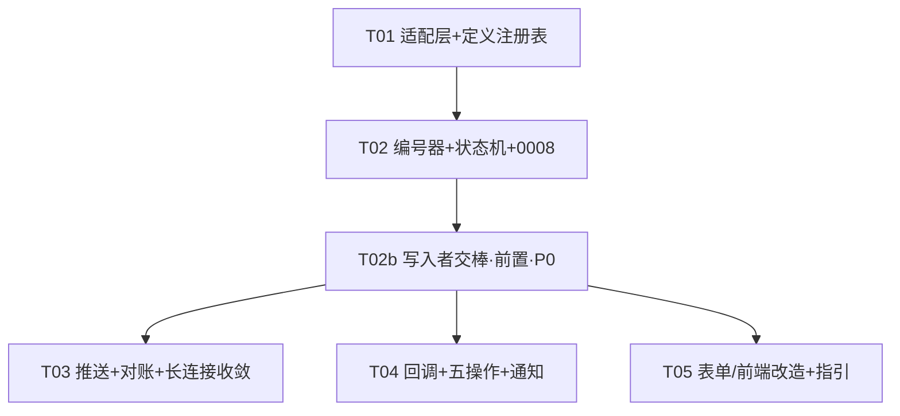

# 11 · 现有系统适配性审计报告（架构转向 ③ 实施前全面比对）

> **目的**：用户明确要求的「**架构定稿后与现有系统的全面严格比对**」的正式交付物。回答一个问题：**转向 ③（审批核心迁至我方 · 飞书三方审批）后，现有代码库/表/路由/测试/脚本/部署物，哪些能留、哪些要改、哪些要弃、哪些要新增，以及"不改就会静默出错"的地方在哪。**
>
> **素材来源**：三路独立适配性审计（后端 / 前端·路由·文档 / 数据层·测试·脚本），原始发现见 `memory/2026-09-27.md` 的**第四十八 / 四十九 / 五十阶段**；并与架构正本 `04a-Architecture-Increment-V2.md`（**V2.1**；审计初版基于 V1.9）、`01a-PRD-Increment-V2.md`（**V1.4.1**）、`10-Approval-Engine-Reference-Comparison.md`（V1.2）、`12-Build-vs-Rewrite-Assessment.md`（V1.0）交叉核对。
>
> ★ **本文只做审计**：不含实现代码、不改 `01a`/`04a` 正文、不新增 migration。可核查处均给 `文件:行`。★ **引用纪律：引用代码文件时以「符号 / 模式」为准（如 `func X` / `const Y` / 正则字面量），行号仅作快照、会随改动漂移；引用 `docs` 时同理，以「章节 + 动作」为准。**

| 项 | 内容 |
|---|---|
| 文档名称 | 现有系统适配性审计报告 |
| 版本 | V1.16 |
| 日期 | 2026-09-27 |
| 审计基线 | `04a` V2.1 · `01a` V1.4.1 · `10` V1.2 · `12` V1.0 |
| 审计范围 | `cmd/` + `internal/`（`internal/` 各包 + 新增 `flow`/`approval`/`number`，约 24,500 行 Go）· `web/src`（Vue3）· `docs/*` · `scripts/*` · `migrations/*` |
| 语言纪律 | 简体中文 |

> ★★ **时点口径（定案 #74）**：**§1–§9 为审计时点快照（`HEAD 875b9e4`）**，其后 `T02b`/`T03`/`T04`/`T05`/`#54` 等批次已变更多项 —— **现状以 §5.1 台账为准**。文中代码引用**以符号 / 模式为准**（行号仅快照）；凡标 **「（审计时点 `875b9e4`）」** 者＝该符号**当时**如此、**现已变 / 已退役**，其后必附**现值指向**（指向 §5.1 状态或明写"该路径已退役、无现状对应"）。

---

## 1. 结论摘要

### 1.1 一句话结论

**③ 的"切换"不是一次开关，而是「显式退役旧路径 + 显式接管新路径」两件事；现状是两头都没做** —— 于是出现**大面积"看起来正常"的假象**：代码能编译、页面能渲染、测试全绿、门禁也绿，但**数据/语义已经错了**。

### 1.2 核心机理（架构师式表述）

> ③ 下**不是"运行时冲突/重复"**，而是「**旧的唯一写入者被弃用、而新的写入者没有接管这些表**」→ **数据静默归零 / 为空**。

具体到本项目：`t_ledger_archive` / `t_instance_status_history` / `t_instance_field` / `t_attachment` 的**当前唯一写入者都是旧事件链 `worker/ingest.go`**；而 ③ 下它们的新写入者应当是 `internal/flow`（`flow.finalize` 等）。但 **`flow` / `approval` / `number` 三个新包已写、却完全未装配**（`cmd/` 与 `httpapi` 无 import），`bootstrap` 的 **`subscriber.SubscribeAll` 旧订阅链** ＋ 长连接订审批事件 ＋ worker 拉详情 → **全项目仍在跑旧"旁路"架构，新包是死代码**（**审计时点 `875b9e4`**；★ **现值指向**：`SubscribeAll` 旧订阅链**已退役**、`bootstrap` 现装配 `flow`/`approval`/`number`（见 §5.1 `R09`，`#54`））。

### 1.3 ★ 实施纪律（必须写进任务分解，而不是逐条打补丁）

1. **旧写入者退役（explicit retire）**：明确停止 `worker/ingest.go` 对台账 / 状态史 / 字段 / 附件的写入，并**留下可验证的"已退役"证据**（写入计数为 0 / 路由 404 / 代码删除或 feature-gate）。
2. **新写入者接管（explicit take-over）**：`flow.finalize` 对**每类 L 台账**显式写入（对应 `FR-M9-12` 终态直写）、状态史与附件元数据写入者随之迁移。
3. **不得依赖"旧链自己会停"**：`bootstrap` 的订阅链与人拉详情**必须显式改**，否则旧链与"我方状态机终态"**并存打架**（旧链会把终态覆盖回 `PENDING`，见 §5 `R18`）。
4. **三路审计各自独立命中同一件事**（旧写入者弃用、新写入者未接管）→ **可信度极高**，不是单点误判。

### 1.4 三路独立命中的"同一件事"

| 路 | 独立表述 | 位点 |
|---|---|---|
| 后端 | 台账唯一写入者＝旧 `ingest`；`flow.Submit` 完全不写台账 | `internal/worker/ingest.go` 的 **`UpsertArchiveTx(...)` 调用**；`internal/flow/service.go` 的 **`flow.Submit`** |
| 前端/文档 | B47 判法说"`L03` 在 ③ 下有了明确生产者"，但 **`§13 T05` 未落 `L03` 的 `finalize` 写入归属** | `04a §13 T05` / `§16 B47` |
| 数据层/测试 | 写入者迁到 `flow.finalize` 后，**所有读侧测试夹具都绕过 `finalize`** → 「每类台账有生产者」**零覆盖**；门禁白名单也未含 `flow` | §6.4 / §7.1 |

### 1.5 分级结论

| 级别 | 含义 | 条目 |
|---|---|---|
| ★★★ **上线即静默** | 不改则③上线后数据/语义静默错误（无异常、无日志） | `R01`–`R04`（写入者迁移）、`R17`–`R19`（覆盖语义）、`R11`/`R14`（端点与中间件）、**`R23`（旧对账补拉覆盖）** |
| ★★ **决策被悄悄降级** | 定案与实现不符（会签形态、对账方向、轮询口径） | `R05`/`R06`/`R07`/`R12`/`R13`/`R20` |
| ★ **认知错位 / 覆盖缺口** | "以为在跑新架构"、测试假绿、门禁失效 | `R08`/`R09`/`R10`/`R15`/`R16`/`R21`/`R22` |

---

## 2. 逐包判定（`internal/` + `cmd/`）

> 判定口径：**保留**（③ 下原样可用）· **改造**（接口/语义/装配需改）· **弃用**（③ 下作废）· **新增**（③ 新增，进行中）。

| 包 | 判定 | 依据 / 关键位点 |
|---|---|---|
| `access` | 保留 | 与审批无关 |
| `seed` | 保留 | 初始化数据 |
| `singlelock` | 保留 | 单实例锁（含 `PID/HOST/START` 诊断；决策 #45/#46）★ **③ 仍要求单实例**（长连接不广播） |
| `jsonutil` | 保留 | 通用 |
| `normalize` | 保留 | 供应商归一（决策 #38） |
| `observ` | 保留 | 观测 |
| `objectstore` | 保留 | 附件主存（S3/RustFS 三层降级） |
| `webui` | 保留 | 静态资源嵌入 |
| `dashboard` | 保留（**但写入者必须迁移**） | 看板读 `t_ledger_archive` → 见 `R01`；`dashboard_test.go` 夹具绕过（§6.4） |
| `submission` | 保留 | K3，与三方审批无耦合 |
| `bootstrap` | **改造（重）** | `bootstrap` 的 **`subscriber.SubscribeAll` 旧订阅链** ＋ 订审批事件 ＋ 拉详情 → **须改为装配 `flow`/`push`/回调**（**审计时点 `875b9e4`**；★ 现值指向：**已装配新包**，见 §5.1 `R09`，`#54`） |
| `worker` | **改造（重）** | `ingest` 全链弃用/部分改造；`job_type` 写死 `fetch_detail`（常量＝`internal/inbox/inbox.go` 的 **`JobTypeFetchDetail`**；**审计时点 `875b9e4`** 该写死点在 `worker/pool.go` 的作业调度链 —— ★ 现值指向：见 §5.1 `R08`）；`extract.go` 见下 |
| `httpapi` | **改造（重）** | 路由大改（§4）；回调端点须绕开 `requireSession` |
| `sync` | **改造** | 对象换成 `external_instances/check`；★ `internal/sync/reconcile.go` 的 **`NewReconciler`** 经 **`worker.Ingestor` 触发旧写入链**（见 §8.2 补正；**审计时点 `875b9e4`** —— ★ 现值指向：`ingestor` 形参**已删除**、旧写入链**已退役**，`R23` 已处置）；`internal/sync` **无任何 `_test.go`** |
| `platform/feishu` | **改造** | 审批键残留（`R07`）（**审计时点 `875b9e4`**：键位于 `longconn.go` 常量段）；新增 `push.go`/回调；`instance.go` 原生详情（F2 弃用）。★ **现值指向**：审批键**已收编为 `internal/platform/feishu/longconn.go` 的 `retiredApprovalEventTypes`（no-op 注册）**，`R07` **已处置** |
| `store` | **改造** | `models.go` 缺 `ReleaseState`/`Weight`；写语义缺陷（`R17`–`R19`） |
| `permission` | **改造** | `internal/permission/dataset.go` 的 **DEPT 名称比对**处 → 建议改**部门 ID**（依赖 `08`） |
| `inbox` | **改造** | 通讯录事件分派缺失（`R08`） |
| `config` | **部分弃用** | 原生控件映射（五类映射）主体作废；`t_approval_def` 装载源**未见**（见 §9） |
| `flow` | **新增（进行中）** | `service.go`（提交/推进/聚合）、`event.go`；★ 审计时点**实现的是并行会签**（`service.go` 建任务处一次性全 `PENDING`）→ 与 §2.3 不符（`R05`）（**审计时点 `875b9e4`**；★ 现值指向：`R05` **已处置**，改由 `createTasksTx` / `releaseNextTx` 实现**顺序会签**） |
| `approval` | **新增（进行中）** | 定义注册表；`external.go` **注册无自检**（`R10`，S7 未落地） |
| `number` | **新增（进行中）** | 编号器 + `t_doc_seq`；`biz_no` 由我方生成（取代飞书流水号控件） |
| `cmd/`（`main.go`） | 保留（微调装配） | 装配新包；装配回调/推送/对账循环 |

### 2.1 `worker/extract.go` 的可复用与不可复用

| 函数 / 段 | 判定 | 说明 |
|---|---|---|
| `ParseAmountCents`（`:105-113`，元→分） | **可复用** | 金额解析独立于事件链 |
| `BuildExtJSON`（`:249-285`） | **改造，不可整段删** | `ext_json` 承载**变更链检索**（`contract_no`，决策 #28）→ 须**改由我方表单值构造** |
| `biz_no` 兜底 | **弃用** | ③ 下 `biz_no` 由 `internal/number` 生成（内联于 `internal/flow/service.go` 的 **`flow.Submit`**），**不需要飞书兜底** |
| 原生控件解析（`parseForm`/`valueToText`/`formItem`/`open_ids`） | **弃用** | F3 原生控件链整体作废 |

---

## 3. 逐表判定（20 表 + `0007`）

| 表 | 判定 | ③ 下的变化 / 写入者 |
|---|---|---|
| `t_instance` | **改造** | `0007` 已加 6 列；`instance_code` 语义迁移（C11）；★ 写语义须改 write-once（`R17`/`R18`） |
| `t_instance_status_history` | **保留（改语义）** | 写入者须由 `ingest` 迁到 `flow`（`R02`）；K1 保留项 |
| `t_instance_field` | **弃用** | F3 原生控件链作废 → 端点恒空（`R03`） |
| `t_event_inbox` | **改造** | `instance_code NOT NULL`（`0001:73`）→ 通讯录事件进死信（`R08`） |
| `t_worker_job` | **改造** | `job_type` 写死 `fetch_detail`（`R08`） |
| `t_ledger_archive` | ★ **改造（写入者 `Ingest` → `flow.finalize`）** | **R01（最重）** |
| `t_deadletter` | 保留 | 通用 |
| `t_sync_cursor` | 保留（改语义） | 对象改 `check` |
| `t_config_mapping` | 保留 | 映射（部分作废须评估） |
| `t_user_role` | 保留 | deny-by-default 准入（**镜像≠权限**） |
| `t_permission_rule` | 保留 | 行·列权限 |
| `t_ledger_ops` | 保留 | 运营字段 |
| `t_ledger_field_def` | 保留 | 写接口白名单（决策 #31） |
| `t_petty_cash_receipt` | 保留 | 备付金 |
| `t_petty_cash_close` | 保留 | 备付金 |
| `t_expense_track` | 保留 | 集团报销跟踪 |
| `t_submission` / `t_submission_item` | 保留（K3） | 报送 |
| `t_audit_log` | 保留 | 审计 |
| `t_attachment` | **保留（改语义）** | 登记写入者由 `ingest` 迁到 **`flow.Submit`**（`R04`；★ 终态回调**无附件载荷** → `finalize` **无数据源**；依据 B39「元数据**入库时**登记、零网络 IO」）；上传改我方（M6） |
| `t_subscribe_state` | **弃用** | F1 审批订阅作废；被 `internal/httpapi/handlers_ops.go` 的**自检读取** → 须一并处理 |
| `migrations/0001`–`0006` | 全部保留 | 已应用，不回改 |
| `migrations/0007` | **保留 + `0008` 已落地** | `t_flow_task` 缺 `release_state`/`weight`（`R20`）→ **`0008` 已落地**（`commit e2f6fe3`；★ **含回填** `UPDATE t_flow_task SET release_state='RELEASED' WHERE release_state='HELD'`，否则存量行被新门禁**静默冻结**）；★ 另需 **`0009`** 补 **`task_order`**（`04a §1.1` 契约：`node_seq` 同节点相同、区分不了审批人） |

> 写入者迁移总表：`t_ledger_archive` / `t_instance_status_history` 的**旧写入者＝`worker/ingest.go`** → 新写入者＝ **`flow.finalize`**；`t_attachment` **元数据** → **`flow.Submit`**（终态回调无附件载荷）；`t_instance_field` **弃用**（F3）。

---

## 4. 逐路由判定（`router.go`）

### 4.1 现有路由

| 路由 | 判定 | 说明 |
|---|---|---|
| `POST /internal/sync/subscribe` | **改造**（订阅目标改为**通讯录事件**） | ★ **绝不可再订审批事件**（N10/F1）；后端路判"弃用"、前端路判"改造"，实质＝**改订阅目标** |
| `POST /internal/sync/reconcile` | ★ **收敛为「通讯录侧」** | ★ **审批对账唯一入口 ＝ `POST /internal/approval/check`**（§4.2 / **`R24`**）；本路由**不再承担审批对账**（对齐 `docs/08`「启动全量 / 事件增量 / 每周对账」）。★ **纪律：同一职能只允许一个入口**。★★ **现返回 `410 Gone`（`code=41000`）**（Batch B-2 `c940603`）—— 退役 body 明指权威入口 `POST /internal/approval/check` |
| `GET /healthz` / `GET /readyz` | **改造** | `subscribe_states` 自检项须换 |
| `GET /api/instances` / `:code` | **改造（语义改）** | `instance_code` 语义变；页面仍渲染＝静默取错（`R12`） |
| `GET /api/instances/:code/fields` | **弃用** | F3 后无生产者，恒空不报错（`R03`） |
| `requireSession`（`internal/httpapi/router.go` 的 **`/api` 组中间件**） | ★ **回调端点必须绕开** | 飞书无 cookie → 否则 401 回调全失败且静默（`R14`） |
| `internalAuth`（`router.go` 的 **`internalAuth` 中间件**） | ★ **反代后须改** | 依赖 `isLoopback(c.RealIP())` → 反代后失效/误放行（§7.3） |
| 限流（`router.go` 的**限流中间件**，`c.RealIP()`） | ★ **反代后须改** | 反代后所有请求同 IP、共用一个限流桶（§7.3） |

### 4.2 须新增路由（T04）

| 路由 | 性质 | 说明 |
|---|---|---|
| `POST /approval/external/callback` | ★ **入站**（不在 `/api` 组、**绕开 `requireSession`**） | 飞书 → 我方；须公网**入站**可达（★ **HTTPS 属我方选择、非平台要求**，见 `04a §17.0`） |
| `POST /api/approval/submit` | 我方提交 | 编号 + 建实例 + 首推 |
| `POST /api/approval/{biz_no}/approve` / `reject` | ★ **缺，必须补** | `01a §5.2` "回我方页面点亦可" 的落点；`04a §5` 四操作不含、`§4.2` 回调只有 APPROVE/REJECT |
| `POST /api/approval/{biz_no}/transfer` / `addsign` / `rollback` / `cancel` | 四操作 | 我方页面发起 |
| `GET /api/approval/tasks`（我的待办） | 读 | ★ **命名已定 ＝ `/tasks`**（`/my-tasks` 语义冗余；与 `GET /api/approval/{biz_no}` 同级）→ `05-API §3.13` |
| `GET /api/approval/{biz_no}` | 读 | 详情（时间线＝`t_flow_op_log`） |
| `GET /api/approval/defs` | 读 | 定义清单（可选管理页） |
| `POST /internal/approval/check` | 内部 | ★ **审批对账唯一入口**（**`R24`**）；`/internal/sync/reconcile` 收敛为通讯录侧 |

> ★ 完成后**必须同步 `docs/05-API.md`**，否则 `scripts/audit_silent.py` 的 **C5**（路由 ↔ 05-API 双向差集）会报「已注册但未提及」。

---

## 5. 静默风险清单（三路去重后编号）

> ★ 判定原则：**"错误表现为正确"是静默缺陷族里最危险的一支**（恒空 / 恒 0 / 页面能开 / 测试全绿）。凡"必须靠主动断言才能发现"的都列此。

| 编号 | 来源 | 风险 | 触发 / 机理 | 处置（指向） |
|---|---|---|---|---|
| **R01** | 后端 | ★★★ **台账静默归零** | `t_ledger_archive` 唯一写入者＝`internal/worker/ingest.go` 的 **`UpsertArchiveTx(...)` 调用**；`internal/flow/service.go` 的 **`flow.Submit`** 不写台账 → ③ 上线后台账/看板全 0、不报错 | 写入者迁 `flow.finalize`；§8 前置任务 |
| **R02** | 后端 | ★★ **状态史无生产者** | `t_instance_status_history` 只由 ingest 写（`internal/store/repo_instance.go` 的 **`AppendStatusHistory`** / **`appendHistory`**） | 同上 |
| **R03** | 后端 | ★★ **实例字段端点恒空** | `t_instance_field` 只由 ingest 写（`internal/store/repo_instance.go` 的 **`UpsertFields`**）；F3 作废后 `GET /api/instances/:code/fields`（`internal/httpapi/handlers_biz.go` 的 **`ListFields`** 端点）恒空不报错 | 端点评弃用；写入者迁移 |
| **R04** | 后端 | ★★★ **凭证包附件清单为空** | `t_attachment` 登记只由 ingest 写（`internal/worker/ingest.go` 的 **`UpsertAttachmentTx(...)` 调用**）；M6 后链断裂（`internal/submission` 的 **`attachmentCSV`** 渲染链） | 附件**元数据**写入者迁 **`flow.Submit`**（★ 终态回调**无附件载荷** → `finalize` **无数据源**；依据 B39「元数据**入库时**登记、零网络 IO」） |
| **R05** | 后端 | ★★ **顺序会签被悄悄降级为并行** | 审计时点 `internal/flow/service.go` 建任务处**一次全 `PENDING`** → 与 §2.3「逐级释放」不符（**审计时点 `875b9e4`**；★ 现值指向：`R05` **已处置**，改由 **`createTasksTx`** / **`releaseNextTx`** 顺序会签） | 0008 补 `release_state`；建任务只释放第一个 |
| **R06** | 后端 | ★★ **对账无方向判断** | 审计时点 `internal/sync/reconcile.go` 的 **`Run`** 只"缺则补"、无 §9.2 方向判断 → S14 陈旧快照覆盖风险（**审计时点 `875b9e4`**；★ 现值指向：方向判断归**新建的 `sync/approval_reconcile.go`**，见 §5.1 `R06`） | 补方向判断（§9.2） |
| **R07** | 后端 | ★ **长连接审批键残留** | 审计时点 `internal/platform/feishu/longconn.go` 常量段含 `approval.task.status_changed_v4`/`approval_task`（与 N10/F1 矛盾）；★ 现值指向：**已收编为 `longconn.go` 的 `retiredApprovalEventTypes`（no-op 注册）**，`R07` **已处置** | 收敛订阅；**保留 no-op 200**（防 S8 重试风暴） |
| **R08** | 后端 | ★ **通讯录事件进死信 / 被误拉详情** | `t_event_inbox.instance_code NOT NULL`（`migrations/0001`）＋ 审计时点 `worker/pool.go` 的作业调度链 `job_type` 写死 `fetch_detail`（常量＝`internal/inbox/inbox.go` 的 **`JobTypeFetchDetail`**）（**审计时点 `875b9e4`**；★ 现值指向：见 §5.1 `R08`） | 加 `event_type` 分派；`instance_code` 语义放宽 |
| **R09** | 后端 | ★★ **"以为在跑新架构、实际跑旧旁路"** | `cmd/` 与 `httpapi` 无 `flow`/`approval`/`number` import；`bootstrap` 的 **`SubscribeAll` 旧订阅链**仍旧链（**审计时点 `875b9e4`**；★ 现值指向：**已装配新包**，见 §5.1 `R09`，`#54`） | 装配新包（§8） |
| **R10** | 后端 | ★ **定义注册无自检** | `external.go` 未落地 S7「提交前校验定义存在」 | 补自检（§10 S7） |
| **R11** | 前端 | ★★★ **我方页面「同意/拒绝」端点未定义** | `01a §5.2` 要求"回我方页面点亦可"，但 `§10.5`/`04a §5`/`§4.2` **均无** `approve`/`reject` 端点 | 补 `POST /api/approval/{biz_no}/approve` / `reject` —— ★ **契约已入 `05-API §3.13`（V2.1）**，实现待 **T04** |
| **R12** | 前端 | ★★ **页面照常渲染、语义已错** | `views/Instances.vue` + `views/InstanceDetail.vue` 仍调 `/api/instances*`；`instance_code` 语义、timeline 字段（`event_seq`/`operator`/`opinion`）已变 | 前端改造 + 后端语义对齐 |
| **R13** | 文档 | ★★ **测试失效仍绿（虚假信心）** | `TC-05`（删数据→对账补全量）不成立；`TC-08`（停机→飞书不受影响）＝假；`TC-25`（无轮询）与"必需 5 分钟对账"矛盾 | 作废/改造对应 TC（§6.1） |
| **R14** | 前端 | ★★★ **回调被登录中间件拦成 401** | 回调路由若挂 `requireSession`（`router.go` 的 **`/api` 组会话中间件**）→ 飞书无 cookie → 回调全失败且静默 | 回调路径绕开会话/OIDC 中间件 |
| **R15** | 前端 | ★ **SIDEBAR 内布局崩** | `web/src/styles.css` 全文无 `@media` + sidebar 固定 216px；`Login.vue` 手点登录在抽屉内体验断裂 | 补响应式外壳 |
| **R16** | 文档 | ★ **旧口径残留** | `01-PRD` N1/N7/G1/G2/FR-M0-12/FR-M8-05/Q1/Q17 仍旧口径（G1"100% 成功率"是量化验收 → 会拿旧口径判违规） | 文档作废/改写（§8 文档位点） |
| **R17** | 数据层 | ★★★ **非空即覆盖，违背 write-once** | 审计时点 `internal/store/repo_instance.go` 的 **`upsertInstance`** 里 `applicant_name`/`department` = `COALESCE(NULLIF(excluded,''),existing)`（**审计时点 `875b9e4`**；★ 现值指向：**已改 preserve 式** `COALESCE(NULLIF(t_instance.X,''),excluded.X)`，`R17` **已处置**） | 改 write-once（S10/M4） |
| **R18** | 数据层 | ★★ **状态无条件覆盖** | 审计时点 `repo_instance.go` 的 **`upsertInstance`** 中 `status = excluded.status` → 旧链会把终态覆盖回 `PENDING`（**审计时点 `875b9e4`**；★ 现值指向：**已加「终态不可倒退」`CASE` 守卫**，`R18` **已处置（分层）**） | ★ **本批处置（分层）**：**只加「终态不可倒退」守卫** —— 库中已是 `APPROVED`/`REJECTED`/`CANCELED` 时**不得被改回非终态**（即堵住"旧链把终态覆盖回 `PENDING`"）；**把 `status` 从 `upsertInstance` 摘出、改由 `flow` 显式状态迁移函数独占更新** ＝ **Batch C**（旧链退役后，见 §8.2） |
| **R19** | 数据层 | ★★ **`ext_json` 被 `{}` 抹掉** | 审计时点 `internal/store/repo_ledger.go` 的 `ext_json = excluded.ext_json` 无条件覆盖 → 变更链检索（`contract_no`）失效（**审计时点 `875b9e4`**；★ 现值指向：**已改「空不覆盖」`CASE`**，`R19` **已处置**） | 改"空不覆盖" |
| **R20** | 数据层 | ★★ **`release_state` 无处落地** | `migrations/0007` / `internal/store/models.go` 的 **`FlowTask`** 审计时点均无 `ReleaseState`/`Weight`；`repo_flow.go` 缺读改写（★ 现值指向：**已补 `FlowTask.ReleaseState` / `Weight` / `TaskOrder`**，`R20` **已处置**） | **`0008` 已落地**（`commit e2f6fe3`）+ 模型补字段；★ 另 **`0009`** 补 **`task_order`** |
| **R21** | 数据层 | ★ **读侧零覆盖** | 夹具全部绕过 `finalize` → 「每类台账有生产者」零覆盖 | 夹具改经 `finalize`（§6.4） |
| **R22** | 脚本 | ★★ **门禁自身失效** | `scripts/audit_silent.py` 的 **C8a 白名单块**（`allowed` / `allowed_prefix`）未含 `flow.finalize` → 漏检 + 误报 | 白名单加 `flow` |
| **R23** | 架构师复核 | ★★★ **旧对账器"补拉"覆盖我方状态（"对账"名义下的隐蔽覆盖）** | `internal/sync/reconcile.go` 的 **`ingestor.Ingest(...)`**（`r.ingestor.Ingest(ctx, det, worker.SourceReconcile)`；**审计时点 `875b9e4`** —— ★ 现值指向：该 `Ingest` 调用**已退役**，见 §5.1 `R23`） —— 旧对账是"**缺则补**"：把**飞书侧实例详情重新 `ingest` 回来**；③ 下**我方才是状态源** → 它**把飞书侧旧数据重新入库、覆盖我方已推进的状态**（名字叫"对账"，**最易被当作无害**！） | ★★ **危害窗口＝"新架构上线" → "`T02b` 完成"之间**：只要旧 `Reconciler` 还在 `bootstrap` 的 **`Reconciler` 装配点**（**审计时点 `875b9e4`**）装配里，**它每跑一次就覆盖一次**；处置＝**先摘除旧定时对账装配、再退役 `ingest` 调用**（§8.2 `T02b` 硬前置） |
| **R25** | 架构复核 | ★ **`C8a` 把「写函数定义行」误判为「写入点」** | 正则修好后，**每个 `Upsert*` 函数的定义行都成命中**（如 `internal/store/repo_instance.go` 的 **`func (d *DB) UpsertArchiveTx(`** 定义行）→ 门禁被**自身噪声**淹没 → ★ **"命中多到无人细读"＝假绿的另一种形态**（与 `3f76985`「扫 0 文件仍 OK」同族：一个"报告为空"、一个"报告多到不看"） | ✅ **已闭合（`308cb5c`）** —— **修正则而非加白名单**：`scripts/audit_silent.py` 的 **`decl_re = ^\s*func\b`** 排除**定义行**，`C8a` 只认**调用**形态；★ **双向实证（逐行对照）**：def 行 旧`True`→新`False`、call 行 `True`→`True`；★★ **方法论（本轮最有价值）＝"清空白名单跑全仓"** —— 让门禁**自己说出**还有哪些真实写入者（暴露**恰好 3 个调用**：`internal/flow/finalize.go` 的 **`UpsertArchiveTx(...)`** / `internal/httpapi/handlers_biz.go` 的 **`UpsertOps(...)`** / `internal/worker/ingest.go` 的 **`UpsertArchiveTx(...)`**），据此**收缩白名单 3→2**，而非"我觉得这条不用"。★ **原则：白名单越长，越接近门禁失效** |
| **R24** | 架构复核 | ★★ **两条对账入口并存的静默面** | `POST /internal/sync/reconcile`（§4.1 原判"改造"）与 `POST /internal/approval/check`（§4.2 新增）**都表现为"触发审批对账"** → **跑错入口不报错、且都回成功**（"以为对过账"）；与 `B47`（恒 0＝期望值）/`R23`（对账名义下的隐蔽覆盖）**同族** | ★ **`/internal/approval/check` ＝ 审批对账唯一入口**；`sync/reconcile` 收敛为**通讯录侧**。★ **纪律：同一职能只允许一个入口**；若需第二个，**必须双方文档写明"谁是唯一权威入口"** |
| **R26** | 架构复核 | ★★ **门禁 `C1` 只覆盖「表创建」、不覆盖「表演进」** | `parse_columns()` 原**只解析 `CREATE TABLE`**；而 ③ 新增的列**几乎全是 `ALTER TABLE … ADD COLUMN`**（`0008` `release_state`/`weight` · `0009` `task_order` · `0010` `t_instance.ext_json`）—— 因 `0001`~`0007` **已应用、不得回改**，新列只能 `ALTER` → ★ **`ALTER` 路径完全不在 `C1` 视野** → 「**建了列但没有任何写入者**」（**`B42`**）**在演进路径上完全无法被发现**。★★ **与 `B42` 显式挂钩：`R26` ＝ `B42` 的检查路径有洞**（`B42` 是"病"，`R26` 是"该查它的门禁查不到"） | ✅ **已修（`908208f`）**：补 `ALTER TABLE <t> ADD COLUMN <c>` 解析，覆盖面 `total_cols` **269 → 284（+15）**、可**逐一点名**（`t_flow_task`+3 · `t_instance`+7 · `t_ledger_archive`+1 · `t_submission`+4），且核实 **15 列全部有写入者** → **回跑基线无新命中、无需白名单**；★ **探针双证**：「`ALTER` 加一列 + 代码从不写它」→ **改前 `[C1] 无命中` → 改后 `1 处 · 死列/预留列`** |
| **R27** | 架构复核 | ★★ **`C8b` 覆盖面比"以为的"更窄** | `C8b` 依赖**夹具命名约定** —— **只认 `seedArchive*` / `seedOps*`** → **改名即失效**（`mkLedger` / `putRow` 看不见）；★ 且实测发现 **`seedArchiveDoc(` / `seedArchiveExt(` 并不匹配 `seedArchive(?:DocExt)?\(`** → **"以为覆盖了、其实没有"**（比"根本没覆盖"更隐蔽） | ✅ **已处置（如实登记，`908208f`）**：**如实写入门禁注释**（**不**"顺手补全名字清单"—— 那是把"按名字"的毛病再犯一遍）；★ 并**实测否掉**备选判据「按目标表（夹具写 `t_ledger_*` 即算）」：本项目测试**无裸 `INSERT INTO t_ledger_*`** → **恒空、无增益** → **暂不采用** |
| **R28** | 架构复核 | ★★ **`t_ledger_archive.department` 快照被静默改写（write-once 缺口 · 「漏登记的半边」）** | `internal/store/repo_ledger.go` 的 **`upsertArchive`** 中 `department = COALESCE(NULLIF(excluded.department,''), t_ledger_archive.department)` ＝ **`excluded` 优先 → "新值非空即覆盖"**；而 `docs/08 §4.9(a)` 要求它是**"名称快照" → write-once**、`§4.9-b` 更把它列为**"必须改 write-once 的两个 UPSERT"之一**。★ **`#46`（Batch A-5）只改了 instance 侧**（`repo_instance.go` 已为保留式）**、ledger 侧没跟着改** → 且**它从未被任何 R 项覆盖**（`R17` 的现值指向只写 `repo_instance.go` 的 `upsertInstance`）⇒ **属"差集单向"造成的漏登记**（定案 #64） | ✅ **已闭合（`cc753c4`）**：该行**已改保留式** `department = COALESCE(NULLIF(t_ledger_archive.department,''), excluded.department)`（提交自述「`08 §4.9-b` 漏改半边」）。★ 另**登记同类候选（不下结论）**：同文件 `amount_cents = COALESCE(excluded.amount_cents, t_ledger_archive.amount_cents)` **无条件覆盖**，而 instance 侧有 **D4**（`WHEN excluded.amount_cents > 0`，决策 #39）→ **两端口径不一致**，判定交 `engineer-glm` |
| **R29** | 后端 | ★★★ **回调「解析字段名」与官方报文不匹配（修复前回调恒 400）** | `internal/httpapi/handlers_approval.go` 的 **`extCallbackBody`** 主读 `biz_no`/`open_id`/`instance_code`/`action_name`，而官方发 `action_type`/**`user_id`**/**`approval_code`**/**`instance_id`**，**且官方【不发】顶层 `biz_no`**；且 `biz_no` 的回传载体 `task_list[].action_context` **推侧从未写入** ⇒ 回调**必然 400**（**用户观感＝"点了同意没反应"**）。★ 注意：**回调"到达被拒"完全可观测**（http 日志逐条带 `trace_id`）——**不是静默族**，问题在**字段映射**（`docs/16 §1 G-1/G-2`） | ✅ **已闭合** —— `extCallbackBody` **按官方 12 字段重写**（旧字段**兼容读**，窗口＝一个发布版本）＋ `ExternalTask` 加 `action_context`（`biz_no` **三级读法**）；第 2 批 **`d94580f`**（`docs/16 §2-A/B`；`06 §R` **B52/B53**）。★ **`V-1` 已实测【定论】（2026-09-28）**：飞书**原样回传** `action_context` —— 主读路径成立 |
| **R30** | 后端 | ★★★ **推实例字段「名 / 必填 / 类型 / 值语义」四要素错（修复前推实例被逐层拒）** | `internal/platform/feishu/push.go` 的 **`ExternalTask`**：① 审批人用自造 `assignees`/`assignee_open_id`（官方**无** → **静默忽略**）；② task 级缺 `links`/`create_time`/`end_time`/`update_time`；③ 实例级缺 `start_time`/`end_time`/`i18n_resources`；④ `message_id` 用 **`string`**（官方 **`int64`**）⇒ **整包解析失败**；⑤ `node_name` 传**实际文案**（官方要求 **`@i18n@` key**）。★ **平台逐层只报一层错**（"剥洋葱"）⇒ 共剥 **5 层**（`docs/16 §8`；`06 §S`） | ✅ **已闭合** —— 逐层修：审批人 → **`open_id`**（`46919ac`）· task 级必填（`46919ac`）· 实例级必填（`5b3f2ac`）· `message_id` 按 **`int64`** 接收（`5761922`）· `node_name` 传 **`@i18n@` key**（`fad0811`）；另 `external_instances/check` 补 **`instances[]`**（`956f3c8`）。★ **并已端到端实测闭环**（对账**零差异**） |

### 5.1 `R01–R30` 闭合状态台账（2026-09-27~28 实测；V1.15 补 `R29` · V1.16 补 `R30`）

> 把上表从「审计清单」变为「**可追踪的闭合台账**」：每条给**当前状态** + **证据（`文件:行` / commit）** + **证据状态**（`已提交（commit）` / `工作区未提交` / `未纳入 git`）。★ **不留空白、不写"部分完成"**——写清是**哪一半**或**待谁**。（`HEAD` ＝ `875b9e4`。）
> ★ **为何要"证据状态"列**：**「已处置」但证据未入库 ＝ 不可复现的处置** —— 别人 clone 出来看不到那行代码，就无法核对处置是否真的存在（与"结论无位点"是同一件事的第三种变体）。

| 编号 | 状态 | 证据（`文件:行` / commit） | 证据状态 |
|---|---|---|---|
| **R01** | 接管侧**已就绪**；**退役待 Batch B**、**装配待 T03-T04** | 接管＝`internal/flow/finalize.go` 的 **`finalizeLedgersTx`**；旧写入者**仍在**（`internal/worker/ingest.go` 的 **`UpsertArchiveTx(...)`**，`bootstrap` 的 **`ingest` 装配点**）；`flow` 未装配（`bootstrap` 的 **`flow` 装配点**）（**审计时点 `875b9e4`**） | **已提交 + 工作区未提交**（接管 `83eddb9`；`bootstrap.go`/`ingest.go` 未提交） |
| **R02** | 接管侧**已就绪**；**退役待 Batch B** | 接管＝`internal/flow/service.go` 的 **`AppendStatusHistory` 调用**；旧 `ingest` 仍写 | **已提交（`83eddb9`）** |
| **R03** | **弃用侧已定**；**退役待 Batch B** | 端点作废入 `05-API §3.4`·`04 §3.1` 标弃用；旧 `ingest` 仍写（`internal/store/repo_instance.go` 的 **`UpsertFields`**） | **工作区未提交**（`ingest.go`/`05-API`/`04` 均未提交） |
| **R04** | 接管侧**已就绪**；**退役待 Batch B** | 接管＝`internal/flow/service.go` 的 **`flow.Submit`**；旧 `ingest` 仍写（`internal/worker/ingest.go` 的 **`UpsertAttachmentTx(...)`**） | **已提交 + 工作区未提交**（接管 `83eddb9`；退役证据未提交） |
| **R05** | ✅ **已处置** | `internal/flow/service.go` 的 **`releaseNextTx`** / **`advanceTx`** + `0008` | **已提交（`34c95df2`·`e2f6fe32`）** |
| **R06** | ⏳ **待 T03** | 新方向对账器 `sync/approval_reconcile.go` **未建** | **未纳入 git**（`reconcile.go` 未提交） |
| **R07** | ✅ **已处置** | `internal/platform/feishu/longconn.go` 的 **`retiredApprovalEventTypes`（审批键 no-op 注册）** | **已提交（`d9d52d6`）** |
| **R08** | ⏳ **待**（`event_type` 分派未实现） | `internal/worker/pool.go` **无** `event_type` 分派 | —（待实现） |
| **R09** | ⏳ **待 T03-T04 装配** | `cmd/jxapproval/bootstrap.go` 的**装配点**（审计时点「不装配 `flow`/`approval`/`number`」；**审计时点 `875b9e4`** —— ★ 现值指向：`#54` 已装配） | **工作区未提交**（`bootstrap.go` 为 ` M`） |
| **R10** | ✅ **已处置** | `internal/flow/service.go` 的 **`flow.Submit`**（S7 提交前校验定义） | **已提交（`34c95df2`）** |
| **R11** | ✅ **已闭合** | `05-API §3.13`（V2.1）＋ ★ **实现已落地**：`internal/httpapi/router.go` 的 **`api.POST("/approval/:biz_no/approve", d.handleApprovalApprove)`** / **`.../reject`**（T04 完成，本次复核确认路由在位） | **已提交**（路由与 handler 随相关批次入库；`router.go` 已 tracked） |
| **R12** | ⏳ **待 T05** | `web/src/views/Instances.vue`/`InstanceDetail.vue` 未改 | —（待实现） |
| **R13** | ⏳ **待 PM（`#34`）** | `03-TestCase` 改造在途 | —（待实现） |
| **R14** | ✅ **已闭合** | `05-API §3.14`；★ **实现已落地**：`internal/httpapi/router.go` 的 **`e.POST("/approval/external/callback", d.handleExternalApprovalCallback, d.callbackBodyLog)`** —— 注册在 **`/api` 组之外**（**未挂 `requireSession`**），并**只挂回调一条路由**的 `callbackBodyLog` 留痕中间件（本次复核确认路由在位、且**不在会话中间件链上**） | **已提交**（路由随相关批次入库） |
| **R15** | ⏳ **待 T05** | `web/src/styles.css` `@media` 计数＝**0** | —（待实现） |
| **R16** | ⏳ **待 PM（`#26`）收口** | `01-PRD` V1.9 已改若干位点、未逐条核 | **工作区未提交**（`01-PRD` 为 ` M`） |
| **R17** | ✅ **已处置** | `internal/store/repo_instance.go` 的 **`upsertInstance`** 中 write-once（`COALESCE(NULLIF(t_instance.X,''),excluded.X)`） | **已提交（`83eddb9`）** |
| **R18** | ✅ **已处置（分层）** | `internal/store/repo_instance.go` 的 **`upsertInstance`** 中**终态不可倒退 `CASE` 守卫**；摘列＝Batch C | **已提交（`83eddb9`）** |
| **R19** | ✅ **已处置** | `internal/store/repo_ledger.go` 的 **`ext_json`「空不覆盖」`CASE`** | **已提交（`d9d52d6`）** |
| **R20** | ✅ **已处置** | `0008` + `store/models.go` 补字段；另 `0009` 补 `task_order` | **已提交（`e2f6fe32`）** |
| **R21** | ⏳ **待**（夹具改造） | 夹具经 `finalize` 的改造随测试轮 | —（待实现） |
| **R22** | ✅ **已闭合** | ★ **正则已修**（`scripts/audit_silent.py` 的 **`name_re`** ＝ `UpsertArchive(?:Tx)?\(\|UpsertOps(?:Tx)?\(`，`c940603`）；**双向实证**：旧正则 `False` / 新正则 `True`，**临时清空白名单后 `internal/flow/finalize.go` 的 **`UpsertArchiveTx(...)` 调用**如实报红** → 真实写入点已可被门禁触达、白名单是唯一抑制项；★ `308cb5c` 再收紧（`C8a` 排除定义行 + 白名单 3→2，见 `R25`） | **已提交（`c940603` / `308cb5c`）** |
| **R23** | ✅ **已处置** | `internal/sync/reconcile.go`（**`Run` 不再 `ingest`**）+ `bootstrap` 的 **`Reconciler` 不装配点**；★ **路由已退役（`410 Gone`）** | **已提交（`d9d52d6` / `c940603`）** |
| **R24** | ✅ **已闭合** | §4.1 / §4.2 裁定；审批对账唯一入口 ＝ `POST /internal/approval/check`；★ **路由退役已落地**（`410 Gone`，`c940603`） | **已提交**（代码侧 `410` 已提交；`docs/11` 已随 `6666e65` 入库） |
| **R25** | ✅ **已闭合** | 修正则（`scripts/audit_silent.py` 的 **`decl_re = ^\s*func\b`** 排除**定义行**）+ **双向实证**（def 行 `True→False` / call 行 `True→True`）+ ★ **清空白名单跑全仓暴露恰好 3 个真实写入调用** → 白名单 **3→2**（`308cb5c`） | **已提交（`308cb5c`）** |
| **R26** | ✅ **已处置** | `C1` 补 `ALTER` 解析（`scripts/audit_silent.py` 的 `parse_columns`）；覆盖面 **269 → 284（+15）**、可逐一点名、核实 15 列**全部有写入者**（`908208f`） | **已提交（`908208f`）** |
| **R27** | ✅ **已处置（如实登记）** | `C8b` 夹具命名约定收窄一事**写入门禁注释**（不补名字清单）；备选判据「按目标表」**实测否掉**（本项目无裸 `INSERT INTO t_ledger_*`）（`908208f`） | **已提交（`908208f`）** |
| **R28** | ✅ **已闭合** | `internal/store/repo_ledger.go` 的 **`upsertArchive`** 中 `department` **已改保留式**（`COALESCE(NULLIF(t_ledger_archive.department,''), excluded.department)`）—— 与 instance 侧（`repo_instance.go`）对齐，补上 `08 §4.9-b`「两个 UPSERT」的**漏改半边**。★ 漏登记成因＝`#46` 只改 instance 侧、ledger 侧**未被任何 R 项覆盖**（**差集单向**，定案 #64） | **已提交（`cc753c4`）** |
| **R29** | ✅ **已闭合**（★ 仍待联调实测 `V-1`） | `internal/httpapi/handlers_approval.go` 的 **`extCallbackBody`** **按官方 12 字段重写**（`action_type`/`user_id`/`approval_code`/`instance_id`/`action_context`/`task_id`/`message_id`/… ；旧字段**兼容读**，窗口＝一个发布版本）；★ `ExternalTask` **加 `action_context`** → `biz_no` **三级读法**（`action_context` JSON 主 → `instance_id` 反解 → 顶层兜底并告警）；★★ **前提：推侧** `task_list[].action_context` **已补写** `{"biz_no":…,"task_id":…}`（否则回调侧无源可读）。★ 修复前回调**恒 400**（用户观感＝"点了同意没反应"） | **已提交（`d94580f`）**；见 `docs/16 §2-A/B`、`06 §R` **B52/B53** |
| **R30** | ✅ **已闭合** | `internal/platform/feishu/push.go` 的 **`ExternalTask`** 逐层修正：审批人 → **`open_id`**（`46919ac`）· task 级必填 `links`/`create_time`/`end_time`/`update_time`（`46919ac`）· 实例级必填 `start_time`/`end_time`/`i18n_resources`（`5b3f2ac`）· `message_id` 按 **`int64`** 接收（`5761922`）· `node_name` 传 **`@i18n@` key**（`fad0811`）；另 `external_instances/check` 补 **`instances[]`**（`956f3c8`）。★ **平台逐层只报一层错** ⇒ 共剥 5 层 | **已提交（`46919ac`/`5b3f2ac`/`5761922`/`fad0811`/`956f3c8`）**；见 `docs/16 §8`、`06 §S` **B57–B62** |

> **统计**：✅ **已处置 18**（`R05`/`R07`/`R10`/`R11`/`R14`/`R17`/`R18`/`R19`/`R20`/`R22`/`R23`/`R24`/`R25`/`R26`/`R27`/`R28`/`R29`/**`R30`**）· ⚠️ **半闭合 0**（`R22` 已闭合）· 一半（接管侧）**4**（`R01`~`R04` 接管侧）· 待（T03/T04/T05/Batch C/PM）其余。★ **无一条"静默未处理"**。★★ **本轮回调链路收口（V1.15）新增 `R11`/`R14` 由「契约就绪」翻为 ✅ 已闭合**（路由实证在位）+ **新增 `R29`**（回调解析字段名缺口）。★★ **端到端联调收口（V1.16）新增 `R30`**（**推实例**字段名/必填/类型/值语义四要素错 ⇒ 逐层拒，共剥 5 层；**已闭合，已端到端实测闭环**）。
> ★ **门禁 `C8a` 白名单 3 → 2（`308cb5c`）**：把 `allowed` **与** `allowed_prefix` **同时清空、跑全仓** → 暴露**恰好 3 个真实写入调用**（`internal/flow/finalize.go` 的 **`UpsertArchiveTx(...)`** / `internal/httpapi/handlers_biz.go` 的 **`UpsertOps(...)`** / `internal/worker/ingest.go` 的 **`UpsertArchiveTx(...)`**）；据此判定 `internal/store/repo_ledger.go` 该条**纯冗余**（**只有函数定义、无调用**）→ **删除**。现白名单 ＝ `allowed` 精确 **2**（`worker/ingest.go` / `httpapi/handlers_biz.go`）+ `allowed_prefix` **1**（`internal/flow/`）；★ **原则：白名单越长，越接近门禁失效**。
> ★★ **丢失风险敞口（本台账指标）**：**修前 ＝ 4**（`R07`/`R19`/`R23` 工作区 + `R24` 未纳入 git）→ **Batch B/B-2 后 ＝ 1**（`R07`/`R19`/`R23` 三条证据由"工作区"转"已提交"）→ ★★ **Batch B-4 后 ＝ 0！**（`docs/11` **全量入库 `6666e65`** —— 实测 `git ls-files --error-unmatch docs/11-…` **命中**、`git log -1 -- docs/11` → `6666e65`；`R24` 的证据＝`docs/11 §4.1/§4.2` **裁定文本本身**，随文档入库而闭合）。★ **Batch B-3（`308cb5c`）**：`scripts/audit_silent.py` 已入库、`R25` 证据已提交 → 不增；★ **Batch B-4（`908208f`）**：`R26`/`R27` 证据**已提交**、`docs/11` 本身亦已入库 → 不增。
> ★★ **里程碑：Batch B-4 时已处置 14 条（`R05`/`R07`/`R10`/`R17`/`R18`/`R19`/`R20`/`R22`/`R23`/`R24`/`R25`/`R26`/`R27`/`R28`）的处置证据全部在 git —— 敞口 ＝ 0**（★ 回调收口轮后为 **17** 条，见上「统计」行）。「**已处置但证据未入库 ＝ 不可复现的处置**」这一长期缺口**已消除**（★ 与本批 `docs/11`/`docs/13` 的提交一并成立）。

### 5.2 设计 ↔ 实现一致性核对（以 `HEAD 875b9e4` + 工作区为对象；**只读**）

| 设计（正本） | 代码（实际） | 结论 |
|---|---|---|
| `04a §6.4` **P3**：`t_instance.biz_no` 全量 `UNIQUE` 兜底 | `migrations/0007` 的 **`ux_instance_biz_no` 唯一索引**（`CREATE UNIQUE INDEX ux_instance_biz_no ON t_instance(biz_no)`） | **一致** |
| `04a §6.4` **P1**：`t_doc_seq` 单调、不参与归档 | `scripts/archive-year.sh` 的 **`require_lock_number_preconditions()`**（`TABLES` 不含 `t_doc_seq`，`grep -qx` 命中即失败退出） | **一致** |
| `04a §6.4` **P2**：不做硬删除 | `scripts/archive-year.sh` 的 **`require_lock_number_preconditions()`**（正文无行首 `DELETE FROM`/`DROP TABLE`，命中即失败退出） | **一致** |
| `04a §2.3` **不变量**：任一非终态实例「可办理」任务**恰 1 个** | `internal/flow/service.go` 的 **`ensureNodeReachedTx`**（"只有当前节点可操作"门禁）+ **`releaseNextTx`**（每节点**至多释放一个**、不越级） | **一致** |
| `04a §1.1` `t_flow_task` 列（含 `task_order`/`release_state`/`weight`） | `0007:29-43`（基础列）+ `0008`（`release_state`/`weight`）+ `0009`（`task_order`） | **一致**（★ 拆 3 条迁移，因 `0007` 已应用不得回改 —— 与设计 §13 改动点一致） |
| `04a §1.1` `t_instance` 增列（含 `ext_json` 来源） | `0007:123-127`（`prev_biz_no` 等）+ `0010`（`t_instance.ext_json`） | **一致**（`ext_json` 由 `0010` 补，支撑 `finalize` 数据源） |
| `04a §6.3` `instance_id = {app_id}:{biz_no}` | `internal/flow/service.go` 的 **`instanceCode`**（＝`appID + ":" + bizNo`；`appID` 空时退化裸单号，仅 dev/test） | **一致** |
| `05-API §3.13/§3.14` 契约（路径/鉴权/幂等键/落盘即 200） | **未实现**（无 `handlers_approval.go`、无回调路由） | **契约已定、实现未做**（应然：T04）——★ **非缺陷** |
| 门禁自检 `C8a`（写入者判据：**目标类型 ∪ 函数名**） | ★ **判据已演进**：由「按函数名」→ ★ **「按目标类型为主 ∪ 名字为辅」**（`type_re = &\s*store\.Ledger(?:Archive\|Ops)\s*\{`，`908208f`）；并**排除 `func` 定义行**（`decl_re = ^\s*func\b`，`308cb5c`）+ 白名单（精确 **2** + 前缀 **1**）。★ **设计依据（保留）**：写 API 收**指针** → 写入恒为 `&store.LedgerXxx{`；读路径用**值**字面量（`map[string]store.LedgerArchive{}` / `[]store.LedgerArchive{…}`）**不带 `&`** → **加 `&` 恰好排除读侧构造**（实测读侧**无误报**） | **已闭合**（`R22`/`R25`）；★ **探针双证**：改名写函数 `InsertArchiveXxx(…, &store.LedgerArchive{…})` → **改前无命中 → 改后 1 处**（同时证明 def 行不误报） |
| `04a §4` 回调端点 · `05-API §3.14` 契约（唯一入站面） | **路由退役不改回调面**；`/internal/sync/reconcile` 已退役（`410 Gone`），回调路由仍待 T04 实现 | **契约一致**（回调面未受影响；`reconcile` 退役已落地） |

> ★ **核对口径**：本节"一致"指**语义一致**（正本描述的行为＝代码行为）；**不评价代码质量**。★ 本节先前发现 **1 处不一致**（门禁 `C8a`）—— **现已闭合**（见上表：`C8a` 判据演进「目标类型 ∪ 名字」+ 排除定义行 + 白名单收缩，`308cb5c`/`908208f`）；其余**未发现**设计↔实现不一致（`05-API §3.13/§3.14` 契约"实现未做"属应然在途）。★ 另：**门禁覆盖面**的两处新洞（`C1` 漏 `ALTER`、`C8b` 判据过窄）**不属**"设计↔实现不一致"，见 **§5 `R26`/`R27`**。
> ★★ **须列入门禁自检清单**：**「白名单已加 + 正则不匹配」** 是 **"看起来已修、其实仍漏"** 的**典型组合** —— 比"根本没用白名单"更危险（前者让人以为已修）。门禁自检必须**同时**核 **白名单** 与 **扫描正则** 两处，缺一即判"未修"。

---

## 6. 测试影响（14 包 / 194 用例）

### 6.1 会失效但**仍绿**（假绿，最危险）

`worker/extract_test.go`（全 11）· `b47_ledger_multi_test.go`（3）· `q20_q21_b46_test.go` · `qa_b32_ingest_test.go` · `status_test.go` · `httpapi/integration_test.go`（3）· `qa_independent_verify_test.go`（B37 端到端）· `inbox/*_test.go`。
→ ★ 这些用例**测的是旧事件链**，③ 下语义已变但断言仍能通过。

### 6.2 需改造

> ★ **合计口径**：`194 用例 = 39 作废 / 48 改造 / 107 保留`（保留率 55%）。**通配口径已弃用**：早期草稿以 `permission/*_test.go` **整包**计改造，会把该包的 policy 用例一并算入（得 `60 改造 / 95 保留`），与 §6.3「多数 `permission` policy 可原样保留」**自相矛盾**；据实**逐文件点名**后收敛为 `48 / 107`（交叉见 `docs/12 §10.1`）。

| 用例 | 改造点 |
|---|---|
| `flow/service_test.go` | 补**顺序会签 `HELD`/释放**断言 |
| `number/gen_test.go` | 补 N-11「**归档后仍拒复用**」后半段 |
| `permission/dataset_test.go` | DEPT 按**名称**比对 → 按 ID（★ **非全 `permission` 包**，仅此文件） |
| `dashboard_test.go` / `ledger_derived_test.go` / `m1m4_test.go` | 夹具须**改经 `finalize`** |
| `store/qa_migration_test.go` | 加 `release_state` 列断言 |

### 6.3 可原样保留

`config/importmap_test.go`（17）· `normalize`/`jsonutil`/`singlelock`/`objectstore` · 多数 `permission` policy · `submission`/`httpapi` 的报送/管理/备付金/`c6_silent`/router 用例。

### 6.4 ★ 夹具绕过清单（8 处：7 处改造 + 1 处仅标注）

`dashboard_test.go` · `ledger_derived_test.go` · `m1m4_test.go` · `admin_test.go` · `attachment_test.go` · `submission_test.go` 的**夹具**（均绕过 `finalize`）· **改造**：`permission/dataset_test.go` 的 **DEPT 名称→ID**。

> ★ **`permission/policy_test.go` 的夹具** 不计入改造**：它同属夹具绕过位点，但该文件**判为可保留**（§6.3）——DEPT 名称→ID 的改造点在 `dataset_test.go`，`policy_test.go` 仅需**标注夹具形态**、不列入改造计数，与 §6.2 口径一致。

> ★ **③ 下更严重**：写入者迁到 `flow.finalize` 后，**所有夹具都绕过 `finalize`** → 读侧（看板/台账）测试对「**每类台账有生产者**」**零覆盖**（`R21`）。**与 `B47`（L03 无生产者）同一模式**：`seedArchive()` 直接造行，绕过真实写入路径。

### 6.5 覆盖缺口

- **完全缺的覆盖**：回调端点（token/幂等/200 时限）· 四操作（除 Cancel 外均无）· `update_mode` 选型 · 通知漏发 · `task_list>300` · 未注册键 no-op · 对账 `check` · S14 方向 · 定义存在校验。
- **T03/T04 文件全部 MISSING**：`feishu/push.go` · `sync/approval_reconcile.go` · `httpapi/handlers_approval.go` · `flow/ops.go`/`callback.go`/`notify.go`/`event.go`；`internal/sync` **无任何 `_test.go`**。

---

## 7. 脚本与部署物缺口

### 7.1 脚本

| 脚本 | 判定 | 说明 |
|---|---|---|
| `archive-year.sh` | ✓ **锁号门禁已落实** | `require_lock_number_preconditions()`（`:68-81`，调用 `:81`）：① `TABLES` 不含 `t_doc_seq`；② 正文无行首 `DELETE FROM`/`DROP TABLE` |
| `audit_silent.py` | ★ **需改** | **C8a 白名单（`:284`）须加 `flow.finalize`**；**C1 会对 `t_push_record`/`t_notify_log` 的未消费列报命中**（`R22`） |
| `restore.sh` | ★ **需改** | **恢复后须触发对账**，否则停滞在旧状态 |
| `preflight.sh` / `jxapproval.service` | ★ **需改** | 公网入站 / 反代前置 |
| `build.sh` / `run-dev.sh` / `logrotate.d` / `backup.sh` / `check_md_tables.py` | 保留 | 通用 |

### 7.2 部署物缺口（公网入站，7 项）

① **反向代理配置**（**仅暴露 `POST /approval/external/callback`**）② **TLS**（Let's Encrypt + ACME `80/443` + 续期告警）③ **防火墙 / IP 白名单 / WAF** ④ **body 上限 + 路径限速** ⑤ 应用侧 `JX_LISTEN_ADDR` **保持回环**（不直接对外）⑥ **回调域名 / `action_callback_token` 配置键** ⑦ **部署 runbook**。

### 7.3 ★★ 两个"反代引入后才暴露"的应用侧隐患

| 隐患 | 位点 | 后果 | 处置 |
|---|---|---|---|
| **`RealIP` 限流塌缩** | `router.go` 的**限流中间件**（`c.RealIP()`） | 反代后所有请求同一 IP → 共用一个限流桶 → **误伤** | 信任 `X-Forwarded-For`（受限可信代理）或改按用户限流 |
| **`internalAuth` 依赖回环** | `router.go` 的 **`internalAuth`**（`isLoopback(c.RealIP())`） | 反代后 `RealIP` 非回环 → 内部端点**失效**，或误配置后**误放行** | 改用 **`JX_INTERNAL_TOKEN`** |

---

## 8. 必须改造清单 + 施工顺序（修订 `04a §13`）

### 8.1 必须改造清单（按阻塞级别）

| 级别 | 事项 | 为什么是"必须" |
|---|---|---|
| ★★★ P0 | **写入者交棒**：台账/状态史/附件 由 `ingest` → `flow.finalize`；`t_instance` 改 write-once | **不改＝③ 上线即静默归零**（`R01`–`R04`/`R17`） |
| ★★★ P0 | **`flow` 顺序会签** + `0008` 补 `release_state`/`weight` + 模型/repo 补字段 | 定案被悄悄降级为并行（`R05`/`R20`） |
| ★★ P0 | **回调端点绕开会话中间件** + 补 `approve`/`reject` 端点 | 否则回调全失败 / 我方页面两键无处落地（`R11`/`R14`） |
| ★★ P0 | **装配新包 + 退役旧订阅链**（`bootstrap`） | 否则跑旧旁路（`R09`） |
| ★★★ P0 | ★ **摘除旧定时对账装配 + 退役 `internal/sync/reconcile.go` 的 `ingest` 调用**（`bootstrap` 的 **`Reconciler` 装配点**） | 否则旧对账"补拉"**覆盖我方已推进状态**（`R23`）；**必须早于新推送 / 新状态机上线** |
| ★★ P1 | 新对账器（`sync/approval_reconcile.go`）补**方向判断**（**不复用旧 `reconcile.go`**） | S14 覆盖风险（`R06`） |
| ★ P1 | 通讯录事件**分派**（`event_type`）+ `instance_code` 语义放宽 | 通讯录事件进死信（`R08`） |
| ★ P1 | 前端改造（`Instances`/`InstanceDetail`）+ SIDEBAR 响应式 | 静默取错 / 布局崩（`R12`/`R15`） |
| ★ P1 | `audit_silent.py` 白名单 + `restore.sh` 恢复后对账 | 门禁失效 / 恢复停滞（`R22`） |

### 8.2 ★ 修订后的施工顺序（前置任务单列）

> **关键修订**：把「**旧写入者退役 + 新写入者接管**」作为**独立前置任务 `T02b` 单列**（P0），**前置到 T03/T04 之前** —— 而不是混在 T03/T04 里。

| 顺序 | 任务 | 名称 | 关键交付 | 依赖 |
|---|---|---|---|---|
| 1 | **T01** | 三方审批适配层 + 定义注册表 | `feishu/external.go`（注册 + **自检 R10**）· `t_approval_def` · `migrations/0007` | — |
| 2 | **T02** | 编号器 + 我方状态机 + 流程事件 | `number/gen.go` · `t_flow_task` repo（`release_state`）· `flow/service.go`（**顺序会签**）· `flow/event.go` · **`0008` 补列** · `store/models.go` 补字段 · 归档自检门禁 | T01 |
| 3 | ★ **T02b** | ★ **写入者交棒（旧退役 + 新接管）· 前置 · 单列** | ★ **硬前置：先摘除旧定时对账装配**（`bootstrap` 的 **`Reconciler` 装配点**）· `flow.finalize` **显式写每类 L 台账**（`FR-M9-12`）· 状态史/附件元数据写入者迁 `flow` · `repo_instance.go` **write-once** · `repo_ledger.go` `ext_json` 掩码修正 · ★ **退役旧写入者的两条触发路径**（① 事件 worker；② **`internal/sync/reconcile.go` 的 `Ingest` 调用**） | T02 |
| 4 | **T03** | 出方向推送 + 自适应对账（**含方向判断**）+ 长连接收敛 | `feishu/push.go` · `SnapshotBuilder`/`PushService` + `t_push_record` · `sync/approval_reconcile.go` · `longconn.go` 收敛 + no-op 200 | **T02b** |
| 5 | **T04** | 回调端点 + 五操作（**含 approve/reject**）+ 通知 | `httpapi/handlers_approval.go`（回调绕开会话中间件）· `flow/ops.go` · `flow/callback.go` · `flow/notify.go` + `t_notify_log` | **T02b** |
| 6 | **T05** | 表单/分档/防错 + 前端改造 + 指引改写 | 11 类填单页 · 我的待办 · 审批操作台 · SIDEBAR 适配 · `07` 改写 | T02b |

> ★ **`T02b` 存在的理由**：三路审计独立命中「旧写入者弃用、新写入者未接管」→ 若把它混在 T03/T04，容易被当成"顺手改一下"而漏掉；**单列 + 前置 + P0** 才能保证「③ 切换＝旧退役 + 新接管」这条纪律被真正执行。

> ★★ **架构师复核补正（对第 1/3 路审计的一处"定位偏差"）**：旧写入者的触发路径**不止"事件 worker"一条** —— `internal/sync/reconcile.go` 的 **`NewReconciler`**（**审计时点 `875b9e4`** 签名含 `ingestor *worker.Ingestor`；★ 现值指向：该形参**已删除**，`R23` **已处置**）**也会重跑 `ingest`**（`listAll` → 补拉 → `ingest` → 写台账/状态史/字段/附件）。故：
> - 审计第 1 路把 §9.2「方向判断」指向 `internal/sync/reconcile.go` 的 **`Run`**（旧实例对账器的补拉链）**定位有偏** —— 那是**旧架构**的实例对账器（靠重跑 `ingest` 落库），③ 下将被**替换**，不是打补丁；§9.2 的正确落点是**尚不存在**的 `sync/approval_reconcile.go`（对 `check` 的 diff）。
> - **由此暴露一个被低估的点**：`T02b`「写入者交棒」必须**同时退役两条触发路径**（**事件 worker** + **定时对账 `internal/sync/reconcile.go` 的 `Ingest` 调用**），否则**旧写入者借"对账"路径复活**；新建的 `sync/approval_reconcile.go` 必须**独立于 `ingest`**、只对 `external_instances/check` 的 diff 做方向判断与重推。**★ 危害窗口与处置见 `R23`**。

> ★ **Batch C 待办（仅记录，**不在本批实现**）**：**把 `status` 从 `upsertInstance` 摘出，改由 `flow` 的显式状态迁移函数独占更新。** 理由：当前"**两个写入者共用一个 upsert、靠条件守卫兜住**"是**过渡态**；**结构性切断**才彻底。★ **但不能在旧链退役前做** —— 否则**旧链写不进状态、一批测试语义悬空** → 故归 **Batch C（旧链退役后）**。（本批对 `R18` 只加「**终态不可倒退**」守卫，见 §5 `R18`。）

### 8.3 文档位点（作废 / 改写，另派）

`01-PRD`：N1/N7（**作废**）· G1/G2/FR-M0-03/FR-M0-12/FR-M2-01/FR-M2-08/FR-M8-05/Q1/Q17（**作废或改写**）· FR-M0-02/09/11、FR-M2-02/03/07、FR-M3-05（**修改**）· **N10 保留结论、改写理由**。
`02-UseCase`：UC-02~11、UC-15/16/17（改造）；UC-12/13/14/18/19（保留）；新增 UC-20~28 + UC-29。
`03-TestCase`：TC-01/02/08/25/43（作废）· TC-03/05/16/22/30/42/44/46/57/58/59（改造）· 其余保留；新增（定义幂等 / 推实例幂等 / 回调落盘即 200 / 非法 token / 四操作 / 撤回 / ID 唯一 / 5 分钟对账 / 提交页防错 / 顺序会签逐级激活 + 4 条负向断言）。
`07`：主体作废（§1/§2①②/§3 逐张建/§4.1/§4.2/§4.5/§5/§7）；标题改「**三方审批定义建立指引（API 建定义）**」。
`08`：机制保留、目的重写；**新增"提交页防错"节**；★ **回填 D6「提交时实时回源校验」**（现 08 口径与 `01a` 有出入）。

---

## 9. 待确认项（合并 `QV2-A19~A28`，去重）

| 编号 | 事项 | 归属 | 级别 |
|---|---|---|---|
| `QV2-A19` | 入站回调公网方案（★ **D1 已定"开放公网入站 + 域名"**；剩**具体域名** / 是否需 WAF） | 用户 / 部署 | 高 |
| `QV2-A21` | `instance_id` 取值：`{app_id}:{biz_no}` vs 裸 `biz_no` | 架构 | 中 |
| `QV2-A22` | `update_time` 递增实现（逻辑版本 vs 时间戳） | 实测 | 中 |
| `QV2-A23` | 三方实例是否仍触发 `approval_instance` 事件 | 实测 | 中 |
| `QV2-A24` | `check` 是否支持**批量**（决定对账 8,640 vs ~17 万 / 月 vs 1 万/月额度） | 实测 | 高 |
| `QV2-A25` | 超配额是"允许超量"还是 `99991403`/429（决定额度耗尽是否阻断推送） | 实测 | 高 |
| `QV2-A26` | `display_method` 取 `SIDEBAR` 还是 `TRUSTEESHIP`（后者是否需额外配 `trusteeship_urls`）—— 影响 §5.1 呈现形态（★ 本节补齐：`09` 有、`11` 原缺） | 实测 | 中 |
| `QV2-A27` | 同 `node_id` 多 task 支持度（**四问**，含未释放 task 是否也生成待办） | 实测 | 中→高 |
| `QV2-A28` | `update_mode=UPDATE` 能力边界（**三问**：能否新增 task/抄送 · 能否改实例级 status · 是否允许 `APPROVED`→`PENDING` 回退） | 实测 | 高 |
| （新）`A29` | `t_approval_def` 的 11 类定义**如何从配置装载**（未见配置源） | 架构 | 中 |
| （新）`A30` | 存量 `t_instance.instance_code`（旧＝飞书 code / 新＝`{app_id}:{biz_no}`）如何共存（C11） | 架构 | 中 |
| （新）`A31` | `external_tasks` / `check` **报文未实测** | 实测 | 中 |

> `QV2-A20`（可用性降级）**已关闭**（`01a` V1.4 §7.2 / D2）；`QV2-01~18` 见 `01a` §9 与 `09-Integration-Verification-Checklist.md`。

---

## 10. 变更记录

| 版本 | 日期 | 变更 | 作者 |
|---|---|---|---|
| V1.0 | 2026-09-27 | 首版：三路适配性审计（后端 / 前端·路由·文档 / 数据层·测试·脚本）汇总。**核心结论＝③ 的切换不是开关，而是「显式退役旧路径 + 显式接管新路径」；现状两头都没做 → 大面积"看起来正常"的假象**。含逐包判定（18 包 + 3 新包 + `cmd/`）、逐表判定（20 表 + 0007）、逐路由判定（现有 + 须新增）、静默风险清单 **R01–R22**、测试影响（假绿 / 改造 / 保留 / 夹具绕过 8 处 / 覆盖缺口）、脚本与部署物缺口（含两个反代隐患）、**修订 `04a §13` 施工顺序（前置任务 `T02b` 单列）**、待确认合并（`QV2-A19~A28` + `A29~A31`）。 | 架构师（Bob） |
| V1.1 | 2026-09-27 | 依 team-lead 裁定：① **§5 新增 `R23`** —— 旧对账器 `internal/sync/reconcile.go:99`（当时行号）经 `r.ingestor.Ingest(...)` "补拉"，会把**飞书侧旧数据重新入库、覆盖我方已推进状态**（"对账"名义下的**隐蔽覆盖**），**危害窗口＝"新架构上线" → "`T02b` 完成"之间**（旧 `Reconciler` 一天不摘、覆盖就持续一天）；② **§8.1 新增 P0 行**（摘除旧定时对账装配 + 退役 `reconcile.go` 的 `ingest` 调用）；③ **§8.2 `T02b` 行补"硬前置：先摘除旧定时对账装配（`bootstrap.go:119-120`，当时行号）"** + 触发明细加注 `reconcile.go:99`（当时行号）；④ §1.5 / §8.1「对账方向判断」**改挂新对账器 `sync/approval_reconcile.go`**（不再指向旧 `reconcile.go`）。 | 架构师（Bob） |
| V1.2 | 2026-09-27 | 收口批次：① ★ **§6.2 去掉通配 `permission/*_test.go`、改逐文件点名**（点名 `permission/dataset_test.go`），并补**合计口径 39 作废 / 48 改造 / 107 保留** + **通配口径已弃用**及原因（通配得 60 / 95，与 §6.3 自相矛盾）；② **§6.4 夹具绕过清单**拆注：`permission/policy_test.go:12`（当时行号）归"可保留（仅夹具形态）"、`permission/dataset_test.go:13`（当时行号）为"改造"，与 §6.2 口径对齐；③ 文末**加一行**指向 `docs/12`（落地方式＝就地改造）；④ 审计基线对齐 `04a` **V2.1**。 | 架构师（Bob） |
| V1.3 | 2026-09-27 | 执行 `13` **B-0（即 C-5）**：**§9 补 `QV2-A26`**（`display_method` 取值 —— `09` 有、`11` 原缺），与 `09` 表格对齐（`09` V1.2 已加"`11 §9` 待补、已交架构师"注）。 | 架构师（Bob） |
| V1.4 | 2026-09-27 | 执行 `13` **N2–N5**（收口）：① **§3 `0008` 待建 → 已落地**（`commit e2f6fe3`；注明**回填理由**：不回填则存量行被新门禁**静默冻结**）+ 补 **`0009` `task_order`**；② **§3 / `R04` 附件元数据写入者 → `flow.Submit`**（终态回调无附件载荷、`finalize` 无数据源；B39 元数据入库时登记）；③ **§5 `R18` 分层标注**（本批只加「**终态不可倒退**」守卫；`status` 摘列＝ **Batch C**）；④ **§8.2 记 Batch C 待办**（`status` 从 `upsertInstance` 摘出，**旧链退役后**做）；⑤ `R20` 标 `0008` 已落地。 | 架构师（Bob） |
| V1.6 | 2026-09-27 | 执行 `13` **Batch P**：① **裁定落地** —— §4.1 `POST /internal/sync/reconcile` **收敛为通讯录侧**（**审批对账唯一入口 ＝ `/internal/approval/check`**）；§4.2 `GET /api/approval/tasks` **命名已定 `/tasks`**；② **§5 新增 `R24`**（两条对账入口并存的静默面）+ **`§5.1 R01–R24` 闭合状态台账**（逐条给状态 + 证据 `文件:行`/commit，**不留空白、不写"部分完成"**）+ **`§5.2` 设计↔实现一致性核对**（只读，以 `HEAD 875b9e4` + 工作区为对象）。 | 架构师（Bob） |
| V1.7 | 2026-09-27 | 执行 `13` **Batch P2**（收口）：① ★ **`R22` 由 `✅已处置` 改「半闭合」** —— 白名单已加（`scripts/audit_silent.py` 的 **C8a 白名单块**）**但正则未改**（当时的 `name_re` 只写 `UpsertArchive\(` **匹配不到** `UpsertArchiveTx(`）→ `flow/finalize.go:105`（当时行号）**仍漏检**，待 **Batch B-2**；② **`§5.1` 台账新增「证据状态」列**（`已提交` / `工作区未提交` / `未纳入 git`）+ 敞口统计（**已处置 9 条中 4 条证据未入库**：`R07`/`R19`/`R23`/`R24`）；③ **`§5.2` 补 `C8a` 不一致行** + "白名单已加 + 正则不匹配"列入**门禁自检清单**。 | 架构师（Bob） |
| V1.5 | 2026-09-27 | 执行 `13` **Batch O** 的连带回填：**`R11`** 处置补注 —— 我方页面 `approve`/`reject` 端点**契约已入 `05-API §3.13`（V2.1）**，实现待 **T04**（本条自 V1.0 起的"正本无端点"缺口在**接口契约层已闭合**）。 | 架构师（Bob） |
| V1.8 | 2026-09-27 | 执行 `13` **Batch Q2**（他人交付回填）：① **§4.1** `reconcile` 行补 **`410 Gone`（`code=41000`）** 退役语义；② ★ **§5.1 台账更新** —— `R22`→**✅已闭合**（正则已修 `c940603` + 双向实证）· `R07`/`R19`/`R23` 证据状态→**已提交**（`d9d52d6`/`c940603`）· `R24` 仍 **未纳入 git**；★ **丢失风险敞口 4 → 1**；③ **新增 `R25`**（`C8a` 把函数**定义行**误判为写入点）至 §5 + §5.1；④ **§5.2** `C8a` 行改"已闭合" + 补「路由退役不改回调面」行。 | 架构师（Bob） |
| V1.9 | 2026-09-27 | 执行 `13` **Batch Q3**（`#43` 交付回填）：① **§5 `R25` → ✅已闭合** —— **修正则**（`decl_re` 排除 `func` 定义行）+ **双向实证**（def `True→False` / call `True→True`）+ ★ **方法论＝"清空白名单跑全仓"暴露恰好 3 个真实写入调用**；② **§5.1** 记 **`C8a` 白名单 3→2**（去 `internal/store/repo_ledger.go`：**只有定义、无调用**）+ ★★ **敞口重算**（**实测**：`scripts/audit_silent.py` 已入库 `308cb5c`，但 `R24` 证据＝`docs/11` 文档本身、仍 untracked → **敞口 仍 ＝ 1**，**未触发"敞口 ＝ 0"里程碑**）；③ **§5.2 `C8a` 行**补"规则已收紧 + 白名单收缩 3→2"（`308cb5c`）；④ `R22`/`R25` 的脚本行号由 `:299` 校正为 `:303`（`308cb5c` 位移）。 | 架构师（Bob） |
| V1.11 | 2026-09-27 | 执行 `#48` 连带补正（**行号引用悬空 → 符号锚定**）：★ 实测 `docs/11` 内对 `scripts/audit_silent.py` 的 4 处「`文件:行号`」引用**已全部失准**（成因：`6ad93f5` C5 改双向 **+59 行**等使行号整体推移；V1.7 变更行已追认过一次 → **追一次漂一次**）。改法＝**以符号/模式为准、行号只作快照**：① §5 `R22` 行（原 `:284`）→「`scripts/audit_silent.py` 的 **C8a 白名单块**（`allowed` / `allowed_prefix`）」；② §5 `R25` 行 + §5.1 `R25` 行（原两处 `:302`）→「`scripts/audit_silent.py` 的 **`decl_re = ^\s*func\b`**」；③ §5.1 `R22` 行（原 `:303`）→「`scripts/audit_silent.py` 的 **`name_re`**」，并**删去**「行号由 `:299` 移至 `:303`」的追认；④ V1.7 变更行（原 `:288` / `:294`）→「**C8a 白名单块**」/「当时的 `name_re`」。★ 并**新增文首引用纪律**：引用代码以**符号 / 模式**为准、**行号仅快照**；引用 `docs` 以**章节 + 动作**为准。 | 架构师（Bob） |
| V1.12 | 2026-09-27 | 执行 **`#72` 全量符号化**（`11` 剩余 80 处 ① 引用，定案 #74）：★ **前提偏差被实测顶回** —— `§1/§2/§5` 正文实为**审计时点（`HEAD 875b9e4`）快照**，多个被引符号**已退役 / 已变**（`SubscribeAll` 已不存在 / `pool` 的 `fetch_detail` 他迁为 `inbox.JobTypeFetchDetail` / `NewReconciler` 的 `ingestor` 形参已删 / `reconcile.go` 的 `Ingest` 已退役 / `repo_instance` 旧 `COALESCE` 正是 `R17` 修法）。故按 **三栏**：**①-a**（现值 ∧ 符号在）→ **符号化**；**①-b**（审计时点快照）→ 标 **「（审计时点 `875b9e4`）」＋保留原符号名＋附"现值指向"**（指向 §5.1 状态或明写"已退役、无现状对应"）；**②**（§10 变更记录）→ 保留＋标「（当时行号）」。★ 文首新增**时点口径**（§1–§9 为审计时点快照、现状以 §5.1 台账为准）。★ 顺带按你要求**给全库扫描补口径**（见 `#72` 报告）。 | 架构师（Bob） |
| V1.13 | 2026-09-27 | 执行 `#74` **批量 B**：★ **新增 `R28`**（`t_ledger_archive.department` 快照被静默改写 · **write-once 缺口**）至 §5 + §5.1（**含「证据状态」列**）。★★ **为何此前从未登记**：`#46`（Batch A-5）**只改了 instance 侧**（`repo_instance.go`），**ledger 侧未被任何 R 项覆盖**（`R17` 的现值指向只写 `upsertInstance`）⇒ 属**差集单向**的**漏登记**（定案 **#64**）。★ 实测判定：`repo_ledger.go` 该行**现已为保留式** → **✅ 已闭合**，证据 **`cc753c4`**（提交自述「`08 §4.9-b` 漏改半边」）。★ 另**登记同类候选（不下结论）**：同文件 `amount_cents` **无条件覆盖**，而 instance 侧有 **D4**（`WHEN excluded.amount_cents > 0`）→ **两端口径不一致**，判定交 `engineer-glm`。 | 架构师（Bob） |
| V1.14 | 2026-09-27 | 依 team-lead **分级核查**裁定，修正**同一断言**的**最后一处现值位点**（**路由判定表**）：`POST /approval/external/callback` 一行由「须公网 **HTTPS**」改为「须公网**入站**可达（★ **HTTPS 属我方选择、非平台要求**，见 `04a §17.0`）」。★ 起因＝`04a §17.0`（官方《三方快捷审批回调》/《创建三方审批定义》**两页均无协议 / 端口要求**；「必须 HTTPS」实属**事件订阅 Webhook**，我方事件走**长连接 `larkws`、不需公网 URL**）。★ 同批修正另见：`04a` **V2.6** · `01a` **V1.16** · `02-UseCase` **V1.4** · `14` **V1.2** · `09` **V1.3**。★ **不改任何 R 编号、不改任何代码**。 | 架构师（Bob） |
| V1.16 | 2026-09-28 | **回调端到端联调文档收口轮**（代码已落地，本批只写回 `.md`、**不改代码 / 不提交**）：① **§5 新增 `R30`**（**推实例**字段「名 / 必填 / 类型 / 值语义」四要素错 ⇒ 修复前推实例被**逐层拒**；逐层修 `46919ac`/`5b3f2ac`/`5761922`/`fad0811` ＋ `check` 补 `instances[]` `956f3c8`）；② **§5.1 台账**：新增 `R30` 行 + **`R29` 行末由「仍待联调实测 `V-1`」改为「`V-1` 已实测【定论】」**（V-1 已验）→ **统计 17 → 18**；③ §5.1 标题 `R01–R29` → **`R01–R30`**。★ **`R29` 状态维持 ✅ 已闭合**（V1.15 已闭合，本批仅消解其唯一遗留的 `V-1`）。★ **不改任何历史 R 编号、不改任何代码**。★ 同批收口见：`05-API` **V2.12** · `16` **V1.2** · `09` **V1.7** · `06` **V1.12** · `reference/README`。 | 产品经理（Alice） |
| V1.15 | 2026-09-27 | **回调链路修复文档收口轮**（代码已落地，本批只写回 `.md`、**不改代码 / 不提交**）：① **§5 新增 `R29`**（回调「解析字段名」与官方报文不匹配 → 修复前回调**恒 400**；`extCallbackBody` 按官方 12 字段重写 + `action_context` 三级读法；修复 `d94580f`）；② **§5.1 台账**：新增 `R29` 行 + **`R11`/`R14` 由「契约就绪」翻为 ✅ 已闭合**（`router.go` 路由实证在位，回调路由在 `/api` 组外、未挂 `requireSession`）→ **统计 14 → 17**、一半 6 → 4；③ §5.1 标题 `R01–R28` → **`R01–R29`**。★ **不改任何历史 R 编号、不改任何代码**。★ 同批收口见：`05-API` **V2.11** · `04a` **V2.7** · `01a` **V1.17** · `09` **V1.6** · `16` **V1.1** · `07` **V2.2** · `14` **V1.4** · `06` **V1.11** · `reference/README`。 | 产品经理（Alice） |

---

> 相关：**「就地改造 vs 完全重构」的落地方式选择**已另行评估、结论＝**就地改造**（不重构）；见 `12-Build-vs-Rewrite-Assessment.md`（V1.0）。
